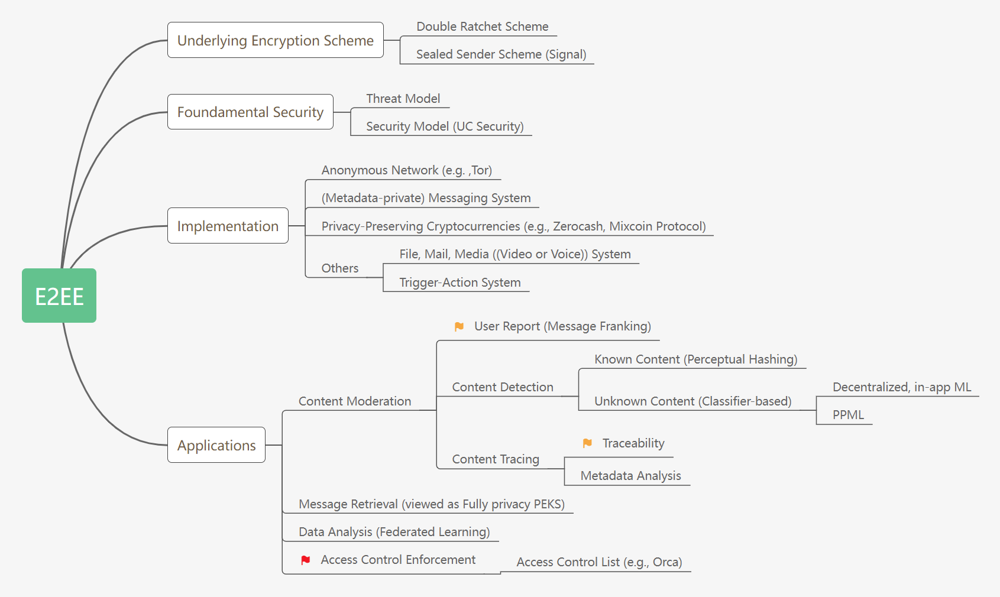
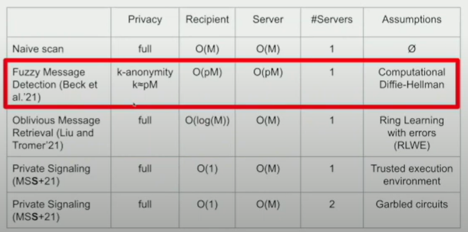

# End-to-End Encrypted (Messaging) System

<!-- 飞书原始链接: https://internal-api-drive-stream.feishu.cn/space/api/box/stream/download/authcode/?code=ZDcyMWZmMjdjNTk0ZDYyYjdlNTg0ZWVmOTU3NGZkMTRfNjYxZmNkNjRlMTJlOTJlNjY0MmY5MTk1MzY2OTE0ZjRfSUQ6NzMxNjg5MTUxOTA5OTgzMDI3Nl8xNzg1NDYxODU2OjE3ODU0NjU0NTZfVjM -->

# Background

## E2EE and Content Moderation

- [UDB+15,[S&P](https://css.csail.mit.edu/6.858/2018/readings/secure-messaging-ext.pdf)] SoK: Secure Messaging ⭐
- [CGC17,[Preprint](https://eprint.iacr.org/2017/982.pdf)] Mind the Gap: Where Provable Security and Real-World Messaging Don't Quite Meet
- [Mayer19,[Princeton](https://www.cs.princeton.edu/~jrmayer/papers/Content_Moderation_for_End-to-End_Encrypted_Messaging.pdf)] Content Moderation for End-to-End Encrypted Messaging 📒
- [Mil20,RWC] E2EE for Messenger: goals, plans and thinking
- [KKL+21,[CDTreport](https://cdt.org/wp-content/uploads/2021/08/CDT-Outside-Looking-In-Approaches-to-Content-Moderation-in-End-to-End-Encrypted-Systems.pdf)] Outside looking in: Approaches to content moderation in end-to-end encrypted systems ⭐📒
- [SWR+22,S&P] 27 Years and 81 Million Opportunities Later Investigating the Use of Email Encryption for an Entire University
- [[BKG+](https://arxiv.org/pdf/2104.04478.pdf)21,PETs] The Motivated Can Encrypt (Even with PGP)
- [[DGGL21](https://eprint.iacr.org/2021/498.pdf#:~:text=Unger%20et%20al.%20created%20a%20systematization%20of%20knowledge,to%20the%20public%20being%20just%20one%20of%20them.),Preprint] SoK: Multi-Device Secure Instant Messaging
- [[SM23](https://arxiv.org/abs/2303.03979),PETS] SoK: Content Moderation for End-to-End Encryption Read ME!Read ME!

### Harm on Messaging Systems

- [SWG+21,[SECURITY](https://www.usenix.org/system/files/sec21-shen-kaiwen.pdf)] Weak Links in Authentication Chains: A Large-scale Analysis of Email Sender Spoofing Attacks
- [[TAB+21](https://research.google/pubs/pub49786/),S&P] SoK: Hate, Harassment, and the Changing Landscape of Online Abuse
- [OOHSB22,[S&P](https://ieeexplore.ieee.org/stamp/stamp.jsp?tp=&arnumber=9833663)] SoK: The Dual Nature of Technology in Sexual Abuse
- [[TML+22](https://arxiv.org/abs/2204.01233),CCS] Clues in Tweets: Twitter-Guided Discovery and Analysis of SMS Spam Read ME!
- [[SDPJ23](https://arxiv-export-lb.library.cornell.edu/abs/2207.12589?context=cs.SI),NDSS] Folk Models of Misinformation on Social Media
- [MBN+23,[NDSS](https://www.ndss-symposium.org/wp-content/uploads/2023/02/ndss2023_s657_paper.pdf)] Tactics, Threats & Targets: Modeling Disinformation and its Mitigation

# Foundation of E2EE

## Encryption Schemes in use of E2EE

Include the schemes that are currently used by Signal, WhatsApp, and facebook messenger, Google Allo etc..

### Real-world Cases

- [[RMS18](https://eprint.iacr.org/2017/713),[EuroS&P](https://ieeexplore.ieee.org/stamp/stamp.jsp?tp=&arnumber=8406614)] More is less: On the end-to-end security of group chats in signal, whatsapp, and threema
- [[Zoom20](https://github.com/zoom/zoom-e2e-whitepaper),WhitePaper] Zoom Cryptography Whitepaper
- [[BS20](https://eprint.iacr.org/2020/224#:~:text=Security%20under%20Message-Derived%20Keys%3A%20Signcryption%20in%20iMessage.%20Abstract%3A,primitive%20we%20call%20Encryption%20under%20Message-Derived%20Keys%20%28EMDK%29.),EUROCRYPT] Security under Message-Derived Keys: Signcryption in iMessage
- [[IETF21](https://www.ietf.org/archive/id/draft-ietf-mls-protocol-12.html)] The Messaging Layer Security (MLS) Protocol
- [Google22, [WhitePaper](https://www.gstatic.com/messages/papers/messages_e2ee.pdf)] Messages End-to-End Encryption Overview
- [[Apple22](https://help.apple.com/pdf/security/en_GB/apple-platform-security-guide-b.pdf),Report] Apple Platform Security [CN](https://help.apple.com/pdf/security/zh_CN/apple-platform-security-guide-cn.pdf)
- [DJKM23,EUROCRYPT] End-to-End Encrypted Zoom Meetings: Proving security and strengthening Liveness
- [[CRZ24](https://eprint.iacr.org/2019/737),S&P] Multi-Stage Group Key Distribution and PAKEs: Securing Zoom Groups against Malicious Servers without New Security Elements

#### Secure Messaging

- [BGB04,[WPES](https://dl.acm.org/doi/pdf/10.1145/1029179.1029200)] Off-the-Record Communication 📒
- OTR has been used by TextSecure App. And it provides encryption, authentication, deniability, and perfect forward secrecy.
- [[Mar13](https://signal.org/blog/simplifying-otr-deniability/),Signal] Simplifying OTR deniability
- [[Signal16](https://www.signal.org/docs/)] The Signal Protocol
- [[Moxie13](https://signal.org/blog/advanced-ratcheting/)] Advanced Cryptographic Ratcheting
- [[GCDGS17](https://eprint.iacr.org/2016/1013.pdf),[EuroS&P](https://ieeexplore.ieee.org/stamp/stamp.jsp?tp=&arnumber=7961996)] A Formal Security Analysis of the Signal Messaging Protocol
- [Lun17,[Signal](https://signal.org/blog/sealed-sender/)] Technology preview: Sealed sender for Signal
- [[ACD18](https://eprint.iacr.org/2018/1037.pdf),EUROCRYPT'19] The Double Ratchet: Security Notions, Proofs, and Modularization for the Signal Protocol
- [PR18,CRYPTO] Towards bidirectional ratcheted key exchange
- [JMM19,TCC] A unified and composable take on ratcheting
- [JMM19,EUROCRYPT] Efficient ratcheting: Almost-optimal guarantees for secure messaging
- [[BFG+20](https://cs.nyu.edu/~afb383/publication/uc_signal/uc_signal.pdf)] What is the exact security of the Signal protocol?
- [[CGCG+20](https://eprint.iacr.org/2019/737),CRYPTO] Highly Efficient Key Exchange Protocols with Optimal Tightness
- [CDV21,[PKC](https://link.springer.com/content/pdf/10.1007/978-3-030-75248-4_23.pdf)] Beyond Security and Efficiency: On-Demand Ratcheting with Security Awareness
- [[HKKP22](https://eprint.iacr.org/2021/616),JoC] An Efficient and Generic Construction for Signal's Handshake (X3DH): Post-Quantum, State Leakage Secure, and Deniable
- [[BFG+22](https://eprint.iacr.org/2022/355.pdf),CRYPTO] More Complete Analysis of the Signal Double Ratchet Algorithm
- [[DHRR22](https://eprint.iacr.org/2022/1187.pdf),ASIACRYPT] Strongly Anonymous Ratcheted Key Exchange
- [[BRT23](https://eprint.iacr.org/2023/1053),CCS] ASMesh: Anonymous and Secure Messaging in Mesh Networks Using Stronger, Anonymous Double Ratchet
- [[GGJJ23](https://eprint.iacr.org/2023/854#:~:text=A%20standard%20paradigm%20for%20building,secrecy%20(and%20implicit%20authentication).),CRYPTO] On Optimal Tightness for Key Exchange with Full Forward Secrecy via Key Confirmation
- [[RSS23](https://eprint.iacr.org/2023/248),EUROCRYPT] Unique-Path Identity Based Encryption With Applications to Strongly Secure Messaging
- [[CZ24](https://eprint.iacr.org/2022/1481),S&P] Secure Messaging with Strong Compromise Resilience, Temporal Privacy, and Immediate Decryption

#### Message Layer Security

- [[CGCG+18](https://eprint.iacr.org/2017/666),CCS] On ends-to-ends encryption: Asynchronous group messaging with strong security guarantees
- [[ACDT20](https://eprint.iacr.org/2019/1189),CRYPTO] Security analysis and improvements for the IETF MLS standard for group messaging.
- [[ACDT21](https://eprint.iacr.org/2021/1083),CCS] Modular Design of Secure Group Messaging Protocols and the Security of MLS
- [[PRSS21](https://eprint.iacr.org/2021/305),CT-RSA] SoK: Game-based Security Models for Group Key Exchange
- [[AANK+22](https://eprint.iacr.org/2022/251.pdf),EUROCRYPT] CoCoA: Concurrent Continuous Group Key Agreement

  - Extend Signal to large group by a server-aided CGKA
- [[AHKM22](https://eprint.iacr.org/2021/1456),CCS] Server-Aided Continuous Group Key Agreement
- [[BDG+22](https://eprint.iacr.org/2022/1237),TCC] On the Worst-Case Inefficiency of CGKA
- [[HKP22](https://eprint.iacr.org/2022/1533),CCS] How to Hide MetaData in MLS-Like Secure Group Messaging: Simple, Modular, and Post-Quantum
- [[WPBB23](https://eprint.iacr.org/2022/1732),SECURITY] TreeSync: Authenticated Group Management for Messaging Layer Security
- [[BCV23](https://eprint.iacr.org/2022/1411),SECURITY] Cryptographic Administration for Secure Group Messaging
- [[AMT23](https://eprint.iacr.org/2023/394),CRYPTO] Fork-Resilient Continuous Group Key Agreement
- [AANK+22,Preprint] DeCAF: Decentralizable Continuous Group Key Agreement with Fast Healing
- [[CEST23](https://eprint.iacr.org/2022/1531),CCS] The Key Lattice Framework for Concurrent Group Messaging
- [[DH23](https://eprint.iacr.org/2023/228),Preprint] Authenticated Continuous Key Agreement: Active MitM Detection and Prevention
- [[BCG23](https://eprint.iacr.org/2023/1385),ASIACRYPT] WhatsUpp with Sender Keys? Analysis, Improvements and Security Proofs Read ME!
- [[ADJ24](https://eprint.iacr.org/2023/1300),S&P] Device-Oriented Group Messaging: A Formal Cryptographic Analysis of Matrix' Core

#### Anonymous Messaging

- [[CPZ20](https://eprint.iacr.org/2019/1416.pdf),[CCS](https://dl.acm.org/doi/pdf/10.1145/3372297.3417887)] The Signal Private Group System and Anonymous Credentials Supporting Efficient Verifiable Encryption ⭐
- [MKA+22,[NDSS](https://www.ndss-symposium.org/wp-content/uploads/ndss2021_1C-4_24180_paper.pdf)] Improving Signal's Sealed Sender

#### Contact Discovery

- [HWS+21,NDSS] All the Numbers are US: Large-scale Abuse of Contact Discovery in Mobile Messengers
- [[TGS23](https://eprint.iacr.org/2022/1083),SECURITY] ENIGMAP: Signal Should Use Oblivious Algorithms for Private Contact Discovery ⭐ Read ME!
- [[HSW23](https://eprint.iacr.org/2023/758),ESORICS] Scaling Mobile Private Contact Discovery to Billions of Users
- [[MSGJ23](https://eprint.iacr.org/2023/1218),Preprint] Arke: Scalable and Byzantine Fault Tolerant Privacy-Preserving Contact Discovery

#### Others

- [[MCYR17](https://eprint.iacr.org/2017/234),CSF] Automatically Detecting the Misuse of Secrets: Foundations, Design Principles, and Applications
- [[DGPI22](https://eprint.iacr.org/2022/1215),ESORICS] Continuous Authentication in Secure Messaging

## Security of E2EE

### Security Model

- [[CJSV22](https://eprint.iacr.org/2022/376.pdf),CRYPTO] Universally Composable End-to-End Secure Messaging ♾

  - Analysis EEMS underlying protocol within the UC framework
- [[HK22](https://eprint.iacr.org/2022/449.pdf),Preprint] On End-to-End Encryption ⭐📒♾

  - Analysis E2EE from theoritical side, introduce the notion of **endness**, map the existing schemes (AEAD, signcryption) to E2EE.
- [[ZLA22](https://eprint.iacr.org/2022/1139),Preprint] Formal Security Definition of Metadata-Private Messaging

  - From the developer of [Anysphere](https://anysphere-messaging.com/), a metadata-private messaging application.
  - A good summary on [why the developers stop develop Anysphere](https://anysphere-messaging.com/post-mortem)?
- [[CJN22](https://eprint.iacr.org/2022/1710),SECURITY] Formal Analysis of Session-Handling in Secure Messaging: Lifting Security from Sessions to Conversations Read ME!
- [BBL+23,[SECURITY](https://www.usenix.org/system/files/sec23summer_243-blazy-prepub.pdf)] How fast do you heal? A taxonomy for post-compromise security in secure-channel establishment
- [PST23,[SECURITY](https://www.usenix.org/system/files/sec23fall-prepub-303-paterson.pdf)] Three Lessons From Threema: Analysis of a Secure Messenger
- [[DFG+23](https://eprint.iacr.org/2023/843),CRYPTO] Security Analysis of the WhatsApp End-to-End Encrypted Backup Protocol
- [BMS23,[Preprint](https://eprint.iacr.org/2023/071)] A security analysis comparison between Signal, WhatsApp and Telegram
- [[LGGR23](https://eprint.iacr.org/2023/386),Preprint] Interoperability in End-to-End Encrypted Messaging Read ME!

#### Attacks

- [[ALT18](https://davidlazar.org/papers/friends.pdf),WPES] What's a Little Leakage Between Friends

  - Perform an attack to metadata-private messaging system, which is from the compromised information of users from its friend.
- [SBP+20,CCS] Mitigation of Attacks on Email End-to-End Encryption
- [CFK+20,[CCS](https://dl.acm.org/doi/10.1145/3372297.3423354)] Clone Detection in Secure Messaging: Improving Post-Compromise Security in Practice
- [[AMPS22](https://mtpsym.github.io/paper.pdf),S&P] Four Attacks and a Proof for Telegram
- [IPK+23,[SECURITY](https://www.usenix.org/conference/usenixsecurity23/presentation/ising)] Content-Type: multipart/oracle - Tapping into Format Oracles in Email End-to-End Encryption
- [[BCC+23](https://eprint.iacr.org/2023/880),CRYPTO] On Active Attack Detection in Messaging with Immediate Decryption Read ME!
- [FPN+24,S&P] Injection Attacks against End-to-End Encrypted Applications

#### Deniability

- [CDNO97,CRYPTO] Deniable Encryption
- [NPW11,CRYPTO] Bi-deniable public-key encryption
- [RG09,JoC] New Approaches for Deniable Authentication
- [FM15,WPES] Notions of Deniable Message Authentication
- [UG15,[CCS](https://dl.acm.org/doi/pdf/10.1145/2810103.2813616)] Deniable Key Exchanges for Secure Messaging
- [UG17,[PETS](https://www.petsymposium.org/2018/files/papers/issue1/paper12-2018-1-source.pdf)] Improved Strongly Deniable Authenticated Key Exchanges for Secure Messaging
- [VGIK20,ACNS] On the Cryptographic Deniability of the Signal Protocol
- [RMA+23,[S&P](https://www.computer.org/csdl/proceedings-article/sp/2023/933600b658/1Js0EdqQFFe)] Is Cryptographic Deniability Sufficient? Non-Expert Perceptions of Deniability in Secure Messaging Read ME!
- [YGS23,[SECURITY](https://www.usenix.org/conference/usenixsecurity23/presentation/yadav)] Cryptographic Deniability: A Multi-perspective Study of User Perceptions and Expectations
- [[AG23](https://eprint.iacr.org/2023/1529),CCS] Shufflecake: Plausible Deniability for Multiple Hidden Filesystems on Linux Read
- [[WCWB24](https://eprint.iacr.org/2023/1926),PETS] NOTRY: deniable messaging with retroactive avowal
- [[CCHD23](https://eprint.iacr.org/2023/403),Preprint] Real World Deniability in Messaging

## Key Transparency/Verification

- [[Ryan14](https://eprint.iacr.org/2013/595),NDSS] Enhanced certificate transparency and end-to-end encrypted mail
- [[MBBFF15](https://eprint.iacr.org/2014/1004.pdf),SECURITY] CONIKS: Bringing Key Transparency to End Users [🕸](https://coniks-sys.github.io/)

  - Provide an efficient method for users to monitor their key-binding in platform.
- [[CDGM19](https://eprint.iacr.org/2018/607.pdf),[CCS](https://dl.acm.org/doi/pdf/10.1145/3319535.3363202)] SEEMless: Secure End-to-End Encrypted Messaging with less Trust Read ME!
- [[YGH+22](https://arxiv.org/pdf/2210.09940.pdf),CCS] Automatic Detection of Fake Key Attacks in Secure Messaging
- [[CDG+22](https://eprint.iacr.org/2022/1264),ASIACRYPT] Rotatable Zero Knowledge Sets: Post Compromise Secure Auditable Dictionaries with application to Key Transparency Read ME!
- [[MKKS+23](https://eprint.iacr.org/2023/081),NDSS] Parakeet: Practical Key Transparency for End-to-End Encrypted Messaging
- [RMY+23,[SECURITY](https://www.usenix.org/system/files/sec23summer_125-reijsbergen-prepub.pdf)] TAP: Transparent and Privacy-Preserving Data Services
- [[LCG+23](https://eprint.iacr.org/2023/1515),Preprint] OPTIKS: An Optimized Key Transparency System

# Services on an E2EE system

These services is build under the assumption that we already have an E2EE system, and their goal is to improve its functionality or fix some drawback.

## Law Enforcement

- [[GKL21](https://eprint.iacr.org/2021/321.pdf),[EUROCRYPT](https://link.springer.com/content/pdf/10.1007/978-3-030-77883-5_19.pdf)] Abuse Resistant Law Enforcement Access Systems ⭐

## Access Control

- [HG13,[WPES](https://dl.acm.org/doi/pdf/10.1145/2517840.2517855)] Thinking Inside the BLAC Box: Smarter Protocols for Faster Anonymous Blacklisting
- [TMRM18,[SECURITY](https://www.usenix.org/system/files/conference/usenixsecurity18/sec18-tyagi.pdf)] BurnBox: Self-Revocable Encryption in a World Of Compelled Access
- [[KC21](https://eprint.iacr.org/2021/345.pdf),SECURITY] Private Blocklist Lookups with Checklist
- [[TLMR22](https://eprint.iacr.org/2021/1380.pdf),[SECURITY](https://www.usenix.org/system/files/sec22summer_tyagi.pdf)] Orca: Blocklisting in Sender-Anonymous Messaging 📒

  - Achieve blocklist on the server in sender-anonymous (only) messaging system (sealed sender protocol) using a newly group signature
- [[RMM22](https://eprint.iacr.org/2021/1577.pdf),S&P] SNARKBlock: Federated Anonymous Blocklisting from Hidden Common Input Aggregate Proofs Read ME!
- [VSH22,[S&P](https://ieeexplore.ieee.org/document/9833601)] Sabre: Sender-Anonymous Messaging with Fast Audits

## Data Analysis

This part of research is highly related to federate learning

- [[GKN17](https://arxiv.org/pdf/1712.07557.pdf),NIPS] Differentially Private Federated Learning: A Client Level Perspective
- [CGB17,[NSDI](https://www.usenix.org/system/files/conference/nsdi17/nsdi17-corrigan-gibbs.pdf)] Prio: Private, Robust, and Scalable Computation of Aggregate Statistics ⭐
- [BEM+17,[SOSP](https://dl.acm.org/doi/pdf/10.1145/3132747.3132769)] Prochlo: Strong privacy for analytics in the crowd
- [[HKST22](https://eprint.iacr.org/2022/1185),ESORICS] PEA: Practical private epistasis analysis using MPC
- [[ZMA22](https://eprint.iacr.org/2022/1174),CCS] Ibex: Privacy-preserving ad conversion tracking and bidding

  - **Private histrogram** based on a new 2-party asymmetric private aggregation protocol that combines SS an HE.
  - **Obilivious bidding** Bidding database + PIR
- [[AHI22](https://eprint.iacr.org/2022/1595),CCS] Efficient Secure Three-Party Sorting with Applications to Data Analysis and Heavy Hitters
- [[AGJOP22](https://eprint.iacr.org/2021/576),Preprint] Prio+: Privacy Preserving Aggregate Statistics via Boolean Shares
- [[CJWJW22](https://eprint.iacr.org/2022/1115),CCS] Vizard: A Metadata-hiding  Data Analytic System with End-to-End Policy Controls
- [[BGL+22](https://eprint.iacr.org/2022/1461),Preprint] ACORN: Input Validation for Secure Aggregation
- [[ZMMA23](https://eprint.iacr.org/2022/1299),NSDI] Addax: A fast, private, and accountable ad exchange infrastructure
- [[MWA+23](https://eprint.iacr.org/2023/486),S&P] Flamingo: Multi-Round Single-Server Secure Aggregation with Applications to Private Federated Learning
- [[DPRS23](https://eprint.iacr.org/2023/130),PETS] Verifiable Distributed Aggregation Functions Read ME!

## Message Detection/Retrieval

Delegate search to a third party without privacy leakage

- [[BLMG21](https://eprint.iacr.org/2021/089.pdf),CCS] Fuzzy Message Detection ⭐📒[👩💻](https://github.com/becgabri/fuzzycrypto)
- [[MSS+21](https://eprint.iacr.org/2021/853.pdf),[SECURITY'22](https://www.usenix.org/system/files/sec22fall_madathil.pdf#:~:text=Private%20signaling%20can%20be%20seen%20as%20a%20solution,recipient%20R%20iand%20posts%20it%20to%20the%20board.)] Private Signaling
- [[LT21](https://eprint.iacr.org/2021/1256.pdf),CRYPTO'22] Oblivious Message Retrieval 📒
- [[SPB22](https://eprint.iacr.org/2021/1180.pdf),FC] The Effect of False Positives: Why Fuzzy Message Detection Leads to Fuzzy Privacy Guarantees? [📺](https://www.youtube.com/watch?v=s5vabHCGkjI)
- [[LTW22](https://eprint.iacr.org/2023/534),Preprint] Group Oblivious Message Retrieval
- [[JLM23](https://eprint.iacr.org/2023/572.pdf),Preprint] Scalable Private Signaling

<!-- 飞书原始链接: https://internal-api-drive-stream.feishu.cn/space/api/box/stream/download/authcode/?code=YzE3YTAyYmFkMjNkNmI1NTBhZDNiZWE2NTFiNzllNjFfOTZhNDY4MDg2MTcwOTFhMmYwZmE2MzdlZDhkNmI4MjdfSUQ6NzMxNjg5MTUxODMwNzIwNTEyNF8xNzg1NDYxODU2OjE3ODU0NjU0NTZfVjM -->

## Encrypted Traffic Inspection

- [[SLPR15](https://eprint.iacr.org/2015/264.pdf),SIGCOMM] BlindBox: Deep Packet Inspection over Encrypted Traffic
- [NPL+19,[CCS](https://dl.acm.org/doi/pdf/10.1145/3319535.3354204)] PrivDPI: Privacy-Preserving Encrypted Traffic Inspection with Reusable Obfuscated Rules
- [[GAZ+22](https://eprint.iacr.org/2021/1022.pdf),[SECURITY](https://www.usenix.org/system/files/sec22fall_grubbs.pdf)] Zero-Knowledge Middleboxes [Blog]
- [[ZDA+23](https://eprint.iacr.org/2023/1022),Preprint] Zombie: Middleboxes that Don't Snoop

## Content Moderation

### User report

- [[Facebook16](https://about.fb.com/wp-content/uploads/2016/07/messenger-secret-conversations-technical-whitepaper.pdf)] Messenger secret conversations: Technical whitepaper (v2.0)
- [[GLR17](https://eprint.iacr.org/2017/664.pdf),[CRYPTO](https://link.springer.com/content/pdf/10.1007/978-3-319-63697-9_3.pdf)] Message franking via committing authenticated encryption 📒
- [DGRW18,[CRYPTO](https://link.springer.com/content/pdf/10.1007/978-3-319-96884-1_6.pdf)] Fast message franking: From invisible salamanders to encryptment
- [[LV18](https://eprint.iacr.org/2018/938),ICICS] Private Message Franking with After Opening Privacy
- [CT18,[Preprint](https://eprint.iacr.org/2018/994.pdf)] People Who Live in Glass Houses Should not Throw Stones: Targeted Opening Message Franking Schemes
- [TGL+19,[CRYPTO](https://link.springer.com/content/pdf/10.1007/978-3-030-26954-8_8.pdf)] Asymmetric Message Franking: Content Moderation for Metadata-Private End-to-End Encryption 📒[📺](https://www.youtube.com/watch?v=9DGSI3Verps&t=434s) ♾
- [HDL21,[Inscrypt](https://link.springer.com/content/pdf/10.1007/978-3-030-88323-2_6.pdf)] A Message Franking Channel
- [FQ21,[CANS](https://link.springer.com/content/pdf/10.1007/978-3-030-92548-2_10.pdf)] Report and Trace Ring Signatures
- [[LZH+23](https://eprint.iacr.org/2023/332),EUROCRYPT] Asymmetric Group Message Franking: Definitions & Constructions
- [[MLGR23](https://eprint.iacr.org/2023/526),EUROCRYPT] Context Discovery and Commitment Attacks: How to Break CCM, EAX, SIV, and More
- [[Eska23](https://eprint.iacr.org/2023/1144),Preprint] Abuse Reporting for Metadata-Hiding Communication Based on Secret Sharing

### Content Tracing

#### Traceability

- [TMR19,[CCS](https://dl.acm.org/doi/pdf/10.1145/3319535.3354243)] Traceback for End-to-End Encrypted Messaging 📒📄 [🪟](https://www.cs.cornell.edu/~tyagi/slides/tracing.pdf)
- [PEB21,[CCS](https://dl.acm.org/doi/pdf/10.1145/3460120.3484539)] Secure Complaint-Enabled Source-Tracking for Encrypted Messaging 📒📄
- [[LRTY22](https://eprint.iacr.org/2021/1148.pdf),NDSS] (FACTS) Fighting Fake News in Encrypted Messaging with the Fuzzy Anonymous Complaint Tally System 📒
- [KTW22,[ESORICS](https://link.springer.com/content/pdf/10.1007/978-3-031-17146-8_3.pdf)] Anonymous Traceback for End-to-End Encryption
- [[DSQ+22](https://arxiv.org/pdf/2109.10074v5.pdf),CCS] STAR: Secret Sharing for Private Threshold Aggregation Reporting
- [[IAV22](https://eprint.iacr.org/2021/1686),SECURITY] Hecate: Abuse Reporting in Secure Messengers with Sealed Sender ♾
- [[BGJP22](https://eprint.iacr.org/2022/1643),EUROCRYPT] End-to-End Secure Messaging with Traceability Only for Illegal Content

#### Metadata Analysis

Moderation based on file size, type, data/time, **sender/receiver**, etc. Construct a path to remove a message.

- [Whatsapp] [2019](https://faq.whatsapp.com/general/security-and-privacy/unauthorized-use-of-automated-or-bulk-messaging-on-whatsapp/?lang=en), [2021a](https://faq.whatsapp.com/general/chats/about-forwarding-limits/?lang=en), [2021b](https://faq.whatsapp.com/general/how-whatsapp-helps-fight-child-exploitation/?lang=en)

### Content Detection

#### Client-side Scanning (Known Content Detection)

on Framework

- [[Ofcom22](https://www.ofcom.org.uk/__data/assets/pdf_file/0036/247977/Perceptual-hashing-technology.pdf)] Overview of Perceptual Hashing Technology
- [PGC19,[Cloudflare](https://blog.cloudflare.com/the-csam-scanning-tool/)] Announcing the CSAM Scanning Tool
- [[BBM+21](https://www.apple.com/child-safety/pdf/Apple_PSI_System_Security_Protocol_and_Analysis.pdf)] The Apple PSI system; [[Apple'21](https://www.apple.com/child-safety/pdf/CSAM_Detection_Technical_Summary.pdf)] CSAM Detection
- [AAB+21,[Arxiv](https://arxiv.org/abs/2110.07450)] Bugs in our Pockets: The Risks of Client-Side Scanning
- [KM21,[SECURITY](https://www.usenix.org/system/files/sec21-kulshrestha.pdf)] Identifying Harmful Media in End-to-End Encrypted Communication: Efficient Private Membership Computation
- [HNCNR21,[SECURITY](https://www.usenix.org/system/files/sec22-hua.pdf)] Increasing Adversarial Uncertainty to Scale Private Similarity Testing
- [GOHS23,[S&P](https://ieeexplore.ieee.org/document/10179417)] Attitudes towards Client-Side Scanning for CSAM, Terrorism, Drug Trafficking, Drug Use and Tax Evasion in Germany
- [[SKM23](https://eprint.iacr.org/2023/029),S&P] Public Verification for Private Hash Matching

on Machine learning research

- [[Facebook](https://github.com/facebook/ThreatExchange/tree/master/hashing/tmk)] PDQ & TMK+PDQE, [[Microsoft](https://www.microsoft.com/en-us/photodna)] PhotoDNA, [Imagehash](https://fullstackml.com/wavelet-image-hash-in-python-3504fdd282b5)
- [JCM22,[SECURTIY](https://www.usenix.org/conference/usenixsecurity22/presentation/jain)] Adversarial Detection Avoidance Attacks: Evaluating the robustness of perceptual hashing-based client-side scanning
- [[PFG+21](https://eprint.iacr.org/2021/1531),[SECURITY'23](https://www.usenix.org/conference/usenixsecurity23/presentation/prokos)] Squint Hard Enough: Attacking Perceptual Hashing with Adversarial Machine Learning
- [HLKF22,[CVPR](https://arxiv.org/abs/2212.04107)] Re-purposing Perceptual Hashing based Client Side Scanning for Physical Surveillance
- [[JCCM23](https://arxiv.org/abs/2306.11924),S&P] Deep perceptual hashing algorithms with hidden dual purpose: when client-side scanning does facial recognition

#### Classifier-based Scanning (Unknown Content Detection)

1. Decentralized, in-app machine learning
2. Privacy-preserving machine learning (PPML)

## E2EE Storage

- [CLTY22,[SECURITY](https://www.usenix.org/system/files/sec22-chen-long.pdf)] End-to-Same-End Encryption: Modularly Augmenting an App with an Efficient, Portable, and Blind Cloud Storage
- [[BHP23](https://eprint.iacr.org/2022/959.pdf),S&P] MEGA: Malleable Encryption Goes Awry [🕸](https://mega-awry.io/#contact) Read ME!
- [AHMP23,EUROCRYPT] Caveat Implementor! Key Recovery Attacks on MEGA
- [[FLS23](https://eprint.iacr.org/2022/1413),EUROCRYPT] How to Compress Encrypted Data
- [[FLS23](https://eprint.iacr.org/2023/946),Preprint] Compressing Encrypted Data Over Small Fields

