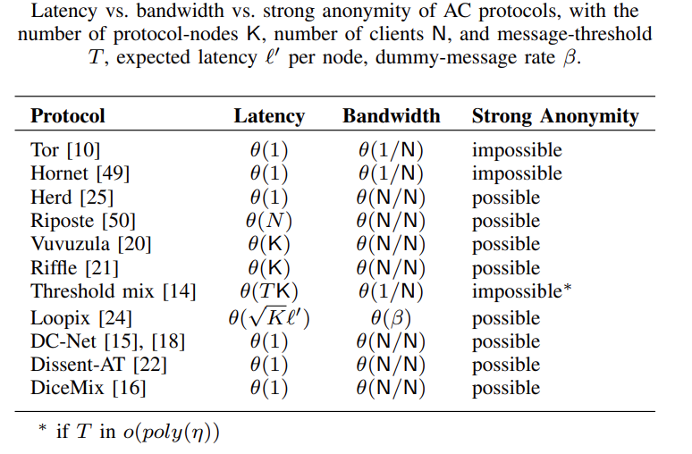
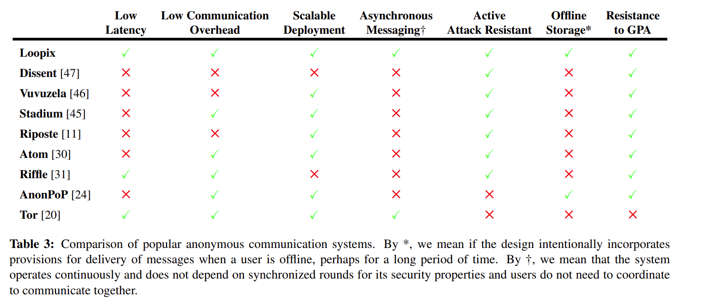
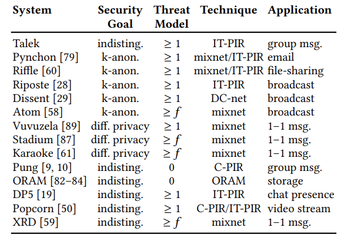

# Metadata Private Messaging System

# Metadata Privacy

- [[SG24](https://eprint.iacr.org/2023/313),PETS] SoK: Metadata-Protecting Communication Systems Read ME! Read ME!

## E2EE in Other Fields

- [GCM+16,NSDI] Scalable and Private Media Consumption with Popcorn.
- [[AMBF+16](https://eprint.iacr.org/2014/1025),PETS] XPIR: Private information retrieval for everyone
- [GFAW17,SIGCOMM] Pretzel: Email encryption and provider-supplied functions are compatible
- [LGZ19,[SOSP](https://dl.acm.org/doi/pdf/10.1145/3341301.3359648)] Yodel: Strong Metadata Security for Voice Calls
- [CP20,[NDSS](https://www.ndss-symposium.org/wp-content/uploads/2020/02/24095.pdf)] Metal: A Metadata-Hiding File-Sharing System
- [STGG20,[Arxiv](https://arxiv.org/pdf/2009.12447.pdf)] Walnut A low-trust trigger-action platform
- [CCWS+21,[S&P](https://ieeexplore.ieee.org/stamp/stamp.jsp?tp=&arnumber=9519495)] Data Privacy in Trigger-Action Systems
- [AYA+21,[SECURITY](https://www.usenix.org/system/files/osdi21-ahmad.pdf)] Addra: Metadata-private voice communication over fully untrusted infrastructure 📒
- [ZLC+21,[VLDB](https://www.vldb.org/pvldb/vol14/p2811-guo.pdf)] Full Encryption An End to End Encryption Mechanism in GaussDB
- [[KMPQ21](https://eprint.iacr.org/2021/107.pdf),[S&P](https://ieeexplore.ieee.org/stamp/stamp.jsp?tp=&arnumber=9519474)] A Decentralized and Encrypted National Gun Registry
- [NSD22,[NSDI](https://www.usenix.org/system/files/nsdi22-paper-newman.pdf)] Spectrum: High-bandwidth Anonymous Broadcast

## Anonymous Credential

- [[DVC23](https://eprint.iacr.org/2022/1622),CRYPTO] Anonymous Tokens with Hidden Metadata Bit from Algebraic MACs
- [[RPXCS22](https://eprint.iacr.org/2022/1286),Preprint] ZEBRA: Anonymous Credentials with Practical On-chain Verification and Applications to KYC in DeFi Read ME!
- [[HSS23](https://eprint.iacr.org/2023/853),SECURITY] How to Bind Anonymous Credentials to Humans Read ME! Read ME!
- [[JRLS23](https://eprint.iacr.org/2022/509),CRYPTO] Lattice Signature with Efficient Protocols, Application to Anonymous Credentials
- [[RWGM22](https://eprint.iacr.org/2022/878.pdf),S&P] zk-creds: Flexible Anonymous Credentials from zkSNARKs and Existing Identity Infrastructure
- [[BLNS23](https://eprint.iacr.org/2023/560),CRYPTO] A Framework for Practical Anonymous Credentials from Lattices
- [[CDV23](https://eprint.iacr.org/2022/1622),CRYPTO] Anonymous Tokens with Hidden Metadata Bit from Algebraic MACs
- [[DKL+23](https://eprint.iacr.org/2023/602),S&P] Threshold BBS+ Signatures for Distributed Anonymous Credential Issuance
- [[AYY23](https://eprint.iacr.org/2023/1199),Preprint] RSA Blind Signatures with Public Metadata
- [[KLR23](https://eprint.iacr.org/2023/707),Preprint] Concurrent Security of Anonymous Credentials Light, Revisited
- [[BRS23](https://eprint.iacr.org/2023/320),ASIACRYPT] Anonymous Counting Tokens
- [[MBG+23](https://eprint.iacr.org/2023/1016),Preprint] Aggregate Signatures with Versatile Randomization and Issuer-Hiding Multi-Authority Anonymous Credentials

## Decoy Routing

This field is focusing on the routing protocols (e.g., Tor), we only list serval papers for potential use in the future.

- [DMS04,[SECURITY](https://www.usenix.org/legacy/publications/library/proceedings/sec04/tech/full_papers/dingledine/dingledine.pdf)] Tor: The Second-Generation Onion Router
- [BG18,[PETS](https://cypherpunks.ca/~iang/pubs/asymmetry-popets18.pdf)] Secure asymmetry and deployability for decoy routing systems
- [SW21,EUROCRYPT] Non-Interactive Anonymous Router ⭐
- [[FSSV22](https://eprint.iacr.org/2022/1395),TCC] Non-Interactive Anonymous Router with Quasi-Linear Router Computation
- [[BKO23](https://eprint.iacr.org/2022/1353),TCC] Anonymous Permutation Routing

### Anonymity Analysis

- [[DMMK18](https://eprint.iacr.org/2017/954.pdf),S&P] Anonymity Trilemma: Strong Anonymity, Low Bandwidth Overhead, Low Latency --- Choose Two [📺](https://www.youtube.com/watch?v=y89Bh5OfrME)
- [[SGD23](https://arxiv.org/abs/2201.11860),NDSS] On the Anonymity of Peer-To-Peer Network Anonymity Schemes Used by Cryptocurrencies
- [PSEB22,[Arxiv](https://arxiv.org/pdf/2207.04145.pdf)] Strong Anonymity for Mesh Messaging
- [[LK23](https://eprint.iacr.org/2022/1037),PETS] RPM: Robust Anonymity at Scale

## Metadata-Private Messaging System

**Application:** SecureDrop

**Existing Systems** (excluded in the below papers): [16Pond](https://github.com/agl/pond), [17Ricochet](https://github.com/ricochet-im/ricochet), [18Cwtch](https://cwtch.im/)

- [DS03,PETS] Generalising Mixes
- [KOR+04,[ACNS](https://link.springer.com/content/pdf/10.1007/978-3-540-24852-1_2.pdf)] Private Keyword-Based Push and Pull with Applications to Anonymous Communication
- [GLM16,[CCS](https://dl.acm.org/doi/pdf/10.1145/2976749.2978407)] A protocol for privately reporting ad impressions at scale
- [LZ16,[OSDI](https://www.usenix.org/system/files/conference/osdi16/osdi16-lazar.pdf)] Alpenhorn: Bootstrapping secure communication without leaking metadata 📒

  - public key message detection, secure bootstrapping, DP, integrate into Vuvuzela
- [[AKTZ17](https://eprint.iacr.org/2017/778.pdf),[SECURITY](https://www.usenix.org/system/files/conference/usenixsecurity17/sec17-alexopoulos.pdf)] Mcmix: Anonymous messaging via secure multiparty computation.
- [LYKG+19,[CCS](https://dl.acm.org/doi/pdf/10.1145/3319535.3354238)] HoneyBadgerMPC and AsynchroMix: Practical Asynchronous MPC and its Application to Anonymous Communication
- [SG19,[PETS](https://petsymposium.org/2019/files/papers/issue3/popets-2019-0050.pdf)] ConsenSGX: Scaling Anonymous Communications Networks with Trusted Execution Environments ⭐
- [ECGZB21,[SECURITY](https://www.usenix.org/system/files/sec21-eskandarian.pdf)] Express: Lowering the Cost of Metadata-hiding Communication with Cryptographic Privacy
- [[EB22](https://eprint.iacr.org/2021/1514),NDSS] Clarion: Anonymous Communication from Multiparty Shuffling Protocols Read ME
- [[LSSD23](https://eprint.iacr.org/2022/1548),NDSS] Trellis: Robust and Scalable Metadata-private Anonymous Broadcast Read ME!

### Tor

- [[HSSN+22](https://arxiv.org/abs/2204.04489),S&P] ShorTor: Improving Tor Network Latency via Multi-hop Overlay Routing

### PIR-based

- [SCM05,WPES] The Pynchon Gate: A Secure Method of Pseudonymous Mail Retrieval.

  - Mixnets/PIR: Mixnets send, PIR retrieve.
- [BDG15,[PETS](http://www0.cs.ucl.ac.uk/staff/G.Danezis/papers/popets15-dp5.pdf)] DP5: A Private Presence Service
- [CGBM15,[S&P](https://ieeexplore.ieee.org/stamp/stamp.jsp?tp=&arnumber=7163034)] Riposte: An Anonymous Messaging System Handling Millions of Users
- [KLD15,[16PETS](https://dedis.cs.yale.edu/dissent/papers/riffle.pdf)] Riffle: An Efficient Communication System with Strong Anonymity

  - Mixnets/PIR
- [[AS16](https://www.cis.upenn.edu/~sga001/papers/pung-osdi16-tr.pdf),[OSDI](https://www.usenix.org/system/files/conference/osdi16/osdi16-angel.pdf)] (Pung) Unobservable communication over fully untrusted infrastructure. ⭐
- [CSM+20,[ACSAC](https://dl.acm.org/doi/pdf/10.1145/3427228.3427231)] Talek: Private Group Messaging with Hidden Access Patterns

  - Detaily summarized the aforementioned work in its related work

### Mixnet-based

- [HLZZ15,[SOSP](https://dl.acm.org/doi/pdf/10.1145/2815400.2815417)] Vuvuzela: Scalable Private Messaging Resistant to Traffic Analysis [📺](https://www.youtube.com/watch?v=nGkfSn4N2Tk)⭐

  - differential privacy, online model
- [PHE+17,[SECURITY](https://www.usenix.org/system/files/conference/usenixsecurity17/sec17-piotrowska.pdf)] The Loopix Anonymity System

  - Continuous time mix
- [[AMWB23](https://eprint.iacr.org/2023/199),Preprint] MixFlow: Assessing Mixnets Anonymity with Contrastive Architectures and Semantic Network Information
- [[DDKZ23](https://eprint.iacr.org/2023/1311),Preprint] Are continuous stop-and-go mixnets provably secure?
- [[ACL17](https://eprint.iacr.org/2017/1142.pdf),[18S&P](https://ieeexplore.ieee.org/stamp/stamp.jsp?tp=&arnumber=8418648)] (Pung+) PIR with compressed queries and amortized query processing

  - Applied to Pung
- [KGDF17,[SOSP](https://dl.acm.org/doi/pdf/10.1145/3132747.3132755)] Atom: Horizontally Scaling Strong Anonymity
- [TGLZZ17,[SOSP](https://dl.acm.org/doi/pdf/10.1145/3132747.3132783)] Stadium: A distributed metadata-private messaging system 📒

  - Introduce a metadata-private message system with horizatally scale (SP's costs won't increase with the number of users), differential privacy. Vuvuzela@SOSP15⬅
- [LGZ18,[OSDI](https://www.usenix.org/system/files/osdi18-lazar.pdf)] Karaoke: Distributed private messaging immune to passive traffic analysis
- [KLD20,[SECURITY](https://www.usenix.org/system/files/nsdi20spring_kwon_prepub.pdf)] XRD: Scalable Messaging System with Cryptographic Privacy

### DC-net based (Dinning Cryptographers Problem)

Used for broadcast messages

- [GRP+03,Cornell] Herbivore: A scalable and efficient protocol for anonymous communication
- [CGF10,[CCS](https://dl.acm.org/doi/pdf/10.1145/1866307.1866346)] Dissent: Accountable Anonymous Group Messaging
- [WCG+12,[OSDI](https://www.usenix.org/system/files/conference/osdi12/osdi12-final-115.pdf)] Dissent in numbers: Making strong anonymity scale.
- [[CGF13](https://arxiv.org/pdf/1209.4819.pdf),[SECURITY](https://www.usenix.org/system/files/conference/usenixsecurity13/sec13-paper_corrigan-gibbs.pdf)] Proactively accountable anonymous messaging in verdict

<!-- 飞书原始链接: https://internal-api-drive-stream.feishu.cn/space/api/box/stream/download/authcode/?code=YWRkYjNhZmE5MDY4NzRkNjVlZGNmNGJkOGViYjgwNGVfYmY5MDMxOTRjNDVhOGY2YmFjYTFlYTYzNTA2OWE1ZDNfSUQ6NzMxNjg5MTIxMDYzMjIwMDIyMF8xNzg1NDYxODU3OjE3ODU0NjU0NTdfVjM -->

<!-- 飞书原始链接: https://internal-api-drive-stream.feishu.cn/space/api/box/stream/download/authcode/?code=NzZkYWI4ZjdlMjZkN2MzODIxOTkyOTZmZGE3MzEyZTRfMjJjOTQxZjk1YjdmNGUxNDRlMmI0MjE5NjI0NWJiZDVfSUQ6NzMxNjg5MTIwODEyMzEwNTI4MV8xNzg1NDYxODU3OjE3ODU0NjU0NTdfVjM -->

## Privacy-Preserving Cryptocurrencies

- [BCG+14,S&P] Zerocash: Decentralized anonymous payments from bitcoin
- [Noe15] Ring signature confidential transactions for monero
- [NM+16] Ring Confidential Transactions
- [BCG+20,S&P] Zexe: Enabling decentralized private computation

<!-- 飞书原始链接: https://internal-api-drive-stream.feishu.cn/space/api/box/stream/download/authcode/?code=YzQ3MWI2MTlmOTBiYzg5ODNiM2ZiMDJiMDhlNWYxNDJfZTU5NGNhMjVjYTQ4ZDMyODBmMDYzNDBkMGFjNjI1ZjNfSUQ6NzMxNjg5MTIwNzQzMzY2NjU2MV8xNzg1NDYxODU3OjE3ODU0NjU0NTdfVjM -->

## Anonymous Whistleblowing

- [[ACM22](https://eprint.iacr.org/2021/1341),TCC] Anonymous Whistleblowing over Authenticated Channels
- [[FO22](https://eprint.iacr.org/2022/265),ASIACRYPT] Non-interactive Mimblewimble transactions, revisited
- [[QTW23](https://eprint.iacr.org/2023/1483),TCC] Lower Bounds on Anonymous Whistleblowing

