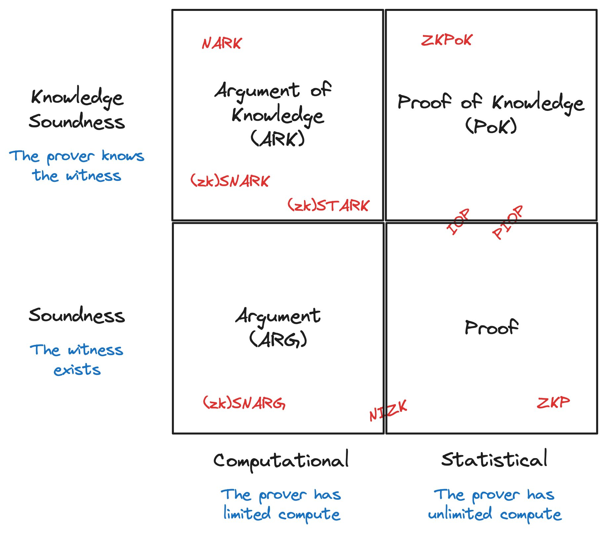

# Concepts on ZKP, Signature, and SoK

<!-- 飞书原始链接: https://internal-api-drive-stream.feishu.cn/space/api/box/stream/download/authcode/?code=YjU2NzAwZDI3Y2Y4ZWVjOTMxMjIwNGRiMWIzZmNhNDRfNDA5ZGQ3NGY5OGMyYmJkMzc0YjIwYzY1YTZmMGU5NDRfSUQ6NzMyNTMzODY1ODk3MDc3OTY3Nl8xNzg1NDYxODgxOjE3ODU0NjU0ODFfVjM -->

In this document, we are trying to clarify the relationships between the following concepts:

- Digital signature
- ZKP/NIZK: zero-knowledge proof / non-interactive zero knowledge proof
- SoK: signature of knowledge
- Proof of knowledge
- Arguments

## Difference between \`proof' and ‘proof of knowledge’

> [what is the difference between proofs and arguments of knowledge?](https://crypto.stackexchange.com/questions/34757/what-is-the-difference-between-proofs-and-arguments-of-knowledge?rq=1)

A \`proof ' allows a prover to prove that this word *belongs to* this language.

A \`proof of knowledge' allows a prover to prove that he *know a NP-witness* for this statement.

Therefore, for a \`proof of knowledge', there exists an extractor (with additional power such as rewinding or changing the prover's tape) that can extract the knowledge by interacting with the prover.

### Difference between \`a proof' and \`an argument'

> [what is the difference between proofs and arguments of knowledge?](https://crypto.stackexchange.com/questions/34757/what-is-the-difference-between-proofs-and-arguments-of-knowledge?rq=1)
>
> [[ECZ+24](https://eprint.iacr.org/2024/050.pdf),MART] Do You Need a Zero Knowledge Proof?

In a nutshell, arguments are "computational sound proofs."  
The arguments only consider soundness against a PPT prover, while the proofs consider it against computationally unbounded prover.

Similarly, there are \`statiscal zero knowledge' and \`computational zero knowledge' proofs that correspond to unbounded and PPT verifier respectively.

#### The relationship between NIZK and digital signature

> [What is the relationship between a NIZK protocol and a digital signature scheme?](https://crypto.stackexchange.com/questions/62327/what-is-the-relationship-between-a-nizk-protocol-and-a-digital-signature-scheme?rq=1)

Strong existential unforgeability: An adversary cannot forge a signature even after seeing many signatures under different instances.

Simulation-sound extractability: A prover cannot forge a proof even after seeing many simulated proofs.

A NIZK with simulation-sound extractability implies a digital signature of knowledge?

#### Is every signature a proof of knowledge?

And does every NIZK imply a signature of knowledge?

> [Did digital signatures come from Zero Knowledge Proofs?](https://crypto.stackexchange.com/questions/100454/did-digital-signatures-come-from-zero-knowledge-proofs)
>
> [Is Using Digital Signatures to prove identity a zero knowledge proof?](https://crypto.stackexchange.com/questions/35177/is-using-digital-signatures-to-prove-identity-a-zero-knowledge-proof?rq=1)

## References

- [[Tha22](https://people.cs.georgetown.edu/jthaler/ProofsArgsAndZK.pdf), FTPS] Proofs, arguments, and zero-knowledge