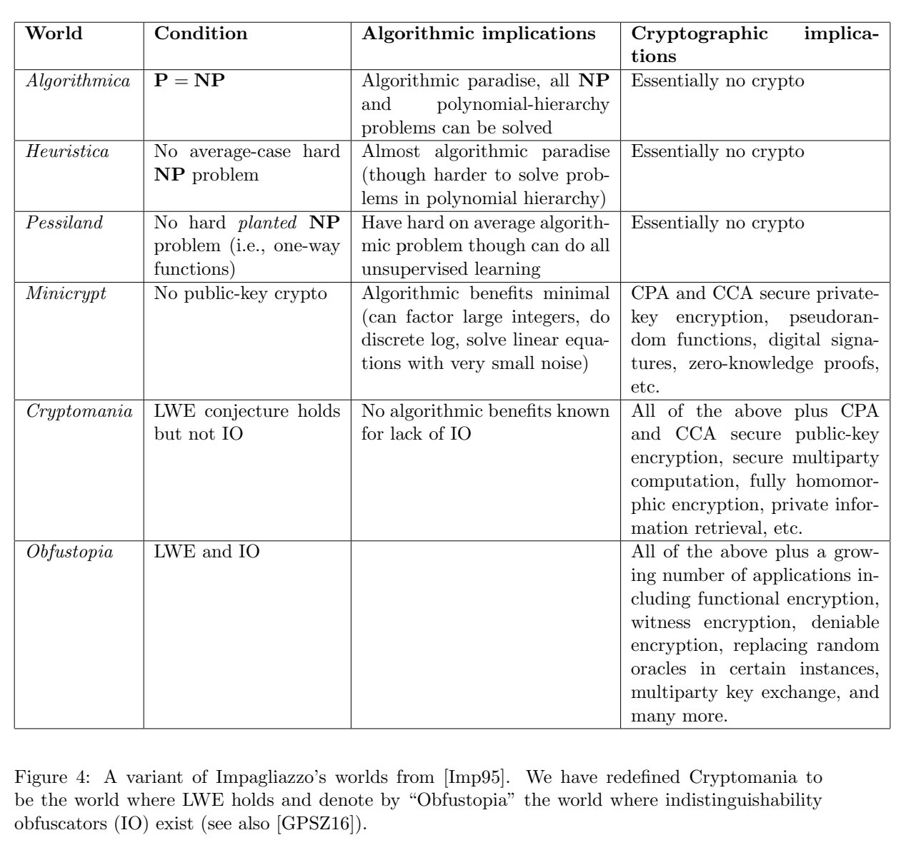
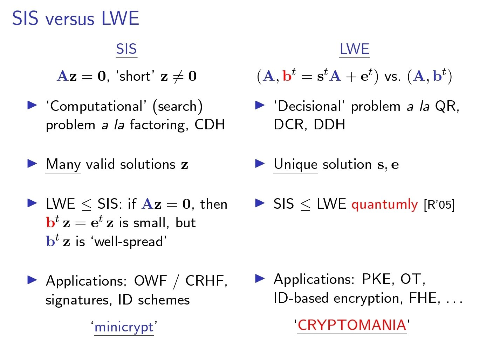

# Five Worlds of Complexity and Cryptography

In 1995, Impagliazzo presented [A Personal Viewof Average-Case Complexity](https://dx.doi.org/10.1109/SCT.1995.514853) at SCT conference. In that paper he describes five possible worlds and their implications to computer science. And, most computer scientists think we are living in Cryptomania or Minicrypt.

<!-- 飞书原始链接: https://internal-api-drive-stream.feishu.cn/space/api/box/stream/download/authcode/?code=YzVkYjcwYjNhNWYwYjc3MWQzYTNhNDg5MWJlN2I0NmNfNmFjN2Y3Y2E4YmNmNDBmMmEyNjRjZmY4NDMwZDQ2YThfSUQ6NzM1NzI3NDY0NTEzOTA5NTU4MF8xNzg1NDYxODgwOjE3ODU0NjU0ODBfVjM -->

**Where is lattice-based cryptography?**

[Lattice-based Cryptography: SIS & LWE from Chris Peikert @GeTech](https://web.eecs.umich.edu/~cpeikert/pubs/slides-abit2.pdf)

<!-- 飞书原始链接: https://internal-api-drive-stream.feishu.cn/space/api/box/stream/download/authcode/?code=MGIwYzM3YzBkYmU4OWVhMjBkYzUyYjVhYmJjYzkxYmFfMmVhMDFmNzE2ZmE3NDA0MDY3ZTgyYzFkNWQzYWE3NTFfSUQ6NzM1NzI3NDk1ODYwMDgxNDYyMF8xNzg1NDYxODgwOjE3ODU0NjU0ODBfVjM -->

**Does MiniCrypt exist?**

[Deng17,EUROCRYPT] Magic Adversaries Versus Individual Reduction: Science Wins Either Way 中证明了以下两个结论仅有一个成立：

1. Feige-Shamir 协议具有并发安全性
2. 可以将公钥加密建立在抽象的单向函数上（即, Minicryp不存在）

## Useful links

- [P, NP, PSPACE and BQP](https://medium.com/arnaldo-gunzi-quantum/p-np-pspace-and-bqp-44d42a842c6a)
- [Complexity Meets Quantum](https://climberpi.github.io/)