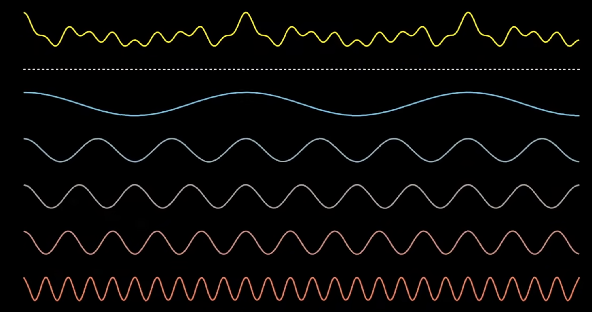

# Fourier Transform and Polynomial Computation

**这篇文章仅仅作为一个学习笔记，帮助读者更好的理解RLWE相关文章**

## 多项式

形如$a_0+a_1x+a_2x^2+\ldots+a_{N-1}x^{N-1}$称为$N-1$次多项式

## $N$-次单位根：

$N$-次单位根是$X^N=1$在复数域上的$d$个解$\omega$，其中$\{\omega_0,\omega_1,\ldots,\omega_{N-1}\}$均匀分布在复平面的单位圆上，其中$\omega_k= e^{i\frac{2\pi k}{N}}$。

## 傅立叶变换

众多博客或教材中会这样描述傅立叶变换：把时域上的信号转变成频域上的信号。

但是对于没有接触过傅立叶变换的人来说（比如我），这样的描述可能会比较抽象。所以，为了更好的理解时域到频域的转换，我们可以通过动画片来更好的理解这个概念https://www.bilibili.com/video/BV1pW411J7s8

简单来说，我们可以把时域理解为一首歌，歌曲里面包含了不同频率音符组成的和声，我们想要知道这些和声到底是由哪些频率的音符组成的，就需要使用到傅立叶变换。

<!-- 飞书原始链接: https://internal-api-drive-stream.feishu.cn/space/api/box/stream/download/authcode/?code=NjEwYWJmNjk2YWU5ZjVmYzY4ZmQ5MmJkMjhkY2IzYzhfZjlhMjczNTRlZmRiODRkYmIxODY2OWM1Nzg3ZTM5NzhfSUQ6NzUzNzY4NDE4ODA3MDk1Mjk2NF8xNzg1NDYxODkyOjE3ODU0NjU0OTJfVjM -->

就如同上面的黄色曲线是由下面五种不同频率组合而成的。

而逆傅立叶变换可以理解为，把不同频率的音符转换为一个和声，也就是频域到时域的转换。

## 傅立叶变换与多项式

通过上面来看，傅立叶变换好像和我们提到的多项式环不能够扯上关系，因为多项式环并没有频域和时域的概念，并且多项式中$x$的取值是离散的，而上面提到的傅立叶变换是取值是连续的。

所以我们引入一个新的概念，离散傅立叶变换，我们直接给出公式：

- 时域变为$X[0],X[1],\ldots, X[N-1]$，是$N$个时间点的采样值
- 频域变为$x[k]=\Sigma^{N-1}_{n=0}X[n]e^{-i\frac{2\pi kn}{N}}=\Sigma^{N-1}_{n=0}X[n](e^{-i\frac{2\pi}{N}})^{kn}$，表示频率为$k$时的振幅和相位

此时假设我们有个多项式$p(x)=a_0+a_1x+a_2x^2+\ldots+a_{N-1}x^{N-1}$，我们想计算这个多项式在$N$-次单位根上的值

$$p(\omega_0)=a_0+a_1\omega_0+a_2\omega_0^2+\ldots+a_{N-1}\omega_0^{N-1}$$

$$\dots$$

$$p(\omega_{N-1})=a_0+a_1\omega_{N-1}+a_2\omega_{N-1}^2+\ldots+a_{N-1}\omega_{N-1}^{N-1}$$

带入$N$-次单位根公式$\omega_k= e^{i\frac{2\pi k}{N}}$可以得到：$p(\omega_k)=\Sigma^{N-1}_{n=0}a_n(w_k)^n=\Sigma^{N-1}_{n=0}a_n(e^{i\frac{2\pi}{N}})^{kn}$

我们可以发现，多项式求值的计算公式和离散傅立叶变换的计算公式“一模一样”，我们可以将多项式系数看作“时域的观测值”，而多项式在$N$-次单位根上的计算值可以看作是频域。

综上所述，傅立叶变换的过程可以看作是已知多项式系数，然后求取多项式在$N$-次单位根上的取值的过程。而逆傅立叶变换可以看作多项式插值，在已知多项式在$N$-次单位根上的取值的情况下，求取多项式的系数。

## 多项式环

$$R:\mathbb{Z}[X]/(X^d+1)$$

$$R_q:\mathbb{Z}_q[X]/(X^d+1)$$

环上元素为d-1次多项式，形如$a_0+a_1x+a_2x^2+\ldots+a_{d-1}x^{d-1}, x^d=-1$

在环$R$中，多项式系数属于$\mathbb{Z}$；在环$R_q$中，多项式系数属于$\mathbb{Z}_q$。

由于在多项式环中经常需要进行多项式计算和多项式插值，常规方法的开销过大，所以傅立叶变换是一个很好的减小计算开销的方法。

- 问题1：