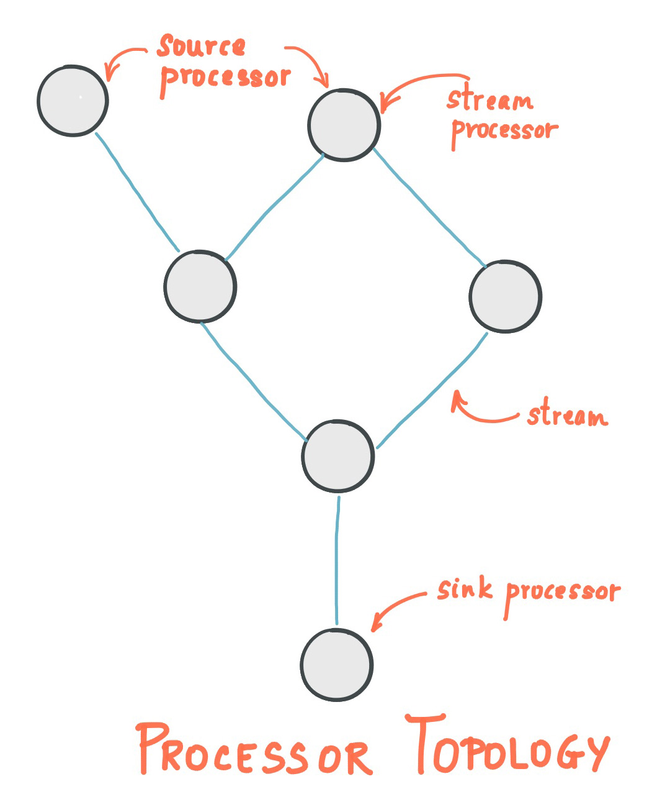
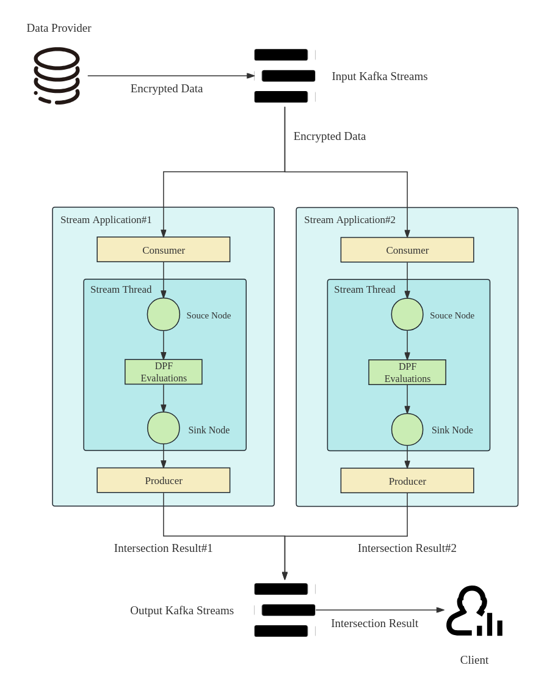

# Kafka Stream Application

**Kafka stream is a simple and lightweight client library with no external dependencies other than Kafka itself.**

## **Concept**

- A **stream** is the most important abstraction provided by Kafka Streams: it represents an unbounded, continuously updating data set. A stream is an ordered, replayable, and fault-tolerant sequence of immutable data records, where a **data record** is defined as a key-value pair.
- A **stream processing application** is any program that makes use of the Kafka Streams library. It defines its computational logic through one or more **processor topologies**, where a processor topology is a graph of stream processors (nodes) that are connected by streams (edges).
- A **stream processor** is a node in the processor topology; it represents a processing step to transform data in streams by receiving one input record at a time from its upstream processors in the topology, applying its operation to it, and may subsequently produce one or more output records to its downstream processors.
- **Source Processor**: A source processor is a special type of stream processor that does not have any upstream processors. It produces an input stream to its topology from one or multiple Kafka topics by consuming records from these topics and forwarding them to its down-stream processors.
- **Sink Processor**: A sink processor is a special type of stream processor that does not have down-stream processors. It sends any received records from its up-stream processors to a specified Kafka topic.


<!-- 飞书原始链接: https://internal-api-drive-stream.feishu.cn/space/api/box/stream/download/authcode/?code=NTUyNTEzNmNhYjIyZDMyZmYzNzEyNTlmNmYzYTQ0YzZfMTNhMjFlYWQ2ZjE3YzY1MGViMTZkMmNjNjJkNjg2NTVfSUQ6NzM1MDY2Nzk3NzAyODg2MTk1NF8xNzg1NDYxODg4OjE3ODU0NjU0ODhfVjM -->

For example:

```Java
KStream<String, String> source = builder.stream("streams-plaintext-input");
source.flatMapValues(value -> Arrays.asList(value.toLowerCase(Locale.getDefault()).split("\\W+")))
    .groupBy((key, value) -> value)
    .count(Materialized.<String, Long, KeyValueStore<Bytes, byte[]>>as("counts-store"))
    .toStream()
    .to("streams-wordcount-output", Produced.with(Serdes.String(), Serdes.Long()));
```

## **Our Architecture**


<!-- 飞书原始链接: https://internal-api-drive-stream.feishu.cn/space/api/box/stream/download/authcode/?code=MzE4YWU4Nzg1N2FmNTIyNGMwN2Y3YzUxN2JmZWJjYjVfZDFiNzM2OGVjODFmMWZmZmRlMWU3YzE3OWIzMmMxNDJfSUQ6NzM1MTQwODU3NTc3NDUzOTc3N18xNzg1NDYxODg4OjE3ODU0NjU0ODhfVjM -->


## **How to write a Kafka Streams Application?**

1. Create source and target topics

```Shell
bin/kafka-topics.sh --create \
    --bootstrap-server localhost:9092 \
    --replication-factor 1 \
    --partitions 1 \
    --topic test-topic
```

2. Setup develop environments
3. Create streams configurations

```Java
Properties props = new Properties();
props.put(StreamsConfig.APPLICATION_ID_CONFIG, "streams-wordcount");
props.put(StreamsConfig.BOOTSTRAP_SERVERS_CONFIG, "localhost:9092");
props.put(StreamsConfig.DEFAULT_KEY_SERDE_CLASS_CONFIG, Serdes.String().getClass());
props.put(StreamsConfig.DEFAULT_VALUE_SERDE_CLASS_CONFIG, Serdes.String().getClass());
```

4. Create StreamsBuilder, source processor, transformation processor and sink processor

```Java
builder.<String, String>stream("streams-plaintext-input")
       .flatMapValues(value -> Arrays.asList(value.toLowerCase(Locale.getDefault()).split("\\W+")))
       .groupBy((key, value) -> value)
       .count(Materialized.<String, Long, KeyValueStore<Bytes, byte[]>>as("counts-store"))
       .toStream()
       .to("streams-wordcount-output", Produced.with(Serdes.String(), Serdes.Long()));
```

5. Build Topology and KafkaStreams

```Java
final Topology topology = builder.build();
final KafkaStreams streams = new KafkaStreams(topology, props);
```

6. Add shutdown hook

```Java
final CountDownLatch latch = new CountDownLatch(1);
Runtime.getRuntime().addShutdownHook(new Thread("streams-shutdown-hook") {
    @Override
    public void run() {
        streams.close();
        latch.countDown();
    }
});
try {
    streams.start();
    latch.await();
} catch (Throwable e) {
    System.exit(1);
}
System.exit(0);
```

7. Start KafkaStreams

## **Useful Commands**

Assume that we are in the Kafka folder and run Kafka service in localhost:9092

1. Start/Stop the ZooKeeper Service

```Shell
# Start ZooKeeper
bin/zookeeper-server-start.sh config/zookeeper.properties
# Stop ZooKeeper
bin/zookeeper-server-stop.sh
```

2. Start/Stop Server

```Shell
# Start server
bin/kafka-server-start.sh config/server.properties
# Stop server
bin/kafka-server-stop.sh
```

3. Create topic

```Shell
bin/kafka-topics.sh --create \
    --bootstrap-server localhost:9092 \
    --replication-factor 1 \
    --partitions 1 \
    --topic my-topic-name
```

4. Delete topic

```Shell
bin/kafka-topics.sh --delete --topic my-topic-name --bootstrap-server localhost:9092
```

5. list all topics

```Shell
bin/kafka-topics.sh --bootstrap-server localhost:9092 --describe
```

6. Input to topic

```Shell
bin/kafka-console-producer.sh --bootstrap-server localhost:9092 --topic my-topic-name
```

7. See topic logs

```Shell
bin/kafka-console-consumer.sh --bootstrap-server localhost:9092 \
    --topic test \
    --from-beginning \
```

## **Customized Processing**

### Processor

- 用途：`Processor` 是最基础的接口，提供了处理流数据的最低层次的抽象。它允许开发者对进入的数据进行处理，并且可以生产零个、一个或多个输出记录。
- 功能：开发者可以在实现了 `Processor` 接口的类中访问输入记录的键和值，也可以操作处理器上下文（`ProcessorContext`），比如前向（forward）输出记录到下一处理器或者操作状态存储。
- 使用场景：当需要对数据流进行详细的处理，比如状态管理或者需要根据数据内容决定是否将记录发送到下游时。

### Transformer

- 用途：`Transformer` 提供了一个更高层次的抽象，适用于需要对数据流进行转换操作的场景。
- 功能：与 `Processor` 相比，`Transformer` 允许开发者返回一个结果，而不是直接操作处理器上下文来前向记录。`Transformer` 可以维护状态，并且能够访问当前处理记录的时间戳和元数据。
- 使用场景：适用于转换操作，特别是当转换逻辑比较复杂，需要访问状态存储或者需要利用记录的元数据时。

### ValueTransformer

- 用途：`ValueTransformer` 是 `Transformer` 的一个特化，它仅对记录的值进行操作，忽略键的部分。
- 功能：提供了一个简化的接口，只需要处理值的转换。与 `Transformer` 相同，它也可以访问状态存储，但是不能直接操作处理器上下文或访问记录的键和时间戳。
- 使用场景：当转换逻辑仅需要关注值而不是整个键值对，或者不需要访问记录的键和时间戳时。

### Example

```Java
package utils.kafka;
import org.apache.kafka.streams.kstream.ValueTransformer;
import org.apache.kafka.streams.kstream.ValueTransformerSupplier;
import org.apache.kafka.streams.processor.ProcessorContext;
import utils.Block;
import utils.dpf.DPF_Server;

public class DPFValueTransformer implements ValueTransformer<Block, Block> {

    private ProcessorContext context;
    private DPF_Server dpf;
    private final byte[] dpfKey;

    public DPFValueTransformer(DPF_Server dpf, byte[] dpfKeys) {
        this.dpf = dpf;
        this.dpfKey = dpfKeys;
    }

    @Override
    public void init(ProcessorContext context) {
        this.context = context;
    }

    @Override
    public Block transform(Block value) {
        // 在这里执行你的 DPF evaluation 逻辑
        // 例如，调用你已经实现的 DPF 函数来对输入值进行转换
        Block transformedValue = null;
        try {
            transformedValue = dpf.eval(value, dpfKey);
        } catch (Exception e) {
            throw new RuntimeException(e);
        }

        // 返回转换后的值
        return transformedValue;
    }

    @Override
    public void close() {
        // 在需要进行清理的时候执行
    }

    public static class Supplier implements ValueTransformerSupplier<Block, Block>{
        private byte[] dpfKey;
        private DPF_Server dpf;
        public Supplier(DPF_Server dpf, byte[] dpfKey){
            this.dpf = dpf;
            this.dpfKey = dpfKey;
        }

        @Override
        public ValueTransformer<Block, Block> get(){
            return new DPFValueTransformer(dpf, dpfKey);
        }
    }
}
```