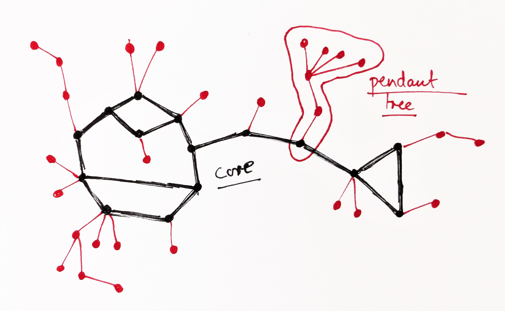

# 基于混淆布谷鸟表（Garbled Cuckoo Table）的 OKVS

> 本文是 [OKVS based on Garbled Cuckoo Table.md](./OKVS%20based%20on%20Garbled%20Cuckoo%20Table.md) 的中文翻译。

在本文档中，我们讨论基于 GCT 的 OKVS。在 OKVS 中，有两个算法：

$D\leftarrow \text{Encode}(I,R),y\leftarrow \text{Decode}(D,x)$，其中 $I=\{(x_1,y_1),\ldots,(x_n, y_n)\}$。

## 2-Hash GCT

[[PRTY20, EUROCRYPT](https://eprint.iacr.org/2020/193.pdf)] PSI from PaXoS: Fast, Malicious Private Set Intersection

**出发点（Start-Point）：** 混淆布隆过滤器（garbled bloom filter）的编码大小*很大*（编码率：$O(1/\lambda)$），但其编码时间是*线性的*。我们想要一个线性时间编码的 OKVS，且具有更小的编码率（$O(1/(2+\epsilon))$）。

**高层思路（High-level idea）：** 有两个哈希函数 $h_1, h_2$。为简单起见，我们可以把 $D$ 视为一张布谷鸟表（cuckoo table），其中 $D[h_1(x)]\oplus D[h_2(x)]=y$。

首先，我们可以构造一张布谷鸟图（cuckoo graph）：顶点表示 $D$ 中的位置，边表示要插入的元素。如果这张图恰好是一棵树，那么 $D$ 可以通过树的遍历来构造。例如，我们可以设 $D[1]$ 为根，并令 $D[1]=r$。如果我们用 BFS 遍历这棵树，那么计算顺序是 $D[2]=x_1\oplus D[1],D[3]=x_2\oplus D[1],D[4]=x_3\oplus D[2],D[5]=x_4\oplus D[2],D[6]=x_5\oplus D[3], D[7]=x_6\oplus D[3].$

<!-- 飞书画板 token: D9XPw5bE9hGAdCbdNZmcGE4zncd -->

然而，对于大小为 $n=O(m)$ 的 $D$，这张图不太可能是无环的，所以上述方法行不通。我们需要找出图的 2-核（2-core，图中黑色线所示）。2-核部分通过解线性方程组求解，其余部分则用上述方法求解。

<!-- 飞书原始链接: https://internal-api-drive-stream.feishu.cn/space/api/box/stream/download/authcode/?code=M2ZlYWFkZTBiYWI2NjVhNTkzMTcxZWZmMmEwZDg3NzVfZDUzZTJhYTY3NjVlMzk3ZjI3MjU5MGE3OWE0ODM3MmJfSUQ6NzQ1NDE3NTIzNzU4OTM1MjQ1Ml8xNzg1NDYxODkxOjE3ODU0NjU0OTFfVjM -->

**如何添加一条新边？**

- 在 2-核内：计算复杂度与整个集合规模成正比。（重新计算线性方程组的解以及所有子树）
- 不在 2-核内：计算复杂度与更新的集合规模成正比。（重新遍历其中一棵子树）

## 3-Hash GCT
