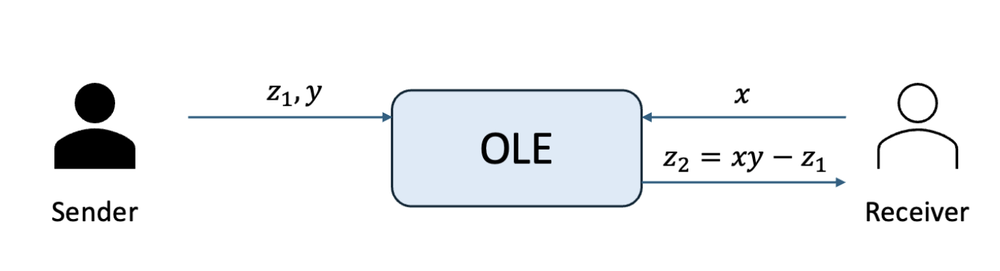
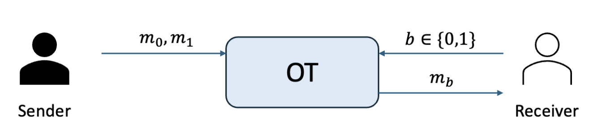
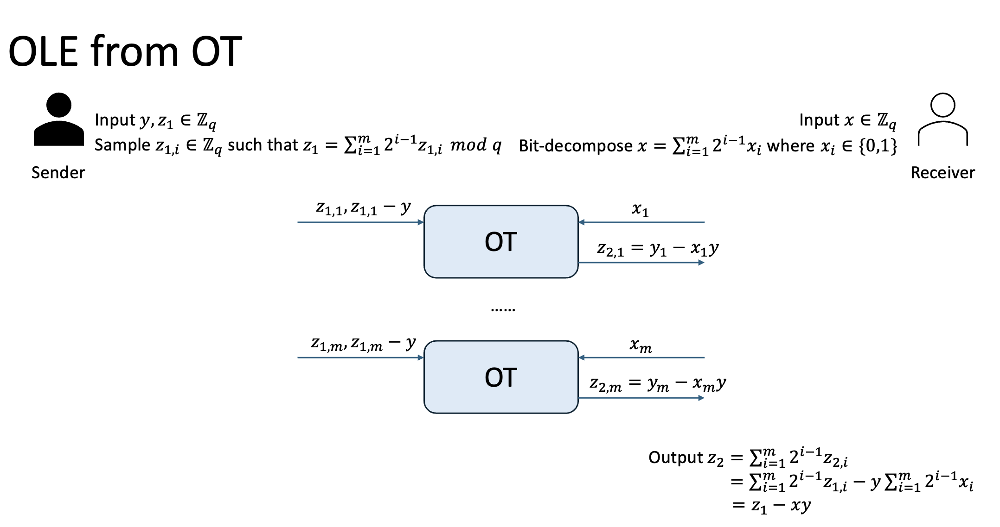
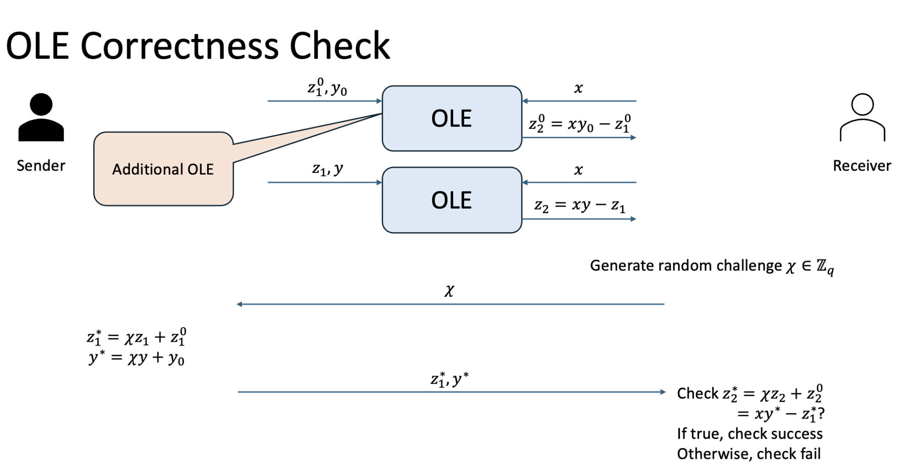
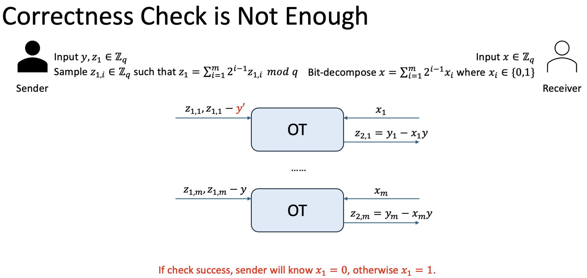
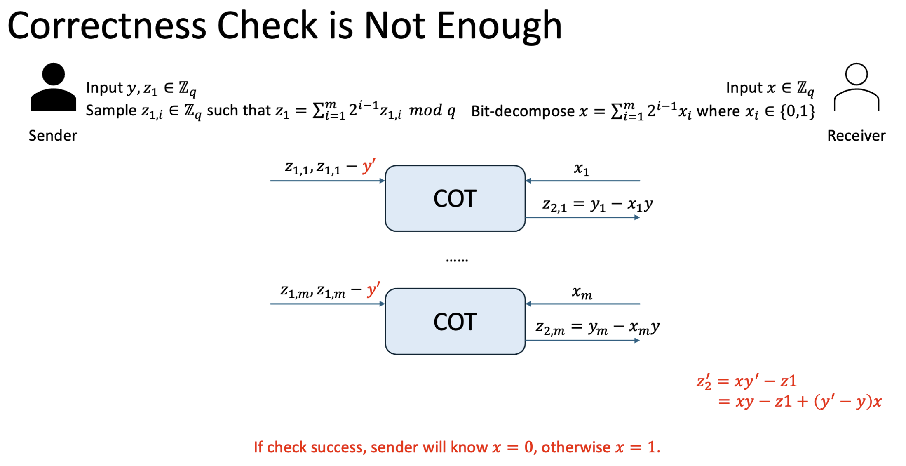

# Oblivious Linear-function Evaluation (OLE)'s 1-bit Leakage

写这篇文章的目的是解释为什么OLE with errors会泄漏一比特的信息

# OLE介绍

## OLE的模型

OLE可以看作是Sender提供一个一元一次线性方程p(x)=yx-z1，然后receiver可以在不知道y和z1的情况下计算这个方程在x点的取值。

<!-- 飞书原始链接: https://internal-api-drive-stream.feishu.cn/space/api/box/stream/download/authcode/?code=Yzc2MjRhYzE4YjhiNzYzM2Y1MzZkZjQwMDE1Nzc0MzdfNGZkMWNmYmY2NmQ3OGQ5ZWNhNDU0Y2U1N2Y3MWEyMzZfSUQ6NzU1MzU5MzYyNDYyNzY1ODc4MF8xNzg1NDYxODk0OjE3ODU0NjU0OTRfVjM -->

## OLE的用处

OLE的用处很多，包括但不限于：

1. 构造Oblivious PRF (OPRF)：[[RS21](https://link.springer.com/chapter/10.1007/978-3-030-77886-6_31), EUROCRYPT] VOLE-PSI: Fast OPRF and Circuit-PSI from Vector-OLE
2. 生成IT-MAC：[[YSWW21](https://dl.acm.org/doi/pdf/10.1145/3460120.3484556), CCS] Quicksilver: Efficient and affordable zero-knowledge proofs for circuits and polynomials over any field
3. 构造multiplicative-to-additive (MtA)的秘密共享份额转换：很显然，z1+z2=xy

## OLE的构造

[[Gilboa99](https://link.springer.com/chapter/10.1007/3-540-48405-1_8), CRYPTO] Two Party RSA Key Generation

假设我们的输入输出域是$\mathbb{Z}_q$，我们以$x_i$表示$x$以比特形式表示的第i个比特。

另外我们需要用到oblivious transfer (OT)，OT中发送方输入两个消息，接收方输入一个选择，最后OT会给接收方输出他所选择的消息。同时，OT保证接收方不会获取发送方的另一条消息，发送方不会知道接收方的选择位。

<!-- 飞书原始链接: https://internal-api-drive-stream.feishu.cn/space/api/box/stream/download/authcode/?code=N2M0NjU4NzVkNTFkZmYwZDZhM2ZhMWYwM2VlOTE3ZTNfZDJiZTQzMGViNzAwY2MyMjdmMzJhNzA4ODZlNWVkMGVfSUQ6NzU1MzU5Mzc1MzU1NjU2NjAxOV8xNzg1NDYxODk0OjE3ODU0NjU0OTRfVjM -->

我们可以使用OT来构造OLE

<!-- 飞书原始链接: https://internal-api-drive-stream.feishu.cn/space/api/box/stream/download/authcode/?code=OTg1NDlmZWM4YmI4YmI0YWE3ZjhkOTUzNjAwNWJmYzhfMmUzNzUzNzhkOWI2OTk4Zjc5ODRiNjNjZDU0OTBlOWFfSUQ6NzU1MzU5MzIxNDM4MDQyNTIzNV8xNzg1NDYxODkzOjE3ODU0NjU0OTNfVjM -->

# OLE面对恶意敌手的1bit泄漏

假设现在我们已经有了一个恶意安全的OT，面对恶意的sender和receiver都可以进行安全的OT运算。

但是这样不足以保证安全的OLE计算，接下来我们来看看为什么。

- 恶意的receiver

  - 恶意的receiver可以改变输入$x\to x'$，然而，Receiver只可以得到有关$x'$的输出，满足$z_2=z_1-x'y$，不能得到更多的信息
- 恶意的sender

  - 恶意的sender可以改变$y\to y'$，让输出变为$z_2=z_1-(y'-y)x$，这样一来，就可以让receiver得到一个错误的东西

上面我们可以看出，防御的重点是在恶意的sender上，这种模式也叫*asymmetric security*，有兴趣的同学可以自行了解。

## 检测恶意Sender的行为

为了在不泄漏输入的同时，也不使用复杂的零知识证明情况下验证正确性，我们使用random linear combination，也就是receiver随机生成challenge，然后发送给sender。但是由于这种简单的线性组合不能够隐藏sender的输入$z_1,y$，所以这里额外添加了一个新的OLE，用来隐藏sender的输入。检测到恶意的行为之后，对于MPC协议来说，receiver就可以abort掉这次的操作。

<!-- 飞书原始链接: https://internal-api-drive-stream.feishu.cn/space/api/box/stream/download/authcode/?code=ZDFhMGZjMDcxODZkYjA4MTgzZmVmNjg3YWQ1NjhkN2NfNTdhNDIzNDg5YTcwMDMwNDVkYzI2MTJlNTk0MTcxZGFfSUQ6NzU1MzYxNjg2NTY2NzcyNzM4OF8xNzg1NDYxODkzOjE3ODU0NjU0OTNfVjM -->

## Sender也会知道abortion

Receiver abort掉这次协议的执行过后，sender眼见这个协议不会有后续的操作了，也会知道协议失败了，然而，这个消息可以让sender得知receiver输入的其中一个比特。如下所示，如果sender改变其中一个OT的输入，如果，对应的receiver输入为0，那么check会通过，否则，check会失败。那么，sender改变了某个OT输入之后，就可以得知某一位的receiver输入的值。

<!-- 飞书原始链接: https://internal-api-drive-stream.feishu.cn/space/api/box/stream/download/authcode/?code=YTVhMzE4ODkzMGY5M2EzODBiNGNiMTJlMGEzNTRjZGNfZjBmMmNlNWIxZTE5NTYwZmUyNjdlNTM0ODRjMjZkNmRfSUQ6NzU1MzYyMTYwOTk2MjA2MTgyN18xNzg1NDYxODk0OjE3ODU0NjU0OTRfVjM -->

更进一步，如果我们有一种方法，可以限制所有OT的sender输入中，偏移量$y$是一样的 (Correlated OT)。这时候还存在1比特泄漏的问题吗？答案是存在的。如果我们把所有的输入偏移量都替换成$y'$，sender可以根据此判断出$x$是否等于0。

<!-- 飞书原始链接: https://internal-api-drive-stream.feishu.cn/space/api/box/stream/download/authcode/?code=NTBkZjc0OWE3ZWIxYTczODU4ZDU1MGI0N2U5NTIyMTFfNDNmZGM5ZDliZTBjNGRkMDE5MTBkMzEwODAzZjFhNjFfSUQ6NzU1MzYyMzExNDM4MDE5Nzg4OV8xNzg1NDYxODk0OjE3ODU0NjU0OTRfVjM -->

在这种情况下，如果你的输入$y$的熵很高，出现全0的情况可以忽略，那么就可以使用这种方案，我们称为OLE with errors。如果不能接受这个泄漏，那么就需要使用到更复杂的零知识证明来解决，这部分等我以后有空再来补充。

有趣的是，在实际场景中，敌手知道协议abort这个信息会造成很大的危害，比如泄漏加密货币的钱包密码，并且abort的方式也多种多样，具体可以参考[这个链接](https://www.coinbase.com/zh-cn/blog/the-subtleties-of-error-handling-flaws-in-mpc)。