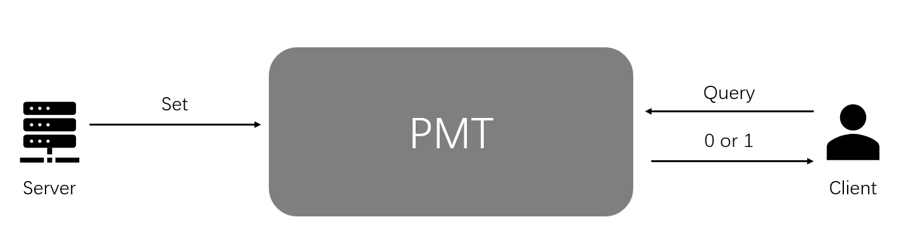
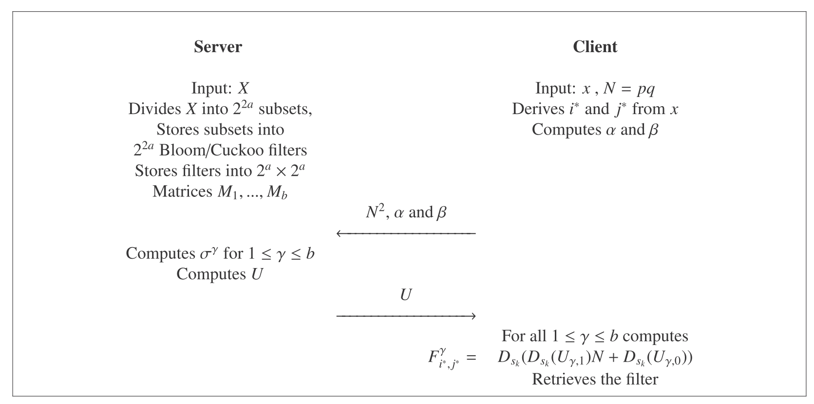
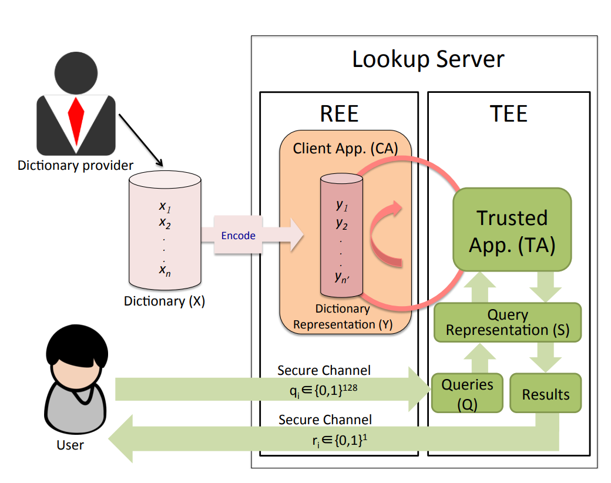

# Private membership test on bloom filters

## Why do we need membership test?

我们的目的是在非平衡场景下做出incremental PSI，之前的一些工作是利用PIR来解决非平衡和incremental的问题，但是标准PIR需要Client知道Server的index，比如双方都用cuckoo hash做index；keyword PIR可以做到关键词查询，双方不需要提前协商index，但是开销过大，不适合用来做PSI。

## Why do we need private membership test (PMT)?

普通的membership test方法有很多，但是会有安全性问题，所以我们需要使用private membership test。

从直觉上来说，server对于PMT的输入是它的数据集，client的输入是一个query，client最终得到的结果是这个query是否存在于数据集中，而server不会得到任何输出。server security指的是server仅对client泄露某个元素是否在集合中，不泄露其他任何信息；client security指的是server不知道关于query的任何信息。

<!-- 飞书原始链接: https://internal-api-drive-stream.feishu.cn/space/api/box/stream/download/authcode/?code=YWQ5MDc2Mzc0YjhlZGEyMDE5ZmU2NTA3ZjU3YTcxNzFfMTlhNzVhMDI0ZjAxZGMyYWVlNjI5MGJiMjA2YjRlOGRfSUQ6NzMwMTIyOTQ0Njk1NzU4MDMxNl8xNzg1NDYxODg1OjE3ODU0NjU0ODVfVjM -->

### Why bloom filter based PMT?

有以下几个原因让我把注意力集中在bloom filter：

- Bloom filter本身就是一种membership test的工具
- 关于incremental bloom filter的研究有很多
- 虽然现在过时了，但以前有很多基于bloom filter的PSI

  - [[DCW13](https://pureportal.strath.ac.uk/files/28525311/https_eprint.iacr.org_2013_515.pdf), CCS] When private set intersection meets big data: an efficient and scalable protocol
  - [[DC16](https://eprint.iacr.org/2016/108.pdf), ISP] An efficient toolkit for computing private set intersection
  - ......

## [[MLRN15](https://www.utupub.fi/bitstream/handle/10024/156300/07345322.pdf?sequence=1&isAllowed=y),TrustCom/BigDataSE/ISPA] Private membership test for bloom filters

这篇文章提出了三个方案，一个基于同态加密，一个基于盲签名，一个基于OPRF

### Protocol 1: Goldwasser-Micali homomorphic encryption

这个方案由于使用到了同态加密，所以开销可能会很大，high-level的思想是server将bloom filter加密之后发送给client，然后client对加密后的filter进行blind decryption获取结果。

#### Server加密

1. **存储数据**：服务 器（S）使用$l$个哈希函数$H_1, ..., H_l$将集合$X$存储到Bloom过滤器$B$中。
2. **选择参数**：S选择Goldwasser-Micali加密所需的参数$N = pq$（其中$p$和$q$是大素数），以及另一个哈希函数$H$：$\{0, 1\}^* \rightarrow Z_N$
3. **加密过滤器**：对于Bloom过滤器中的每个索引$i$，S通过试错法找到最小的$j$，使得$\text{Jacobi}(H(j||i), N) = 1$

   - 如果$H(j||i)$属于$QR_N$（N的二次剩余），则$EB(i) = B(i)$。
   - 如果$H(j||i)$属于$QNR_N$（N的非二次剩余），则$EB(i) = 1 - B(i)$。
4. **发送加密数据**：S将哈希函数$H_i$$( i = 1, ..., l )$，加密的数据库$EB$，哈希函数$H$，模数$N$和属于$QNR_N$的某个$y$（使得$\text{Jacobi}(y, N) = 1$）发送给客户端（C）。
5. **准备证明**：如有必要，S准备向可信第三方（TTP）或C证明$N$是按照Goldwasser-Micali方式选择的，以及$y$属于$QNR_N$。

#### Client查询过程

对于每个哈希函数$H_i$$( i = 1, ..., l )$：

1. C计算$H_i(x)$并通过试错法找到最小的$j$，使得$\text{Jacobi}(H(j||H_i(x)), N) = 1$。
2. C将$H(j||H_i(x))$乘以一个随机平方（模$N$)），并以1/2的概率乘以$y$。
3. C将结果$z$发送给S。
4. S告知这个数$z$是属于$QR_N$还是$QNR_N$。$z$是二次剩余当且仅当$\text{Jacobi}(z, p) = \text{Jacobi}(z, q) = 1$。
5. 现在C可以进行如下推理：

   - 如果$z$在$QR_N$中，并且C在第2步没有乘以$y$，他知道$B(H_i(x)) = EB(H_i(x))$。
   - 如果$z$在$QNR_N$中，并且C在第2步没有乘以$y$，他知道$B(H_i(x)) = 1 - EB(H_i(x))$。
   - 如果$z$在$QR_N$中，并且C在第2步乘以了$y$，他知道$B(H_i(x)) = 1 - EB(H_i(x))$。
   - 如果$z$在$QNR_N$中，并且C在第2步乘以了$y$，他知道$B(H_i(x)) = EB(H_i(x))$。

如果对于每个哈希函数$H_i$，C得到的$B(H_i(x)) = 1$，那么$x$就在Bloom filter中。

#### Thoughts

在作者的实现中，这个方案是用时最短的，但是这个方案会向Client透露bloom filter使用的hash function，随着查询的增多，client可以恢复出bloom filter的信息。

另一个问题是这个方案使用的同态加密是对bloom filter的每一bit分别加密，如果扩展到$λ-\text{bit}$的bloom filter开销可能会显著增大。我认为，对于数据集比较大的情况，应该尽量避免使用同态加密。

### Protocol 2: Blind signature

盲签名允许服务器对一个消息进行签名，同时又无法了解这个消息的具体内容。有点忘了盲签名的流程，所以这里重新回顾一下。

#### 基于盲签名的RSA流程

1. **密钥生成** ：签名方（通常是服务器）生成RSA密钥对，包括公钥（通常包含大整数$N$和指数$e$）和私钥（含有$N$和另一个指数$d$）。$N$是两个大素数的乘积，而$e$和$d$是模$Φ(N)$逆元。
2. **盲化** ：请求签名的一方（客户端）首先生成一个消息$M$，然后创建其盲化版本。盲化通常是通过将消息与一个随机数$r$（与$N$互质）结合，并将其乘以公钥指数$e$。盲化后的消息表示为$M' = (M \cdot r^e) \mod N$。
3. **签名请求** ：客户端将盲化后的消息$M'$发送给服务器。
4. **盲签名** ：服务器使用其私钥对盲化消息进行签名，生成签名$S' = (M')^d \mod N$。由于$M'$是盲化的，服务器无法知道原始消息的内容。
5. **去盲化** ：客户端收到盲签名$S'$后，进行去盲化处理，计算原始消息的签名。去盲化的过程通常涉及到使用随机数$r$的逆元。原始消息的签名$S$可以表示为$S = (S' \cdot r^{-1}) \mod N$。
6. **验证签名** ：任何一方都可以通过使用服务器的公钥来验证签名的有效性。验证过程涉及将签名$S$乘以公钥指数$e$并与原始消息$M$进行比较。

### 生成Bloom filter

1. **服务器S选择RSA签名方案的密钥**：$e$, $d$, $N$。S还选择了$l$个用于Bloom过滤器的哈希函数$H_i$，以及一个与RSA签名一起使用的哈希函数$H$。
2. **生成签名**：对于每个元素$x$，其签名为$\text{Sig}(x) = H(x)^d \mod N$。S构建一个Bloom过滤器$B$，使得当且仅当$h = H_i(x||\text{Sig}(x))$时，$B(h) = 1$。
3. **交付Bloom过滤器**：S将Bloom过滤器$B$，哈希函数$H_i$，$H$，以及公钥$(e, N)$传递给客户端C。

### 查询Bloom filter

1. **客户端C生成查询**：C选择一个随机数$r \in Z_N$，计算$y = r^eH(x) \mod N$，并将$y$发送给S。
2. **服务器签名**：S对$y$进行签名，返回签名$z = y^d \mod N$给C。
3. **客户端计算原始签名**：C计算$x$的签名$\text{Sig}(x) = z/r \mod N$。
4. **验证结果**：对于每个哈希函数$H_i$，如果$B(H_i(x||\text{Sig}(x))) = 1$，那么C知道$x$可能存在于S的记录数据库中。

#### Thoughts

这个协议利用盲签名实现了客户端安全性，服务器无法根据客户端的查询获取到信息，但由于bloom filter是直接传输给客户端的：

- 客户端知道BF中哪些位置是和查询相关的（不太清楚这个是否会对安全性造成影响，毕竟客户端不可以自己签名，不能使用字典攻击）。
- 客户端知道BF中所有1的个数，从而可以估算出服务器数据集大小（泄露数据集大小好像没有什么太大的影响，许多PSI协议都会泄露数据集大小，比如基于OKVS的，会把encode之后的数据发送过去，而encode之后的数据和原始数据差不多大）。

### Protocol 3: Oblivious PRF

#### 生成Bloom过滤器

1. S选择一个哈希函数$H$、私钥$k$，以及$l$个用于Bloom过滤器的哈希函数$H_i$。
2. S选择一个能够通过多方计算求值的OPRF $K$，用于生成one-time pad密钥的一个比特。
3. S选择另一个OPRF $F$，能够通过多方计算求值，使得$F_k(x) = (H_1(x), H_2(x), ..., H_l(x))$
4. S构建一个Bloom过滤器$B$，使得当且仅当$h = H_i(x)$时，$B(h) = 1$。
5. S构建一个加密的Bloom过滤器$EB$，使得对于每个$i$，$EB(i) = B(i) \oplus K_k(i)$。
6. S将加密的Bloom过滤器$EB$和哈希函数$H$交付给客户端C。

#### 寻找正确的Bloom过滤器条目

S和C共同评估$F_k(x)$，以便仅C了解结果$(h_1, h_2, ..., h_l)$。C不了解$k$，S不了解$H(x)$。

#### 解密Bloom过滤器条目

1. 对于每个$h_i$，S和C调用OPRF计算$K_k(h_i)$，以便只有C了解结果$b_i \in Z_2$。C不了解$k$，S不了解$h_i$。
2. 如果对于每个$i$，$EB(h_i) \oplus b_i = 1$，那么C得知$x$可能在记录数据库中。

#### Thoughts

这里使用了两个OPRF，一个用来加密BF，另一个用来获取BF相应条目。应该是由于使用到了两个OPRF，并且在文章提出来的时候还没有比较高效的OPRF方案，所以根据作者的实现结果，这个协议是最慢的。（在semi-honest模型下有必要加密BF吗？）

在[[DC16](https://eprint.iacr.org/2016/108.pdf), ISP] An efficient toolkit for computing private set intersection中提出了一种encrypted bloom filter，或许可以参考一下。

## [[RMN+19](https://www.sciencedirect.com/science/article/pii/S2352864818302670),DCN] Private membership test protocol with low communication complexity

### Main idea

这篇文章的工作是改进上面文章的通信开销，因为上一篇文章的核心思路是服务器将bloom filter加密之后再发送给客户端，在这种情况下如果服务器同时和多个客户端交互的话，通信开销会比较大。在这篇文章中，作者根据元素的前缀将一个大的bloom filter分割成了许多小BF，比如根据2a-bit长的前缀把元素分类并且生成${2}^{2a}$个小BF。文章中有介绍分割成二维和多维的情况，这里介绍二维的。

简单来说，当Client需要查询元素时，先确定这个元素的前缀，再根据前缀利用同态加密生成相应的密文，服务器收到密文之后，对密文进行相应的操作，将对应BF的密文返回给客户端，客户端可以解密出BF并进行查询。

<!-- 飞书原始链接: https://internal-api-drive-stream.feishu.cn/space/api/box/stream/download/authcode/?code=ZGJiOGQyNjE1ODZkOTc2N2FmNWY4Yjk2OGRhODYzMTZfYzA4ZGUzY2RlNDNmYTJhN2ZhZGE0NDhhYjE0YjA4YzZfSUQ6NzMwMTYwODM3ODYyNzIyNzY1Ml8xNzg1NDYxODg1OjE3ODU0NjU0ODVfVjM -->

#### 1. 数据库和过滤器的准备

- **数据库** $X$: 服务器拥有一个由 $n$ 条记录组成的数据库 $X$，其中每条记录是一个 $s-\text{bit}$的字符串。
- **子集划分**: 服务器将 $X$分为${2}^{2a}$个子集，每个子集包含所有以相同的${2}a-\text{bit}$前缀开始的元素。
- **过滤器应用**: 对于每个子集，服务器使用布隆过滤器或布谷鸟过滤器来存储其元素，设定特定的误报率 $\varepsilon$。
- **矩阵**$M$**的构建**: 服务器将这些过滤器组织成一个${2}^a \times 2^a$的矩阵$M$。

#### 2. 客户端的准备工作

- **查询元素**$x$: 客户端拥有一个元素$x$ 并希望检查它是否在数据库$X$中。
- **前缀提取和转换**: 客户端提取$x$的${2}a-\text{bit}$前缀，并将其等分成两个$a-\text{bit}$的部分，计算出对应的十进制数$i'$和$j'$。
- **生成加密向量**: 客户端根据$i'$和$j'$生成两个加密向量$\alpha$和$\beta$。

  - 向量$\alpha$和$\beta$分别由${2}^a$个加密值组成。
  - 客户端使用同态加密函数$E_k$（其中$k$是公钥）来生成这些向量。
  - 对于$\alpha$向量，客户端对每一个从 1 到${2}^a$的整数$t$计算$E_k(I(t, i'))$，其中$I(t, i')$是一个指示函数，当$t = i'$时值为 1，否则为 0。
  - 类似地，对于$\beta$向量，客户端对每一个从 1 到${2}^a$的整数$t$计算$E_k(I(t, j'))$。

#### 3. 私有成员测试的执行

- **加密向量的传输**: 客户端将加密向量$\alpha$、$\beta$和公钥$k$发送给服务器。
- **服务器的处理**:

  - 服务器使用加密向量和公钥处理矩阵$M$的相关部分。
  - 对于每个矩阵$M^\gamma$（$M$被分成多个小块以便加密处理）
  
    - 服务器为每个$M^\gamma$计算向量$\sigma^\gamma$。每个元素$\sigma^\gamma_i$是由$\beta$中的元素和$M^\gamma$中的相应元素的同态加密值的乘积（或等效的同态操作）计算得出的，$\sigma^\gamma_i=\prod^{2^a}_{t=1}(\beta_t)^{F^\gamma_{i,t}}$，$\sigma^\gamma_i$是$F^\gamma_{i,j^*}$的密文。
    - 然后计算$a_{i,e},...,a_{i,0}$，其中$\sigma^\gamma_i=a_{i,e} N^e + a_{i,e-1} N^{e-1} + \ldots + a_{i,0} N^0$。
    - 然后计算向量$U_\gamma=(U_{\gamma,0},...,U_{\gamma,e})$，其中$U_{\gamma,i}=\prod^{2a}_{t=1}(\alpha_t)^{a_{t,j}}$，其中$U_{\gamma,i}$是${a_{t,j}}$的密文。
- **服务器的响应**: 服务器将计算得到的一系列向量$U = \{U^1, U^2, \ldots, U^b\}$发送给客户端。

#### 4. 结果的解密和验证

- **客户端的解密**: 客户端接收到服务器的响应后，使用私钥对$U^\gamma$进行解密。
- **检索和验证**: 客户端根据解密后的数据恢复出对应的过滤器$F^\gamma_{i'j'}$，然后使用它来检查元素$x$是否存在于数据库 $X$中。

### Thoughts

这篇文章的思路可以借鉴，把BF或者CF分成很多regions，每次查询都对应到某一个region来减小通信开销，PIR-PSI也使用了类似的思路，协议的通信开销可以被显著减小，但是计算开销会显著增大，尤其是涉及到非常多的同态加密指数运算。或许可以考虑使用DPF，扩展成multi-server的方案，减小计算开销。

## [[TLP+17](https://arxiv.org/pdf/1606.01655.pdf),AsiaCCS] The Circle Game: Scalable Private Membership Test Using Trusted Hardware

// TODO: 这篇文章用到了可信任硬件，如果没有可信任硬件可能不太实用，先看看。TEE和TA是Trusted execution environment和trusted app，TEE 是一种系统安全原语，用于隔离和保护安全关键逻辑，使其免受平台上其他软件的影响。在 TEE 中运行的应用逻辑被称为 Trusted Application (TA)。TEE 的核心功能是保护 TA 数据的保密性和完整性，并确保没有运行在 REE 中的软件可以干扰 TA 的操作。这意味着，在 TEE 中运行的应用程序或数据可以被视为受到特别保护，隔离于系统的其他部分**。**

<!-- 飞书原始链接: https://internal-api-drive-stream.feishu.cn/space/api/box/stream/download/authcode/?code=OWQ5MGYyOTA0ODM3Mzk0NWFlNDYwNmVhNTQyZjc1MGFfOTE0MDExNDZkM2RiZDY3OGY4YThjOTEzZTk2NjZjZTZfSUQ6NzMwMTk3MDQ2NTA2ODI2OTU5Nl8xNzg1NDYxODg1OjE3ODU0NjU0ODVfVjM -->