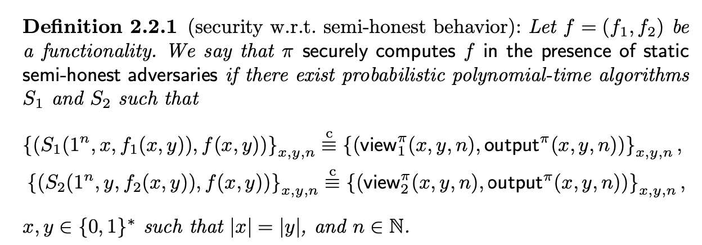

# Semi-honest Vs. Augmented Semi-honest

**Summary:** The parties controlled by the adversary are allowed to change their inputs at the beginning of the computation in augmented semi-honest model.

We only consider two-party computation for simplicity.

## Definition

### Simulation-based security

[How To Simulate It – A Tutorial on the Simulation Proof Technique](https://eprint.iacr.org/2016/046)

> Intuitively, a protocol is secure if whatever can be computed by a party participating in the protocol can be computed based on its input and output only. This is formalized according to the simulation paradigm. Loosely speaking, we require that a party’s view in a protocol execution be simulatable given only its input and output. This then implies that the parties learn nothing from the protocol execution itself, as desired.

<!-- 飞书画板 token: QLEmws1Kzh2iXabdLWmcg6ldnTb -->

### Semi-honest (Static)

**The ability of adversary:** The adversary will corrupt one of the two parties and follow the protocol specification honestly. But the adversary will try to learn more information that is allowed by ideal functionality through the internal messages.

**Formal definition of security:** a party's view in a protocol (real)execution can be simulated indistinguishably given only its input and output (ideal).

<!-- 飞书原始链接: https://internal-api-drive-stream.feishu.cn/space/api/box/stream/download/authcode/?code=YjM0MTFlMWExMTVjN2RkODMyMTBmYWY0ZjMwMGI4YWJfZTZlYWY2OWUxYTI0ODFiNTk5NzRiNDlkMzM1ZmQwZGFfSUQ6NzQzMTQ1NDc3MDUxNjc1NDQzNV8xNzg1NDYxODg5OjE3ODU0NjU0ODlfVjM -->

### Augmented semi-honest

**The ability of adversary:** same as the behavior in semi-honest, but adversary can modify the corrupted party's input before protocol excecution.

## Semi-honest / Augmented Semi-honest / Malicious

If a protocol is proven secure against malicious adversary, it may be not proven secure in the presence of semi-honest adversary.

Intuition, the adversary are able to modify input in malicious setting, which is more powerful than that in semi-honest setting.

If a protocol is proven secure against malicious adversary, it can be proven secure in the presence of augmented semi-honest adversary.

Intuition, augmented semi-honest adversary is the special case of malicious adversary who faithfully follow the protocol.

For detailed examples, please refer to Chapter 2.3.3 in [Efficient secure two party computation](https://link.springer.com/book/10.1007/978-3-642-14303-8).

<!-- 飞书画板 token: ShPswvKgth6ZDdbP23CciwQMnPc -->

## References

- [Efficient secure two party computation](https://link.springer.com/book/10.1007/978-3-642-14303-8): Chapter 2.2
- [Foundation of cryptography](https://theswissbay.ch/pdf/Gentoomen%20Library/Security/Oded_Goldreich-Foundations_of_Cryptography__Volume_2%2C_Basic_Applications%282009%29.pdf#page=332.29): Definition 7.4.24