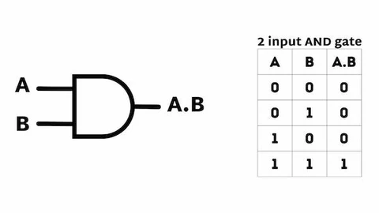
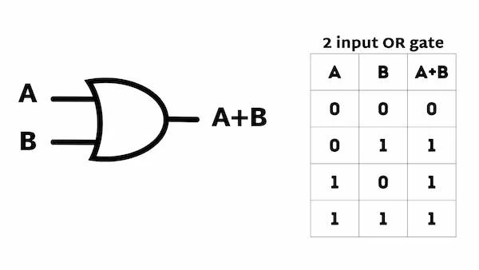
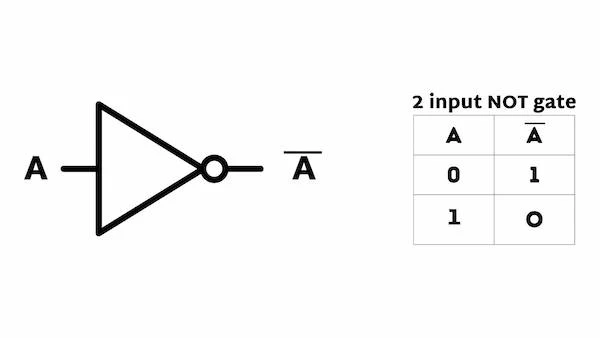
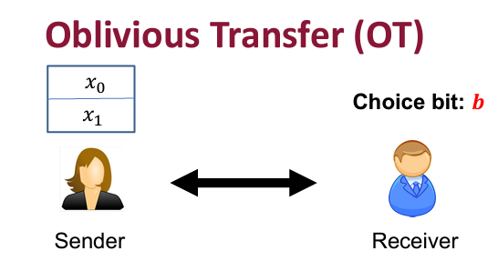

# TODO: General 2PC Via Garbled Circuit

Secure 2-Party Computation (2PC) 允许两个参与方$P_1$和$P_2$，分别输入$x_1,x_2$，共同计算一个函数$f(x_1;x_2)=y$。

目前2PC有两种实现方法，第一种是使用garbled circuit (GC)，第二种是使用secret sharing (SS)。

我们在这篇文章中，主要介绍怎么利用garbled circuit (boolean circuit)实现2PC，作为一个入门版本，帮助初学者快速认识GC。

# Boolean Circuit

在布尔电路中，输入的数据可以被看作是一个0/1比特串。并且AND门，OR门和NOT门就可以组成一个功能完备（可以表示任意的布尔函数）的布尔电路。

## AND门，OR门和NOT门

- AND门

<!-- 飞书原始链接: https://internal-api-drive-stream.feishu.cn/space/api/box/stream/download/authcode/?code=ZTg4NzNhMzQ4MDg1ZGI0MzUzOWIzYTZmMDBlYTJhNmNfNTZmNjEzZjU4NjI2OTdiMzFmOWVmYzNiOGNkZGZkYWJfSUQ6NzU0OTQ5MzM0NDM2ODgzNjYxMl8xNzg1NDYxODkzOjE3ODU0NjU0OTNfVjM -->

- OR门

<!-- 飞书原始链接: https://internal-api-drive-stream.feishu.cn/space/api/box/stream/download/authcode/?code=ZTdhNjU3NDc3ODJmNmY4MWJmNGI1Y2UzZDIyYzBiMGFfNTEzNjVhOTI0MjExNGQzMWZkZjFiNzc4ZDZlNTVjNGNfSUQ6NzU0OTQ5MjMzNjQ0NDk0ODUwOF8xNzg1NDYxODkzOjE3ODU0NjU0OTNfVjM -->

- NOT门

<!-- 飞书原始链接: https://internal-api-drive-stream.feishu.cn/space/api/box/stream/download/authcode/?code=OWQ4YzIwZWJiYWI2NWQzYjIxOGExNmFhNzRjMGVlNGRfZGY1MzUyMTAyZDQ0Nzg4YjQxNWUyNjg2ZDU1MzlkNDJfSUQ6NzU0OTQ5MzEwMTAwODcxNTc3OV8xNzg1NDYxODkzOjE3ODU0NjU0OTNfVjM -->

## 如何去混淆一个门?以AND门为例

假设这样一个场景，$P_1$输入一个比特A，$P_2$输入一个比特B。他们想要计算A and B，同时不想向别人透露自己输入的值。（当然，在这个简单的情况下，一方如果输入的是1，很容易可以根据输出猜出别人输入的值）

<!-- 飞书原始链接: https://internal-api-drive-stream.feishu.cn/space/api/box/stream/download/authcode/?code=ZWE1ZDQzMmNhN2JlNzlhNGY3ZmRiOGE5NmI3MTMyOGNfMmM0MmVhYzU2MDE2MGNjNWM1ODg2ZjYzNDFkOTJjNzBfSUQ6NzU0OTQ5NDA4MTg5NTU2MzI2NV8xNzg1NDYxODkzOjE3ODU0NjU0OTNfVjM -->

我们通过上图可以看到，AND门包含三根导线：A, B, A.B。我们后面把A.B称为C。每根导线都有一个连个可能的输入0/1。我们分别为每一根导线生成随机的garbled labels，用来混淆真实的输入值。

更具体一点，我们需要使用到dual-key symmetric encryption (IND-CCA)：$c\leftarrow \mathsf{Enc}(k_1, k_2; m),m\leftarrow \mathsf{Dec}(k_1, k_2; c)$，这种加密方法使用到了两个密钥，每个garbled label代表一个随机密钥。

假设$P_1$负责产生混淆电路，他首先产生6个随机密钥：$\{k^0_{A}, k^1_{A}, k^0_{B}, k^1_{B}, k^0_{C}, k^1_{C}\}$，分别代表四个导线输入为0/1时的garbled label。随后再产生四个密文$c_{0,0}\leftarrow \mathsf{Enc}(k^0_{A}, k^0_{B}; k^0_{C}), c_{0,1}\leftarrow \mathsf{Enc}(k^0_{A}, k^1_{B}; k^0_{C}), c_{1,0}\leftarrow \mathsf{Enc}(k^1_{A}, k^0_{B}; k^0_{C}), c_{1,1}\leftarrow \mathsf{Enc}(k^1_{A}, k^1_{B}; k^1_{C})$。

到这我们解决了如何隐私的表示布尔电路，可以尝试在本地进行计算。假如我们输入$\underline{A=1, B=1}$，我们就先找到对应的garbled label $k^1_{A}, k^1_{B}$，随后使用这两个密钥逐个尝试解密密文，只有一条密文会被解密成功 (利用CCA的性质)，得到C的garbled label $k^1_{C}$。但是仍然有一个gap没有解决，就是$P_2$如何得到正确的garbled label，同时不让$P_1$知道他的输入。

这个时候我们就需要用到一个基础的密码学工具oblivious transfer (OT)。OT中，发送方输入两个消息，接收方输入一个选择bit，最终接收方会得到他选择的那条消息，并且不知道另一条消息的信息，发送方不会知道接收方的选择比特。

<!-- 飞书原始链接: https://internal-api-drive-stream.feishu.cn/space/api/box/stream/download/authcode/?code=MzAxN2E1YTQzZDcyMTlmZGJjYzA0NTA4MDVhOWM4ZDhfNTZjMDNiZmMzZjY1MzJhODc2ZGI2OGYxMDEzYjIxMjlfSUQ6NzU0OTUwMTQxMDQxNjIxNDAxOF8xNzg1NDYxODkzOjE3ODU0NjU0OTNfVjM -->

假设$P_1, P_2$的输入都为1。有了OT之后，我们就可以让$P_1, P_2$分别输入$k^0_{B}, k^1_{B}$和1给OT，$P_2$会得到$k^1_{B}$。$P_1$先把$k^1_{A}$和所有密文发送给$P_2$。$P_2$对所有的密文尝试解密之后，就可以得到$k^1_{C}$，随后他把$k^1_{C}$发送给$P_1$，$P_1$就可以知道结果为1。

当我们的电路很庞大的时候，$k^1_{C}$就作为后续门的输入label，继续进行计算，知道最终计算完成。

推荐阅读：[BRH12, CCS] Foundations of garbled circuits