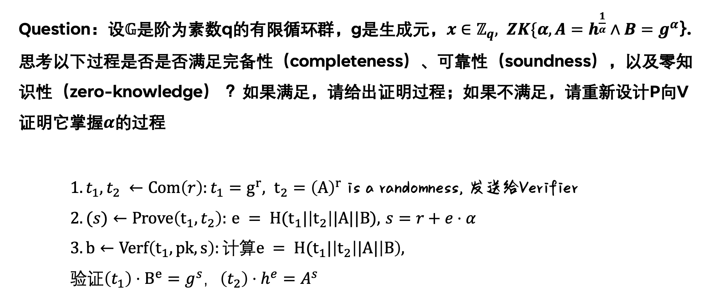

# The Sigma Protocol

Q1. Why do we use special soundness to define the Sigma protocol's soundness, i.e., why it is special?

Q2. Why does the Sigma protocol require an honest verifier? Can it be secure against malicious verifiers?

Q3. What's the difference between Special HVZK (Def. 19.5) and Special computational HVZK (20.6)?

<!-- 飞书原始链接: https://internal-api-drive-stream.feishu.cn/space/api/box/stream/download/authcode/?code=NzZkMjQ2YmMxMzlhYzBkMDdmODk1OTA1MzM5OGNmZDBfMGNiODVkOTliOTg0OTZkNzMxODUxZDFkNDMxYWM0MTVfSUQ6NzM2MTY5NzcxNjE5MzkzNTM2NF8xNzg1NDYxODg0OjE3ODU0NjU0ODRfVjM -->