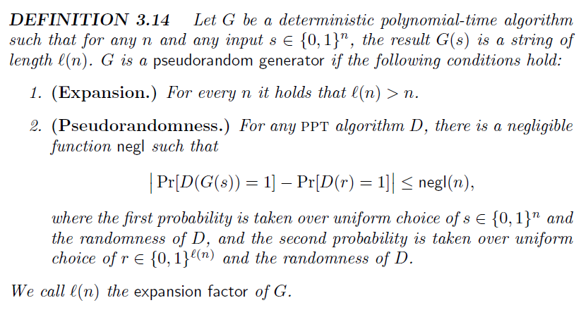
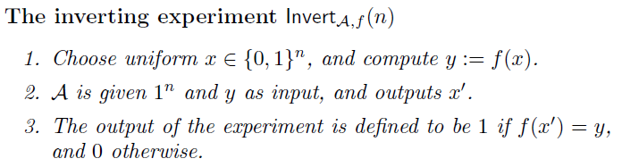
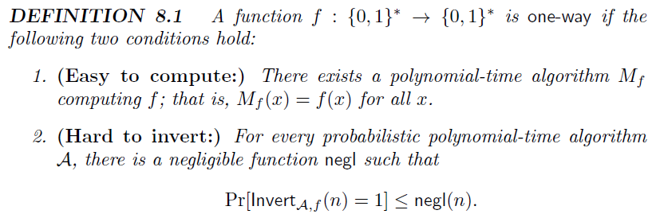
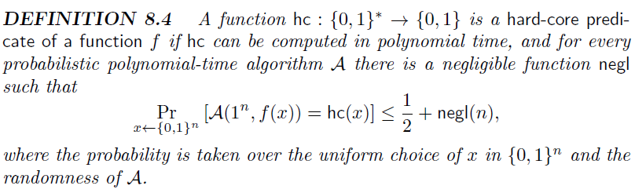
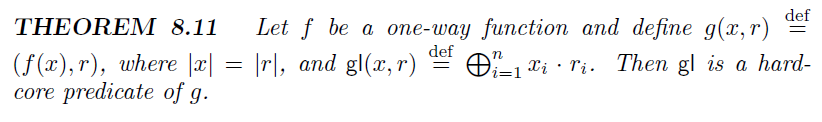
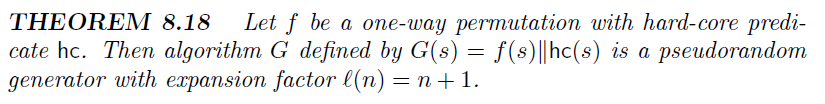
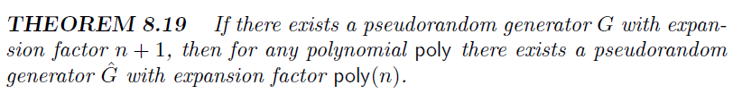
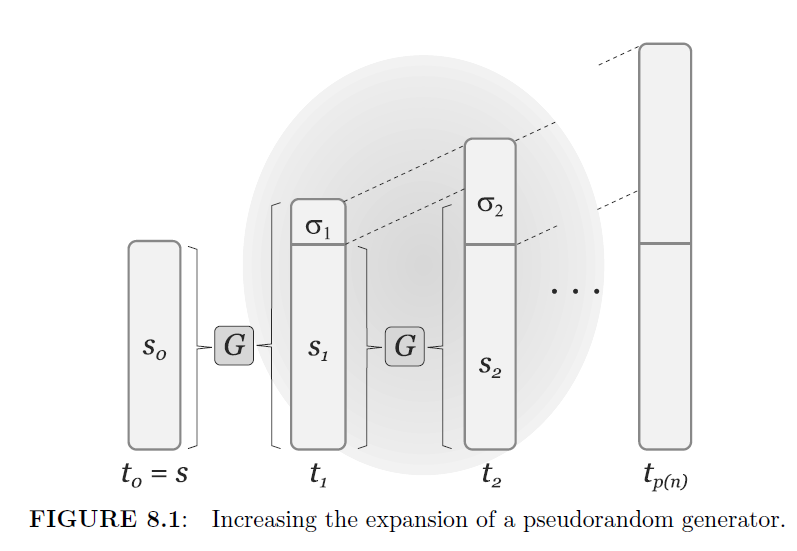
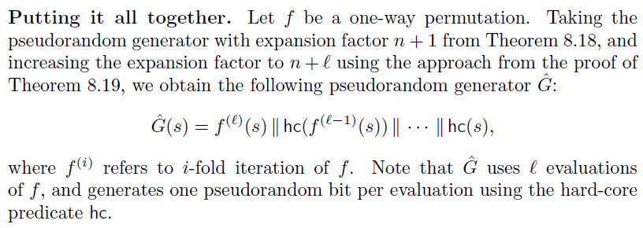

# The consistency of symmetric and asymmetric encryption

**Summary:** We are trying to discuss the core of symmetric encryption (secret-key encryption, SKE) and asymmetric encryption (public-key encryption, PKE).

## Notations

- Pseudorandom Generator/Permutation/Function, PRG/PRP/PRF: 伪随机生成器/映射/函数.

### Pseudorandom Generator (PRG)

> A pseudorandomgenerator G is an efficient, deterministic algorithm for transforming a short, uniform string (called a seed) into a longer, "uniform-looking" (or "pseudorandom") output string. State differently, a pseudorandom generator uses a small amount of true randomness in order to generate a large amount of pseudorandomness.

#### Formal Definition

<!-- 飞书原始链接: https://internal-api-drive-stream.feishu.cn/space/api/box/stream/download/authcode/?code=ZTllY2IwZTAxNGYzOThhNGE3ZWQ5YmZjZTc5MTNjMGFfMGQ3ZTFjNmFhMGQ4NmIzZWJkNTMxNzk5NWJmNTE5NmNfSUQ6NzMyNjgzNjgwMTk4ODEzMjg5Ml8xNzg1NDYxODgzOjE3ODU0NjU0ODNfVjM -->

对上面公示的一个简单理解是，没有一个概率多项式时间（PPT）算法可以区分出PRG的输出结果和一个随机字符串。

**Insecure Example：**

Define $G(s)$ to output $s$followed by $\oplus s_i$ (i.e., the XOR of all the bits of $s$), so the expansion factor of $G$ is $l(n)=n+1$. The output of $G$can be distinguished easily from uniform. Consider the following efficient distinguisher $D$: on input a string $w$, output 1 if and only if the final bit of $w$ is equal to the XOR of all the preceding bits of $w$. Since this holds for all strings output by $G$, we have $Pr[D(G(s)) =1]=1$. On the other hand, if $r$ is uniform,the final bit of $r$ is uniform and so $Pr[D(r) =1]= 1/2$. The quantity $|1/2-1|$ is constant, not negligible, and so G is not a pseudorandom generator. (Note that $D$ is not always "correct" since it sometimes outputs 1 even when given a uniform string. But $D$ is still a good distinguisher.)

### Construction (From OWF)

#### One-way function

<!-- 飞书原始链接: https://internal-api-drive-stream.feishu.cn/space/api/box/stream/download/authcode/?code=NjQyMDg4ZmNmMTIzNDZjMTdmNzY4MDcxYjRiYjQ5MmVfNjI1MzZiNjk2YzY4MzM0ODk1MzU5MDU4MjdhZWZiMGZfSUQ6NzMyNjkyNDYwMjA1NDMyODM0OF8xNzg1NDYxODgzOjE3ODU0NjU0ODNfVjM -->

<!-- 飞书原始链接: https://internal-api-drive-stream.feishu.cn/space/api/box/stream/download/authcode/?code=ZWY0YTc0ZTM4MDQ3YjNjYmE4NDU4MzlhZDgxMDhmMjlfYWMyYWRjNjBjMDYzZWMzNjUwMmM4OWM3MzQ5OTZkYjVfSUQ6NzMyNjkyNDY2NTg5NzQ4NDMxNl8xNzg1NDYxODgzOjE3ODU0NjU0ODNfVjM -->

#### Hard-Core Predicates

<!-- 飞书原始链接: https://internal-api-drive-stream.feishu.cn/space/api/box/stream/download/authcode/?code=MWUzYjY2ZGFkNjc1ZGE5MzNlNWE2MDcxNmY3N2FkYmNfYmUwZGUxYzMzNWUwYWYzNWE0NjZjODgzOWRjOGU0OGNfSUQ6NzMyNjkzOTUzNTA3MjYyNDY0MV8xNzg1NDYxODgzOjE3ODU0NjU0ODNfVjM -->

<!-- 飞书原始链接: https://internal-api-drive-stream.feishu.cn/space/api/box/stream/download/authcode/?code=MzYzZjhjNTBlN2FlYmRiYjhlZGY0NDMzY2U3YjY3YjVfYmI1MzQ3MDMxNDBhODczNDNhNzg3NzBhZThmMDY4NzBfSUQ6NzMyNjk0MDU1MDQ3OTk4NjY4OV8xNzg1NDYxODgzOjE3ODU0NjU0ODNfVjM -->

#### Pseudorandom Genarator

<!-- 飞书原始链接: https://internal-api-drive-stream.feishu.cn/space/api/box/stream/download/authcode/?code=OTcwNDg1YTk4ZmM5MjNjOTI0ODA3ZDkwZWQzZTQ1MTNfNTNkNmRiY2ZjMDAxZDk0NTMxNTZmM2YxMTcwOTA4NTdfSUQ6NzMyNjk0MjcxMTE5MzMyMTUwMF8xNzg1NDYxODgzOjE3ODU0NjU0ODNfVjM -->

<!-- 飞书原始链接: https://internal-api-drive-stream.feishu.cn/space/api/box/stream/download/authcode/?code=ZGIyNDJjZWU4ZjY0Yzk2MDA1OTc4YjM2ZTg3MWQ0OWVfODc2YTAzODhlZmUwY2M0OGI1YTBmNDZhMjJiMDk5YjZfSUQ6NzMyNjk0Mjg3NDQwNTI5MDAxMl8xNzg1NDYxODgzOjE3ODU0NjU0ODNfVjM -->

<!-- 飞书原始链接: https://internal-api-drive-stream.feishu.cn/space/api/box/stream/download/authcode/?code=MThiZjBjZGJlMDk5NGJkMGU4YzViMGRlNTE4NDBlZjZfMTNhOWY5MDdiOTZjNWQzYTUzYzU1NTI0ZjRmMGE3ZWNfSUQ6NzMyNjk0Mjk0ODk3MTUyODE5M18xNzg1NDYxODgzOjE3ODU0NjU0ODNfVjM -->

<!-- 飞书原始链接: https://internal-api-drive-stream.feishu.cn/space/api/box/stream/download/authcode/?code=MDlmNjg4MDIwNzhmM2U1MTM2ZmQ2MTQxODFjNmMzYmJfZmEyMmJkY2I1YTMxOTA0MWQyNTkwOTYxNGMzOTY0N2JfSUQ6NzMyNjk0MzgyNDQ5MDYxMDcxNl8xNzg1NDYxODgzOjE3ODU0NjU0ODNfVjM -->

### Pseudorandom Permutation (PRP)

### Pseudorandom Function (PRF)

- Block cipher: 等同伪随机映射，即 block cipher is a PRP. 最常见的 block cipher 为 AES-128/256.

#### Definitions

- Permutation
- Function
- Pseudorandom
- One-way

# 对称加密 (SKE)

## 完美加密 One-time Pad

### 统计/计算不可区分加密

对称密码核心为构造 一个输入为固定长度，输出为任意长度的 PRG.

How to transform fixed-length PRP to arbitrary-length PRG ?

#### Stateful-based

#### Nonce-based

# 公钥加密 (PKE)

尽管许多公钥加密的实际构造看上去为各种计算组成，事实上他们的构造依旧符合通用构造。其中的代数结构为相关原语在代数上的映射，例如 algebraic MAC, hash.

## Perderson commitment relies on a algebraic hash function

### Elgamal encryption relies on non-interactive key exchange

#### BF-IBE [BF01,CRYPTO] relies on three-party non-interactive key exchange