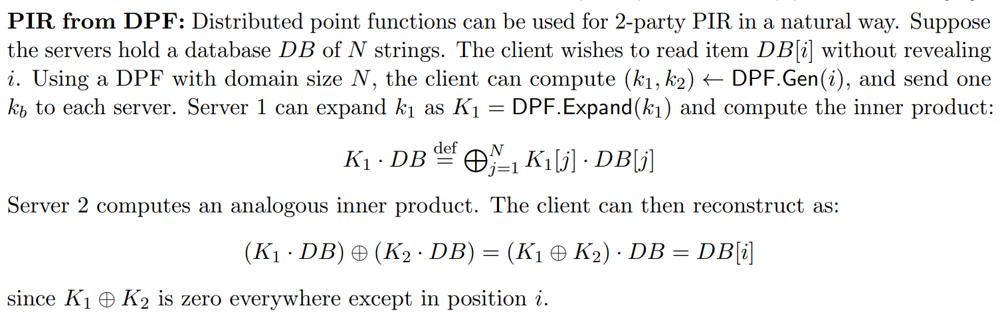
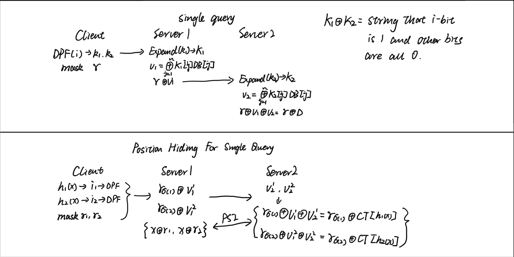
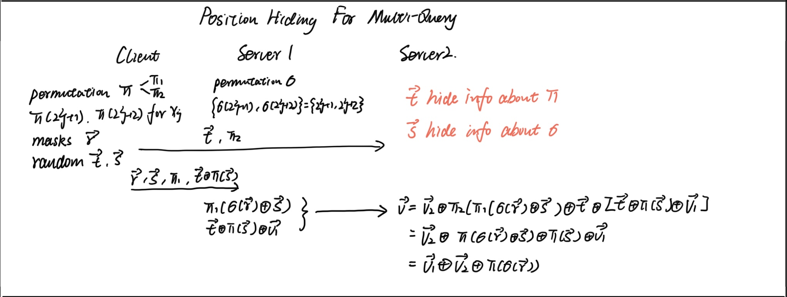
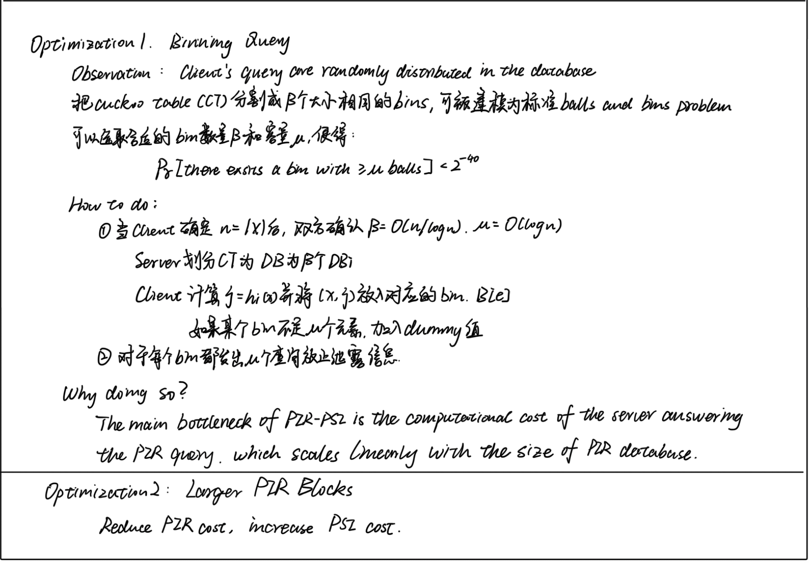
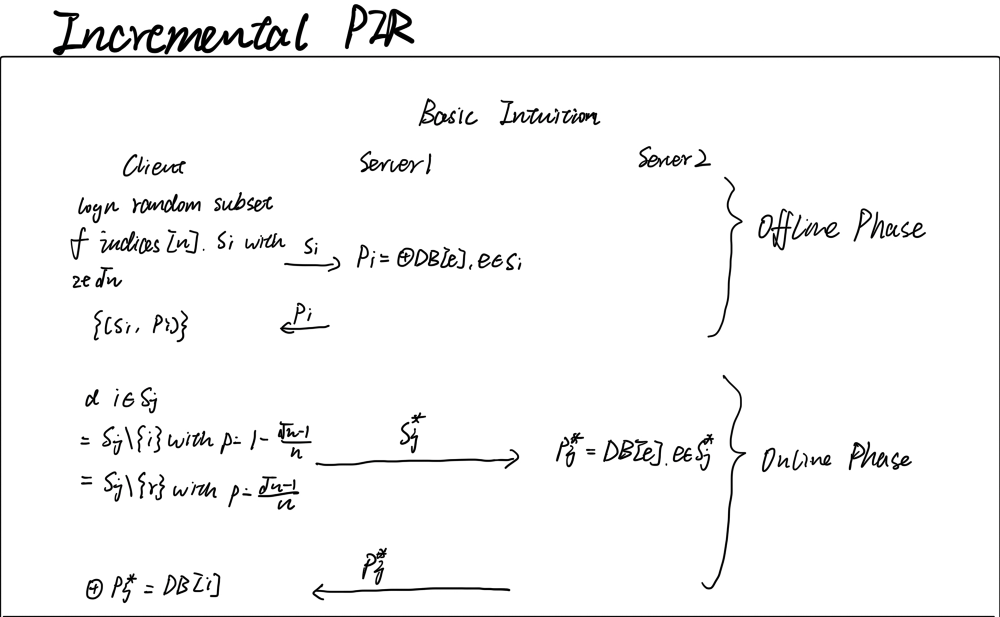
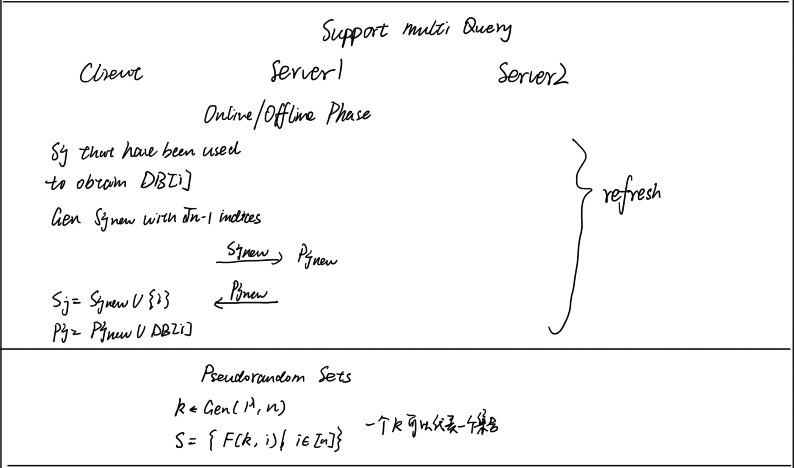
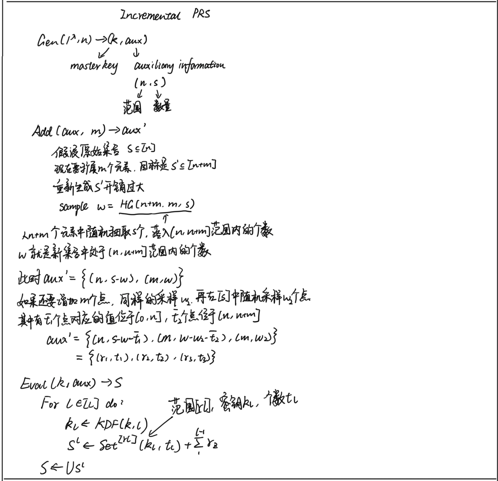
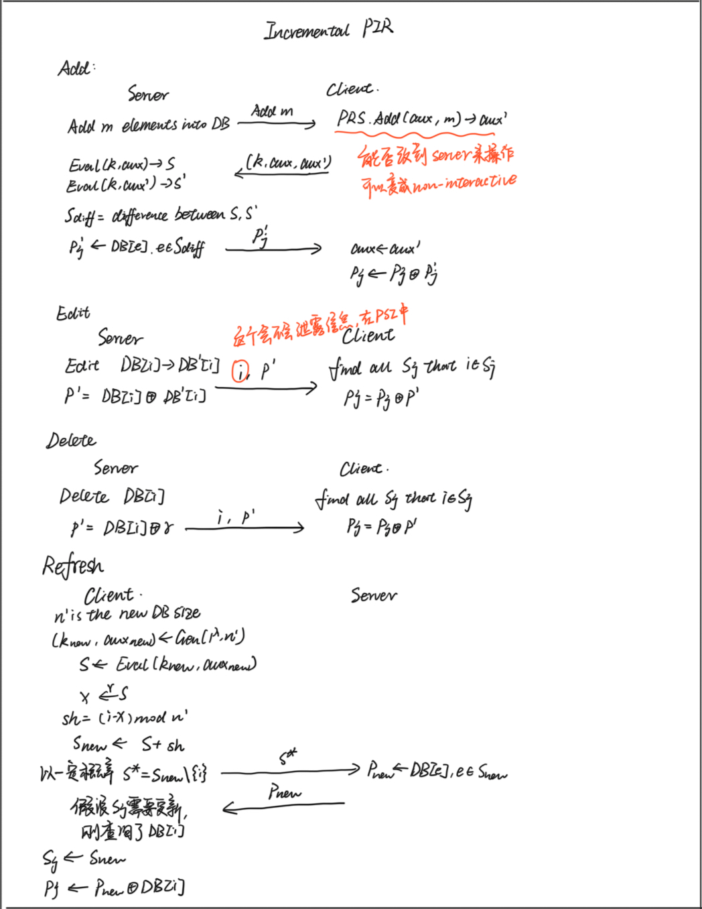
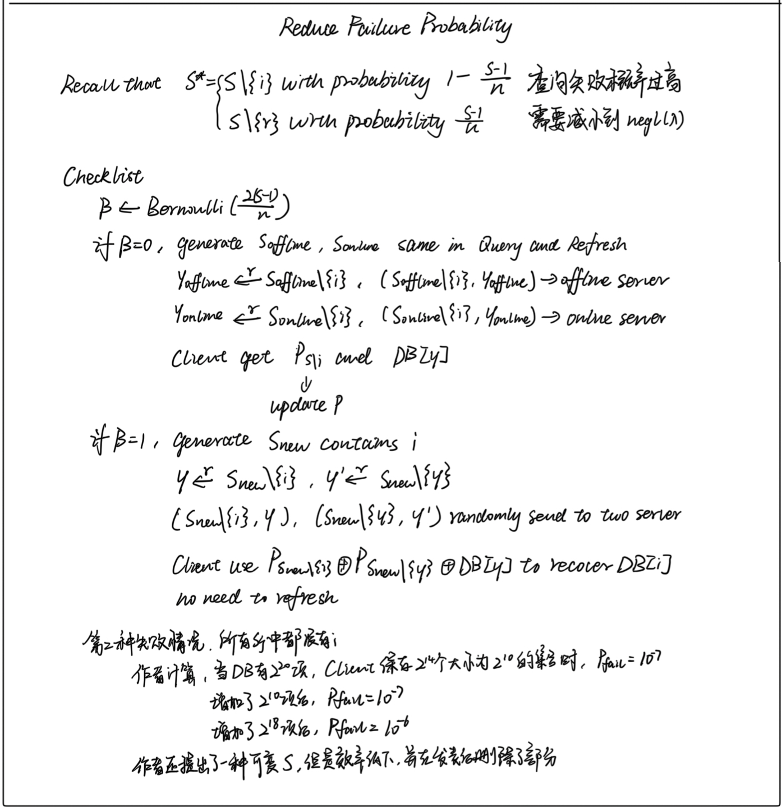

# PIR-PSI

## Setting

Non-colluding multi-server.

semi-honest

## PIR-PSI: Scaling Private Contact Discovery

按照文章写的顺序介绍一下，感觉直接写构造跨度有些太大

1. PIR from DPF

利用DPF实现PIR，首先客户端将要查询的位置 $i$ 利用PIR分成两个key，然后将两个key分别发送给两个服务器，两个服务器将key与自己的数据库做异或后发送给client，client之后可以利用DPF的性质求解出想要得到的值

<!-- 飞书原始链接: https://internal-api-drive-stream.feishu.cn/space/api/box/stream/download/authcode/?code=MWI1YWJhMTIwNjU2ZWJlYmY0N2FkMWQ5YTRiMGVmMjhfNjc1ZGQxZmI2OGI4MzFkYTgwMDRiOWFhYWM0NzVlNGNfSUQ6NzI4NzkyMjc0NDQzNTI0NTA2MF8xNzg1NDYxOTM1OjE3ODU0NjU1MzVfVjM -->

2. PIR-PEQ and Designated-output PIR

在Designated-output PIR中，client会在开始时多发送一个mask给server1，server1给自己的结果加上一个mask后再发给server2，server2直接求出PIR异或r之后的结果，然后server2再和client做private equality test，就可以知道某个元素是否在DB之中。后面的构造延续了这个思路。

3. Cuckoo hashing and position hiding

在PIR中，client是需要知道某个元素在DB中的具体位置的，但是在PSI的functionality中，不可以让client知道某个元素在DB中的具体位置，所以既要让client知道位置，又不能client知道太多，于是存入cuckoo table之后再做position hiding。生成cuckoo hash表之后，如果直接用PIR-PEQ，client会知道x是被放在h1(x), h2(x)或者h3(x)，这会泄露额外的信息。为了不泄露是x在CT中的位置，client发送三个PIR queries $h_1(x)$, $h_2(x)$, $h_3(x)$ 和三个masks $r_1$, $r_2$, $r_3$，然后经过PIR-PEQ（加上了一些置换），server2会得到$CT[h_1(x)]⊕r_{σ(1)}, CT[h_2(x)]⊕r_{σ(2)}$，如果x在CT中的话，server2中肯定会有$x⊕r_1$或者$x⊕r_2$，client和server2分别将这些作为PSI的输入就可以了。重复这些操作就完成了PIR-PSI，可以把PSI留到最后一起执行。

4. 优化

- 文章中提到了两个优化的点，第一个是bining query，把CT等分成 $\beta$ 个bin $DB_i$，client的输入也根据CT的划分做同样的划分，得到$B_i$，最后每个$DB_i$和$B_i$做PIR-PSI。因为作者观察到PIR的瓶颈是DB的大小，这样划分可以显著减小DB大小，最后实测确实可以极大的提高效率。而且这个bin的数量是可以调整的，所以可以做取舍。
- 第二个是增大PIR的block，一个PIR的block可以包括多个元素，减少PIR的数量，增大PSI的开销，也是个trade off。

<!-- 飞书原始链接: https://internal-api-drive-stream.feishu.cn/space/api/box/stream/download/authcode/?code=ZTQxYzY0ZWE2OGI2NTRhODZlYzdmYmQ1MjcwNTA0OGZfZDZiY2YwYWY5MjY5ZWIwNDJiMzlhZGZlZTQ4ZmM0NjZfSUQ6NzI5MTI1MTc0NDMxNzkxNjE2NF8xNzg1NDYxOTM1OjE3ODU0NjU1MzVfVjM -->

<!-- 飞书原始链接: https://internal-api-drive-stream.feishu.cn/space/api/box/stream/download/authcode/?code=N2I4OGVlYTYzYjRhMzYxZWMyMzJhYjg1MWIxMWU4ZGNfYzg5MjM3Y2UzYmFkMDk2MmQ1OTExNmY4MjFkZTNkNmNfSUQ6NzI5MTI1MTIzODQwMTYzODQwM18xNzg1NDYxOTM1OjE3ODU0NjU1MzVfVjM -->

<!-- 飞书原始链接: https://internal-api-drive-stream.feishu.cn/space/api/box/stream/download/authcode/?code=MGQwZjgwYjI1MjFmOTA0MWFiY2ExNmUyNDc3MjlhNmVfZDMwOWY2ZTNlMGRhZmI5OTY2YTMzNTYzMWZkNmRmY2VfSUQ6NzI5MTI1MTI4Mjg1NjM5NDc1Nl8xNzg1NDYxOTM1OjE3ODU0NjU1MzVfVjM -->

## Incremental Offline/Online PIR

这篇文章的PIR是基于[CK22] [Private information retrieval with sublinear online time](https://eprint.iacr.org/2019/1075.pdf)构造的。这个PIR协议也是基于non colluding multi server的，有online和offline server，每个server都保存一份DB。

### CK's Protocol

offline阶段offline server将自己的数据库将数据库DB划分为$\sqrt{n}logn$个随机子集，并计算：

- 其下标集合分别为$S_1,...,S_{\sqrt{n}logn}$
- $p_j=\bigoplus_{e\in S_j} D[e]$
- 发送$hint=\{(S_1,p_1),...\}$给client

online阶段client进行查询的步骤如下：

- 找到一个集合$S$包含要查询的下标$i$，以一定概率（$S$中包含$i$的概率）计算$S^*=S\backslash {i}$，否则$S^*=S\backslash {rand}$，发送给online server
- Online server根据$S^*$计算出对应的parity $p^*$，发送给client
- client计算$p\oplus p^*=D[i]$

这个版本虽然不完善，但是有助于理解CK协议的思想。这里存在的第一个问题，是多次查询时，加入用到的$S$是一样的，那么online server就可以根据两次集合的不同推断出client要查询的元素；第二个问题是，删除$i$的概率过低，导致协议失败的概率过高；第三个问题是存下标集合的开销过大。

- 第一个问题可以通过refresh解决，也就是和服务器协商生，成一个新的包含$i$的集合和parity。
- 第二个问题可以通过fallback解决，如果没有删除$i$，客户端重新生成一个全新的包含$i$的集合$S_{new}$，分成两份都不包含$i$的集合随机发送给两个服务器，两个服务器返回parity之后client可以恢复出$D[i]$。
- 第三个问题可以通过引入pseudorandom set (PRS) 来解决，PRS可以通过一个密钥$k$来构造出随机集合，保存时只需要保存密钥，可以极大的节省空间。

### Incremental Protocol

这篇文章的协议基本思路和CK是一样的，主要区别在于提出了incremental PRS，从而实现了PIR的插入，修改和删除。

Incremental PRS：

- $(k,aux)\gets Gen(λ,n)$，用于生成密钥和aux，aux是键值对组成的集合，key是元素范围，value是该范围内元素个数，初始状态是
- $aux'\gets Add(aux,m)$，用于构造插入m个新的元素之后的集合的辅助信息，流程是模拟从$n+m$个元素中抽取$m$个元素，得到一个随机结果$w$，从$[s]$中随机抽取$w$个元素，将对应位置替换成新增的元素，生成新的$aux$，以此类推。
- $S\gets Eval(k,aux)$，利用$aux$和master key $k$构造集合$S$，对于$aux$中每一个键值对都利用KDF生成密钥，然后根据范围和数量利用密钥和PRF构造集合。

删除和修改元素简单一些：

- 修改：假如server需要修改$S_j$对应的$D[e]$为$D'[e]$，server把$u=D[e]\oplus D'[x]$发送给client，client计算$p_j=p_j\oplus u$
- 删除：假如server需要删除元素$D[e]$，计算$u=r\oplus D[e]$然后和修改做一样的操作

用这个incremental PRS替换掉上面的PRS就可以得到incremental PIR，大概思路是这样，有一些细节在这里没有提到。

<!-- 飞书原始链接: https://internal-api-drive-stream.feishu.cn/space/api/box/stream/download/authcode/?code=ZjUzMzdhNmJiZDgzY2JlOTJiMTEzYTZjZjgwZjAwNTBfOTYzN2FlY2EzNjM5NTkwZjU2Y2Y4YWQxNGZjODJjMTFfSUQ6NzI5MTI1MTQyMDg3ODE1OTg3NV8xNzg1NDYxOTM1OjE3ODU0NjU1MzVfVjM -->

<!-- 飞书原始链接: https://internal-api-drive-stream.feishu.cn/space/api/box/stream/download/authcode/?code=YzYxMGFkMzk4NjIwNjkwMDlhNmEzOGJlMTE3YTYyYjBfM2UxMDNkNjViNmI4MmQ0OWJkMTFmYjVhZGYxYTM3YzlfSUQ6NzI5MTI1MTQ3NDUyMzI1ODg4M18xNzg1NDYxOTM1OjE3ODU0NjU1MzVfVjM -->

<!-- 飞书原始链接: https://internal-api-drive-stream.feishu.cn/space/api/box/stream/download/authcode/?code=MmE1NDhkYTUzY2VmMDZhMmQyYzYzNjk0NmU1YWQzODFfMTk0NTI3ZWNiNmEzNjQ0YWY5MmZjMDk4MTFkNTA4M2ZfSUQ6NzI5MTI1MTUwMjgyNzYzNDY5MV8xNzg1NDYxOTM1OjE3ODU0NjU1MzVfVjM -->

<!-- 飞书原始链接: https://internal-api-drive-stream.feishu.cn/space/api/box/stream/download/authcode/?code=NjdiZjU2NGE0YmYzY2Y4OWY3ZDU1OTRkOWVjMWMwYmVfMWJhMzBhOWEyYjI4ZmU5MzJkMzg1YTJiYzFjYTY1MGZfSUQ6NzI5MTI1MTU0Njc2NzI3ODA4M18xNzg1NDYxOTM1OjE3ODU0NjU1MzVfVjM -->

<!-- 飞书原始链接: https://internal-api-drive-stream.feishu.cn/space/api/box/stream/download/authcode/?code=NGFjY2FjZDdmMjU2MzU3ZmQ5MjY2Yjk5OGMyMjUxNTNfMWVlYjEwZjEyZTY3ZjUzOWQzNTU4MDRjMGQ1NDcxMjJfSUQ6NzI5MTI1MTYzNTYyNjQ5MTkwOF8xNzg1NDYxOTM1OjE3ODU0NjU1MzVfVjM -->

## Combine Incremental PIR with PIR-PSI

### Observation

- 第一个方案中需要server2得到PIR的masked output。而第二个方案是标准的PIR方案，也就是client获得结果，这里感觉是个难点，就是不让client获取结果，仅仅让server2获取masked output（没有想到trivial的方法解决）
- PSI不允许client知道服务器的index，所以需要服务器建立可查询的索引，就像PIR-PSI中使用到的cuckoo hash，可以在incremental PIR的preprocessing中加入cuckoo hash
- 第一个方案为了提高PIR的效率，将cuckoo table分成了多个bin，这个在Incremental PIR里面天然的实现了，因为把DB分成了多个随机集合

<!-- 飞书原始链接: https://internal-api-drive-stream.feishu.cn/space/api/box/stream/download/authcode/?code=YWQyNmM4MTJhMmFkNGNiYWJiOTMzNTJmZTc1ZDgxMWVfYmNhZTM2NmMzYzNlYjBmYmY0OWRkOGJlYjJiNjRiODFfSUQ6NzI5MTI1MjEwNzg3Mzg2MTYzNl8xNzg1NDYxOTM1OjE3ODU0NjU1MzVfVjM -->

$$\beta\leftarrow Bernoulli(\frac{2(s-1)}{n})$$

- If $\beta=0$, generate $S_{offline}$, $S_{online}$same in Query and Refresh

$\gamma_{offline}\xleftarrow{r}S_{offline}\backslash \{i\}$, $(S_{offline}\backslash\{i\},\gamma_{offline})\rightarrow offline\ server$

$\gamma_{online}\xleftarrow{r}S_{online}\backslash \{i\}$, $(S_{online}\backslash\{i\},\gamma_{online})\rightarrow online\ server$

server calculate $p'=\oplus DB[e], e\in S$ and $DB[\gamma]$

- If $\beta=1$, generate $S_{new}$ where $i\in S_{new}$

$$\gamma\xleftarrow{r}S_{new}\backslash \{i\},\gamma'\xleftarrow{r}S_{new}\backslash \{i\}$$

Randomly send $(S_{new}\backslash\{i\},\gamma),(S_{new}\backslash\{\gamma\},\gamma')$ to two servers

Client use $P_{S_{new}\backslash\{i\}}$, $P_{S_{new}\backslash\{\gamma\}}$ and $DB[\gamma]$ to recover $DB[i]$

### Use dynamic cuckoo filter in PIR-PSI

- 在第一篇文章中用可更新的CT

### 一些杂谈

- 第二篇文章的增删改主要贡献是对于client保存的Parity和PRS的修改；而第一篇文章本身不存在这个问题，因为client不保存这些信息，服务器直接更新自己的DB然后更新cuckoo filter就行了。（我先试着构造一下）
- 第一篇文章的base-PSI是KKRT，KKRT本身也是要将元素放入cuckoo table的，那么PIR-PSI在PIR阶段要把元素放入CT，在PSI阶段中还要构造CT，能否将这两个CT合并起来。
