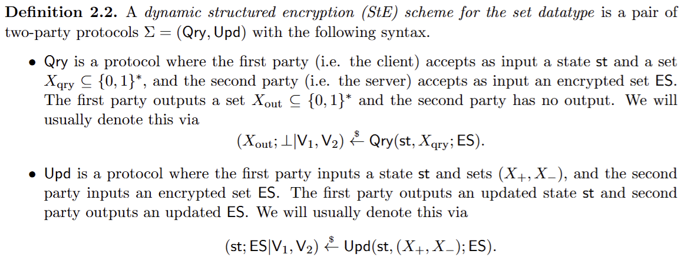
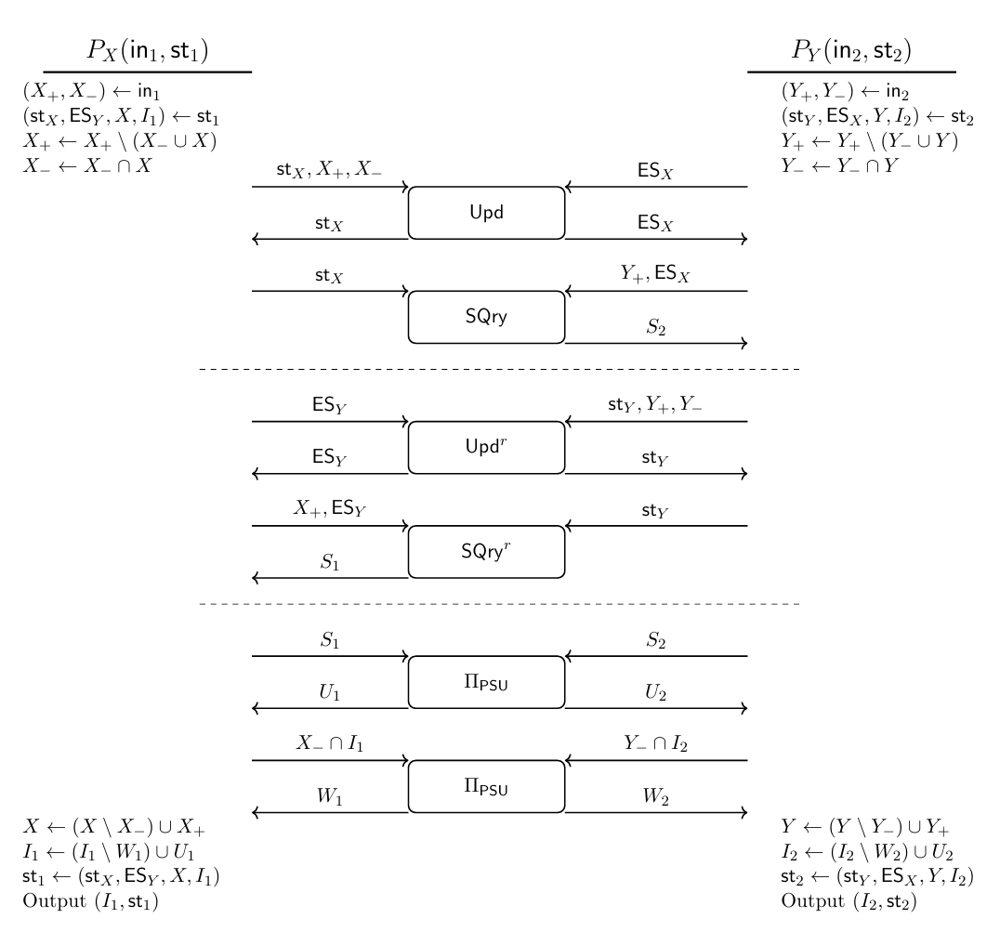
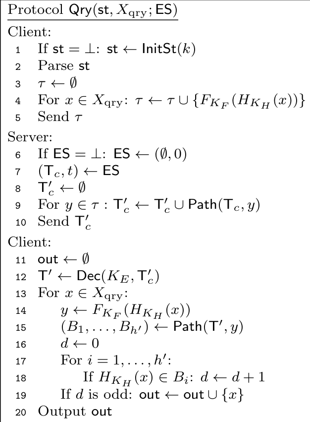
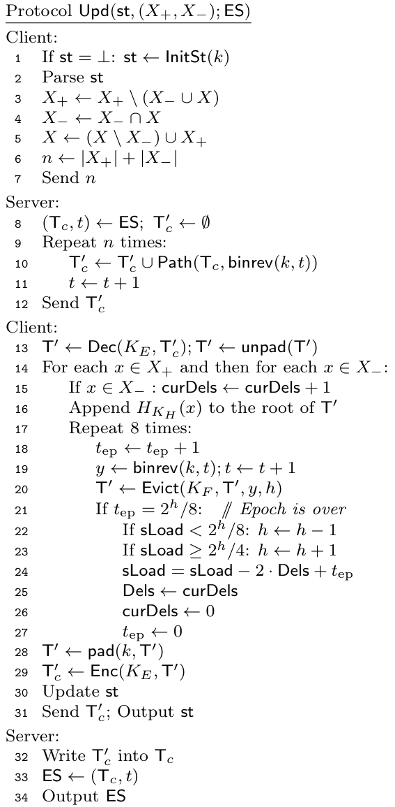
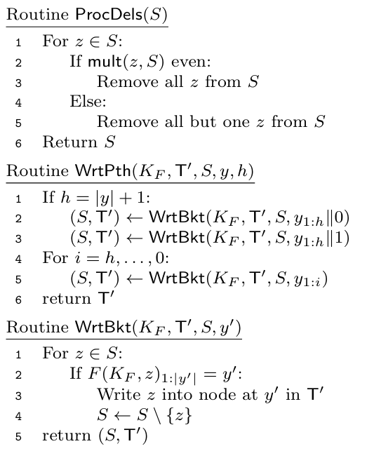
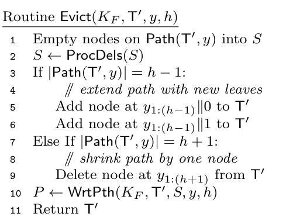

# [ACG+ 24, Preprint] Updatable Private Set Intersection from Structured Encryption

**Summary: they propose an updatable PSI based on structured encryption (StE) and PSU**

## Introduction

这篇文章的特色是在PSI上面实现了arbitrary deletion，因为在[BMX22](https://par.nsf.gov/servlets/purl/10412585)中，只实现了weak deletion（在一定的time slot之后删除）。

## Overview

在最开始，参与双方会拥有对方加密的集合，参与方的输入为一个元组，包括上一轮的集合，准备添加的元素和准备删除的元素，我们将这个元组表示为$(X, X_+, X_-)$；这篇文章支持增加和删除，具体构造也可以分为这两个部分：

1. 更新encrypted set

参与双方通过StE，更新对方保存的加密集合，再通过StE计算交集

2. 合并结果

参与双方本地计算应该删掉的元素之后，将应该增加的元素和应该删除的元素通过PSU合并起来，最后更新结果

## Preliminaries

这个协议主要构造部分是StE，而这个StE是基于tree-based ORAM的思路

### Tree-based ORAM ([[SDS+12](https://arxiv.org/pdf/1202.5150)])

这里仅仅介绍一些简单的概念

Tree-based ORAM是二叉树的结构，每个节点是一个bucket，每个bucket里包含了一些block，每个block是元素经过CPA-Secure的加密方案加密的密文

在传统的Tree-based ORAM中，二叉树的大小是固定的，每个元素会随机映射（一般是通过PRF）到二叉树的某个node/bucket中，这个映射会保存在client中，每当client想要读取一个元素时，会告诉server一个path（从root到leaf），server把这个path上的所有结点都发送给client，client进一步完成shuffle操作

### 这篇文章中的StE

这篇文章的StE包含两个算法，Qry和Upd，其中Qry是在上图提到的二叉树中进行查询的算法；Upd是对二叉树进行更新的算法；

Qry对应的是client-side query，意思是，client将数据外包给了server，然后client向server查询的过程；但是在这篇文章中，需要用到的是server-side query：client仍然将数据外包给server，但是由server对这些数据查询，叫做sQry。

<!-- 飞书原始链接: https://internal-api-drive-stream.feishu.cn/space/api/box/stream/download/authcode/?code=NDBkY2I4ODI2OWYxMTM1YTJiZDAzMDMyZDE4Y2Y4YjFfYmEzMWQ4YTgxMzgxOTM1Y2Q1MmQ0YzkyNjU4NWQ0ODNfSUQ6NzQxNTQ0NzgxMDYwMDAwOTczMl8xNzg1NDYxOTY0OjE3ODU0NjU1NjRfVjM -->

## PSI Construction

<!-- 飞书原始链接: https://internal-api-drive-stream.feishu.cn/space/api/box/stream/download/authcode/?code=MThjYjlkZmM5MjE1ZjcwOTdjZWQzMTUzOWJiYWQyNTlfMTZlZDZhMGQ5OTQ3OGEyNWM5NzY2ZmQ1ZmVmNzQ0ODlfSUQ6NzQxNTc4OTI2NDIxNDQ0MTk4NV8xNzg1NDYxOTY0OjE3ODU0NjU1NjRfVjM -->

实际上，这个是参与双方都保存对方的加密集合，为了避免访问模式的泄露，采用了ORAM-like的构造

上面的构造可以分为三个交互阶段：

1. $P_X$更新$P_Y$中的加密集合，$P_Y$根据新增的集合调用SQry，取得更新的交集$S_2$
2. 和上面的步骤是对称的
3. 合并新增元素产生的新交集；合并应该删除的元素

最后双方本地合并出最终的交集

## StE Construction

上面是一个general的构造，而PSU可以直接使用现成的构造，这篇文章主要关注StE的构造，作者把他们的StE构造称为ESX。

### ESX with client-side query

这里涉及到构造两个算法：Qry和Upd；这个模型是client将自己的数据加密后外包给server，server以二叉树的形式保存这些数据，client会通过Qry查询这些数据并且通过Upd更新二叉树。某个元素在树中的路径由PRF确定：该元素一定存在于由PRF确定的由根到叶的路径的某个节点中。

#### Qry

通过这个算法client可以在server的二叉树中查询某个元素

- 首先client会计算想要查询元素的PRF（代表该元素所在的路径），然后将这些路径发送给server；
- server收到路径之后，根据这些路径从树中提取出一个子树并发送给client；
- client解密子树，如果元素出现奇数次，则元素在树中；否则元素不在树中；

<!-- 飞书原始链接: https://internal-api-drive-stream.feishu.cn/space/api/box/stream/download/authcode/?code=MzY5MjU0MDdkNmQ3MzcyNjkwNTcyZTE1YmNkMjI5OTdfMWYzNmI5OWNlMzE1NjMzZGNlNGVhMTk4ODI4NTAyOTFfSUQ6NzQxNTg4MzkxNjEwNjI4NTA2MF8xNzg1NDYxOTY0OjE3ODU0NjU1NjRfVjM -->

#### Upd

这个算法的功能是client和server交互，根据client集合的更新安全的更新二叉树

<!-- 飞书原始链接: https://internal-api-drive-stream.feishu.cn/space/api/box/stream/download/authcode/?code=ZWY4ZTZmMTYxODI1ZDlmMzE0MzY5YjBkYjM4NzVjYzJfYTU2ZjAzZGIxZjVjY2Q2ODAyMTM5NTFlYTgzZjNmZDBfSUQ6NzQxNTg4NjM3MjcwNTAwOTY2N18xNzg1NDYxOTY0OjE3ODU0NjU1NjRfVjM -->

- client把更新元素的大小n发送给server
- server选取n个确定性路径，把这些路径组合起来形成子树发送给client
- client把每个将要插入或者删除的元素插入根节点，并且通过调用evict算法把插入的元素下移，并且把要删除的元素移出子树，并且通过判断sLoad大小来对树的高度做动态调整，最后把调整好的子树发送给server，完成更新

<!-- 飞书原始链接: https://internal-api-drive-stream.feishu.cn/space/api/box/stream/download/authcode/?code=MTVlYTI0NTc2OTU0YmNjNDkyOGE5OWViNTdhMDljZTNfZDE3ZDM3ZTg1N2I5MjdlM2E2MGYxNjZkZDlmZDAyYTNfSUQ6NzQxNTg4NjU2NjM3ODIwOTI4NF8xNzg1NDYxOTY0OjE3ODU0NjU1NjRfVjM -->

<!-- 飞书原始链接: https://internal-api-drive-stream.feishu.cn/space/api/box/stream/download/authcode/?code=YWYxNzUyOGY2ZDE5NDM3YTNlOTRjYjdjZTNkNTFkODFfYjQyODU2ZWEwODNmNmNlODlmOWE5MmNkMTU0MDYyYTlfSUQ6NzQxNTg4Njc3Mzg0NjkwMDc0MF8xNzg1NDYxOTY0OjE3ODU0NjU1NjRfVjM -->

### ESX with server-side query

这个方案的Upd和上面是完全相等的，而Qry进行了微小的更新形成了SQry，新增了两个子组件，一个是OPRF，另一个是private membership test