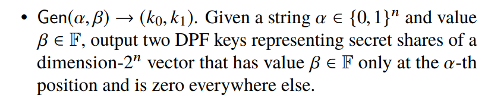
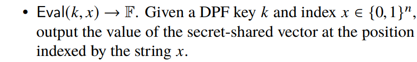
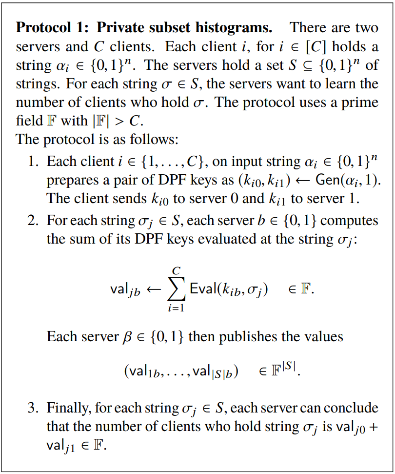
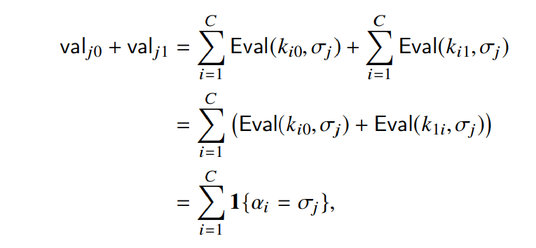
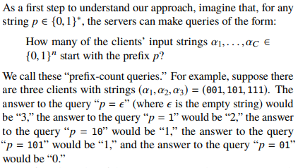
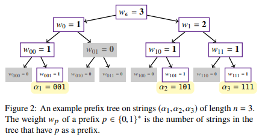
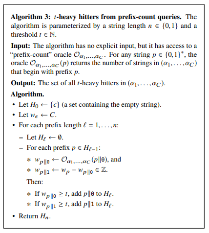
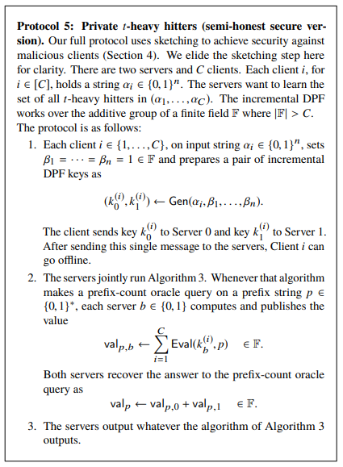
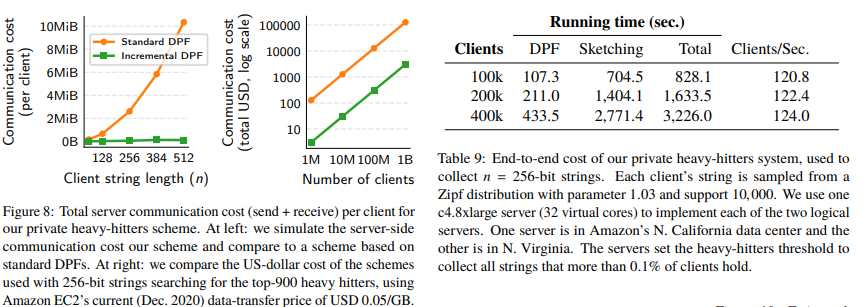
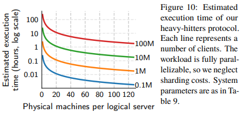

# [BBC+21,S&P] Lightweight techniques for private heavy hitters(看到基础协议）

> This paper presents a new protocol for solving the private heavy-hitters problem. There are many clients and a small set of data-collection servers. Each client holds a private bitstring. The servers want to recover the set of all popular strings, without learning anything else about any client’s string.

# Problem statement

We work in the setting in which clients communicate with two non-colluding data-collection servers. The system protects client privacy as long as one of the two servers is honest (the other may deviate arbitrarily from the protocol and may collude with an unbounded number of malicious clients).

## Private-aggregation tasks

### Task I: Subset histogram.

In this task, the servers hold a set $S \subseteq \{0,1\}^n$ of strings. For each string $\sigma \in S$, the servers want to learn the number of clients who hold the string $\sigma$. In some of our applications, both the clients and servers know the set $S$ (i.e., the set is public). In other applications, the servers choose the set $S$ and may keep it secret.

### Task II: Heavy hitters.

In this task, the servers want to identify which strings are "popular" among the clients. More precisely, for an integer $t \in \mathbb{N}$, we say that a string $\sigma$ is a $t$-heavy hitter if $\sigma$ appears in the list $(\alpha_1, \ldots, \alpha_C)$ more than $t$ times. The $t$-heavy hitters task is for the servers to find all such strings. Note that, unlike the previous subset histogram task, here there is no a priori set of candidate heavy hitters.

## Communication pattern

- *Setup*: In an optional setup phase, the servers generate public parameters, which they send to all clients.
- *Upload*: The clients proceed in an arbitrary order, where each participating client sends a single message to Server 0 and a single message to Server 1. Alternatively, the client can send a single message to Server 0 that includes an encryption of its second message, which Server 0 then routes to Server 1.
- *Aggregate*: Servers 0 and 1 execute a protocol among themselves, and output the resulting aggregate statistic agg.

## Security properties

- Completeness: If all clients and all servers honestly follow the protocol, then the servers correctly learn $\mathsf{agg} = f(\alpha_1, \ldots, \alpha_C)$.
- Robustness to malicious clients: Informally, a malicious client cannot bias the computed aggregate statistic agg beyond its ability to choose its input $\alpha \in \{0,1\}^n$ arbitrarily.
- Privacy against a malicious server: Informally, if one of the servers is malicious, and the other is honest, the malicious server should learn nothing about the clients’ data beyond the aggregate statistic agg.

# A simple protocol for private subset histograms

SETTING：  
每个客户端 $i$ 都持有一个私有字符串 $\alpha_i \in \{0,1\}^n$，服务器持有一个字符串集合 $S = \{\sigma_1, \sigma_2, \ldots, \sigma_k\}$。

TASK：  
对于集合 $S$ 中的每个字符串 $\sigma$，服务器想要知道持有该字符串 $\sigma$ 的客户端数量。

## Distributed point functions (DPF)

分布式点函数在高层次上将 ${2}^n$ 个元素的向量进行秘密共享，其中只有一个元素是非零的。其重要属性是每个 share 只有大小 $O(n)$，而朴素的秘密共享的 share 大小是 ${2}^n$。

More formally, a DPF scheme, parameterized by a finite field $\mathbb{F}$, consists of two routines:

<!-- 飞书原始链接: https://internal-api-drive-stream.feishu.cn/space/api/box/stream/download/authcode/?code=NjhkMTc2YThkODRmYTQzYjgxNTM1OTY1ZDE0MGQ5NjdfM2M5ZTNiZjdjMmIyZTgwMmJjZDVhYzAwN2I0YjVhNDVfSUQ6NzIyNTYxNDUyNTI0MzEyOTg1N18xNzg1NDYxOTA3OjE3ODU0NjU1MDdfVjM -->

<!-- 飞书原始链接: https://internal-api-drive-stream.feishu.cn/space/api/box/stream/download/authcode/?code=YmVjOTkxYzY0YWE5ZmY2MWY4NmQ1NzdkYjQ2ZWJlNTJfYjhhMDA3Zjc5NDY4ZGZlODRfSUQ6NzIyNTYxNDYwOTQ0MzgzMTgwOV8xNzg1NDYxOTA3OjE3ODU0NjU1MDdfVjM -->

### DPF的正确性

对于所有字符串 $\alpha \in \{0,1\}^n$，输出值 $\beta \in \mathbb{F}$，密钥 $(k_0, k_1) \gets \mathrm{Gen}(\alpha, \beta)$，和字符串 $x \in \{0,1\}^n$，满足 $\mathrm{Eval}(k_0, x) + \mathrm{Eval}(k_1, x) = \{\beta \text{ if } x = \alpha; 0 \text{ otherwise}\}$。简而言之，DPF的安全属性规定，一个只获得 $k_0$ 或 $k_1$ 的攻击者不会了解到关于点 $\alpha$ 或其值 $\beta$ 的任何信息.

## 基础的简单协议

给定DPF，我们可以使用以下简单的协议解决TASK：

<!-- 飞书原始链接: https://internal-api-drive-stream.feishu.cn/space/api/box/stream/download/authcode/?code=NWQ1M2IyZjBjY2ZjMTk3MmRjNmNlYWJhNjRjZjg5ZjBfN2NiMDliNjEwNGM1Y2QwNTk5NGM1MzhjZGU3ZWMxOWNfSUQ6NzIyNTYxNDQ0ODg0ODA3NjgwMV8xNzg1NDYxOTA3OjE3ODU0NjU1MDdfVjM -->

在高层次上，每个客户端 $i$ 使用 DPF 创建一个维度为 ${2}^n$ 的向量的秘密共享。该向量在所有位置都是零，除了客户端 $i$ 的输入字符串 $\alpha_i \in \{0,1\}^n$ 的位置上有“1”。为了了解有多少客户端持有特定的字符串 $\sigma$，服务器可以计算每个客户端 $i$ 的秘密共享向量中 $\sigma$-th 值的共享。通过发布这些共享的总和，服务器确切地了解持有字符串 $\sigma$ 的客户端数量。

### 正确性

<!-- 飞书原始链接: https://internal-api-drive-stream.feishu.cn/space/api/box/stream/download/authcode/?code=YTY1MmQyMTRkZDU3M2Q0MmZiM2U3YTFjNmI4ZTNiZGNfMjM2MjBiZDhjNmNmODJkNTViN2IyYjM2ZGNjNzE5ZTdfSUQ6NzIyNTYxNDQ3MTY1MzIxMjE2Ml8xNzg1NDYxOTA3OjE3ODU0NjU1MDdfVjM -->

正好是持有字符串 $\sigma_j$ 的客户端数量。

故只要两个服务器中的一个是诚实的，完全恶意的攻击者控制另一个服务器和任意数量的客户端，除了子集直方图本身泄漏的信息，不会获得有关诚实客户端输入的任何信息。

# Private heavy hitters(TASK II)

## Setting

As before, there are $C$ clients and each client $i$ holds a string $\alpha_i \in \{0, 1\}^n$. Now, for a parameter $t \in \mathbb{N}$, the servers want to learn every string that appears in the list $(\alpha_1, \ldots, \alpha_C)$ at least $t$ times.

## Heavy hitters via prefix-count queries

> 服务器可以通过向客户端字符串 $(\alpha_1, \ldots, \alpha_C)$ 列表进行 prefix-count queries 找到所有 $t$-heavy hitters

### prefix-count queries

<!-- 飞书原始链接: https://internal-api-drive-stream.feishu.cn/space/api/box/stream/download/authcode/?code=OWYxMjUyMWYxM2EzNTE3ZmJmODM4ZTViZDAxYTg4N2VfZWFlYmI0YmQxZWIwNmI5YmU1ZGNiNGU4ZTI1NDE2OGFfSUQ6NzIzMzQxMTE4MTY0ODU2MDEzMl8xNzg1NDYxOTA3OjE3ODU0NjU1MDdfVjM -->

如果服务器可以获得这些查询的答案，那么他们可以使用一种简单的算法有效地枚举所有客户端输入字符串列表中的 $t$ heavy 的字符串。该算法对应于对应于字符串集的前缀树的广度优先搜索（图2），其中搜索算法修剪重量小于 $t$ 的节点。  

<!-- 飞书原始链接: https://internal-api-drive-stream.feishu.cn/space/api/box/stream/download/authcode/?code=MDY3OGU2ZTljMDVkYmM3Yzg4MmM3YmQyMjc2YWJjZGZfZTJiZGRiYTdhZWY1N2MyZmFkNmRmZGYzZThmZjM1Y2NfSUQ6NzIzMzQxMTIyNDUxNDQ5NDQ2OF8xNzg1NDYxOTA3OjE3ODU0NjU1MDdfVjM -->

### t-heavy hitters from prefix-count queries

对于每个前缀长度 $l \in \{0, \ldots, n\}$，我们构造长度为 $l$ 的 heavy string 集合 $H_l$。$H_0$ 集合包括空字符串，因为总是重要的（假设，不失一般性，$t \leq C$）。我们通过将 ${0}$ 和 ${1}$ 附加到 $H_{l-1}$ 的每个元素并检查结果字符串是否重要来构建 $H_l$ 集合。  

<!-- 飞书原始链接: https://internal-api-drive-stream.feishu.cn/space/api/box/stream/download/authcode/?code=NjM0NzliYTY2NzYwNDMyNmU2MzI0ZWQ2NDdlZjJkYzRfMDVkODBkMmVhNGEzMWQyOGM4ZDI1ZTQ4ZTIyZTEwZmFfSUQ6NzIzMzQxMTM2NjMwNzg3Mjc3MV8xNzg1NDYxOTA3OjE3ODU0NjU1MDdfVjM -->

- Efficiency  
The algorithm thus makes at most $n \cdot C/t$ prefix-count-oracle queries total. If we are looking strings that more than a constant fraction of all clients hold (e.g., $t = 0.001C$), then the number of queries will be independent of the number of clients.

## Implementing private prefix-count queries via incremental DPFs

> 每个客户端 $i$ 向服务器提供 $\alpha_i$ 的 share，服务器进行 prefix-count queries

现在只需要解释服务器如何计算客户端持有的字符串集合的前缀计数查询的答案，而不需要了解客户端的输入字符串的其他信息。每个客户端 $i$ 生成一对增量 DPF 密钥，表示一个前缀树的秘密共享，该前缀树在所有地方都是 0，但其节点在下到客户端 $i$ 的输入字符串 $\alpha_i$ 的路径上有值 1。在获取了所有 $C$ 个客户端的增量 DPF 密钥的情况下，两个服务器可以通过发布每个单个消息来计算前缀计数查询的结果。为了计算以前缀 $p \in \{0, 1\}^*$ 开头的客户端字符串的数量，每个服务器在前缀 $p$ 上计算所有客户端的增量 DPF 密钥，并输出这些计算的总和。  

<!-- 飞书原始链接: https://internal-api-drive-stream.feishu.cn/space/api/box/stream/download/authcode/?code=OGIxNzQ1ZTU2NTFiMjEwOTQxMDcwZTAwZThmOGU3YWNfYjIzMDg2MTYwYzU4NDRlN2M2YWUwOWM1NDljYzcyMzZfSUQ6NzIzMzQxMTQwNTg4NTM1ODA4M18xNzg1NDYxOTA3OjE3ODU0NjU1MDdfVjM -->

- Efficiency  
客户端到服务器的通信只包括一个增量 DPF 密钥。服务器到服务器的通信需要与服务器进行的前缀计数 oracle 查询数量成比例的一些字段元素。

### Extension: Longer strings.

# Implementation and evaluation

<!-- 飞书原始链接: https://internal-api-drive-stream.feishu.cn/space/api/box/stream/download/authcode/?code=ZjI5ZTE1YTI3MzY1ZWUzNTliYzc0OWMwZTdjNjM0NmZfMWE2YmU5ZTI1NzIzZmY4MGMyNTE1NTQ3YTgzZGVlYTlfSUQ6NzIzMzQxMTQ1MTU3NzUzMjQxOV8xNzg1NDYxOTA3OjE3ODU0NjU1MDdfVjM -->

<!-- 飞书原始链接: https://internal-api-drive-stream.feishu.cn/space/api/box/stream/download/authcode/?code=ZDY2MDg1Nzg3MGEwMDdlZWVhNTNlOGQxMDAxY2UzNDdfMjJkNDIwMGM2ZDMwMmQ0OTcwN2QwMjFmYTJhZjU1Y2RfSUQ6NzIzMzQxMTQ4NDcyMTQzMDUzMl8xNzg1NDYxOTA3OjE3ODU0NjU1MDdfVjM -->

# Conclusions

允许两个非勾结的服务器以保护客户端隐私的方式计算一个大量客户端持有的字符串中最流行的字符串。
