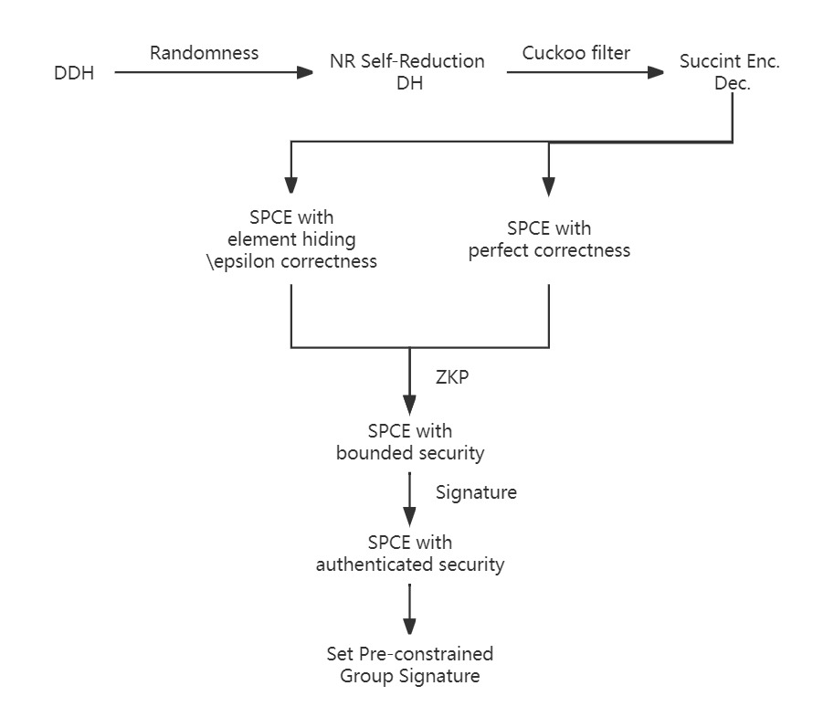
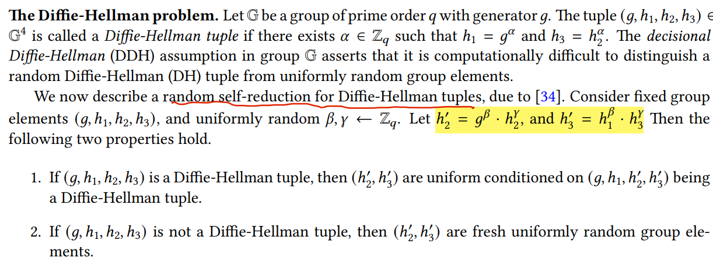
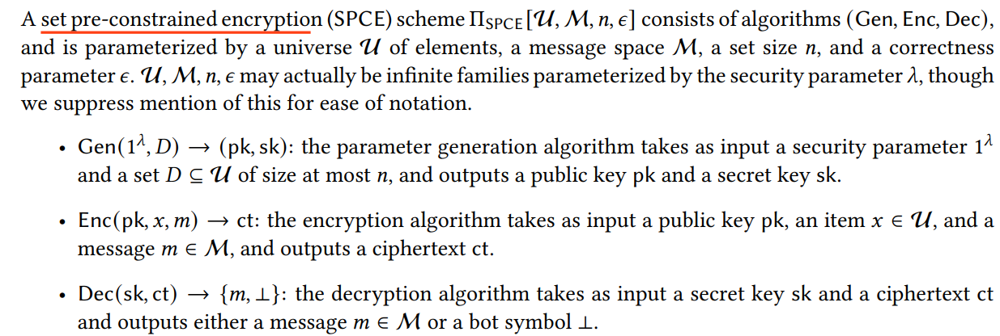
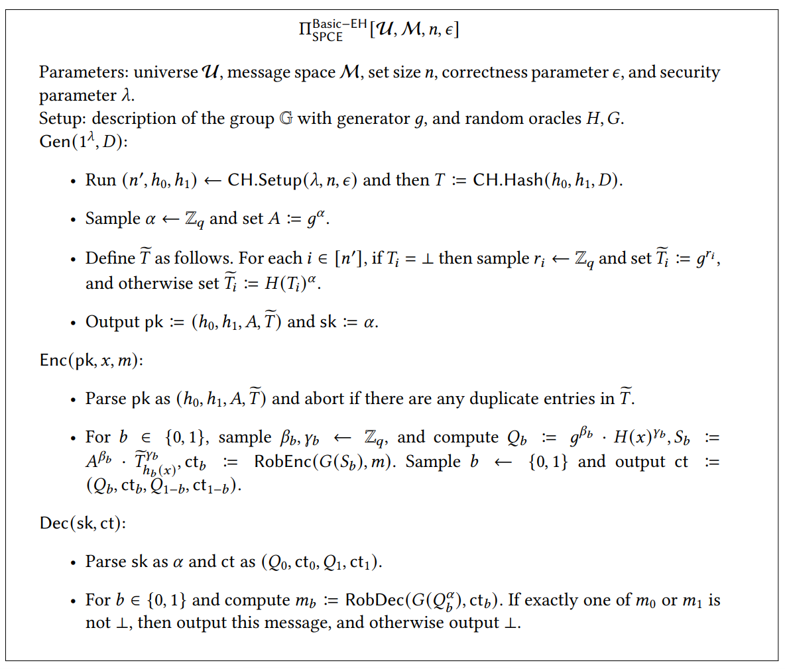
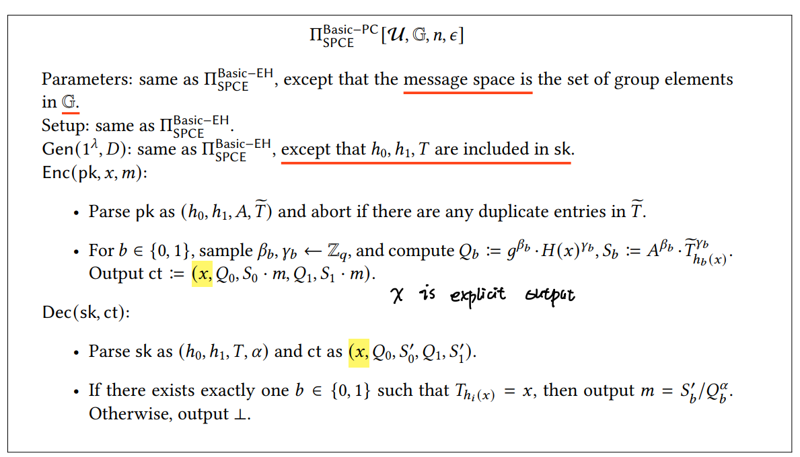
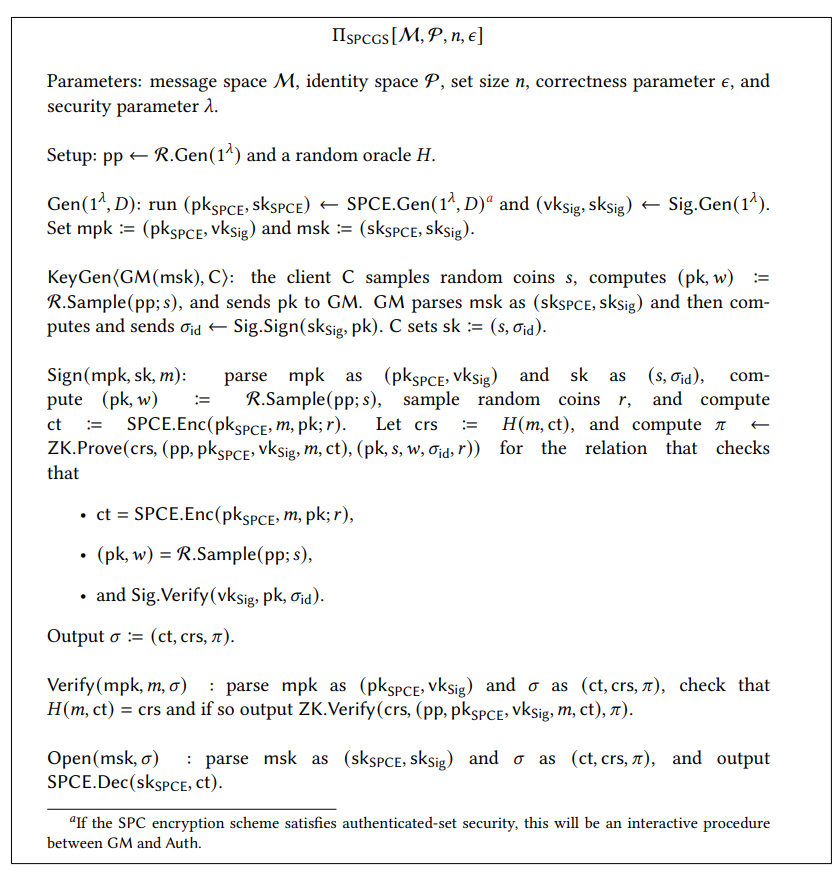

# [BGJP23,EUROCRYPT] Traceability Only for Illegal Content

**Summary:** Proposed a source-tracking scheme that only traces messages belong to a pre-defined set with strong security guarantee.

# 1. Motivation

"Report-then-Trace" is a hot topic in content moderation for EEMS. However, it can be abused by recipients and the platform.

- A malicious recipient can abuse this mechanism to launch a DoS attack.
- A malicious platform can abuse this mechanism to compromise user's message privacy.

Here, the observation is that not every report should trigger a trace!

Therefore, the authors propose a scheme that only traces reported messages that belong to a pre-defined set. Note that the set must be created or auditted by a trusted third party.

# 2. Observations & Insights

> There are too many schemes in this paper, thus I put this part before technique.

In fact, the pre-defined set is not a novel idea for content moderation. For example, Apple's Child Sexual Abuse Management uses a pre-defined set to test whether a user's iCloud storage contains illegal content.

However, this paper achieves pre-defined without any privacy or security compromise. In contrast, FACTS achieves threshold reporting while suffers inject/sybil attack. In this paper, the authors only assume the sender is honest and the pre-defined set is correct, which is the minimal assumption a protocol requires.

Unfortunately, this paper's security guarantee only works in static set setting, and we discuss the reasons in <cite doc-id="FYVydKC6ho7aqWxz0UiczT1Wnvc" file-type="docx" title="Hybrid Trace Rule" type="doc"></cite>.

# 3. Technique

<!-- 飞书原始链接: https://internal-api-drive-stream.feishu.cn/space/api/box/stream/download/authcode/?code=ZmZjNjk1NmZiYTc2NTY5MzM5ZWMwMmU1YmY5ZTQzMjlfOGM0ZGI4ZjMyMWM3Y2U5NDBjNjk2OGE1ZDBmNGRlYWRfSUQ6NzI4NjM4Mzk4OTgyNzQyMDE2Ml8xNzg1NDYxOTM0OjE3ODU0NjU1MzRfVjM -->

## 2.1 Noar-Reingold Diffie-Hellman Random Self Reduction (NR Self-Reduction DH)

<!-- 飞书原始链接: https://internal-api-drive-stream.feishu.cn/space/api/box/stream/download/authcode/?code=YzJlOGQxMmYzZjVmMDU2MjQ4NjYwNzVkMTI0OTkyZWRfZmViZDc3ZTU3NGIwYWIyNjhhYWFiMzlmNTc0OTJiNDVfSUQ6NzI4NjM4NDg5OTgwMjY5MzY2MF8xNzg1NDYxOTM0OjE3ODU0NjU1MzRfVjM -->

- The Self-Reduction DH ensures that $h^{'}_{2}, h^{'}_{3}$ are random, which preserves the privacy of elements in the set of illegal contents.

### 2.2 Set Pre-constrained Encryption (SPCE)

<!-- 飞书原始链接: https://internal-api-drive-stream.feishu.cn/space/api/box/stream/download/authcode/?code=ZmUyOWQ2N2JjNTgzZDkyMjhjZGFiMDcwYjlkYjc5YzdfZDc0YzI3MjEzNWQ3ODM0YTExZGZkOTc3MzZhOTRlYzBfSUQ6NzI4NjM4NTc4MTgxNDQ2MDQxOF8xNzg1NDYxOTM0OjE3ODU0NjU1MzRfVjM -->

- **Correctness:** Here, correctness represents the probability that a positive element is misidentified as false negative. Note that this paper's correctness drops the effect of the cuckoo filter. The authors assume that the cuckoo filter perfectly holds all the elements in the set D.
- **Bounded-set security** requires the key generator can only decrypt elements that contained in the set D.
- **Authenticated-set security** requires parameters that represent elements in the set D should be authenticated by a trusted third party.

### 2.3 SPCE with element hiding and \epsilon correctness

<!-- 飞书原始链接: https://internal-api-drive-stream.feishu.cn/space/api/box/stream/download/authcode/?code=YzhmODE1M2U0ZmMyZmE5MDM4Yjc2OWYwZTk0MWIxNGJfNGQwZTA5OGJiMzNkNTE3NjAwZDEyY2M2ZjExMDBmNGRfSUQ6NzI4NjM4NjkzMDA3MzEwODQ4Ml8xNzg1NDYxOTM0OjE3ODU0NjU1MzRfVjM -->

- Note that the RobEnc encryption scheme should be *random key robustness (RKR)*. This is where \epsilon correctness is from.

  - As far as I know, RKR is mentioned in [OPAQUE](https://eprint.iacr.org/2018/163.pdf) (a PAKE protocol that is standardized by IETF) and discussed in [1](https://soatok.blog/2020/09/09/designing-new-cryptography-for-non-standard-threat-models/#comments),[2](https://mailarchive.ietf.org/arch/msg/cfrg/2W9LoeeiRzAiTWVnDsyxvjYPPmo/). In short, RKR means that a ciphertext can be only decrypted by a key. In other words,  for a pair of ciphertext and plaintext, there exists only one key to link them.

### 2.4 SPCE with perfect correctness

<!-- 飞书原始链接: https://internal-api-drive-stream.feishu.cn/space/api/box/stream/download/authcode/?code=Y2VhNjQyYjJlMjIxZGJhNTFlZjliNzQ5OTVlNGUzOThfZTdjYzU2MTg2MmZkMTZkMzlhMDIwYWFjNDc0MzdlNzNfSUQ6NzI4NjM5NjM2MTE3MDQxOTcxM18xNzg1NDYxOTM0OjE3ODU0NjU1MzRfVjM -->

- The RobEnc is dropped; therefore, this scheme is perfect correctness.
- x is an explicit output of ciphertext; therefore, this scheme is not element hiding.

### 2.5 SPC Group Signature

<!-- 飞书原始链接: https://internal-api-drive-stream.feishu.cn/space/api/box/stream/download/authcode/?code=NzUzNjI5YTdmYWE2NjRhNDZmMWZkOWZiNDk0NmVlMjlfOGY5NWU3OTI1NTQwOTM0NTYwYTlkYjBiZmMyYjNiN2NfSUQ6NzI4NjQwMjc0ODkxMDgyOTU3MF8xNzg1NDYxOTM0OjE3ODU0NjU1MzRfVjM -->