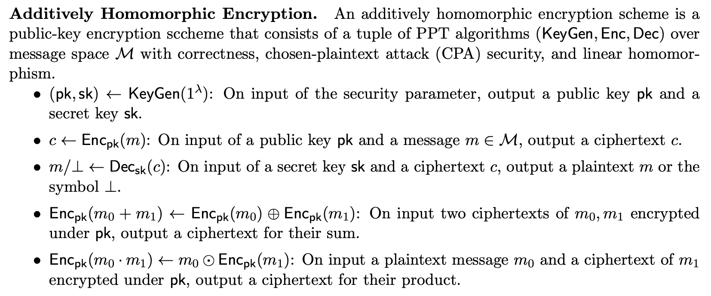
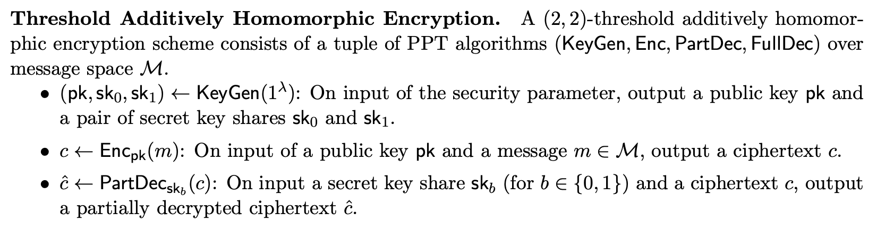
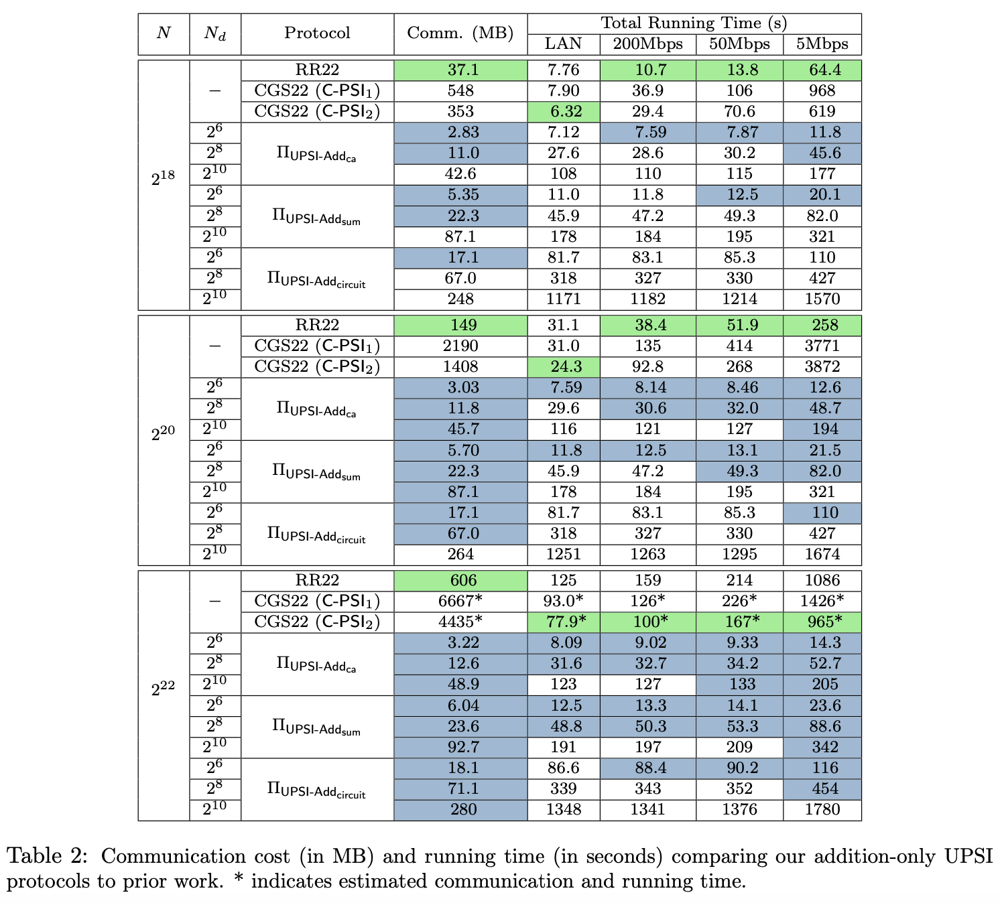

# [BMSTZ24, AsiaCrypt] Updatable Private Set Intersection Revisited: Extended Functionalities, Deletion, and Worst-Case Complexity

**Summary:** They combine ORAM and AHE to achieve various PSI functionalities and arbitrary deletion.

## Main Observation

这个工作和之前的updatable psi一样，把更新的集合进行分块计算。

假设$P_0$原有集合$X$，更新集合是$X^*=(X^+, X^-)$；$P_1$原有集合$Y$，更新集合是$Y^*=(Y^+, Y^-)$

需要计算的是$X^*\cap{}Y$和$Y^*\cap{}(X\cup{}X^*)$两个部分。

## Preliminaries

### AHE

<!-- 飞书原始链接: https://internal-api-drive-stream.feishu.cn/space/api/box/stream/download/authcode/?code=NDhhZjFmOTUwZTBiNDQ5NjA4NDUxZWNkZTcxN2VhZDFfZDMxMDQ2MTYwYzUzNGVlMGRiNGY3OGU5MDljNDFhZjZfSUQ6NzQyODk4MzU1ODM1NTU5OTM2Ml8xNzg1NDYxOTY0OjE3ODU0NjU1NjRfVjM -->

### (2-2) Threshold AHE

和AHE的区别是，解密需要两方的私钥配合

<!-- 飞书原始链接: https://internal-api-drive-stream.feishu.cn/space/api/box/stream/download/authcode/?code=MTUxNTYxMjllM2IwNjM0MGI3YWE1YTczMmFiYzBjMWZfYzllMWI0NTRmNDRiNzU4ZjI2MzY2NjhjMzlkM2NkMzBfSUQ6NzQyODk4Mzk1NjQ1ODcwMDgwM18xNzg1NDYxOTY0OjE3ODU0NjU1NjRfVjM -->

<!-- 飞书原始链接: https://internal-api-drive-stream.feishu.cn/space/api/box/stream/download/authcode/?code=YTY3MTUwNzJmZTQ3MGQyNWRhNmQ4MjJiY2I4ZmVkM2RfZTQ0YzNkOTFlOTkxMjAwZDlhOTI1M2Q5NWE5MTRlZmZfSUQ6NzQyODk4NDAyNTQ0NzgwOTA1Ml8xNzg1NDYxOTY0OjE3ODU0NjU1NjRfVjM -->

## Construction

### Oblivious data structure

这个数据结构的构造是从Path ORAM改造而来，和[[ACG+24](https://eprint.iacr.org/2024/1183.pdf)]大部分是相似的。区别在于：

1. 这篇文章对二叉树的节点包含的元素数量做了限制，而[[ACG+24](https://eprint.iacr.org/2024/1183.pdf)]中没有，导致这篇文章的worst case efficiency比[[ACG+24](https://eprint.iacr.org/2024/1183.pdf)]好
2. 这篇文章中二叉树节点的加密使用的是同态加密，而[[ACG+24](https://eprint.iacr.org/2024/1183.pdf)]中使用的是对称加密。所以这篇文章中可以直接对加密二叉树做同态计算进行查询，[[ACG+24](https://eprint.iacr.org/2024/1183.pdf)]中需要用到general 2PC进行oblivious查询

[[BMX22](https://par.nsf.gov/servlets/purl/10412585)]中也使用到了类似的结构，但是每次查询会传递所有叶子节点（上面的方案传递的是一条路径）

### Addition-only

可以直接通过在oblivious data structure上面进行同态加密的加法减法乘法得到操作得到

### Arbitrary Deletion

和addition only相比需要多注意一个点：在同一时刻，$P_0$添加了x，随后$P_1$删除了x，这个过程不能被泄漏，文章中的处理方法是，先统一处理删除，再处理添加

## Experiment

他们的方案还是对比的，不支持更新的方案，在原始集合较大，更新集合较小的时候显示出优势

<!-- 飞书原始链接: https://internal-api-drive-stream.feishu.cn/space/api/box/stream/download/authcode/?code=MGY3OGZjODA5ODQ3OGRkNDVkZDY4ZDY1ZDYyZGRkODJfZWVkZGNmN2FiMjc2MzNkZjM3YTNlNmVjYTljYTk3OWNfSUQ6NzQyODk5NDI4NzY3NDc1MzAyNl8xNzg1NDYxOTY0OjE3ODU0NjU1NjRfVjM -->