# [BMX22, PETS] Updatable Private Set Intersection

Summary: 给出了三个updatable PSI的方案，分别是one-sided/two-sided的对于增量的PSI和一个可以删除数据的PSI 。two-sided/weak deletion PSI的计算复杂度和通信复杂度都和新增元素数量相关，one sided的复杂度多了一个logN。

## Challenges

- 简单的扩展FHE-Based，circuit-based和OT-based是不可行的。因为开销都会以原始数据集大小N成线性增长。
- 对于two-sided PSI（结果会被双方知道）来说，很容易想到的思路是使用DH-Based PSI，只计算新增元素X'和Y' (假设P0持有X，P1持有Y)，这样计算和通信复杂度都只会和新增元素数量N'相关，但是这样实际上会泄露更多的信息。在理想的PSI中，加入新元素后，双方只能知道$(X\cup X')\cap (Y\cup Y')$；而只计算新增元素并交换会额外泄露$X'\cap Y'$和$X'\cap Y$给P0。
- 对于one-sided PSI（结果只会被一方知道），由于two-sided可以直接从one-sided实现（其中一方得到结果后传给另一方），所以one-sided会比two-sided更复杂一点。

## Solutions

- 对于two-sided PSI，我们需要更新的数据是$(X\cup X')\cap (Y\cup Y')\backslash(X\cap Y)$，作者把这部分的数据分成了两个部分，第一个部分是$X\cap Y'$，这部分可以通过直接扩展DDH得到；第二部分是$X'\cap(Y\cup Y')$，这部分用一个新的PSI来计算。
- 对于one-sided PSI，作者得到Oblivious RAM（这个是某种encrypted searchable的数据结构）的启发，构造了特殊结构的二叉树，每天可以更新，可以进行查询，解密使用到了加同态。

## Two Sided UPSI

- 初始化

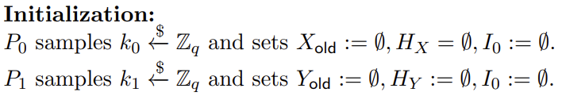
<!-- 飞书原始链接: https://internal-api-drive-stream.feishu.cn/space/api/box/stream/download/authcode/?code=OTVmODk1YWQxMjA5ZmVlOTk2YjQ1MTAwYzA3ZjE4ZjZfNDMzMmQ5M2VlNTdhNzhmYmFjYmQ0Y2EyMzQ4ZGE2ODVfSUQ6NzI4MDcyNjY3MTQyMjI0Mjg0NF8xNzg1NDYxOTMyOjE3ODU0NjU1MzJfVjM -->

- 在第d天的时候两方分别输入

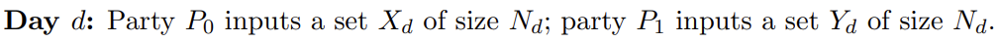
<!-- 飞书原始链接: https://internal-api-drive-stream.feishu.cn/space/api/box/stream/download/authcode/?code=M2QxYTBmZmI1ZDUxMDkyNWY1YTc2ZWMxNzMyY2Y5MjdfMmFjM2FhZWJhN2Y0ZWFjMGVhNjg3Y2MwNGMwZGMwOTNfSUQ6NzI4MDcyNDc4NTc1MDMyNzMyNF8xNzg1NDYxOTMyOjE3ODU0NjU1MzJfVjM -->

- 然后P0和P1计算，可以通过扩展得到的交集（$X\cap Y'$）

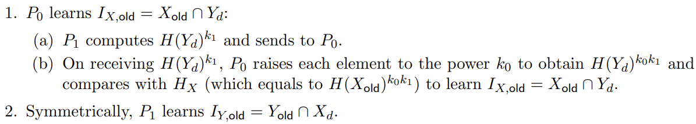
<!-- 飞书原始链接: https://internal-api-drive-stream.feishu.cn/space/api/box/stream/download/authcode/?code=NjA0MzYwOGI2MzhjNmM1MTY0NTI1NTcxYmFhMDAxZDlfOGM0NWNkNDE2MjNlNmZmZWExOTA5NDMyMmYzOTEzNTZfSUQ6NzI4MDcyNDk1MTAxODY2ODAzNF8xNzg1NDYxOTMyOjE3ODU0NjU1MzJfVjM -->

- 随后进行一个新的PSI来得到另一部分的交集

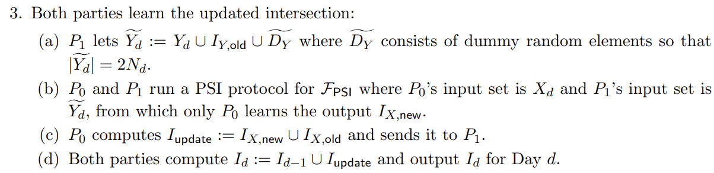
<!-- 飞书原始链接: https://internal-api-drive-stream.feishu.cn/space/api/box/stream/download/authcode/?code=NGRiOGFhODYyY2Q1ZTA5NjEyMjU3MGRkM2U2ZTJmZWFfMjIzN2NkMjIwZjE4ZjBmYWJiZTI4NjAwYzIzMDNiYjdfSUQ6NzI4MDcyNTM5MDYxOTE2NDcwMF8xNzg1NDYxOTMyOjE3ODU0NjU1MzJfVjM -->

- 最后对集合进行更新

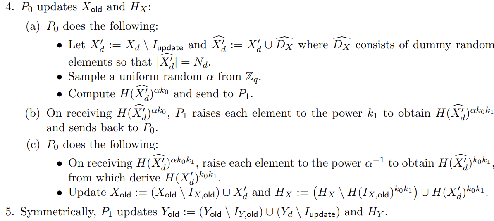
<!-- 飞书原始链接: https://internal-api-drive-stream.feishu.cn/space/api/box/stream/download/authcode/?code=MzkzODY0NzE0ZDYzODdkOTUwNjZjNmFmNTkzZjcwODNfMmNlOWI0M2M5ZWZkOTI1ZmIzZjA0NWNlMDRhODJmMjBfSUQ6NzI4MDcyNjcyNzg0NzY3Mzg4NF8xNzg1NDYxOTMyOjE3ODU0NjU1MzJfVjM -->

## One Sided UPSI （假设P0获得输出）

读到这里有个疑问，为什么Two Sided PSI不能用在这里，最开始没有想明白。然后发现如果我们只需要P0获得信息的话，在第三步的时候，会需要P1知道$I_{Y,old}$，但One Sided PSI不允许P1知道这些。

- 初始化，和上面的初始化有一些区别，为了保存二叉树多了两个数组，为了实现AHE多出了密钥生成的过程。

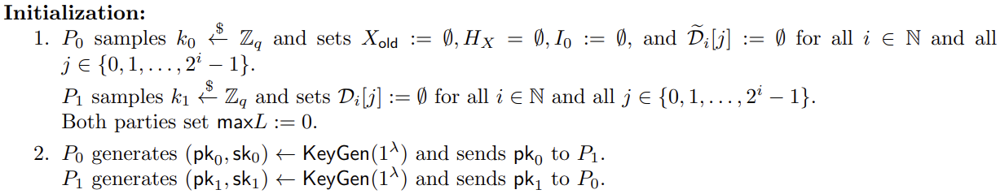
<!-- 飞书原始链接: https://internal-api-drive-stream.feishu.cn/space/api/box/stream/download/authcode/?code=ODI2MzMyODY1Y2JlYzljNWU3N2NjNDRjM2IwZjIyMzFfNWVmNzJhZDc1NzBhNmMyMjE0YmZiZjU5YTRjZGY5NjNfSUQ6NzI4MDczMjQ4MzgzMzEzNTEwNV8xNzg1NDYxOTMyOjE3ODU0NjU1MzJfVjM -->

- 通过扩展得到的交集（$X\cap Y'$）和上面是一样的，去掉了P1获得信息的那一步

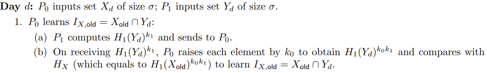
<!-- 飞书原始链接: https://internal-api-drive-stream.feishu.cn/space/api/box/stream/download/authcode/?code=NGVkNGJmMGQ0YmRlZWMwZjgxMGFiOTFiMDQyZGFjYWFfY2NiOGVlYjA0NmU2ZDkzODNkMjE4YTNiOGJmODIyMGRfSUQ6NzI4MDczMzEyNTYzMzQ1ODE3OF8xNzg1NDYxOTMyOjE3ODU0NjU1MzJfVjM -->

- 更新二叉树

这棵树是每天更新的，假设今天是第d天，首先找出d的least significant 1 bit （L），比如20的二进制表示是10100，LS1(20)=3，所以把前三层的节点全部清零，然后P1把所有元素（已有的和新增的）插入第三层，根据元素的哈希值选择相应节点插入。下层节点保持不变，每个节点最多保存$σ$个元素（数量不足的做padding，防止泄露信息）。最后把每个节点加密之后发送给P0。文章中提到这里二叉树可以优化的点是每个节点是一个cuckoo hash表，用于存放节点。

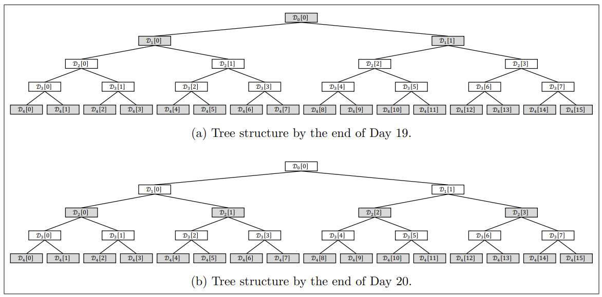
<!-- 飞书原始链接: https://internal-api-drive-stream.feishu.cn/space/api/box/stream/download/authcode/?code=YzhlNmQ3NTdhNDE5MmE5OGMyOTBlOWU3ODQ3ZGI3ZmNfNWViY2EwZjQ2YjhkODlmMDg3OTYyNDQ3MTkyNGRkZWNfSUQ6NzI4MDc3NjI1NzY1NzQzODIwOV8xNzg1NDYxOTMyOjE3ODU0NjU1MzJfVjM -->

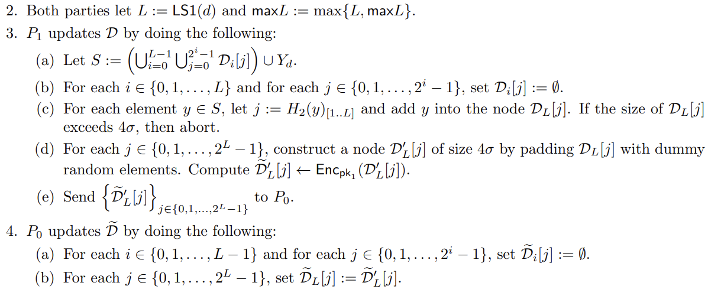
<!-- 飞书原始链接: https://internal-api-drive-stream.feishu.cn/space/api/box/stream/download/authcode/?code=Njk4MmUwOWM1N2Q4MTUzOGQ0YzNmMzYwNzI5OTY1OTFfYzRjZWJmYzFiYWY4ODcwZTNlNjkzNWQyOGFhZjAwZTJfSUQ6NzI4MDc1NTk3NDA0MTY0OTE1NF8xNzg1NDYxOTMyOjE3ODU0NjU1MzJfVjM -->

- P0收到二叉树之后进行加密查询，根据元素的哈希值逐层去二叉树相应节点寻找，如果该节点非空，那么利用加同态进行解码，如果解码成功最终会得到0，否则是随机数。

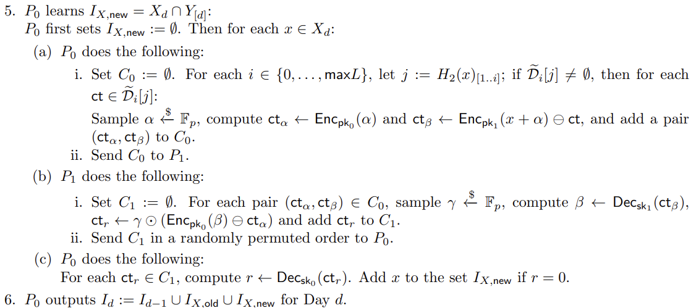
<!-- 飞书原始链接: https://internal-api-drive-stream.feishu.cn/space/api/box/stream/download/authcode/?code=NTVmZTFhMDA3MDEyYWIwM2JmMGFiNjRkZWFmZWMzM2RfNjhhY2RiNTk2ZWVjZTU1ZmQzNTJlOTgxYWY5MmQxYzhfSUQ6NzI4MDc4MTIzMzUzNzg5MjM4MF8xNzg1NDYxOTMyOjE3ODU0NjU1MzJfVjM -->

- 最后一步和One sided是一样的

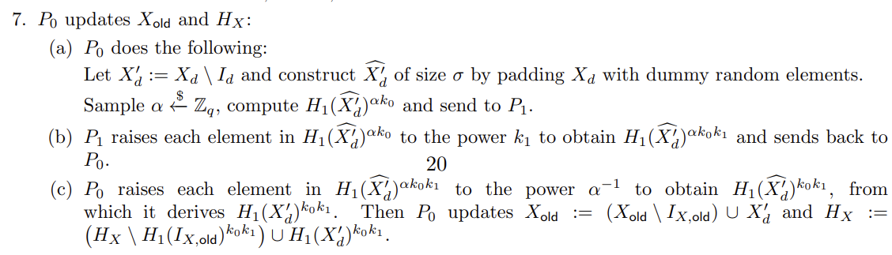
<!-- 飞书原始链接: https://internal-api-drive-stream.feishu.cn/space/api/box/stream/download/authcode/?code=YjBlOTI5OGIwNjRlYTQxOWVjZmI0YTdlMWE0OWFjZjRfZWE3NWQzMjgzYmIzNjRlZTVmOWNjNWY0NjMzZDI3ZDJfSUQ6NzI4MDc4MjI2Mzk0NjgyMTYzM18xNzg1NDYxOTMyOjE3ODU0NjU1MzJfVjM -->