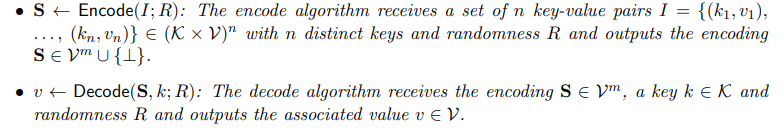
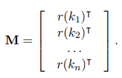
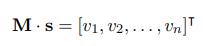
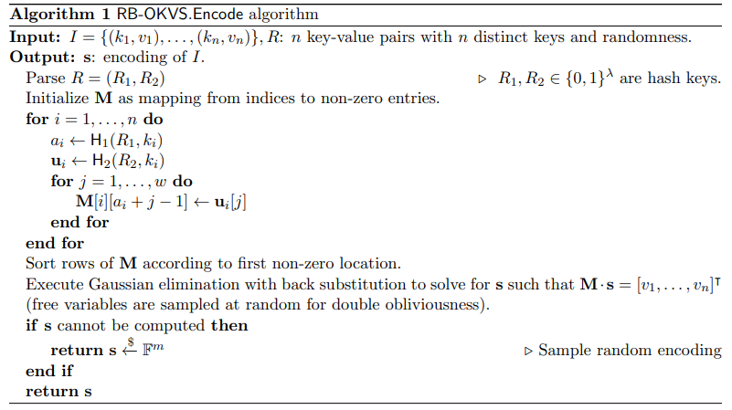
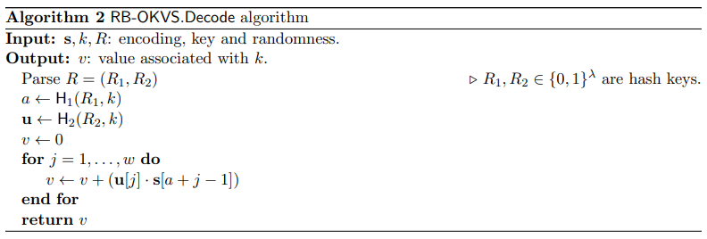
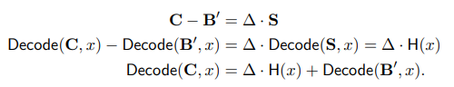
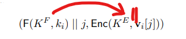
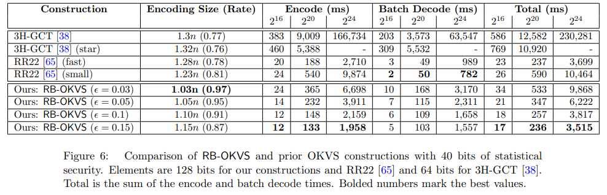
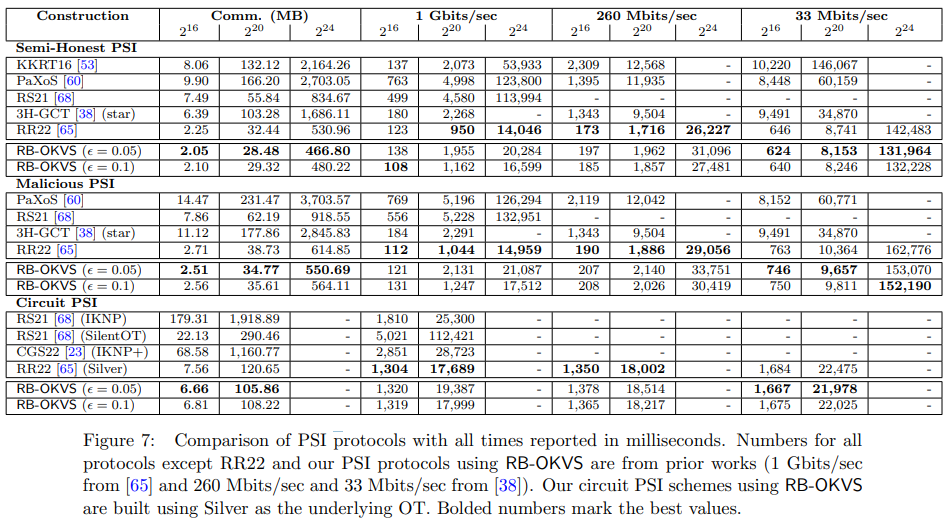

# [BPSY23, Preprint] Near-Optimal Oblivious Key-Value Stores for Efficient PSI, PSU and Volume-Hiding Multi-Maps

**Summary: They proposed an OKVS with high efficiency, and made applications in PSI/PSU and volume-hiding encrypted multimaps (VH-EMM).**

## OKVS

<!-- 飞书原始链接: https://internal-api-drive-stream.feishu.cn/space/api/box/stream/download/authcode/?code=YjY4M2EwNTdhOTJiYjhmNzAzZmVjMGVjYjQ3MDcyNThfOTYyMDU5M2Y3MmJjNzA5ZmFhYjhmY2MyNWJjMWM1MDhfSUQ6NzI3NTYyNzM1OTY4MDMzMTc4MF8xNzg1NDYxOTMxOjE3ODU0NjU1MzFfVjM -->

这篇文章的OKVS高效在encode方面，encode之后的输出 $S$ 较于输入的键值对没有大多少。这里用了一个 rate 来量化，假如输入有 $n$ 个键值对，输出 $S$ 的长度是 $m$，这个OKVS的 rate $= n/m$ 可以做到 ${0}.97$。

首先讲一下 high-level 的思路，encode 算法会生成一个随机矩阵 $M$，其中 $k$ 是输入的 key 的值，$r$ 是某种 hash 函数，然后需要解下面的线性方程组得到 $s$。

<!-- 飞书原始链接: https://internal-api-drive-stream.feishu.cn/space/api/box/stream/download/authcode/?code=OTVjN2QzYTY5Yzk0YTBkODg3MjkwNjcxNGE2ZTJmMzZfMzAxM2JkZTJlYmVmYTc1YWRiN2E1MmQ2YTY5NzliMDdfSUQ6NzI3NTYyODQzOTcxMjg1ODExNF8xNzg1NDYxOTMxOjE3ODU0NjU1MzFfVjM -->

<!-- 飞书原始链接: https://internal-api-drive-stream.feishu.cn/space/api/box/stream/download/authcode/?code=YzA0ZjA2ODJlNDg4NGE3YmQ1ODQ4MDQ0OGU0ZTRjZTBfMTY0Mzc3MjAyMjY5ZjQ2MTJlOThiYTMwNGU5MWY4OTFfSUQ6NzI3NTYyODg1NDUwNDM3NDMwMF8xNzg1NDYxOTMxOjE3ODU0NjU1MzFfVjM -->

为了提高求解线性方程组的效率，这里使用的 $M$ 并不是真正的随机矩阵，而是 Random Band Matrices（RBM），RBM 每一行中只有部分连续 $w$ 比特是随机的，剩余的比特都是 ${0}$，随机比特的起始位置也是随机的，这样的话可以高效的使用高斯消去法求解方程组，时间复杂度大概是 $O(nw + n\log n)$。具体构造时，使用到了两个 hash，$h_1$ 用于确定起始位置，$h_2$ 用于输出随机比特。

<!-- 飞书原始链接: https://internal-api-drive-stream.feishu.cn/space/api/box/stream/download/authcode/?code=ODUyZDA5ZTNhMTFlNTVmMDM1YzI5Y2NiMWE3YzI2MjZfNWExODE0MTM3NTJlZTA0NDIwNWE2NzM2YTcyZjIyMjRfSUQ6NzI3NTYzMDQ1NjgyNDM2NTA1OF8xNzg1NDYxOTMxOjE3ODU0NjU1MzFfVjM -->

解码就比较简单，做向量点积，如果 $k$ 在键值对中，那么进行点积就会得到对应的值，如果 $k$ 不在键值对中，那么就会得到随机数。

<!-- 飞书原始链接: https://internal-api-drive-stream.feishu.cn/space/api/box/stream/download/authcode/?code=YTNiMzcwZWNmOTY4MzAxZGRjZTY5ZTNhMjY2MWI4YjFfMTNlMDE5M2RhOTZhMGFiZmI3YjdhNjhhZTMzMWViM2VfSUQ6NzI3NTYzMTQ5MjAwNzU3NTU1NF8xNzg1NDYxOTMxOjE3ODU0NjU1MzFfVjM -->

## PSI

这篇文章没有构造自己的PSI，是把之前基于VOLE的PSI使用到的OKVS替换成了自己的OKVS，具体是这篇[Blazing fast psi from improved okvs and subfield vole](https://eprint.iacr.org/2022/320.pdf)。首先其中一方进行OKVS encode得到 $S$，然后通过 VOLE 得到 $C$，另一方得到 $\Delta$ 和 $B'$。对他们进行解码操作之后可以构成如下所示的等式，一方知道 $C$，另一方知道 $\Delta$ 和 $B'$，然后就可以进行 PSI，如果 $x$ 是集合之中的元素，等式就成立，否则等式不成立。

<!-- 飞书原始链接: https://internal-api-drive-stream.feishu.cn/space/api/box/stream/download/authcode/?code=NGE1YjM5YzkxMWEyNTFkNGY4ZTQyYWI0YmQ1MmU3MDZfZTNjMzEyZmE0MDZlYTllYmIyM2RhMGM4ZWEzMGI3OGRfSUQ6NzI3NTYzNDE0NDA2MTkzMTUyMV8xNzg1NDYxOTMxOjE3ODU0NjU1MzFfVjM -->

## PSU

PSU方案基于[Linear private set union from multi-query reverse private membership test](https://www.usenix.org/system/files/usenixsecurity23-zhang-cong.pdf)。用到了multi-query reverse private membership test (mq-PRMT), vector oblivious decryption-then-matching (VODM)和OT。其中mq-PRMT使用了OKVS。但是这个方案会泄露集合交集的信息，我之前参加一个talk，里面的老师说PSU需要保护集合交集信息，和这里的定义有冲突，不知道哪一方是对的。

## VH-EMM

这里的输入也是键值对集合，不过一个键可能对应多个值，VH-EMM的目标就是隐藏一个键对应值的数量。对于一个键对应的每个值，都构造下面的键值对，把这些键值对编码为OKVS。解码也比较trivial，就是设定一个最大volume数 $l$，然后从 ${1}$ 到 $l$ 依次进行OKVS decode，如果decode出来的值是以 $F(K, k)$ 开头的，那就说明是一个有效的值。

<!-- 飞书原始链接: https://internal-api-drive-stream.feishu.cn/space/api/box/stream/download/authcode/?code=ZTI5ZTdjNTg1Mjc2ZmNlOTllZjE3NDk5Zjc3NmJjYTJfOWIxNDBlZjNlMDE4NDQyNjIyY2Y4ZGQ5ZDQyZmU2ZjFfSUQ6NzI3NjMwMjYyODA4NTIzNTcxNF8xNzg1NDYxOTMxOjE3ODU0NjU1MzFfVjM -->

## Evaluation

OKVS,需要在encoding size和时间上做trade off

<!-- 飞书原始链接: https://internal-api-drive-stream.feishu.cn/space/api/box/stream/download/authcode/?code=NjNjMTZhZWFjMzRjMzc5YWY3Zjc2ZTU4YWY1MTViNWJfYTg5NmNiMzBiYzZkNWZjYjhmNTllYWFjOTM3N2UwNzhfSUQ6NzI3NjMzNTIzOTE4MTQwMjExNV8xNzg1NDYxOTMxOjE3ODU0NjU1MzFfVjM -->

PSI，KKRT好像性能开始落后了

<!-- 飞书原始链接: https://internal-api-drive-stream.feishu.cn/space/api/box/stream/download/authcode/?code=NTY4MTYzN2RkMzZmZTg3NWZlNTNiNGM2OGMwMmJhODRfY2ZjNDliODU2YWI5MjY3YWFjODY4OTYzODE3MTQzYTFfSUQ6NzI3NjMzNTQ4NzI1NjgzODE0OF8xNzg1NDYxOTMxOjE3ODU0NjU1MzFfVjM -->
