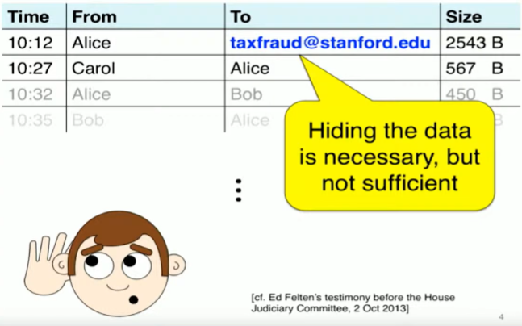
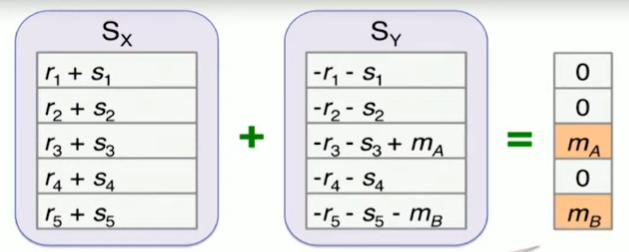
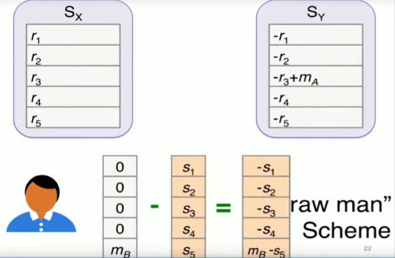
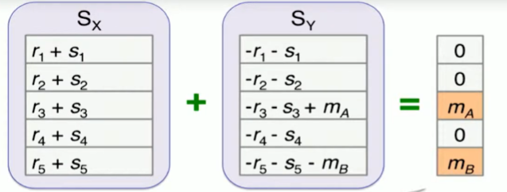
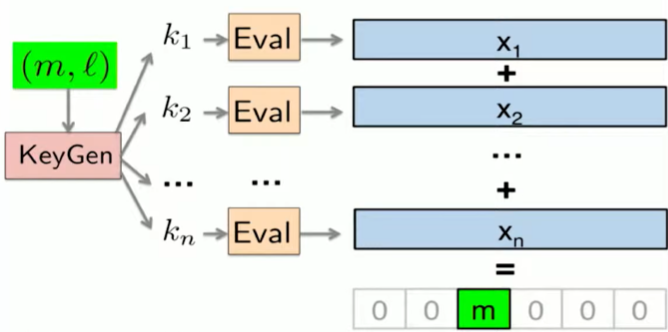
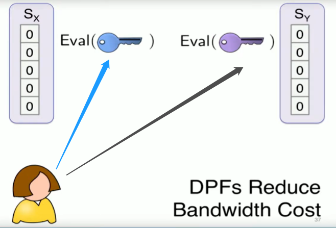
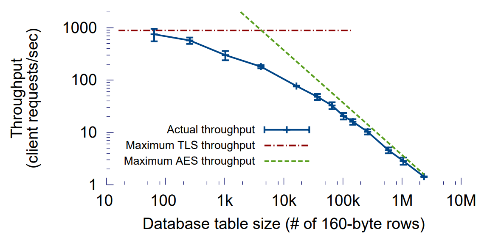

# [CBM+15,S&P]Riposte An Anonymous Messaging System

# Background

在无处不在的网络监视的世界中，考虑一个想要匿名地向公众泄露浪费、欺诈或无能证据的政府雇员。举报者可以直接通过电子邮件联系调查记者，但邮件服务器日志的事后分析很容易揭示举报者的身份。举报者可以通过Tor一类的低延迟匿名代理联系记者，但这将使泄露者容易受到流量分析攻击。**在数字时代保护举报者需要提供强大的安全保证的匿名消息系统，但这些系统也需要能够扩展到非常大的网络规模。**  

<!-- 飞书原始链接: https://internal-api-drive-stream.feishu.cn/space/api/box/stream/download/authcode/?code=M2VmZDI2Yzk1YjQ2MTNjYzViMzQyOWNmZjA4MWQ3YTNfMDY2N2JmODdhZWYwZDA0MmVmYTE4OTJmOWVlMzcxMDZfSUQ6NzIzODU3NDY4MDEyNTQwNzIzM18xNzg1NDYxOTExOjE3ODU0NjU1MTFfVjM -->

## State of art

以前的系统只在可扩展性成本下提供流量分析抵抗性：

- 基于Mix-net的系统需要大量的零知识证明来提供在恶意服务器主动攻击下的隐私保护
- 基于DC-nets的系统要求客户端传输与匿名集的大小成正比的数据，并依赖于昂贵的零知识证明来保护免受恶意客户端的攻击

## Goal：保护元数据

Riposte使客户端能够写入一个共享数据库，由一小组服务器共同维护，而不向服务器透露写入的位置或内容。故而举报者可以使用Riposte作为匿名发布Tweet或电子邮件长度的消息的平台，并可以将其与标准的公钥加密相结合，建立点对点的私密消息通道。

# Reposite

## A "Straw man" scheme[Chaum '88]

- 不合谋的服务器X和Y初始各自存储了一个空向量
- Alice现在想向公告栏发送一个消息 $m_A$

  - $m$ 被存放在向量的第三个分量中，同时整个向量被拆分成两份随机数向量存储给两个服务器，故而服务器不知道Alice发了什么。  
  

  
<!-- 飞书原始链接: https://internal-api-drive-stream.feishu.cn/space/api/box/stream/download/authcode/?code=ZGYxZTZkMTkyMTg1YWQ0MGYwM2RhYjZlNjlkNmRiMjlfMTE0MzNhYWFhNzY1MjFmNzA0YzgxZDFlZTI5YmI2ZDVfSUQ6NzIzODU3NDc0Nzg4ODU5OTA0MV8xNzg1NDYxOTExOjE3ODU0NjU1MTFfVjM -->

  - 但是服务器中存储的向量可以在需要的时候被恢复  
  

  
<!-- 飞书原始链接: https://internal-api-drive-stream.feishu.cn/space/api/box/stream/download/authcode/?code=ZGVhYjA0ZDYxNzkzZGY3MTI0ZDRiYjNiNDI3ZGExZGVfNTJiMjY4N2I3NzVlZGFkZGIyNWY0YTI0NmZjMDZkNDJfSUQ6NzIzODU3NDc4MDEyNzgwNTQ0MV8xNzg1NDYxOTExOjE3ODU0NjU1MTFfVjM -->
- Bob向公告栏发布 $m_B$，两个向量同样被发给服务器

<!-- 飞书原始链接: https://internal-api-drive-stream.feishu.cn/space/api/box/stream/download/authcode/?code=ZGJjNDZkZDNlNTAxMzliZTE5MWE2YmU3NmRlODQ0OGZfZDhjMjg5NjU5NjI5MjhhOTA2ZTYxZGY2NWQ0ZTNhZDhfSUQ6NzIzODU3NDgzMzc4Nzc4MTEyMl8xNzg1NDYxOTExOjE3ODU0NjU1MTFfVjM -->

- 最后两个服务器合并它们的向量，恢复出明文

<!-- 飞书原始链接: https://internal-api-drive-stream.feishu.cn/space/api/box/stream/download/authcode/?code=NmJhNmY2YjljNmExOTQzMzkwNDBlOWJhNzg0Mjc4ZGJfOWVkYTUwYjE1NGVjMDI0YTYwYzMyOGQ5NTg0NGIxMDRfSUQ6NzIzODU3NDg3MzgwNDAyOTk1M18xNzg1NDYxOTExOjE3ODU0NjU1MTFfVjM -->

## Challenge: Bandwidth Efficiency

为了解决稻草人方案中每个客户端都要发送一个和整个数据库大小一样的向量的问题，reposite基于PIR对向量进行压缩，允许客户端在不向服务器透露其所读行的信息的情况下，有效地从一组服务器共同维护的数据库中读取一行。Riposte通过反向PIR运行私有信息检索协议，从而实现可扩展的匿名消息传递：使用反向PIR，Riposte客户端可以有效地写入在一组服务器维护的数据库中，而不向服务器透露其所写的行。

### use DPF(Distributed Point Functions)

在Eval之前，关于key的自己并不会泄漏明文的信息。

<!-- 飞书原始链接: https://internal-api-drive-stream.feishu.cn/space/api/box/stream/download/authcode/?code=YWNiMzViZWI1NWM2YzQwYTQ0Mzg1MjQ5NzA2Njk2NzNfM2JkODliY2E4MTE5YmFkNTgxNDQzMjYzZTJkMzkwNTZfSUQ6NzIzODU3NDkxNjM1MjgxOTIyOF8xNzg1NDYxOTExOjE3ODU0NjU1MTFfVjM -->

Alice此时可以将gen出的两份key(长度仅为DB的平方根级)分发给服务器，由服务器对key进行eval，以获得相应的向量。

<!-- 飞书原始链接: https://internal-api-drive-stream.feishu.cn/space/api/box/stream/download/authcode/?code=NDM2MzQ0ZWFiZGEzNzk3MDI0ZjkwYzBmNTY4MTFiNzlfMDZkMWRlZGM3YzVlY2U1MWI0MTk4MTA1OTVkNjQ2Y2VfSUQ6NzIzODU3NDk4Mzc4MDMwMjg1MF8xNzg1NDYxOTExOjE3ODU0NjU1MTFfVjM -->

# Evaluation

- 对于65000tweet长的向量，每秒可以写入30次  
随着数据库表的大小增加，系统的吞吐量接近服务器的AES吞吐量的最大可能值。(这意味着更多的数据量下，系统性能取决于服务器对于AES的计算能力(size较小时开销主要收到服务器与客户端的连接速度的限制))

<!-- 飞书原始链接: https://internal-api-drive-stream.feishu.cn/space/api/box/stream/download/authcode/?code=YWNlMmRkMzE1MjY4NDk0NDdmNDQ0YjU5MzdlOTdhOWVfYWYyNjI0OGVhMDY1MDY1YmM1OTM1ODFmMDBmODY5ZGZfSUQ6NzIzODU3NTAxNjU0NjM2OTUzOF8xNzg1NDYxOTExOjE3ODU0NjU1MTFfVjM -->

# Conclusion

- 在某些场景中，对元数据的隐藏确实和隐藏消息本身一样重要。
- 虽然上周sabre看得不太好，但是引用它站在时间上的一个高位回头对riposte的看法：为了实现每个发送者自己决定在向量的哪个分量中写入消息，他们必须始终将消息写入均匀随机的地方，这可能会覆盖其他发送者之前写入这些位置中的消息。因此，向量必须足够大，以使意外碰撞的概率较低，这意味着公告板需要 $\Omega(m^2)$ 个桶来容纳 $m$ 条消息，而不会产生任何预期的碰撞。
