# [CFR23, Security] Distance-Aware Private Set Intersection

**Summary:** 介绍了可以感知距离的PSI协议（一阶闵氏距离和汉明距离）

## Distance-Aware Private Set Intersection

Alice和Bob输入两个集合$A=\{a_1,a_2...a_n\}$和$B=\{b_1,b_2...b_n\}$，$d$表示阈值，$\delta(a,b)$表示计算距离，这个PSI协议输出$S=\{(a,b):a\in A,b\in B, \delta(a,b)\le d\}$。协议需要满足：

1. Correctness：需要以大于True Positive Rate的概率找出距离小于阈值的元素，以大于True Negative Rate的概率拒绝距离大于阈值的元素。
2. Securty：协议只透露交集集合和对方集合的基数，Semi-Honest Security。

## Protocol for Hamming Distances

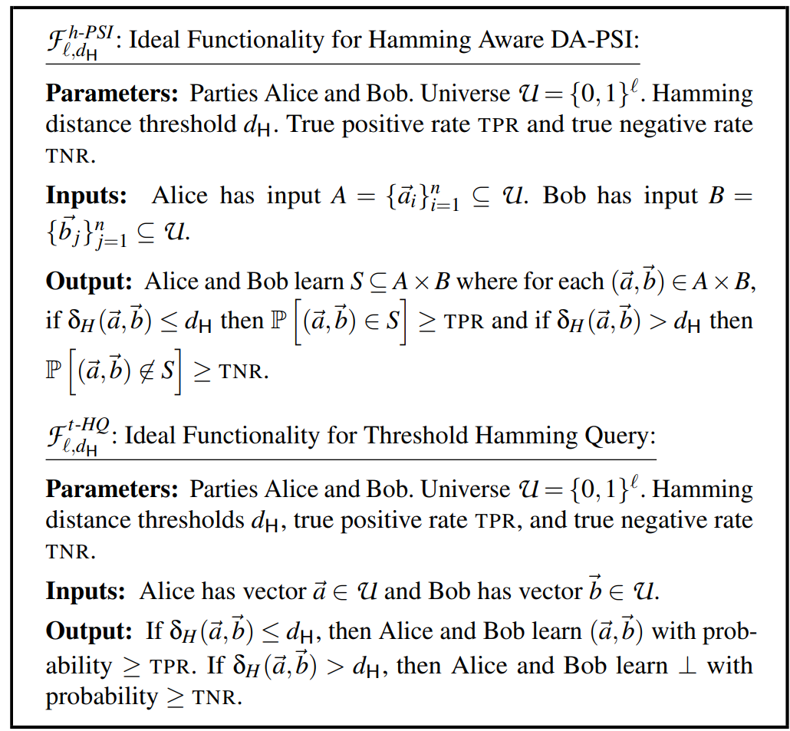
<!-- 飞书原始链接: https://internal-api-drive-stream.feishu.cn/space/api/box/stream/download/authcode/?code=MDkyMGZjZTA2YTRiNzg2NmJmMDVkMWU4YmQzNGYyZGZfMDIwYTlhNWM1ODkwYmQyMzE2ODYxZjFhY2FiODk4MmZfSUQ6NzIyMDAzMjMwMDYyMzM5Njg2Nl8xNzg1NDYxODgyOjE3ODU0NjU0ODJfVjM -->

### Technical Preliminary

- OLE/VOLE

  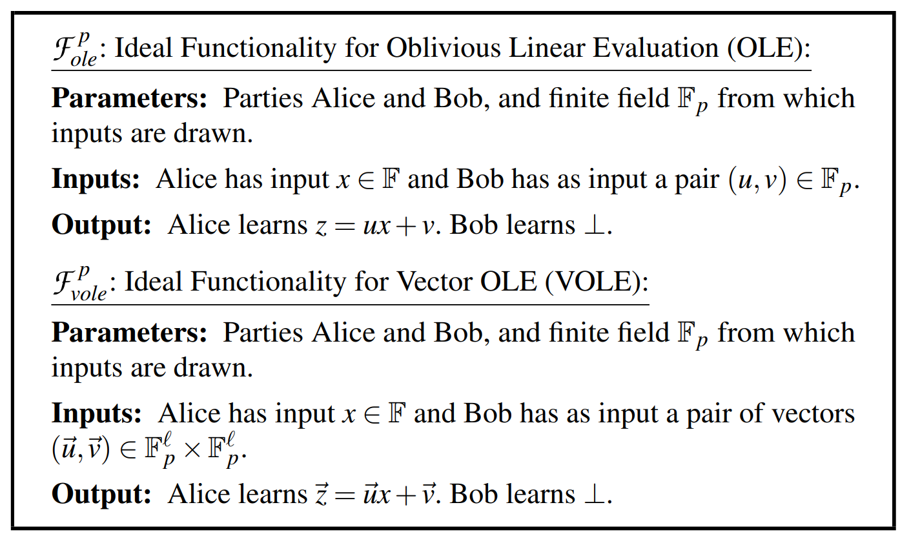
<!-- 飞书原始链接: https://internal-api-drive-stream.feishu.cn/space/api/box/stream/download/authcode/?code=NzgxN2QzNTVkOWNiOWYxZWM0MWZkMTUyYWRhNWI4ZTJfNjQxNDEwMzllNDYxN2FiN2QwNmU4MjMwMTk3ODg5MmVfSUQ6NzIyMDAyNjMwMzI1NTI2NTI4M18xNzg1NDYxODgyOjE3ODU0NjU0ODJfVjM -->

### tHamQueryLite

HamQuery协议输入是两个二进制向量$\overrightarrow{a},\overrightarrow{b}$，如果输入的两个向量的汉明距离小于阈值，那么输出这两个向量，否则不输出。

这里用到的基本思路是有理函数插值，先将两个向量的每一位都映射为一个元素，然后再将这些元素映射到两个多项式中，利用这两个多项式，构造有有理函数，并且计算足够多个点。如果向量的距离小于阈值，那么有理函数就可以消去足够多的公共项，使得通过计算出来的点可以通过插值唯一确定有理函数，这个有理函数的分母的根就是$\overrightarrow{a}\backslash \overrightarrow{b}$。然后可以构造出$\overrightarrow{a},\overrightarrow{b}$向量的交集，从而输出两个向量。

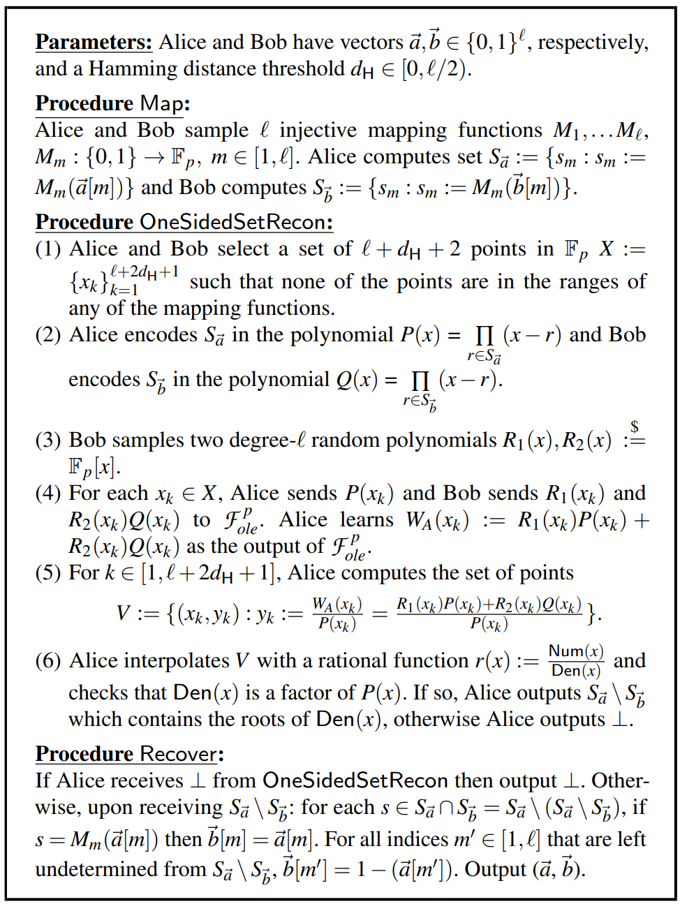
<!-- 飞书原始链接: https://internal-api-drive-stream.feishu.cn/space/api/box/stream/download/authcode/?code=MTJhMzQ1YWZlOTE5NGMyYjkxZTNjMzQ1NzU0M2M0YzFfY2EwZGZhZjUyMGQ2ZDU1MDVjN2MxMmJlN2E4MzA1ZjBfSUQ6NzIyMDAzMTg5MzM1NjU5MzE1M18xNzg1NDYxODgyOjE3ODU0NjU0ODJfVjM -->

### tHamQuery

上面提到的方案有个缺陷就是当向量的距离大于一倍阈值，小于二倍阈值的时候，就会有极大概率泄露两个向量，所以需要改进。改进的方法是在上面协议的前面再加一个协议判断距离是否在一倍到二倍向量之间。原理来源于一个丢球游戏：

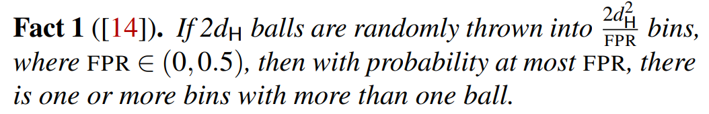
<!-- 飞书原始链接: https://internal-api-drive-stream.feishu.cn/space/api/box/stream/download/authcode/?code=ZjBkZDQ1MTA5N2IyMzQ5NGYxNmFlNDY2OGViNzVmZWNfNGVmNGUzMGFlMWY4Mjg0N2Y0MWFlNzAyZDBiMGYzMTZfSUQ6NzIyMDAzNDQ1MzY1MjAyOTQ0M18xNzg1NDYxODgyOjE3ODU0NjU0ODJfVjM -->

首先限制两个向量最大的汉明距离是两倍阈值，然后将两个向量用相同的方式打乱，然后分割成${2}d_{H}^2/FPR$个子向量，再将每个子向量的奇偶性组合成另一个向量，组合成的两个向量的汉明距离等于原向量的汉明距离。

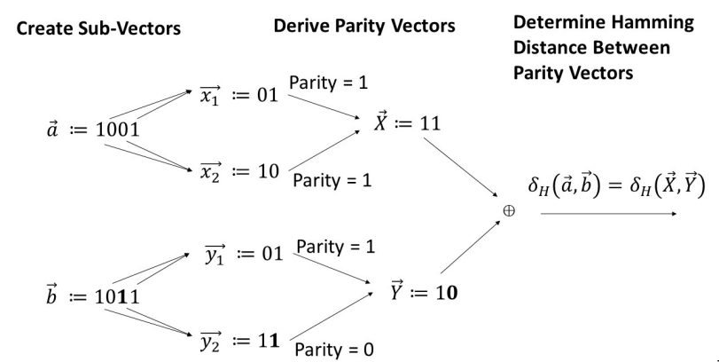
<!-- 飞书原始链接: https://internal-api-drive-stream.feishu.cn/space/api/box/stream/download/authcode/?code=NTUxNDhjZjZkNjVhZjZmODhhMjBjNTg4OTBiZjE2YjFfZGIyNjdhOGM3YjJjYmZmMTA3YjZjZjlmYmE2ZWYwMTdfSUQ6NzIyMDAzNzg2OTA0ODU2MTY2OF8xNzg1NDYxODgyOjE3ODU0NjU0ODJfVjM -->

利用有加同态性质的加密方案去判断两个向量的距离，只有在两个向量距离小于阈值时才可以解密出密钥。

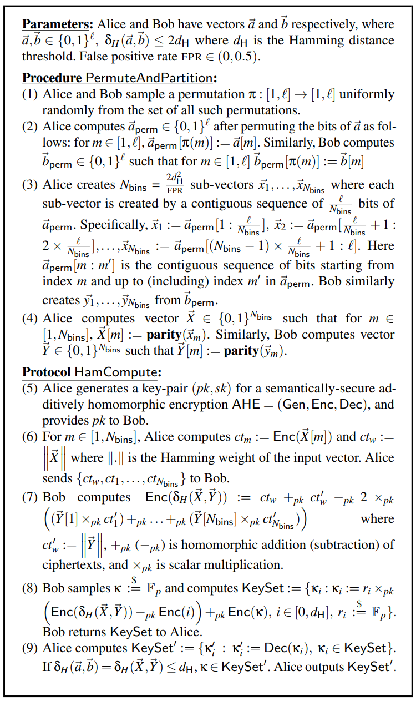
<!-- 飞书原始链接: https://internal-api-drive-stream.feishu.cn/space/api/box/stream/download/authcode/?code=ZjM4NTZjOTZmZDcyMWEwNjQ0MjQ4Yjg5YTI4N2E4NDdfN2RkMjkxZDEyN2U1Y2QxYWYxOGM2YjY3OTk1YWZjYmRfSUQ6NzIyMDAzODM3NDU0Njg5ODk0NV8xNzg1NDYxODgyOjE3ODU0NjU0ODJfVjM -->

然后把这个方案整合进入tHamQuery，中间增加了一个密钥为k的伪随机函数，只有得到k之后采样点才是正确的，不然有理插值不会得到正确的结果。（距离大于二倍阈值时就算得到k也不能通过有理插值得到有理函数，因为采样点数量不够）

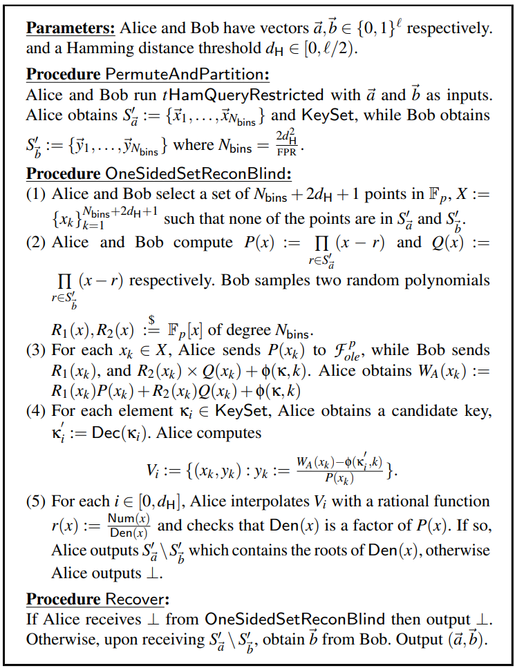
<!-- 飞书原始链接: https://internal-api-drive-stream.feishu.cn/space/api/box/stream/download/authcode/?code=OTRlMmIzMmEzNzBmN2Q5Y2Y5ZWExNjM5ZDZkYjc0Y2ZfNDFjYTJlYjkwODIwOTc4Mzc0MTkyMDYzNWY4N2FiYjFfSUQ6NzIyMDA0MTAwNDk4Mjk0Mzc0N18xNzg1NDYxODgyOjE3ODU0NjU0ODJfVjM -->

### HamPSI

有tHamQuery之后，构造HamPSI是比较简单的，对$A,B$集合中每个向量都进行tHamQuery即可，但这样效率比较低下，用VOLE代替OLE即可提升效率。

### HamPSISample

上面提到的方案缺陷是当向量的距离大于一倍阈值，小于二倍阈值的时候，会泄露两个向量，这里的方法利用了这个漏洞。基本思路是将tHamQueryLite的阈值设置为之前的一半，这样在距离小于一半阈值的时候还是正常流程，在距离大于一半阈值小于一倍阈值时就利用漏洞求解出结果。

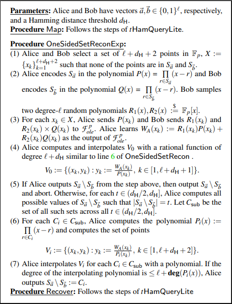
<!-- 飞书原始链接: https://internal-api-drive-stream.feishu.cn/space/api/box/stream/download/authcode/?code=NjgyOGQyZmRjNzE3MWIxMTMwMjY2MjI1MGI1NDEwZTlfZTFjZGJkMzhmYzFkMDBhN2FiNDI0MWIxNDU3MjU2OGNfSUQ6NzIyMDA2MzcyMTIwNzM2NTYzNl8xNzg1NDYxODgyOjE3ODU0NjU0ODJfVjM -->

## Protocol for Integer Distances

检测整数比较简单，只需要扩展集合即可。对于集合A来说，把整数转换成二进制的形式再将集合中所有元素放入二叉树中，找出所有最大封闭完全子树，子树的根节点就代表最大通用前缀，这样对所有数找出所有最大通用前缀就可组成代表字符，代表字符串组成扩展集合。[42-55]的代表字符就是001010\*，001011\*\*和00110\*\*\*。

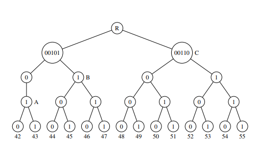
<!-- 飞书原始链接: https://internal-api-drive-stream.feishu.cn/space/api/box/stream/download/authcode/?code=M2U5NzVhOTY0ODY2NjU1ZTI4MzRjNDQ0ODNkMmVjNDhfM2EzZTQxOTljOGVjMzIzM2I0ODA5NTI5YzYyZTFiYTRfSUQ6NzIyMDA2NTMyNzgxMDQxMjU0OF8xNzg1NDYxODgyOjE3ODU0NjU0ODJfVjM -->

对于集合B来说扩展比较简单，比如集合B有个元素的二进制是00110001，那这个元素的代表字符串就为00110001，0011000\*，001100\*\*，00110\*\*\*，0011\*\*\*\*（按照阈值确定），这样就可以生成B的扩展集合。

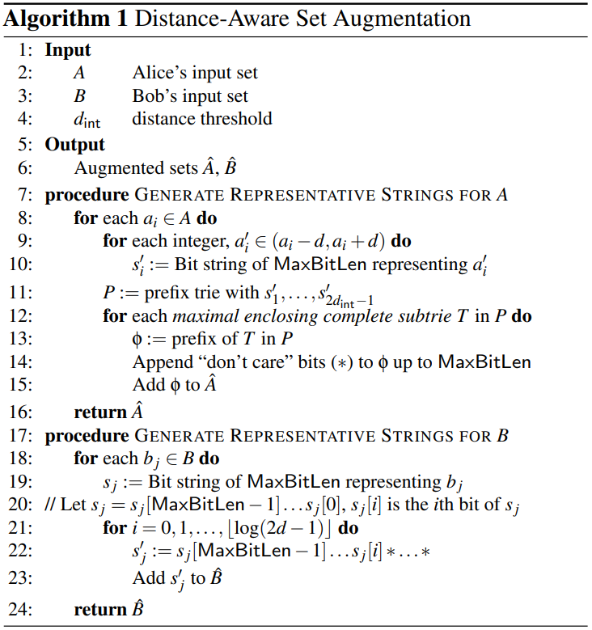
<!-- 飞书原始链接: https://internal-api-drive-stream.feishu.cn/space/api/box/stream/download/authcode/?code=MGZkNDZlMTRiOWQ2MTBiZDI4ZjE5ZmQ5MzY5OGQ1M2VfMDBhMzU5ODEyYjdiNTg4NDllNTcyZjAzNTY3ZDk2MjRfSUQ6NzIyMDA2NjYyNjM2NzAxMjg2Nl8xNzg1NDYxODgyOjE3ODU0NjU0ODJfVjM -->

扩展集合生成完了之后就可以将集合带入任意传统PSI进行比较。

## Evaluation

- HamPSI和Garbled Circuit比较

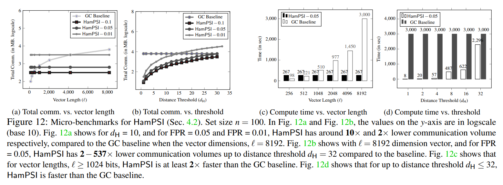
<!-- 飞书原始链接: https://internal-api-drive-stream.feishu.cn/space/api/box/stream/download/authcode/?code=ZTI5NzI4NmVhMWIyYWI2YzZlY2MwNzY0MTZkZTZmZDlfOGI3ODNmZmQxODNjZDRkMmI3Y2FhYTZlOTBjZjdkOTRfSUQ6NzIyMDA2NzE2MTA1MjY0MzMyOV8xNzg1NDYxODgyOjE3ODU0NjU0ODJfVjM -->

- HamPSISample和[Uzun et al.](https://www.usenix.org/system/files/sec21-uzun.pdf)比较

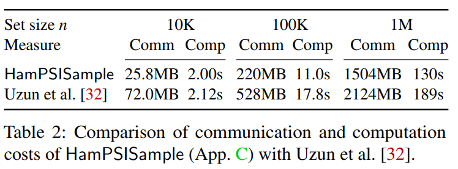
<!-- 飞书原始链接: https://internal-api-drive-stream.feishu.cn/space/api/box/stream/download/authcode/?code=YmJhOGZlYzkyZmFmNjk4NWUyMWM3Y2UxZGYwODg0ZjVfNmM4NzAzZjc2ZmQ3ZjlhNzg5ZGQzMGU3ZTE3YmVlNWNfSUQ6NzIyMDA2ODA2OTg2MTkwMDI5MF8xNzg1NDYxODgyOjE3ODU0NjU0ODJfVjM -->

- IntPSI

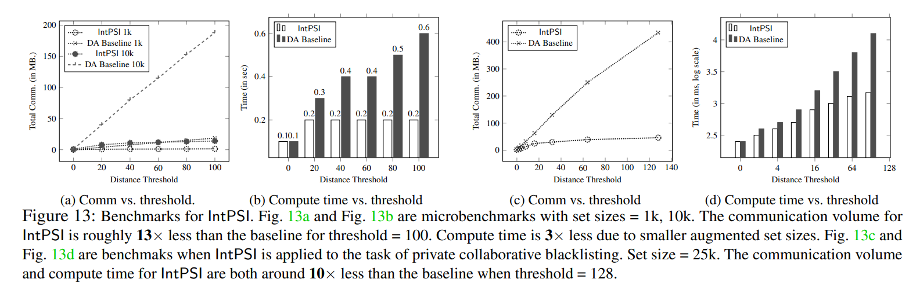
<!-- 飞书原始链接: https://internal-api-drive-stream.feishu.cn/space/api/box/stream/download/authcode/?code=NTRhNzljZWRhZGEzZTI4ZmMyYTAzN2VjNTllMjcwNjFfNTkxNDc2OWM2ZWI2NGQ5NTQyNjU1ZjlkN2IyMDdiZTlfSUQ6NzIyMDA2ODI3MDk3NDgxMjE4OF8xNzg1NDYxODgyOjE3ODU0NjU0ODJfVjM -->

## Conclusion

- 这篇文章关于有理函数的那部分看起来非常吃力
- PHF可否做这个hamming PSI？