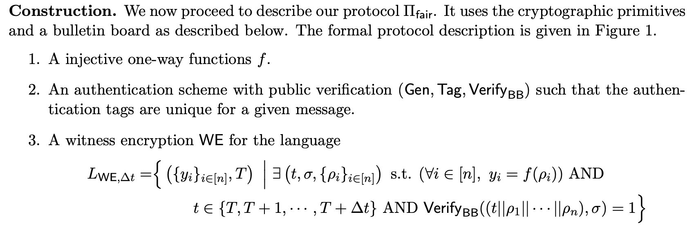
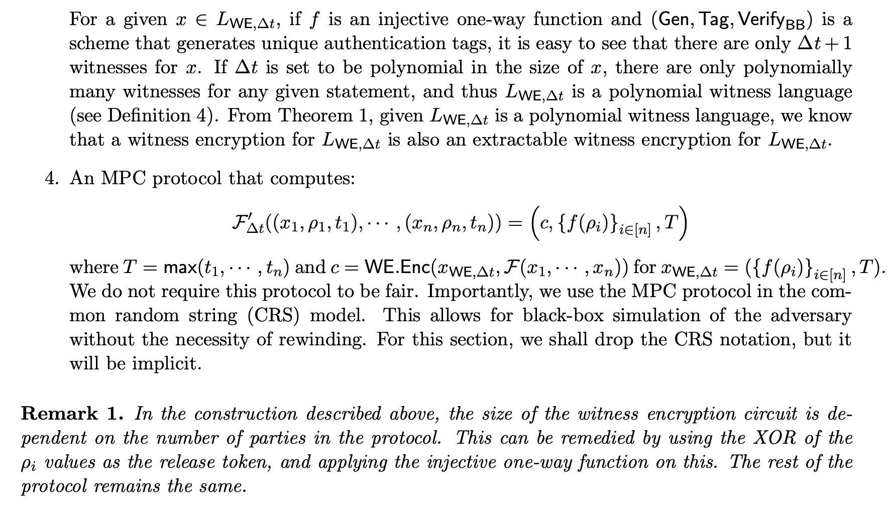

# [CGJ+17,CCS] Fairness in an Unfair World

> 源文件：`[CGJ+17,CCS] Fairness in an Unfair World.pdf`（PDF 原文保留，本文由 OCR 识别生成，轻微修正拼写）

**SUMMARY**: Propose a new paradigm of constructing fair MPC protocol based on public bulletin board, and gives two constructions from witness encryption and TEE.

## 1 Different Models of Fairness

- **Standard model**: Complete fairness can only be achieved for a restricted class of functions.
- **Optimistic model**: Building on a semi-trusted third party.
- **Gradual release mechanisms**: Parties take turns to release their secrets in a bit-by-bit fashion.
- **∆-fairness**: If an adversary aborts, then the honest party can learn the output in time $\Delta \cdot T$, where $T$ is the time in which the adversary would learn the output.
- **Fairness with Penalties**: Implement. The adversarial parties who abort must pay for their behavior.

## 2 Models and Goals

### 2.1 Models

- **System model**: Symmetric participants - all participants execute the same operation.
- **Threat model**: Do not require honest majority.

### 2.2 Goals

- **Fairness**: Either all participants receive the protocol output or no party does.
- **Public bulletin board**: This is implemented by blockchain in this paper.
  - `getCurrentCounter`: Return the value of the counter.
  - `post`: Return a signature $\sigma$ and tag $t$ of the input $x$.
  - `getContent`: Return the signature $\sigma$ and message $x$ corresponding to a tag $t$.

## 3 Technical Roadmap

1. Reduce the problem of constructing fair MPC protocol to fair decryption protocol:

$$\text{Fair MPC} \leftarrow \text{Unfair MPC} + \text{Fair decryption}$$

2. Fair decryption $\leftarrow$ Witness encryption or TEE + PBB

## 4 Fairness from Witness Encryption

**Construction.** We now proceed to describe our protocol $\Pi_{fair}$. It uses the cryptographic primitives and a bulletin board as described below. The formal protocol description is given in Figure 1.

1. A injective one-way functions $f$.
2. An authentication scheme with public verification $(\mathsf{Gen}, \mathsf{Tag}, \mathsf{Verify}_{BB})$ such that the authentication tags are unique for a given message.
3. A witness encryption $\mathsf{WE}$ for the language

$$L_{\mathsf{WE},\Delta t}=\left\{\left(\{y_i\}_{i\in[n]},T\right)\Bigm|\exists\left(t,\sigma,\{\rho_i\}_{i\in[n]}\right)\text{ s.t. }(\forall i\in[n], y_i=f(\rho_i))\ \text{AND}\ t\in\{T,T+1,\cdots,T+\Delta t\}\ \text{AND}\ \mathsf{Verify}_{BB}((t\|\rho_1\|\cdots\|\rho_n),\sigma)=1\right\}$$

For a given $x \in L_{\mathsf{WE},\Delta t}$, if $f$ is an injective one-way function and $(\mathsf{Gen}, \mathsf{Tag}, \mathsf{Verify}_{BB})$ is a scheme that generates unique authentication tags, it is easy to see that there are only $\Delta t + 1$ witnesses for $x$. If $\Delta t$ is set to be polynomial in the size of $x$, there are only polynomially many witnesses for any given statement, and thus $L_{\mathsf{WE},\Delta t}$ is a polynomial witness language (see Definition 4). From Theorem 1, given $L_{\mathsf{WE},\Delta t}$ is a polynomial witness language, we know that a witness encryption for $L_{\mathsf{WE},\Delta t}$ is also an extractable witness encryption for $L_{\mathsf{WE},\Delta t}$.

4. An MPC protocol that computes:

$$\mathcal{F}_{\Delta t}^{\prime}((x_1,\rho_1,t_1),\cdots,(x_n,\rho_n,t_n))=\left(c,\{f(\rho_i)\}_{i\in[n]},T\right)$$

where $T = \max(t_1, \cdots, t_n)$ and $c = \mathsf{WE.Enc}(x_{\mathsf{WE},\Delta t}, \mathcal{F}(x_1, \cdots, x_n))$ for $x_{\mathsf{WE},\Delta t} = (\{f(\rho_i)\}_{i \in [n]}, T)$. We do not require this protocol to be fair. Importantly, we use the MPC protocol in the common random string (CRS) model. This allows for black-box simulation of the adversary without the necessity of rewinding. For this section, we shall drop the CRS notation, but it will be implicit.

**Remark 1.** In the construction described above, the size of the witness encryption circuit is dependent on the number of parties in the protocol. This can be remedied by using the XOR of the $\rho_i$ values as the release token, and applying the injective one-way function on this. The rest of the protocol remains the same.

## 5 Observation & Insights

- What is the cost of implementing the public bulletin board? Can we simplify the functionality of the PBB?
- How to instantiate the witness encryption and unfair MPC for actual application?
