# [CRR21, CRYPTO] Silver: Silent VOLE and Oblivious Transfer from Hardness of Decoding Structured LDPC Codes

**Summary:** The article presents new protocols for silent oblivious transfer extension and silent vector oblivious linear evaluation (VOLE), termed "Silver." These protocols offer high efficiency and performance advantages over existing methods, relying on the conjectured hardness of decoding new, heuristically designed linear codes. The approach deviates from traditional provable security reductions, focusing instead on building a heuristic framework to resist known attacks.

## Introduction

这篇文章构造了Silent OTE和Slient VOLE，OTE和VOLE都是MPC的重要组件，作者以此论述了这篇文章的意义；我感觉最主要的是，这篇文章没有用到已知的任何假设，没有用到可证明安全，而是自己提出了基于启发式线性编码解码困难性的方案。

很有意思的一个点是作者花了几段阐述为什么要这样做，作者将一个密码学方案的构造方法抽象成的两大类：

- 自顶向下的方法 (top-down approach)：基于各种已经广泛研究的假设，比如离散对数问题，然后构造一个高效的方案，将方案的安全性归约到这些假设上面；
- 自底向上的方法 (bottom-up approach)：文章中是这样描述的，" which tries to find the minimal construction that resists all known attacks, and relies on heuristic design criteria to build an intuition about the concrete security"

我的理解是，自顶向下的方法是用已有的东西构造，自底向上的方法是自己从头构造。作者提到，自顶向下的方法效率都没有自底向上的方法高，比如SHA256和基于离散对数的哈希。作者还提到，等到对密码学原语深入理解之后，自然而然会进行自底向上的构造。作者的目的就是用自底向上的方法构造出高效的MPC方案。

这篇文章的出发点在[[BCG+19](https://dl.acm.org/doi/pdf/10.1145/3319535.3354255)]中的SOT构造上：

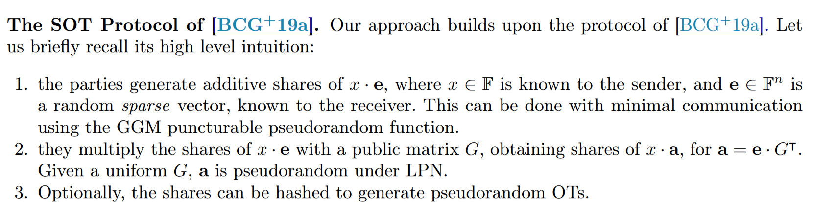
<!-- 飞书原始链接: https://internal-api-drive-stream.feishu.cn/space/api/box/stream/download/authcode/?code=YzJkMTU4MzAwZDg2NzU4MjEyNWVhOWE0MmQ5NTY4MDFfYmJkNzEwOWMxOTUzMWY1M2ZkZTNjNjJhYjZhZjM1MzhfSUQ6NzM3NDczNjA5MjE0NjY0NzA0MV8xNzg1NDYxOTYzOjE3ODU0NjU1NjNfVjM -->

然后作者提出，这个方案的计算瓶颈在第二步的矩阵乘法中，随机矩阵和向量的乘法开销太大，以前的方案在这方面的trade-off还不够，还可以进一步的提高效率。

作者提出了以下两个标准来构造编码方案：

- Large minimum distance and security：依据LPN假设，minimum distance越大的话这个方案越安全
- Linear time encodable codes

LDPC编码可以实现很高的minimum distance和高效的编码，然后作者的思路是achieving fast encoding and high minimum distance LDPC codes.

## Preliminaries

### Preliminaries on bias

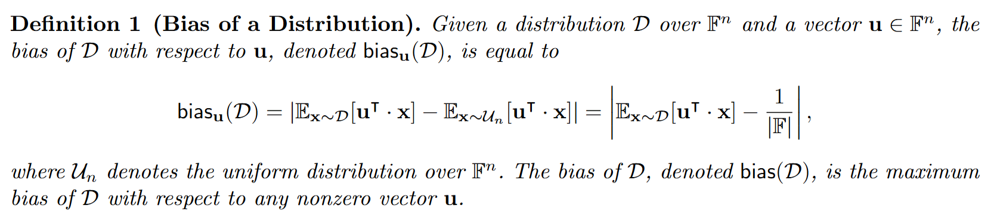
<!-- 飞书原始链接: https://internal-api-drive-stream.feishu.cn/space/api/box/stream/download/authcode/?code=MjJlOTU4MjNiNzg4NmNjNTFjMDg0MTZkZDJjYTM4MzlfM2ExNGYxYjNhZmVhNjc0NWE1M2Q5NjNhYTg1M2ZhMzFfSUQ6NzM3NDczOTYyNDcwMDM2Mjc1M18xNzg1NDYxOTYzOjE3ODU0NjU1NjNfVjM -->

bias(D)可以理解为分布D和随机分布的偏差

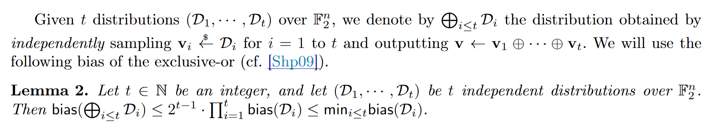
<!-- 飞书原始链接: https://internal-api-drive-stream.feishu.cn/space/api/box/stream/download/authcode/?code=OTgwMzYwM2E2OTlkODE5ZTA3OGM1OTRlNDg4YmI0NjdfYjE1OGRlYjkyZTA1ZWI1ZmQ5MWU0ZmViY2M4NGU2YmFfSUQ6NzM3NDc0MDAxNzY5ODQwNjQwMV8xNzg1NDYxOTYzOjE3ODU0NjU1NjNfVjM -->

lemma2可以理解为从t个独立分布采样得到新的分布的偏差小于任意一个偏差

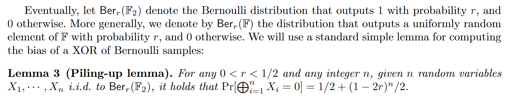
<!-- 飞书原始链接: https://internal-api-drive-stream.feishu.cn/space/api/box/stream/download/authcode/?code=YmQzYWEzYjdmYzRjMmQyMzQ2MWJlY2Q0ZTk1ZmJkMmZfZTFmOTNhZDY4NWMwNzc4YTEyMTc1MmRhOGY0MWZhY2NfSUQ6NzM3NDc0MDA2MjQ5ODQ4ODMyMl8xNzg1NDYxOTYzOjE3ODU0NjU1NjNfVjM -->

### Syndrome Decoding and LPN

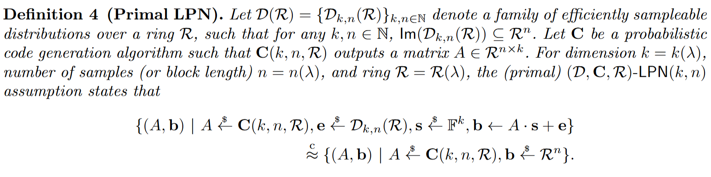
<!-- 飞书原始链接: https://internal-api-drive-stream.feishu.cn/space/api/box/stream/download/authcode/?code=OGZiMzhhNzczZTg4MTQzNGU3Y2ViM2YzMDI5ZDI2ZDVfNTZlM2QzOTc0NjI3ZTc0NWFiZjkwOTBjNmExMzFlYThfSUQ6NzM3NDc0MDMxMjA3NTg0NTYzNF8xNzg1NDYxOTYzOjE3ODU0NjU1NjNfVjM -->

简单来说，LPN表示，区分$(A,A\cdot s+e)$和$(A,b)$是一件很困难的事。

## On the Hardness of LPN for Structured LDPC Codes

这里面文中写的很理论很复杂，总结来说就是针对LPN的攻击有很多，我们通过自底向上的方法构造的话，会涉及到构造结构化的矩阵，这样会让我们的方案归约到一个新的LPN假设中，要证明这个假设是安全的，就需要证明这个假设可以抵抗所有已知的攻击。然后有人提出了可以抵御所有已知攻击的linear test framework，这个framework要求编码方案具有两个性质：

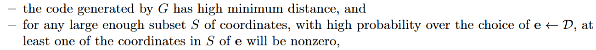
<!-- 飞书原始链接: https://internal-api-drive-stream.feishu.cn/space/api/box/stream/download/authcode/?code=MTdjYzkxZjQ2Yzg1OTQwN2E3MzE2NWRmMmMzNDlkMGVfOTcxZjlmOWVjZWEwOTlkZmI1MTQ4YjBmMWQ5MjUxNmZfSUQ6NzM3NzIyMjQyMzc5MDk5MzQxMV8xNzg1NDYxOTYzOjE3ODU0NjU1NjNfVjM -->

最主要的是通过生成矩阵G生成的编码具有high minimum distance，噪声的分布可以根据伯努利分布进行采样

## Fast LDPC Encoding

这一节介绍怎么进行快速LDPC编码，当生成矩阵G是系统形式时，左边是单位矩阵，右边是parity check部分，编码的结构如下所示：

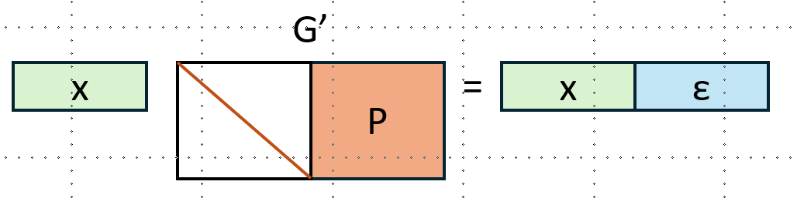
<!-- 飞书原始链接: https://internal-api-drive-stream.feishu.cn/space/api/box/stream/download/authcode/?code=ZjQ5MmY0YjQ3N2M0ZWJhODA5ZGNkODIxMjY5ZTIzZjJfY2QwNWFkMGNkZWVkYTExY2Y4MGFkZDFlNGQ5OTA3OGJfSUQ6NzM3NzIyMzU1OTA3Mjg1ODExNl8xNzg1NDYxOTYzOjE3ODU0NjU1NjNfVjM -->

当我们设计一个编码方案时，一般是先构造奇偶校验矩阵H，如果我们要通过H计算得到生成矩阵G，然后再通过G进行编码，时间复杂度是$O(n^3)$

我们也可以通过求解下面的方程来进行编码，要高效求解这个方程组，H需要满足一种特定的结构，然后进行高斯消元，这种方法叫做，g-Approximate Lower Triangularization (g-ALT)。

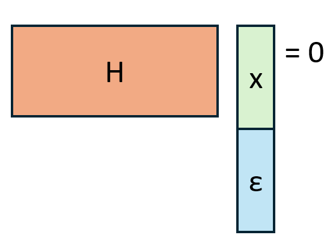
<!-- 飞书原始链接: https://internal-api-drive-stream.feishu.cn/space/api/box/stream/download/authcode/?code=MzM4MWY0NzAzYzhhMTg2YzQyYzg4ZThiZDVhZmRmNWRfOWI2N2Y5OWNmZjcwNWYxMGQ5ZGE2NWViM2E5MWQxMjJfSUQ6NzM3NzIyNTMwOTc0ODMxNDExNV8xNzg1NDYxOTYzOjE3ODU0NjU1NjNfVjM -->

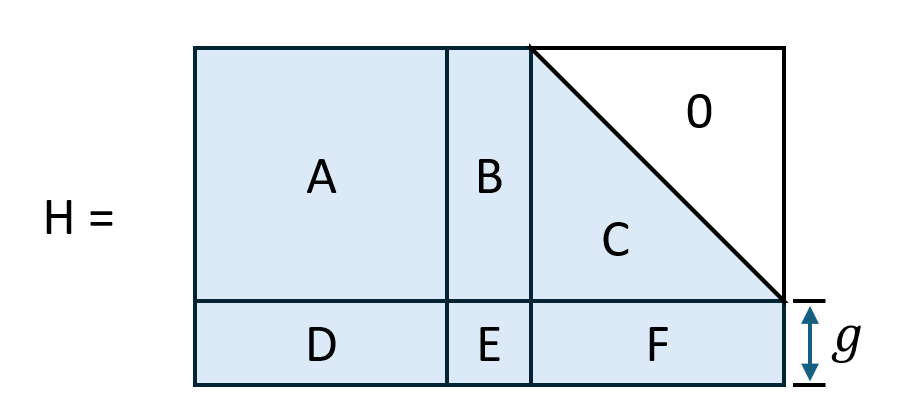
<!-- 飞书原始链接: https://internal-api-drive-stream.feishu.cn/space/api/box/stream/download/authcode/?code=MTQzM2FhM2RhZGFjOTRmZTk2ZjI2ZDUzMjE1YzQyMGFfZjkzYmMyYTNmYWNkYjk4MDdkYTYxODhmYjc5MmM0NGZfSUQ6NzM3NzIyNTc5MDMxNDQ3OTYyMF8xNzg1NDYxOTYzOjE3ODU0NjU1NjNfVjM -->

具体求解过程在这里省略，这样求解的复杂度是$O(n+g^2)$，当$g=\sqrt{n}$时，求解的复杂度是线性的。

## Estimating minimum distance

由于编码方案中码字空间是特别大的，因此对于码字长度n特别长的情况下，计算得到精确的minimum distance被证明是NP完全问题。

在n比较短的情况下，比如n<200，可以通过Brouwer-Zimmerman算法得到一个exact minimum distance。

在n<4000的情况下，可以通过noisy impulsive method，对零码字的任意比特进行反转，然后通过belief propagation方法搜寻与零码字最近的非零码字，通过这两个码字之间的距离推断minimum distance的上界。

对于更大的n，作者进行的推断。

## Code Design

### Uniform LDPC Codes

这个编码中，校验矩阵H是通过固定行权重然后进行随机采样得到的，这种编码方式优点是具有线性的最短距离，缺点是编码效率比较低。

### Tillich-Zemor Codes

这个编码方式构造的H如下图所示，左边是随机的，右边固定了行列的权重，并且1分布在对角线上和左下角。

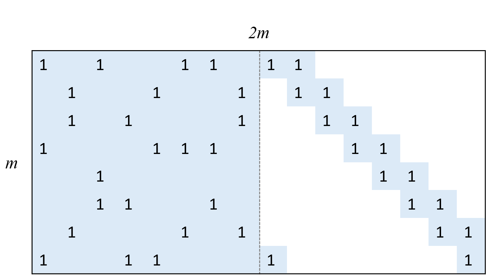
<!-- 飞书原始链接: https://internal-api-drive-stream.feishu.cn/space/api/box/stream/download/authcode/?code=ZjFlZjVmMTE4OWE0ODBjOTJkYWEyZTc5MWQyOTk4NTZfYzllZjVlOWZiMDhhMTY2YTRiNGNjODE3Y2U0ODk5NzRfSUQ6NzM3NzIyOTM3Mjc5MTkxNDQ5OV8xNzg1NDYxOTYzOjE3ODU0NjU1NjNfVjM -->

这个编码方式的特点是编码效率很高，但是只有对数的minimum distance，因为L中有概率会出现两列异或之后1的举例很近，然后被对角线给cancellation，如下所示

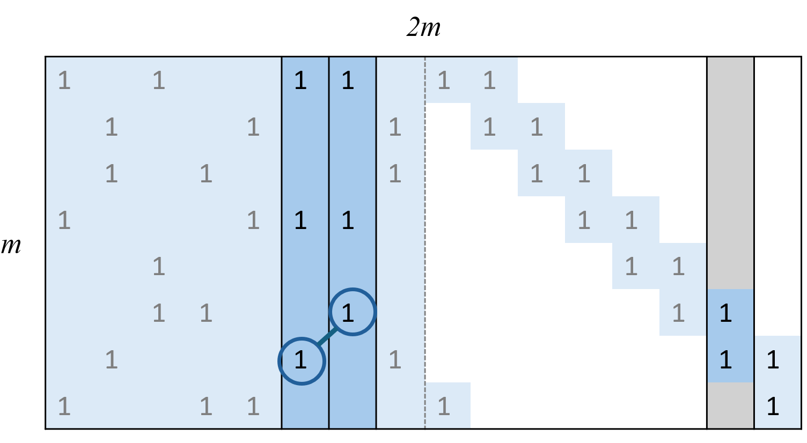
<!-- 飞书原始链接: https://internal-api-drive-stream.feishu.cn/space/api/box/stream/download/authcode/?code=ZGQwMTk1NjM0Mzk1YzRkMjY5MWY3NWE3Njg0NDFmZDVfMjk0MWIxNzM2ZjNiYTk4YjgzZjdkZmE4N2U5NTliZjVfSUQ6NzM3NzI4MDQxMjkzMjY2OTQ0NF8xNzg1NDYxOTYzOjE3ODU0NjU1NjNfVjM -->

### Slv1

TZ码最大的问题是minimum distance太小了，作者想到的第一个改进方法是增加R的权重，使其避免出现bridge的情况，避免很小的minimum distance

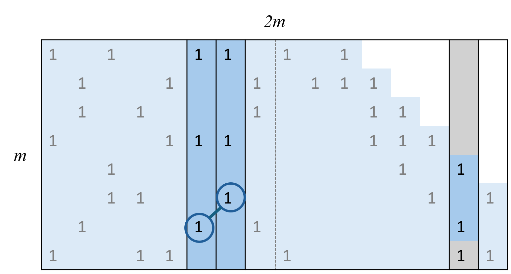
<!-- 飞书原始链接: https://internal-api-drive-stream.feishu.cn/space/api/box/stream/download/authcode/?code=YWMzNTE1ZjAyNDE1MWZkYTY2NDBkZmNkY2JlY2QwMmRfMGNiNzRiMzk2ZDM4ZmRlYmZlMjljY2E1MWQyOTllNjFfSUQ6NzM3NzI4MDU4ODA0ODg1OTEzOV8xNzg1NDYxOTYzOjE3ODU0NjU1NjNfVjM -->

但是这样还是会有一些情况minimum distance不理想，仍然会有cancellation发生， 比如：

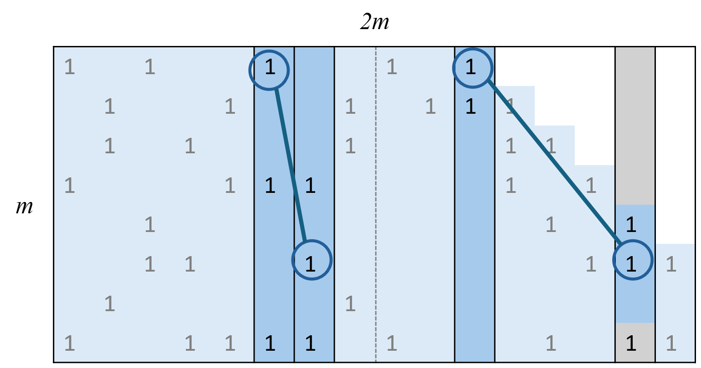
<!-- 飞书原始链接: https://internal-api-drive-stream.feishu.cn/space/api/box/stream/download/authcode/?code=N2JkN2U4ZmIwYzI0NjI0MWRlNWM1ZjE4ZWExZThhMWZfNWY4ZTZjYzc0OGFkNzM1Mzk2MDY0NzVmYjBiYTg5ZmRfSUQ6NzM3NzI4MDc2NTM5MzQyMDI5MV8xNzg1NDYxOTYzOjE3ODU0NjU1NjNfVjM -->

### Slv2

这个编码方案中增加了一条对角线，经过实验可以避免cancellation带来的影响

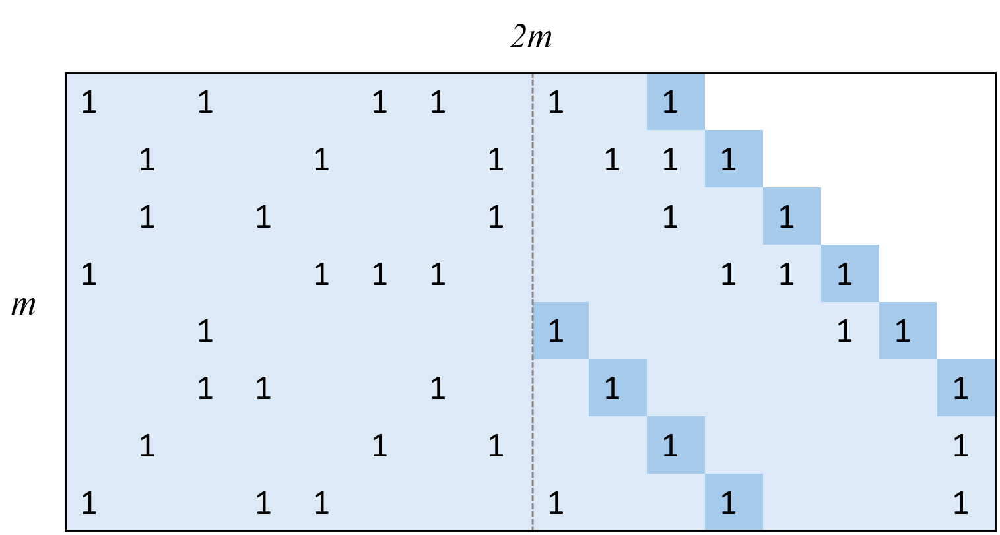
<!-- 飞书原始链接: https://internal-api-drive-stream.feishu.cn/space/api/box/stream/download/authcode/?code=NGIxZTlkN2I1NzY2OWE5NThmMzBhMzY0ZjBhZWZjNWFfNzI3YmQwZDQ1Y2IwNWY0ZDhjNjJlZDkwMTdmYTA2MDVfSUQ6NzM3NzI4MTAwNTIwNjg4MDI1OV8xNzg1NDYxOTYzOjE3ODU0NjU1NjNfVjM -->

### Slv3

前面的编码方案memory locality都不好，因为L是随机的，很容易就会有cache miss，然后作者对L进行了去随机化

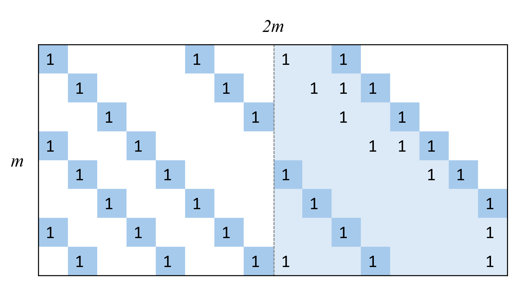
<!-- 飞书原始链接: https://internal-api-drive-stream.feishu.cn/space/api/box/stream/download/authcode/?code=YjkxM2YwZmIxYzJjOTc1MzM4MzgyMDgwYTllNzhiZTJfNzEzZWZhZWJhMTEyYTBmM2JiYzY4YzNiODhiZmYxOWNfSUQ6NzM3NzI4MzkwMDIzMDQxODQzNV8xNzg1NDYxOTYzOjE3ODU0NjU1NjNfVjM -->

### Slv4, 5

作者对L进行去随机化之后又对R进行了去随机化，然后通过实验推测不会对minimum distance有影响

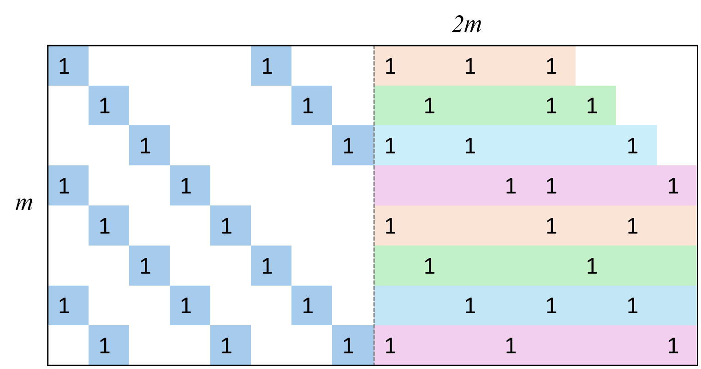
<!-- 飞书原始链接: https://internal-api-drive-stream.feishu.cn/space/api/box/stream/download/authcode/?code=MmMzMmMyYjFiOTdhOTViM2M4MWEyNjM0MDczNWJjZjZfNTZkN2JiMzI2NDk4ZThkN2ZjZWU4ZGI0OTE5ZTIzOTlfSUQ6NzM3NzI4NDM2Mzg3MDI3MzUzOV8xNzg1NDYxOTYzOjE3ODU0NjU1NjNfVjM -->

但是实际上这样做会对使minimum distance变成对数的而不是线性的，这个结论在[[RTT23](https://eprint.iacr.org/2023/882.pdf#page=14.60)]中被证明