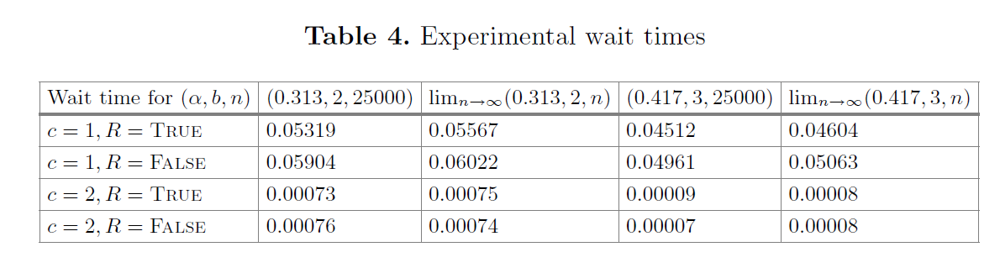
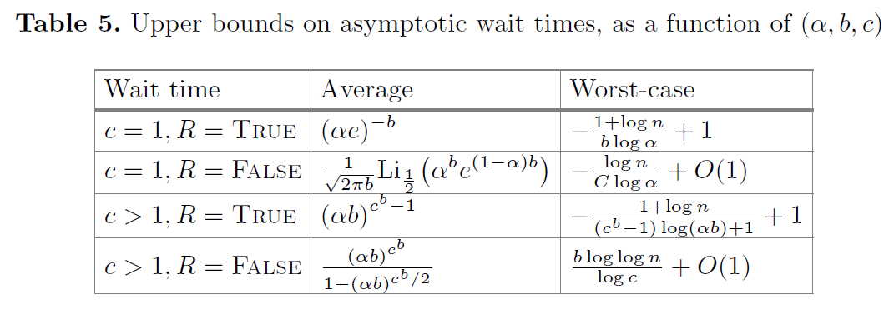
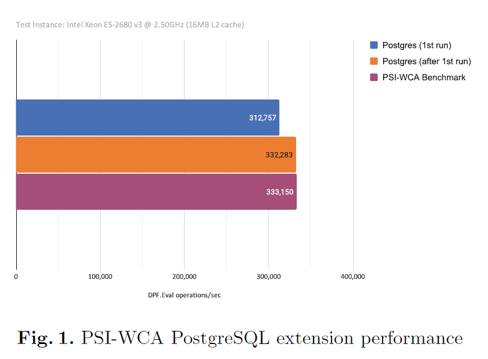

# [DIL+22, SCN] Streaming and Unbalanced PSI from Function Secret Sharing

**Summary:**  这篇文章利用DPF构造了一个Streaming和非平衡的PSI-WCA协议（每个元素对应一个secret weight，协议执行完毕之后得到weight之和）

我认为PSI-WCA是一种更weak的PSI，因为有了PSI结果之后可以推出PSI-WCA结果，但是反过来是不行的。

## Background

作者说使用双服务器模型可以避免使用公钥加密，并且在PIR中已经普遍使用了这种模型；然后说使用DPF的好处，第一是可以支持secure keyword search，第二是对于PSI-WCA来说，求和不会增加通信开销，很适合lightweight PSI solutions。

## Goals

- Streaming：假设PSI的运行时间分成了许多的时隙，每个时隙数据集会变动一小部分，这个时隙的开销和数据集变动的部分成比例。
- Unbalanced：假设双方数据集大小相差很大，$n\ll N$，协议通信开销应该和$n$成比例。

## Baseline Protocol

### One Shot

这个One Shot方案利用到了DPF支持secure keyword search的特性：

- 假设客户端拥有集合$X=\{(x,w)\}$，对于集合中的每一个元素$x_i$都生成一个密钥$k_i(f_{x_i,w_i})$然后发送给服务器
- 服务器收到密钥集合$K=\{k_i\}$之后，对自己的每个元素$y_j$都计算$\text{DPF}.Eval(k_i,y_j)$，然后将计算结果相加之后返回给客户端
- 客户端收到两个服务器的结果以后可以恢复出权重之和

### Streaming

这里的Streaming有个设定：

- 假设协议执行的时间分为很多个Epoch，每个Epoch都服务器和客户端都会更新固定数量元素（服务器为$N'$，客户端为$n'$）

有了这种假设之后做起来会简单一些：

- 对于客户端，每个Epoch只需要对新增元素生成DPF密钥
- 对于服务器，只需要对新增的密钥进行计算（服务器新增元素和客户端所有密钥计算，客户端新增密钥和服务器所有元素计算）

## Greedy Scheduling

这个贪心调度的策略实际上和cuckoo hash很像，它的目的是为了减少服务器的计算开销：

- 客户端有$n$个元素，选定桶大小$b$，然后选定$c$个哈希函数，将元素映射到$n/b$个桶，选元素最少的桶放入；插入失败的元素放入stash中等下一个Epoch优先处理；DPF密钥还是照样生成
- 服务器收到密钥之后，不需要再对所有元素进行计算；而是对自己的元素进行哈希映射到$n/b$个桶，只用桶中密钥进行计算

### Streaming

由于上面提到过的假设，这里的Streaming也很简单

> 假设协议执行的时间分为很多个Epoch，每个Epoch都服务器和客户端都会更新固定数量元素（服务器为$N'$，客户端为$n'$）

为了使得描述简洁，这里假设只有客户端新增元素，双方都Streaming的方式和Baseline中一样：

- 每个Epoch客户端通过Greedy Scheduling生成DPF密钥发送给服务器
- 服务器为每个元素计算出$c$个哈希值，然后从这$c$个桶中找出DPF密钥然后进行计算；最终把聚合之后的结果发送给客户端
- 客户端恢复出最终结果

## Evaluation

- Greedy scheduling涉及到queueing theory，首当其冲的问题就是，平均等待时间和最坏等待时间，作者做了蒙特卡洛模拟和相应的计算，得出结论在参数选取恰当的情况下，平均等待时间很短，等待很长时间的概率很低：

<!-- 飞书原始链接: https://internal-api-drive-stream.feishu.cn/space/api/box/stream/download/authcode/?code=ZTM2NGRiYjkxNjdhMmFmZjQwZmMyNzhmMzY3YWM2MmFfMzIzY2Q4YzI5NGUyOWU0Mzg5YzVkYjgxOWUwMTAwOTlfSUQ6NzMyMjQ5MjMxODgxMDk2Mzk3MV8xNzg1NDYxOTM1OjE3ODU0NjU1MzVfVjM -->

<!-- 飞书原始链接: https://internal-api-drive-stream.feishu.cn/space/api/box/stream/download/authcode/?code=OTMzOWQ5NmE5ZTFmZjRkNDc2MmVlMjJjZDhiMmIyNWRfZjlhNTlkYjNlOWIxZWQ2NjQyOGUyY2Y0YTNjM2MwMDlfSUQ6NzMyMjQ5MjM2Njc5NDcxOTIzNl8xNzg1NDYxOTM1OjE3ODU0NjU1MzVfVjM -->

- 作者在实现之后没有与其他PSI方案做比较，而是评估了每秒钟执行DPF.Eval的次数

<!-- 飞书原始链接: https://internal-api-drive-stream.feishu.cn/space/api/box/stream/download/authcode/?code=NzA3OWY2MTgyZGI0NjJmMGFjN2NkYmRjMzg1NmZiZDZfMTNiZmYxMTA5ODRmYTBjMmQ2MDc5MzVkYzc3NmM4YjBfSUQ6NzMyMjQ5NTAyNjkxODc4NTAyN18xNzg1NDYxOTM1OjE3ODU0NjU1MzVfVjM -->

## Thinking

这篇文章提到的Streaming应该是Synchronized的，也就是固定时间服务器和客户端同步更新固定数量的元素，有这种假设的话会好做一些，之前讲的Updatable PSI也是一样的假设。

与之对应的就是Asynchronized，客户端服务器可以任意时候更新，这种情况下需要解决的问题多一些，我之前也就在思考这种异步的情况下如何更新，但是没有想出来结果。