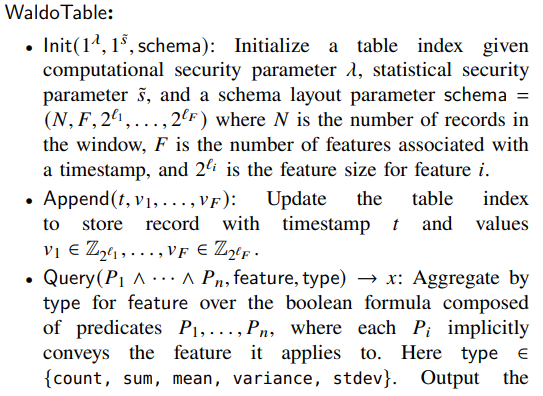
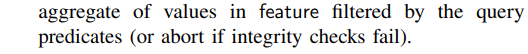
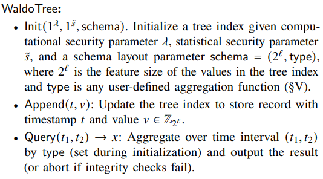
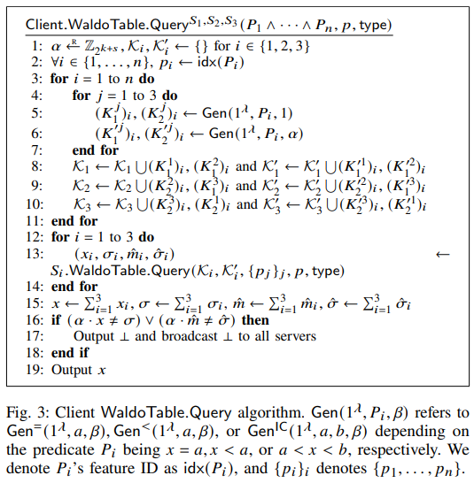
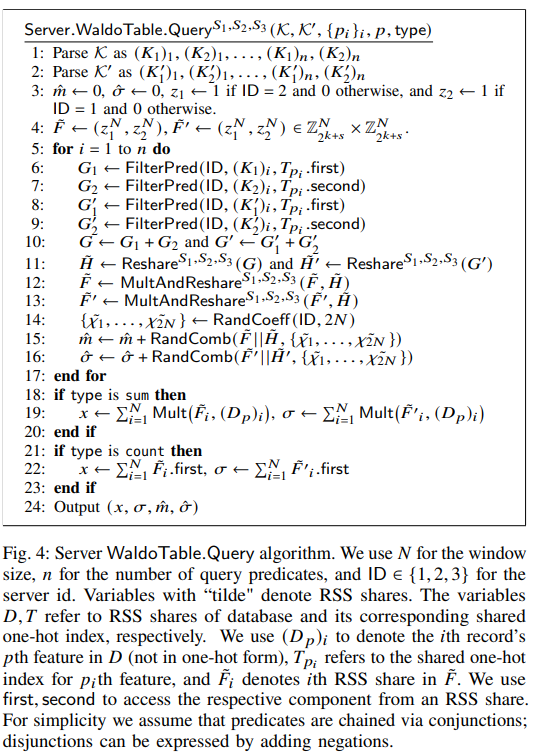
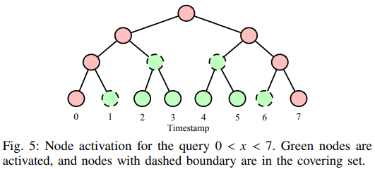
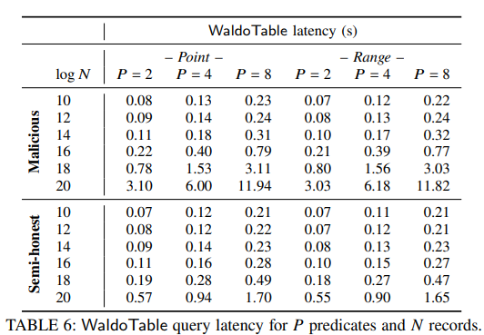
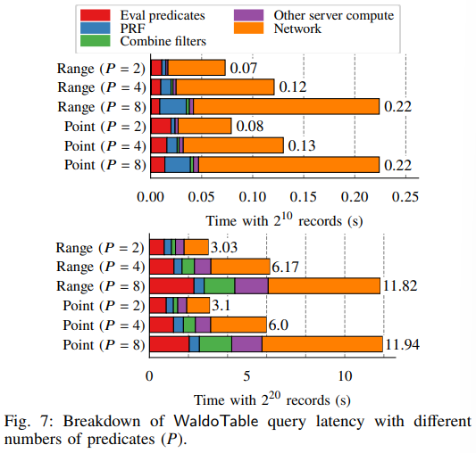
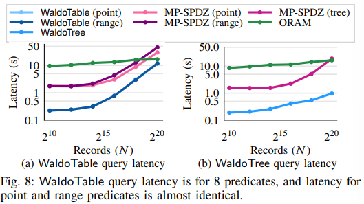
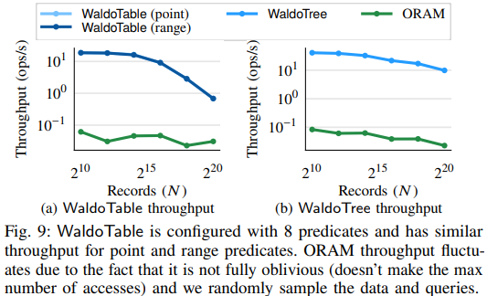

# [DRPS22, S&P] Waldo: A Private Time-Series Database from Function Secret Sharing

> Waldo supports multi-predicate filtering, protects data contents as well as query filter values and search access patterns, and provides malicious security in the 3-party honest-majority setting.

# Introduction

## characteristics

- Multi-predicate functionality
- Obliviousness with malicious security
- Efficiency

  - With features modulo 2^8, Waldo runs a query with 8 range predicates for 2^10 records in 0.22s, compared with 1.75s for an MPC baseline and 9.60s for an ORAM baseline, and 2^20 records in 11.82s, compared with 45.72s for MPC and 16.70s for ORAM.

## Summary of techniques

- Why Waldo?

  - ORAM and general-purpose MPC are poorly suited to the time-series database setting due to the many rounds of interaction (ORAM) and substantial communication overhead (MPC) they require.
- Why FSS?

  - We need to rely less on communication, which is limited and expensive, and instead take advantage of compute resources, which are significantly cheaper and easy to increase.
- How to apply FSS in complex settings?

  - FSS for private predicates
  
    - shortage: 在聚合share时以明文提供输入显然是一个问题。为了解决这个问题，以前在安全计算中使用加性掩码来隐藏秘密值，但是效率非常低，需要与数据库大小成线性关系的客户端通信
    - 我们开发了一个共享的one-hot索引，它隐藏了数据的内容，同时支持具有FSS的高吞吐量附加和私有查询
  - Combining multiple predicates
  
    - shortage: 为了支持多谓词查询，需要一种机制合并相等的和按范围查询的输出。两个关键挑战

      - 1）如何构造FSS计算的输出，以便它们可以被高效地合并；
      - 2）如何执行实际的合并。
    - 解决方案：

      - 为了解决（1）：共享one-hot索引，以使FSS评估输出是一个由零和一组成的向量，可以与另一个谓词的向量组合。
      - 为了解决（2）：we leverage the fact that our vectors are shared using replicated secret sharing to take advantage of existing communication-efficient techniques for semihonest 3-party honest-majority multiplication
  - Supporting complex aggregates
  
    - shortage: The above protocol supports complex filtering, but a limited set of aggregates
    - 解决方案: a *shared aggregate tree* that supports any user-defined aggregation function where the server does not have to know how values are aggregated
  - Providing malicious security
  
    - shortage: 需要防范可能试图篡改查询结果的恶意对手
    - 解决方案: 对 FSS 评估结果进行身份验证，以与*从多个谓词合并输出的技术*兼容

# System overview

## A. System architecture

- Clients: There are two types of clients: data producers and queriers. Some clients may be both.

  - Data producers: Sensors or other devices collect real-time data and update the servers’ state.
  - Queriers: Queriers query the data collected by the data producers and stored at the servers
- Servers: Three servers in different trust domains store data collected by data producers and execute queries made by queriers. If a majority of the servers are honest, the single malicious server cannot not learn the data contents, query filter values, or any search access patterns. These “logical” servers might be distributed across multiple machines.

## B. Waldo API

### WaldoTable:

<!-- 飞书原始链接: https://internal-api-drive-stream.feishu.cn/space/api/box/stream/download/authcode/?code=ZDEzNzA0ZjI1ZTE4MmY4OTJmMDc0NjMwNjg0YTEyODZfZGMwMDNiZjdjYzFjNjVjNTI1MjlmY2M4OTY4NjdhM2VfSUQ6NzIxNzQ5NDAyMzg3MzgwNjM0MF8xNzg1NDYxODgwOjE3ODU0NjU0ODBfVjM -->

<!-- 飞书原始链接: https://internal-api-drive-stream.feishu.cn/space/api/box/stream/download/authcode/?code=NzE1YjhiZjlhMzJiZTk0YThlZmEzYmU3ZDEzOTk4NDlfMGUzNmFlMGJmOTg3ZTQ1YjNkZWJmOTkyOWNiMDJjZDVfSUQ6NzIxNzQ5NDA5MjgzNjUwMzU1NF8xNzg1NDYxODgwOjE3ODU0NjU0ODBfVjM -->

### WaldoTree:

<!-- 飞书原始链接: https://internal-api-drive-stream.feishu.cn/space/api/box/stream/download/authcode/?code=ZGY1NWNhOTMyOGI0ODMzMmM1MGQyOWM3ZmE4MTlhNDlfMTUzYjcyMzBjMGE5MjBjZTE5YmViMDcxNGIzNjgzYjJfSUQ6NzIxNzQ5NDE0ODE4MDM5Mzk4OF8xNzg1NDYxODgwOjE3ODU0NjU0ODBfVjM -->

# Multi-predicate queries

## Client WaldoTable

<!-- 飞书原始链接: https://internal-api-drive-stream.feishu.cn/space/api/box/stream/download/authcode/?code=MWRjMDU2MzRmMjRhODdhNmRlYTIxMDJkMGI5ODIwZWNfMWZhNGI2NjkwMTZhNWU4YjIyYTMyNjE5YTFmNTgyZDJfSUQ6NzIxNzQ5NDI1NjU3MzgyNTAyOF8xNzg1NDYxODgwOjE3ODU0NjU0ODBfVjM -->

## Server WaldoTable

<!-- 飞书原始链接: https://internal-api-drive-stream.feishu.cn/space/api/box/stream/download/authcode/?code=MzVkNWQxNGYzNDliZTVhMWVjNmY5MjRjMDkxMDcyNjRfYmEyNGE0Njg4NDQ0NTVkZTMxZWY5ZmRmMmRkODg5MjFfSUQ6NzIxNzQ5NDI5MTk4MjEyMzAxMl8xNzg1NDYxODgwOjE3ODU0NjU0ODBfVjM -->

# Complex aggregates over time ranges

## ---- a shared aggregate tree

       虽然 one-hot 索引可以使用 sum 和 count 查询计算出一组有用的聚合，但并非所有有价值的聚合都可以表示为点积的组合（例如，min、max、top-k）。在许多情况下，客户端需要计算一个时间段内的复杂聚合（例如，医生可能想要计算糖尿病患者最近一周的最高血糖水平）。WaldoTree 索引允许客户端在时间段内计算任何聚合函数，而无需进行服务器之间的交互，并且不会透露正在查询的时间间隔。由于 WaldoTree 比 WaldoTable 更高效，且不需要服务器之间的交互，因此在查询谓词被预定义的情况下也很有价值。解决这个问题的方法被称为共享聚合树。每个叶节点包含一个记录值，每个内部节点包含其两个子节点的聚合值。每个叶节点都有一个公共的时间戳，并且 n 个叶节点按时间排序，以便每个内部节点具有公共的时间间隔。通过这种方式，客户端可以通过检索最多 2log n + 1 个节点来计算某个时间间隔内的聚合（Fig 5）。这组节点表示覆盖集，因为它覆盖了客户端正在查询的时间范围。一旦客户端检索到覆盖集中的节点，客户端可以本地聚合中间聚合以计算查询结果。为了将树的内容隐藏在服务器之外，可以再次使用 RSS 来共享每个节点的聚合值。

<!-- 飞书原始链接: https://internal-api-drive-stream.feishu.cn/space/api/box/stream/download/authcode/?code=MjgxZGFmNzQ1MjJlMGYwODdiZjExMTllMDNhODUwZmJfZDFmOGMxOTA2Y2QxZjgxN2VmYzE4NWU5ZWM4ZmFiYjhfSUQ6NzIxNzQ5NDM2NzkyMDc5OTc0Nl8xNzg1NDYxODgwOjE3ODU0NjU0ODBfVjM -->

# Implementation

We implemented Waldo in ∼6,200 lines of C/C++ code (excluding tests and benchmarking infrastructure). We used the libPSI DPF mplementation (with some minor modifications), the cryptoTools library for cryptographic primitives, and gRPC for communication. We configured Waldo to aggregate values of up to size 2^32 and set our statistical security parameter s˜ = 80 and computational security parameter lambda = 128. This allows us to use a 128-bit ring, which makes the additions and multiplications used to evaluate predicates very fast.

# Evaluation

## A. Baselines

- Oblivious multidimensional tree
- MP-SPDZ

## B. Latency: WaldoTable

- Waldo’s performance

In Table 6, we show WaldoTable query latency for different numbers of records *N* and different numbers of predicates *P*.

<!-- 飞书原始链接: https://internal-api-drive-stream.feishu.cn/space/api/box/stream/download/authcode/?code=ZDY5ZTk5ODM2YjMxMTBiMTUxYzEyYmM3ZjJkYTY3Y2JfMmFlZDNjNmQyYmEwNmJmYmViMmU3OWJlY2JlY2ZkNjNfSUQ6NzIxNzQ5NDQyMjIxNjA5Nzc5M18xNzg1NDYxODgwOjE3ODU0NjU0ODBfVjM -->

Fig. 7 illustrates the breakdown in query execution time for 2^10 and 2^20 records with different numbers of predicates (*P*).

<!-- 飞书原始链接: https://internal-api-drive-stream.feishu.cn/space/api/box/stream/download/authcode/?code=YWVmMjNkOGFmNWU1ZDhmZWE1MzdhNzlmOTEzZmNhMWZfODc0NjdmZTBjOTJiOWQ4MWMyNzk5YTIxNjBkYWZlZThfSUQ6NzIxNzQ5NDUyMzM1MjYyOTI1MV8xNzg1NDYxODgwOjE3ODU0NjU0ODBfVjM -->

- Comparison to baselines

In Fig. 8a, we show how WaldoTable’s query latency compares to that of the two baselines for different numbers of records *N* with 8 predicates.

<!-- 飞书原始链接: https://internal-api-drive-stream.feishu.cn/space/api/box/stream/download/authcode/?code=MGRmODY3YTNjNTc4ZThlOGJkZGY4Y2E3NDE2M2ZmNjlfMzg5ZmExNDFiN2VhZmNmMDNmMjI0ZWY0NDRiOTlmYWNfSUQ6NzIxNzQ5NDU2NjIxODM1MDU5NV8xNzg1NDYxODgwOjE3ODU0NjU0ODBfVjM -->

- Parallelism across servers

WaldoTable is parallelizable not just across cores, but also across servers without introducing new trust domains. We can split each “logical” server into *n* “physical” servers. The client divides its index into *n* equally-sized sub-indexes and delegates a sub-index to a triple of servers split across trust domains. The client can run its query on all *n* sub-indexes and locally aggregate the results. Because each triple processes its query chunk independently, parallelism is trivial. By using 12 servers instead of 3, we estimate that 8-predicate range queries take 3.0s, whereas with 3 servers they take 11.82s

## C. Latency: WaldoTree

In Fig. 8b, we show that WaldoTree queries are much faster than queries in our two baselines.

## D. Throughout

In Fig. 9a and Fig. 9b, we compare Waldo’s throughput to that of our ORAM baseline for a 90% append, 10% query workload.

<!-- 飞书原始链接: https://internal-api-drive-stream.feishu.cn/space/api/box/stream/download/authcode/?code=ZmQ1N2YyMmJiMTU4MzBiYjU2YjU3ODJmZjU4YTMwNGZfMTI2YTI0NjcwZDBjOTQ1OGVmNDEzNTMzZGFmMmUwN2FfSUQ6NzIxNzQ5NDY3NjU3ODc5NTUyMl8xNzg1NDYxODgwOjE3ODU0NjU0ODBfVjM -->

# Limitations and future work

- 虽然Waldo支持比之前的工作更丰富的功能，但它不支持一些明文时序数据库提供的所有功能（例如检索单个记录，排序，按组合并或连接）。
- Zeph支持差分隐私，但Waldo不支持，因为它提供了恶意安全性：服务器需要以可验证的正确方式添加噪声，而且不能导致MAC验证失败。
- 支持更具表达力的查询和提供差分隐私是未来工作的有价值方向。