# [DSQ+22,CCS] STAR: Secret Sharing for Private Threshold Aggregation Reporting

# SUMMARY

STAR is a highly efficient, easy to deploy, and provides cryptographically-enforced $\kappa$-anonymity protections on private data collection.

# 1 Introduction

Application developers often need to learn how their product is used, and in which environments their software runs to debug errors, address security issues, and optimize implementations. However, collecting such information puts user privacy at risk. To protect user privacy, a common approach is to only collect data from $\kappa$ clients (sometimes called $\kappa$-heavy-hitters) to prevent uniquely identifying patterns from being revealed. This is known as threshold aggregation and systems that provide this guarantee are called threshold aggregation systems. However, there is a challenge for designers of these systems to allow a server to determine if it has collected $\kappa$ identical records without seeing the underlying measurement value and protecting the user from a malicious or untrusted server. While many systems have been proposed, they all have at least one impractical property for most developers and telemetry systems.

## 1.1 The STAR approach

The paper proposes a new threshold aggregation system called STAR, which prioritizes efficiency, limited trust assumptions, and simple cryptography, and allows developers to attach arbitrary data to client messages.

### Overall idea

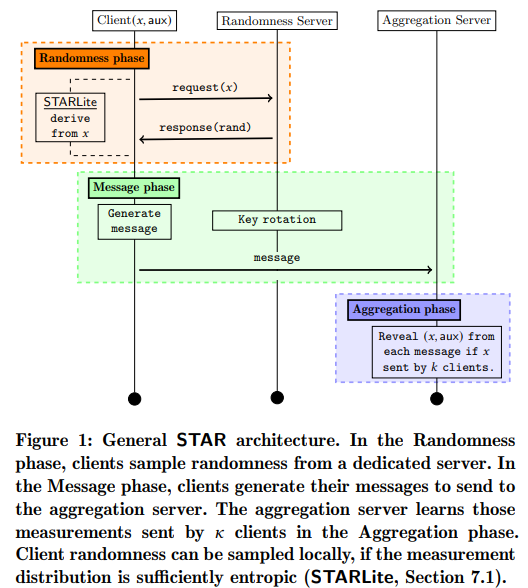
<!-- 飞书原始链接: https://internal-api-drive-stream.feishu.cn/space/api/box/stream/download/authcode/?code=ZDJjYzAyODRkZjViMGFlMTI0MWVmMjFmOTRiOWIwOWNfYWI0YmEwMmRhZWYyNjRmZTBjZWRmMzJiOTNhYmI5MzlfSUQ6NzIxMjQ5NDczNjkzMzE1ODkxNl8xNzg1NDYxODc5OjE3ODU0NjU0NzlfVjM -->

Each client derives an encryption key deterministically from any randomness in the client's measurement and additional randomness provided by a "randomness server", constructs a ciphertext, and then sends the ciphertext, a share of the random key for $\kappa$-out-of-$N$, and a deterministic tag to an aggregation server for strong privacy guarantees. To provide this service, the randomness server runs an Oblivious Pseudorandom Function (OPRF) service that allows clients to receive pseudorandom function evaluations on their measurement and the server's OPRF key, without revealing any information about their measurement, and uses the output as randomness to generate the message sent to the aggregation server. Additionally, the paper introduces an alternative form of STAR called "STARLite", which samples randomness only from the measurement itself, further simplifying and reducing the costs of private data collection.

### Trust assumptions.

The STAR protocol is a multi-server approach for data aggregation, but it is weaker than previous cryptographic approaches because it relies on an untrusted server. However, it provides additional security guarantees by hiding client measurements until a certain level of anonymity is achieved. This is done with minimal performance overhead.

### Simple cryptography.

STAR uses simple, well-established cryptographic tools, that have been used extensively by non-experts for many years.

### Performance.

STAR is orders of magnitude cheaper to run than previous systems.

### Standardization.

STAR is compatible with the IETF’s proposed framework for devising new privacy-preserving measurement systems.

## 1.2 Formal contributions

- The design, systematization, and formalization of the STAR system, and associated privacy goals.
- An open-source Rust implementation of STAR, already
- Empirical evaluation of the STAR protocol that showcases performance and simplicity far superior to previous constructions, while ensuring comparable privacy guarantees.
- Specific guidance for navigating trade-offs between additional privacy, and simpler deployment scenarios.

# 2 OVERVIEW OF DESIGN GOALS

> In this section, we clarify the problem statement that we are tackling, along with subsequently a set of design goals and non-goals that we consider.

## 2.1 Problem statement

- **Primary goal**: build a system that allows clients to submit measurements as encoded messages to an untrusted aggregation server which be able to decode and reveal only those measurements that are sent by $\geq \kappa$ clients
- **Auxiliary data**: Clients send auxiliary data with their measurements, which is revealed only if the measurement satisfies the threshold aggregation policy.

## 2.2 Design goals

Theie goal is to create a practical and widely adopted protocol suitable for various projects and organizations. They aim to address the limitations of existing state-of-the-art solutions by considering points and constraints such as **client privacy, correctness guarantees, low financial costs**(*Ideally, we would like aggregation of 1 million client measurements to incur a cost of less than 1 dollar*)**, achievable trust requirements, avoiding trusted hardware and limiting cryptographic complexity**.

## 2.3 Non-goals

**Prevention of Sybil attacks** and **Leakage-free cryptographic design**.

# 3 THE STAR PROTOCOL FRAMEWORK

## 3.1 Notation

- Participants and protocol parameters:

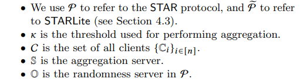
<!-- 飞书原始链接: https://internal-api-drive-stream.feishu.cn/space/api/box/stream/download/authcode/?code=ZmI0N2I1MzljOTA1OTU1NGRjOGM2YTY2NmQyZmZjMzhfMzg1MTNhOWZjMWU4ZjMwY2E2OWI1OTQ4ZmMzOGMxNDVfSUQ6NzIxMjQ5NDgzOTU3MzYxMDUwMF8xNzg1NDYxODc5OjE3ODU0NjU0NzlfVjM -->

- General notation:

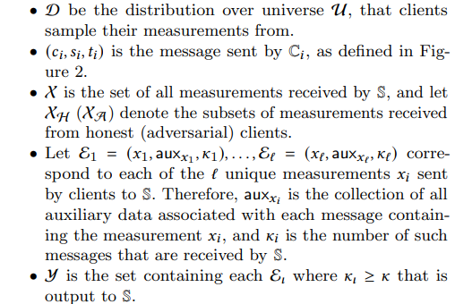
<!-- 飞书原始链接: https://internal-api-drive-stream.feishu.cn/space/api/box/stream/download/authcode/?code=YjQwNTQyZmNjZDZkZmQ2OWJjNGFhZWVkNDFkMzkyYzlfOGZiNTEyNGRkNzQ5ZDdjMGJkYWNhMWQ1OTFmYjU2MzRfSUQ6NzIxMjQ5NDg3NzQ1NTEyMjQzNl8xNzg1NDYxODc5OjE3ODU0NjU0NzlfVjM -->

- Cryptographic tools:

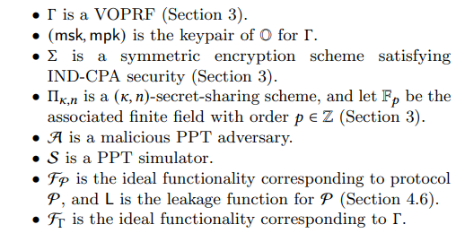
<!-- 飞书原始链接: https://internal-api-drive-stream.feishu.cn/space/api/box/stream/download/authcode/?code=M2ZiNzBiOTM3NDc3MTEwN2IzNmE4MDk5OTNmZjJlZmRfYmU5OTQ2ZjBkMDdkNWE5ZTg0MzlhYWY3ODMxOTcxMzRfSUQ6NzIxMjQ5NDk3NTA1NjE2NjkxNF8xNzg1NDYxODc5OjE3ODU0NjU0NzlfVjM -->

## 3.2 Design space

- A large universe of elements *M* representing potential measurements that clients send to a single, untrusted aggregation server.
- Clients may *optionally* send arbitrary additional data with their measurement.
- A single encoded measurement is sent during an *epoch* by each available client. The aggregation server should be able to reveal all those encoded measurements that are received at least $\kappa$ times. The threshold $\kappa \geq 1$ is agreed publicly from the outset.

## 3.3 STAR protocol

- Randomness phase

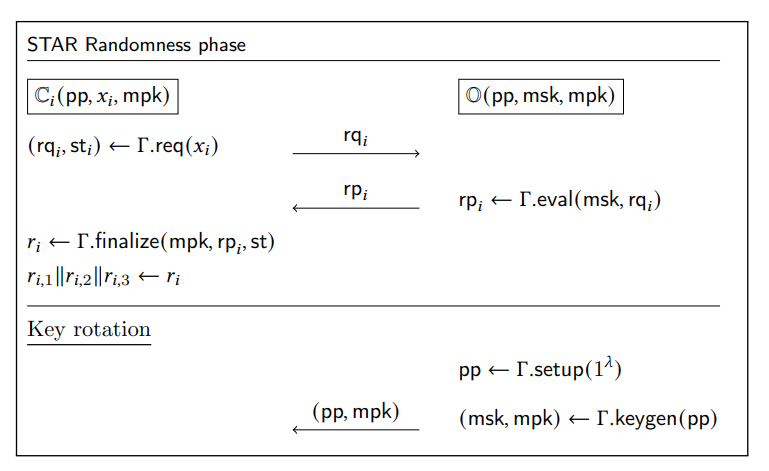
<!-- 飞书原始链接: https://internal-api-drive-stream.feishu.cn/space/api/box/stream/download/authcode/?code=MDYwNGY5MjBlZWYyNTVmZWQ1NzRhMmQwYTNlMDY0MzhfMmE4N2JjYmVmMzdhNWUxNGVmYWU2MTI4OTgzMmM1MTZfSUQ6NzIxMjQ5NTA0ODc4ODA5OTA3M18xNzg1NDYxODc5OjE3ODU0NjU0NzlfVjM -->

each client interacts with the randomness server, $\mathbb{O}$, to learn correlated randomness for their measurement $𝑥_𝑖$. Essentially, the client operates as the client in the VOPRF protocol with input $𝑥_𝑖$ and the randomness server answers the query and returns the result to the client. Note that the client must also possess the public parameters, **pp**, and the public key, **mpk**, that $\mathbb{O}$ produces. The client, after processing the VOPRF output to receive $r_𝑖∈\{0,1\}^{3w}$ for some $\omega > 0 \in \mathbb{Z}$, now has the result $(𝑥_𝑖, 𝑟_𝑖)$. Any client that shares the measurement $𝑥_𝑖$ will also receive the same output $𝑟_𝑖$.

- Message phase

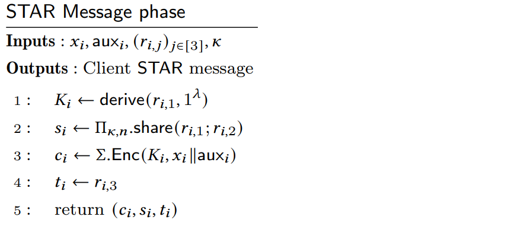
<!-- 飞书原始链接: https://internal-api-drive-stream.feishu.cn/space/api/box/stream/download/authcode/?code=NWQyYmJiZmU5OGM0MTlmOGEyMzIzMGU1NTgyZGI2NDVfYmU1MjJmM2M1YjY5NTRjNGJlYjAxMTY1ZTU3ZDUxYWFfSUQ6NzIxMjQ5NTE0OTUxODk0NjMzMl8xNzg1NDYxODc5OjE3ODU0NjU0NzlfVjM -->

- Aggregation phase

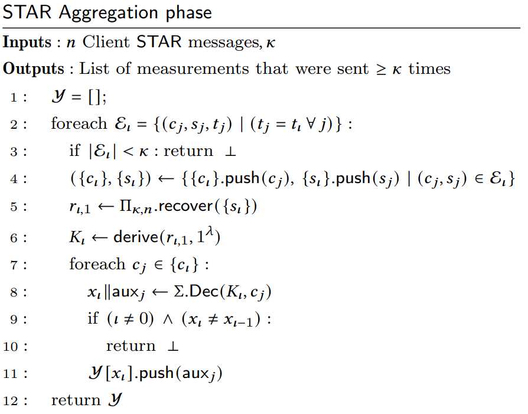
<!-- 飞书原始链接: https://internal-api-drive-stream.feishu.cn/space/api/box/stream/download/authcode/?code=NzE2NmI2OGZkNGJlNWY5OWY2ZTVlNTAxYTdlNjE4N2ZfNjBmNzM0NDBlOTRmZGFlZGQxZDQyYzFjNDZjYmZlNzlfSUQ6NzIxMjQ5NTE5NzI5MTQxMzUwNV8xNzg1NDYxODc5OjE3ODU0NjU0NzlfVjM -->

## 3.4 Security Considerations

- Communication between servers: the randomness and aggregation servers only communicate with the clients in the system, and only one performs the eventual aggregation
- Leakage: the leakage in the STAR protocol amounts to the aggregation server learning which clients share the same measurement ---- regardless of whether the measurement is kept hidden or not
- Randomness server key rotations: randomness server in STAR protects against attacks on client inputs, but it does not guarantee security for low-entropy inputs
- Predictable input distributions: practical use-cases of STAR require that client messages remain somewhat unpredictable during the randomness phase of the protocol.
- Additional data: Before the protocol begins, S should inform clients of the maximum length of the additional data that should be sent.
- Hardening against local attacks in STAR: all hash function invocations in STAR can be replaced with functions that are deliberately slower primitives

## 3.5 Formal Security Model

> the security model for establishing the security of STAR

- Ideal functionality

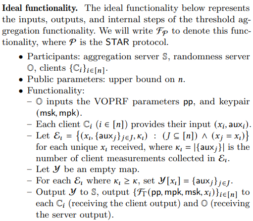
<!-- 飞书原始链接: https://internal-api-drive-stream.feishu.cn/space/api/box/stream/download/authcode/?code=ODFlY2M5Y2EzN2U3ODc5MmY2NzAzNjRmYmE4ODVmMmZfZTcxZTYxYmU3OTE5MTQzMGYzNTgxMTI0NzE4NDdmMTVfSUQ6NzIxMjQ5NTMxNDQ4MDI1MDg4M18xNzg1NDYxODc5OjE3ODU0NjU0NzlfVjM -->

- Leakage function

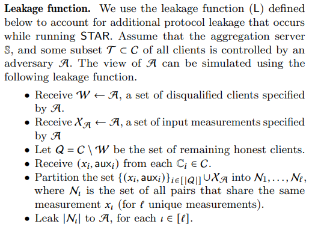
<!-- 飞书原始链接: https://internal-api-drive-stream.feishu.cn/space/api/box/stream/download/authcode/?code=ZDU4YmFiYjNhNGExNzM4ZjIwODY2NjIwYjljNzNlODlfNmMzYTU1ZjllZjIyMDA4Y2E5YTI4YjQ5ZjZmZDQ1OTZfSUQ6NzIxMjQ5NTM0OTg1NTY0OTc5Nl8xNzg1NDYxODc5OjE3ODU0NjU0NzlfVjM -->

# 4 FUNCTIONALITY AND LEAKAGE COMPARISON

> We compare STAR with prior constructions of private threshold aggregation schemes, specifically with respect to functionality and leakage profiles.

## 4.1 Ideal functionality

A coarse-grained comparison of the functionality provided in STAR with previous approaches:

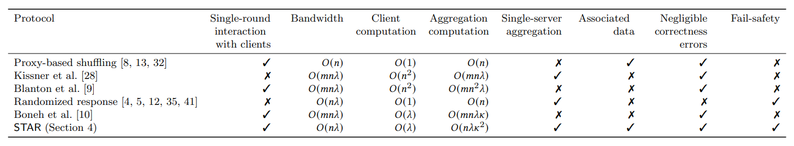
<!-- 飞书原始链接: https://internal-api-drive-stream.feishu.cn/space/api/box/stream/download/authcode/?code=NTM0ZWUzY2EzOTJkMTM4MDlhYTNhMGQwYjFmNjkyYWVfOWNiYjY3YjhkNTE1MGMyMDUzNzJkMjU5NjhkZGI3YjZfSUQ6NzIxMjQ5NzA1OTQ0OTI5MDc1M18xNzg1NDYxODc5OjE3ODU0NjU0NzlfVjM -->

## 4.2 Leakage

- Recent approaches for efficiently learning $\kappa$-heavy-hitters incorporate some amount of leakage: each scheme leaks all the $\kappa$-heavy-hitting prefixes of the eventual $\kappa$-heavy-hitter measurements.
- While STAR avoids prefix-based leakage, it leaks the subsets of clients that share equivalent measurements: the server can separate client messages into groups that all share the same measurement.
- Such leakage can be eliminated using anonymizing proxies for submitting client messages.

# 5 PERFORMANCE EVALUATION

- implementation: Rust
- benchmark: All benchmarks are run using an AWS EC2 **c4.8xlarge** instance with 36 vCPUs (3.0 GHz Intel Scalable Processor) and 60 GiB of memory.

## 5.1 Communication Costs

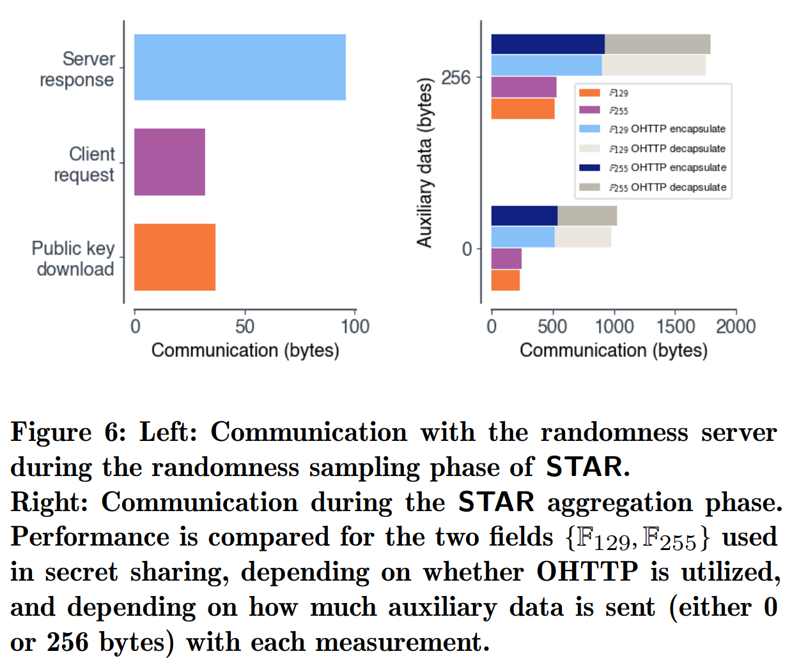
<!-- 飞书原始链接: https://internal-api-drive-stream.feishu.cn/space/api/box/stream/download/authcode/?code=OGZiNGQ2ZDRlOTM2NzlkMGIzNmJmNTkxYTdjNmVmNGZfZjU5MGMxZjZhYTc2YjA4ZDk0Yzg1MjdmMTJiMTMxMGFfSUQ6NzIxMjQ5NzEwMTA2NTg5NTk2NF8xNzg1NDYxODc5OjE3ODU0NjU0NzlfVjM -->

## 5.2 Computational Costs

- Client message construction

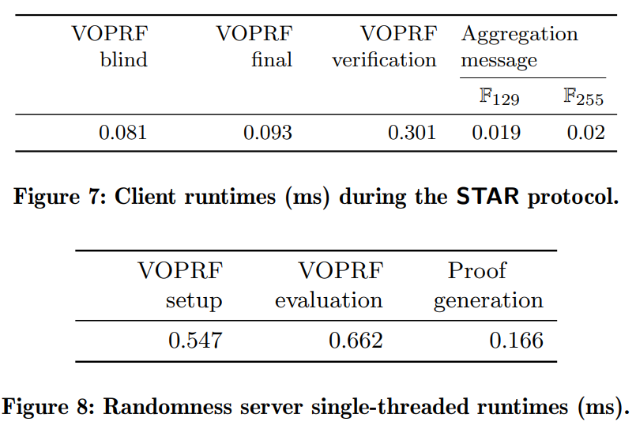
<!-- 飞书原始链接: https://internal-api-drive-stream.feishu.cn/space/api/box/stream/download/authcode/?code=MTVjMjBjNjU2YjhhZjFjMTgzM2ZhM2E5ZTI2Njg5NzhfN2Q2ZjliOGE5NzZkZDliNWU4NjBkYWZmMDlhOTk4OTFfSUQ6NzIxMjQ5NzE0MjkwNzUzNTM2Ml8xNzg1NDYxODc5OjE3ODU0NjU0NzlfVjM -->

- Aggregation server

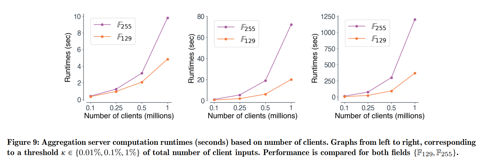
<!-- 飞书原始链接: https://internal-api-drive-stream.feishu.cn/space/api/box/stream/download/authcode/?code=MTdkNjViMDk3MzJjODEyYmMwY2IzM2Q2ZTVhMmY1ZGNfMDhkMWVhNTg0ZjdjMTRjMDk0YmRhYzg3OGU5NTI5NzNfSUQ6NzIxMjQ5NzE3NTYzOTgwMTg4NF8xNzg1NDYxODc5OjE3ODU0NjU0NzlfVjM -->

- Oblivious HTTP proxy

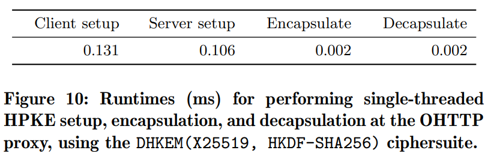
<!-- 飞书原始链接: https://internal-api-drive-stream.feishu.cn/space/api/box/stream/download/authcode/?code=ZGYzNTkyMzk1YmY4YmM5MjZjZTJkM2I0ZmQ5MTM3N2FfNjc3MWYwNmU5MTU0ZDY0MTcwYTJlODYxNGJkMTkxMTdfSUQ6NzIxMjQ5NzIyNTQ5MzEzNTM2MV8xNzg1NDYxODc5OjE3ODU0NjU0NzlfVjM -->

## 5.3 Comparison With Prior Approaches

> We compare STAR directly with the performance results of the work of Boneh et al. [10]

### Communication

- Overall communication in STAR (using $\mathbb{F}_{129}$) is 62.4× smaller than in [10].
- Using $\mathbb{F}_{255}$ instead, per-client communication in STAR only increases by 20 bytes.

### Runtimes

- Server-side aggregation phase is 1773× faster in the STAR protocol.
- Clients messages take ${0}.628\,\mathrm{ms}$ to construct

### Financial costs

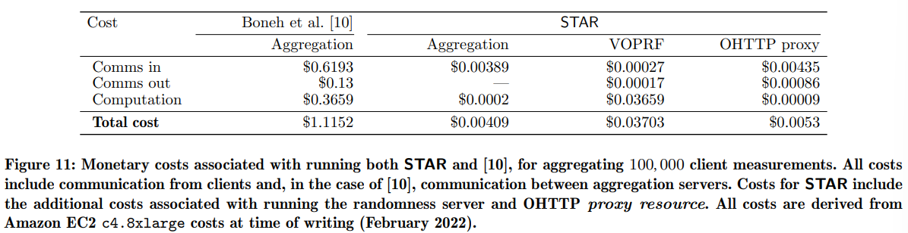
<!-- 飞书原始链接: https://internal-api-drive-stream.feishu.cn/space/api/box/stream/download/authcode/?code=ZjhhMDQ5NTI4MGRiMzNmMjFiMDllMmYxZTIwYmQyMzdfZmRiNDE0Y2RjNmQ4OTFkNWYzZmMxMjA3ZDVlZGM3OTBfSUQ6NzIxMjQ5NzI5MTEwODg1OTkzMl8xNzg1NDYxODc5OjE3ODU0NjU0NzlfVjM -->

# 7 Limitations

- Identity leakage can only be eliminated using application-layer solutions that anonymize client messages to the aggregation server.
- STAR can not provide security for small message spaces, since this would allow a malicious aggregation server to enumerate all possible client inputs before it has received them, via interaction with the randomness server.

# 9 CONCLUSION

In this work we build STAR: a simple, practical mechanism for threshold aggregation of client measurements. We intend STAR to enable privacy-protecting, user-respecting data collection practices when it is also magnitude cheaper, easier to understand, and easier to implement (in terms of code and trust requirements) than existing systems.
