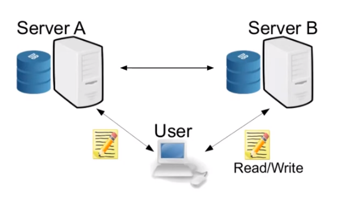

# [ECZ21, Usenix]Express: Lowering the Cost of Metadata-hiding Communication with Cryptographic Privacy

# Introduction

Express是一个显著降低通信和计算成本的元数据隐藏通信系统。它通过双服务器的架构，提供针对任意数量恶意客户端和一个恶意服务器的密码学安全性。在通信方面，Express每发送一条消息只产生一个常数倍的开销；在计算方面，Express只使用对称密钥密码学算法。

# The Problem

Express这篇文章延续了riposte的动机， 依旧想解决在一个端到端加密举报的背景下，元数据的安全问题。

## 现有方案的缺陷：对客户端的高要求

Drawback: heavy requirements placed on clients

- Requirement to run in synchronized rounds
- High communication costs

## 基本要求：cover traffic的成本问题

- cover traffic：非举报客户端发送的空消息，用来掩盖真实举报者的流量  
cover traffic的开销对于客户端要尽可能低，才能方便实现其功能

# What is Express

**Express: Practical Metadata-Hiding Whistleblowing**

## Improvements

### 定性改进

用户无需同步访问系统

### 渐进改进

- 客户端计算开销： $O(1)$
- 通信开销： $O(1)$
- 现有方案(Riposte)： $O(\sqrt{N})$

### 实际改进

- 6x faster server
- 8x faster client

> - 10x communication reduction

- 6x reduction in dollar cost to run

## Overview

- 通过双服务器的架构，secure against:

  - 任意数量恶意客户端
  - 一个恶意服务器
- 支持操作(单向通信setting)：

  - 接受者注册邮箱
  - 发送者私密写入邮箱
  - 接受者读取邮箱内容

<!-- 飞书原始链接: https://internal-api-drive-stream.feishu.cn/space/api/box/stream/download/authcode/?code=NjQxNjQ4ZDE1YjE5MTk4YzVhYzc2NTNkNDA1MDdhY2RfNzUxYjgyYWM0YzU4NzAyNDY2YWYwZDgwY2Y2MmQ0M2NfSUQ6NzI2MjE1ODUyNzI3OTc5MjEzMl8xNzg1NDYxOTA3OjE3ODU0NjU1MzBfVjM -->

- Security：当有人向express写入内容，没有人知道收件人是谁

# How does Express work

## Tool: Private Writing

见riposte

## Full Express Protocol

### Sending a message

- 客户端首先生成点函数 $f_{v,m}$ 的 DPF 分片 $f_A$ 和 $f_B$，并将 $f_A$ 发送给 A，将 $f_B$ 发送给 B。
- 然后服务器 A 和 B 计算 $k_A \gets (f_A(V_1), \ldots, f_A(V_n))$ 和 $k_B \gets (f_B(V_1), \ldots, f_B(V_n))$。使用共享的随机性生成一个用于在审核协议中使用的种子 $r$，将其发送给客户端，并准备用于 SNIP 的服务器输入。
- 接着客户端准备用于 SNIP 的客户端输入，并生成相应的证明 $\pi = (\pi_A, \pi_B)$。它将 $\pi_A$ 发送给服务器 A，将 $\pi_B$ 发送给服务器 B。
- 由服务器验证 SNIP 证明 $\pi$，如果验证失败则中止。
- 否则服务器 A 和服务器 B 使用 $K_{A,i}$ 解密 $D_{A,i}$，使用 $K_{B,i}$ 解密 $D_{B,i}$。然后在重新加密 $D_{A,i}$ 和 $D_{B,i}$ 的新值之前，将两个分量 $w_A$ 和 $w_B$ 加到数据库里原本对应的位置。最后使用新的 nonce 重新加密。

### Checking a mailbox

- 邮箱所有者首先向服务器 A 和服务器 B 发送 $(p, v)$ 以请求从物理地址 $p$ 的邮箱中读取消息。
- 然后服务器 A 和服务器 B 检查虚拟地址 $v$ 是否对应于物理地址 $p$，发送 $D_{A,p}$ 和 $D_{B,p}$ 以及用于加密每个值的 nonce。发出之后清空邮箱，也就是他们将 $D_{A,p}$ 和 $D_{B,p}$ 的值设置为使用 $K_{A,p}$ 和 $K_{B,p}$ 新加密的 ${0}$。由于只有邮箱所有者和写入邮箱的人知道 $p$ 和 $v$，并且 $v$ 的虚拟地址空间非常大，客户端无法读取或删除彼此邮箱的内容。
- 邮箱所有者使用密钥 $k_A$ 和 $k_B$ 解密收到的 $D_{A,p}$ 和 $D_{B,p}$ 的值，以获取消息 $m_{A,p}$ 和 $m_{B,p}$。输出聚合消息 $m \gets m_{A,p} + m_{B,p}$。

# Conclusion

Express作为一个隐藏元数据的通信系统，相比于riposte，通过对称密钥密码学原语优化了同步轮，然后提供了一个具有更优的通信成本的审计方案
