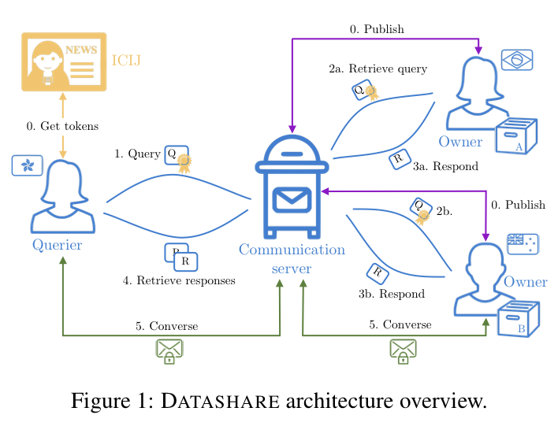
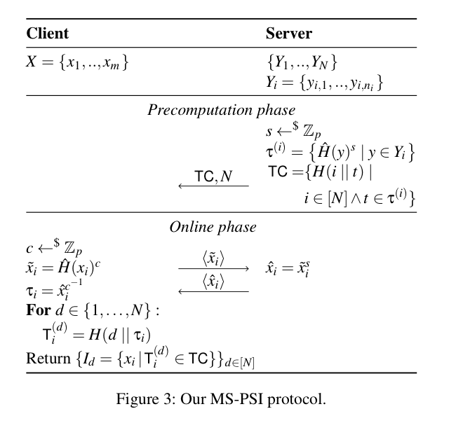
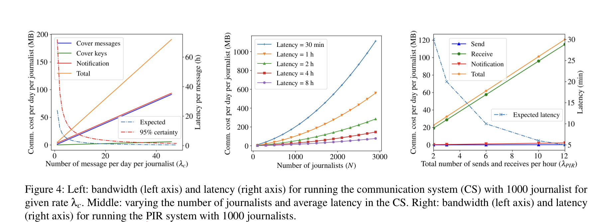
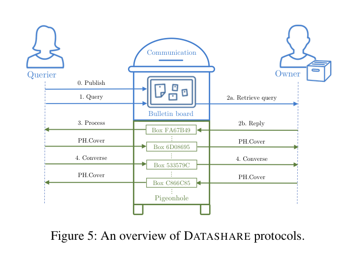
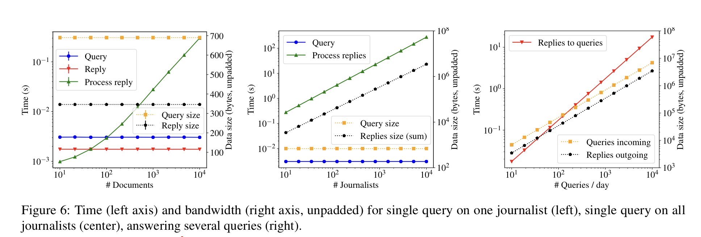
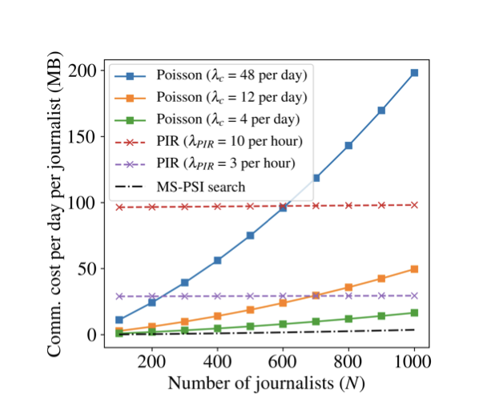

# [ELM+20, Security] DATASHARENETWORK: A Decentralized Privacy-Preserving Search Engine for Investigative Journalists

**Summary: 提出了一个面向调查记者的去中心化，安全的平台用来：1. 文件搜索，2. 简短交流**

## Motivation

调查记者在调查敏感话题时会收集很多机密文件，保存和分享这些文件可能威胁记者的安全。记者希望可以安全的搜索别人的文件并且最小化风险。

## Requirements

- 避免将文件存储到中央服务器：记者不愿意上传文件
- 避免依赖高性能计算机：一些记者的设备性能不高
- 异步交流：记者所在时区不同
- 分享文件之前应该征求所有者同意：简短的交流

## Sketch

1. 记者从Token Issuer中获取Token用于验证
2. 所有记者用自己的所有文件计算出Privacy-preserving representations并且广播出去
3. 查询者广播自己的查询
4. 文件所有者提取查询然后计算出恢复
5. 查询者提取出回复并计算match (所有者是否有文件包含所有查询关键字)
6. 查询者和match文件所有者进行交流请求分享文件 (该系统不包含文件分享的过程)

<!-- 飞书原始链接: https://internal-api-drive-stream.feishu.cn/space/api/box/stream/download/authcode/?code=MTFkZjM4OTMxYTNjZWRlMzM3NGUxZWFjODc2MTU5YmRfZTQzYzk0NDk5NTY2YjM4NzFkNTc0ZTQ3NTYwNjA3YzdfSUQ6NzIyMjkxOTY3Mjg2MDM5MzQ3NF8xNzg1NDYxOTA2OjE3ODU0NjU1MDZfVjM -->

## Security Goal

Against malicious third-party adversaries: hackers, governments, big corporations... They trust other journalists and ICIJ.

## Multi-set PSI

这个Multi-set PSI和最简单的DH-based PSI比较相似，做出的改进有：

- 增加了Precomputation Phase，避免每次PSI都要重复计算TC
- TC计算增加了i，避免不同的集合计算出相同的结果：MS-PSI要求计算出$X$和$\{Y_1,Y_2,…,Y_N\}$的交集，如果不加入i的话，就会泄露$|Y_i\cap Y_j|$

<!-- 飞书原始链接: https://internal-api-drive-stream.feishu.cn/space/api/box/stream/download/authcode/?code=MThhYWIzMWQxN2VjZWFiZDllMWUzMWRhMGYxMTE3YmFfOTJlNzdkMDU2NjQyZDcyZTg5YWYxMjFmMzdkYWQxOWVfSUQ6NzIyMjkyMDY0MzUyNDQ2MDU0NV8xNzg1NDYxOTA2OjE3ODU0NjU1MDZfVjM -->

## Privacy-Preserving Messaging

这部分有两个组件

### Bulletin Board

用于广播信息，主要是广播出自己文件的关键字 (PSI precomputation的结果)。有两个操作，BB.broadcast(m)用于广播信息，BB.read()用于读取信息。

### Pigeonhole

这里有很多mailboxes，记者利用这些mailboxes来发送和接收消息。发送者和接收者计算出相同的mailbox地址，如果发送者消息队列中有需要发送的消息，那么间隔特定时间把这个消息放入对应的mailbox中，否则放入dummy消息 (cover message)。

### Security

消息发送的在网络层的安全性由Tor保证 (一种洋葱路由)，在应用层上的安全性由cover messages保证，攻击者无法区分cover message和real message，所以攻击者无法得知何时发送了信息。

### Improvement

由于每个记者都要以一定的频率向其他所有记者发送cover message，开销是不小的，有一个改进的方法是以固定频率向随机的mailboxes发送cover message (独立于记者数量)，然后以相同频率用PIR提取消息。

### Evaluation

<!-- 飞书原始链接: https://internal-api-drive-stream.feishu.cn/space/api/box/stream/download/authcode/?code=YjJiMzBhYmY4MmZiZDhhYWYxM2VlODcyYWFmMWFjZmRfODFlNDYyZTYwNTVhNjgzOTc5MTFlNDYzZDk4ZDA3ZjdfSUQ6NzIyMjkzNzUwNDQ3NDEzNjYwNF8xNzg1NDYxOTA2OjE3ODU0NjU1MDZfVjM -->

## The DATASHARE System

系统的整体实现就是把上面的PSI和Messaging组合起来，而不是作为独立的组件。另外，系统中还加入了一个认证的过程，利用盲签名获取一次性token，token和query一起发布，token有效query才有效，每个时隙中Token Issuer限量提供token。

<!-- 飞书原始链接: https://internal-api-drive-stream.feishu.cn/space/api/box/stream/download/authcode/?code=N2Y0NmQ3MTkzODNmOGRjZmEyMjY5MjUxYzhlMWQ4MDBfMmE3OTlmZWNhYzlmZGQxNGNhZGVmYTZkMjJkMmFhYjZfSUQ6NzIyMjk0MDc3NTg0NzI5NzAyN18xNzg1NDYxOTA2OjE3ODU0NjU1MDZfVjM -->

具体的实现在文章中。

这个系统的安全性由PSI和Private-Preserving Massaging保证，除此之外，这个系统对一些攻击是脆弱的：

- 如果攻击者可以知道用户是否在线，那么攻击者可以获取额外的信息：这段时间匿名发送信息的参与方肯定是在线用户
- 攻击者可以通过语言习惯来确定聊天中对方的身份
- 攻击者可以通过文件的部分关键字来确定文件所有者：包含特定关键字的文件由特定的人持有

这些攻击对于所有聊天和搜索系统都成立。

## Evaluation

<!-- 飞书原始链接: https://internal-api-drive-stream.feishu.cn/space/api/box/stream/download/authcode/?code=MjU0OWIyMGU5OTNlZmY4MjRmOGFlNmUxOWY0MzliNzNfZDUwNDcxY2RlM2M3MDBlZWJhYjU1NDM0OTBjMTFhZmZfSUQ6NzIyMjk0NDAwMzg1MTczMDk3Ml8xNzg1NDYxOTA2OjE3ODU0NjU1MDZfVjM -->

<!-- 飞书原始链接: https://internal-api-drive-stream.feishu.cn/space/api/box/stream/download/authcode/?code=OTdmMjEwZDU2NGIzNTQ5ZTMyZWE4ZTU1ZTMwZDUzYmZfYmM4NTk5OGQ5M2FhNjg0NmVhOTlhNjQ2YjUxN2M4ZWNfSUQ6NzIyMjk0NDI2Njk2Mjg0NTY5N18xNzg1NDYxOTA2OjE3ODU0NjU1MDZfVjM -->

对于单个记者来说，如果记者有1000个文件，一次PSI大概需要1KB，27ms的开销；对于1000个有1000个文件的记者，一次PSI需要1MB，27s，基本是线性增长；使用PIR之后，开销相对于记者数量是固定的，在记者数量比较大的时候PIR更高效，并且可以看到，发送cover message占了绝大部分开销，PSI只占了很小的一部分。

## Conclusion

这篇文章针对调查记者构造一个可以文件搜索和简短交流的平台。在实现的时候，由于要隐藏何时发送了信息，每个记者以固定频率向多个mailboxes发送cover message，在开销分析中，cover message占了绝大部份开销。能否再改进这部分，比如随机选一部分记者发送cover message。