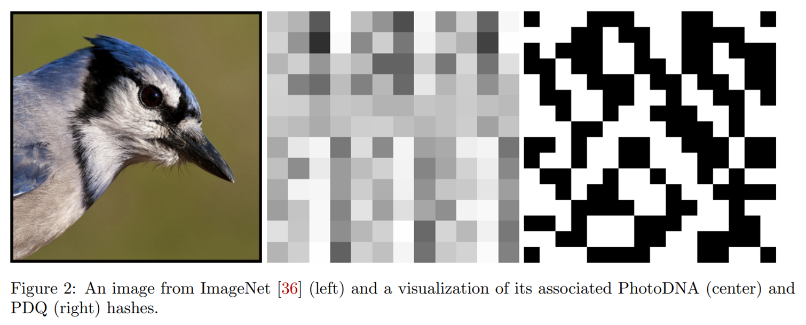
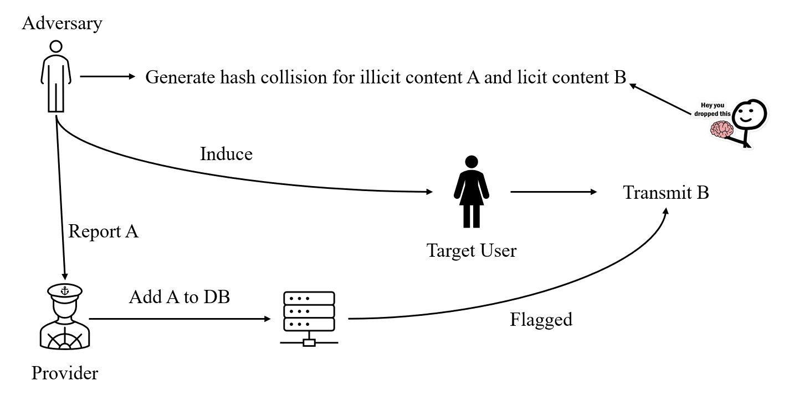
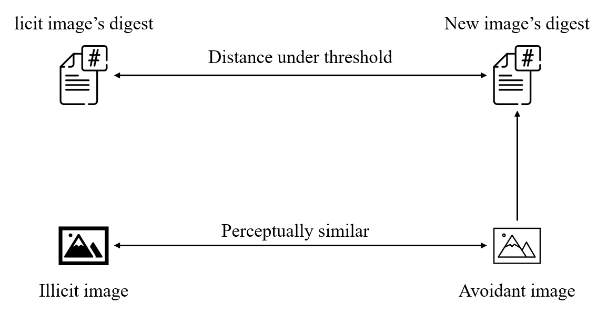
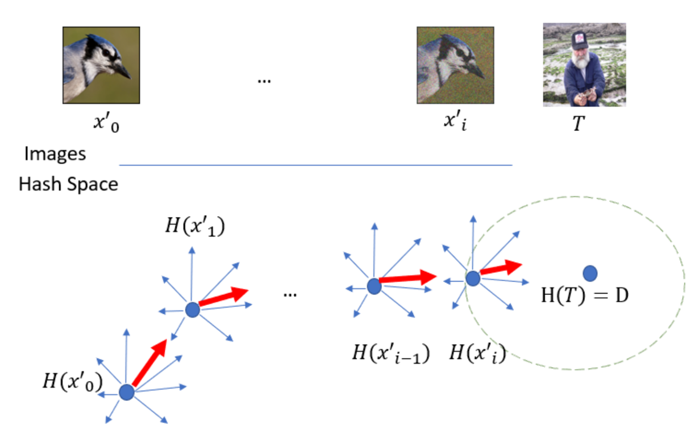
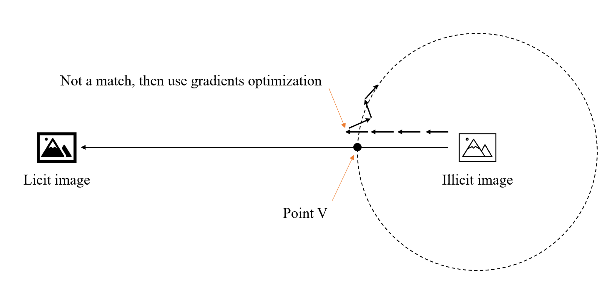
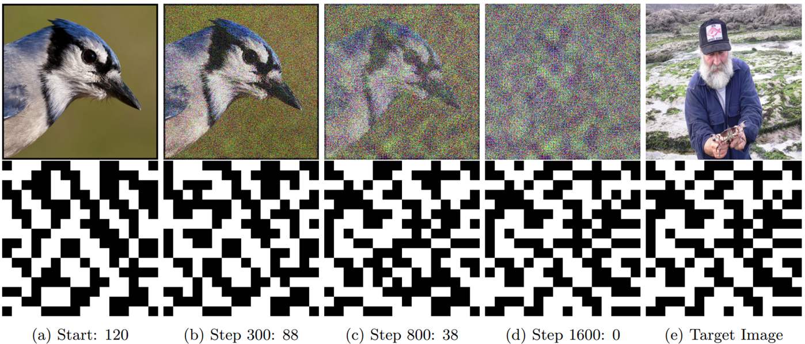
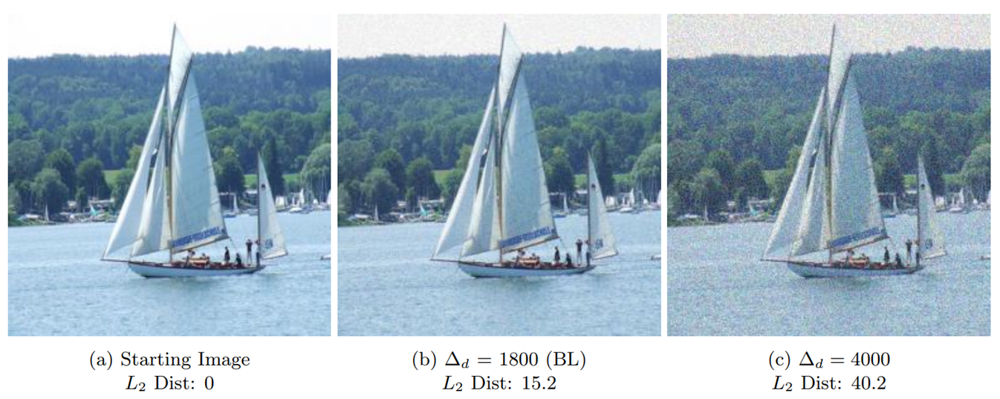
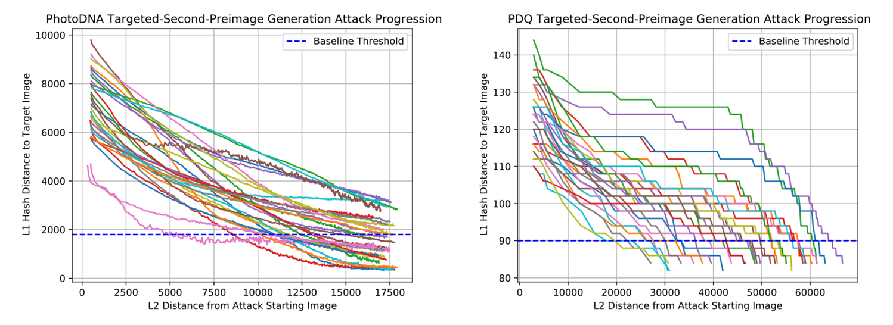

# [FPG+23, Security]  Squint Hard Enough:  Attacking Perceptual Hashing with Adversarial Machine Learning

**Summary:** Generate collision and avoidant images for PhotoDNA and Facebook PDQ

## 介绍

这篇文章指出，PHFs在设计的时候没有考虑密码学的安全性。并且在E2EE中，PHFs的安全性很重要，这篇文章将针对PHF的攻击进行了分类，并且针对PhotoDNA和PDQ实现了两种攻击，能够生成碰撞图片和规避检测的图片。PhotoDNA和PDQ都是基于CNN的，它们的哈希值分别是144个数和256比特。

<!-- 飞书原始链接: https://internal-api-drive-stream.feishu.cn/space/api/box/stream/download/authcode/?code=NjYzNTBkOGMyYmRlZWRiOGFjMGYxODM1MzFmOWI2NWJfYjEwOGMwOTM4ODNkNmNjZTQyMDA4NTQ2Y2NhYzU3NjhfSUQ6NzIzODU4OTIxMDAwMzk2MzkzMl8xNzg1NDYxOTEwOjE3ODU0NjU1MTBfVjM -->

## 攻击的种类

第一种是监视用户发送内容，假如攻击者可以得知用户发送的图片是否被PHF标记，那么攻击者可以生成看起来无害但哈希值和非法图片相似的图片，然后诱导用户去发送这个图片，那么用户发送的消息就可以被监控；

<!-- 飞书原始链接: https://internal-api-drive-stream.feishu.cn/space/api/box/stream/download/authcode/?code=ZWFjZDUxMGRmMTNiZGRiMzQyYmRkMzRlZDk3MjY2MzFfNzFjYmM0OGEwMWM4ZmI1ZDRkZWM3NjhjYzMxZjgyYzBfSUQ6NzIzODU4NzM0NDA1ODgxMDM3MV8xNzg1NDYxOTEwOjE3ODU0NjU1MTBfVjM -->

第二种是躲避检测，攻击者生成一个看起来非法但是哈希值合法的图片，发送这种图片的时候服务器不会检测到。

<!-- 飞书原始链接: https://internal-api-drive-stream.feishu.cn/space/api/box/stream/download/authcode/?code=OTQzNDE0NjY3Nzk1YjIzMmRhNzBiNzY1NjY5OWMzYWVfNDhmMGRmOGNjOWY3MzBiNzc3NmM2NmQ5ODY1ZTRlOTJfSUQ6NzIzODU4NzY5NjcxMTYxNDQ2OF8xNzg1NDYxOTEwOjE3ODU0NjU1MTBfVjM -->

最后两种是preimage attack，也就是攻击者获取到了用户发送的哈希值然后恢复出preimage或者攻击者获取到了数据库然后恢复出preimage，这两种攻击在文章中没有实现。

##  Targeted-Second-Preimage Attack

这是一种基于梯度优化的方法，从起始图片开始利用Monte Carlo方法计算梯度，根据梯度逐步逼近目标图片，直到产生碰撞。

<!-- 飞书原始链接: https://internal-api-drive-stream.feishu.cn/space/api/box/stream/download/authcode/?code=OWUwMmI5ZWVjNDBiOWEwMDc1N2RkMGYyMWM3YjkxZjFfMjM4NjQ3NzEwNjE4ZjgxNDIyZTZjNWEzNGQzNDNmOWZfSUQ6NzIzODU4ODM0MjQyMDY1MjA2MF8xNzg1NDYxOTEwOjE3ODU0NjU1MTBfVjM -->

##  Detection Avoidance Attack

这个也是基于梯度优化的方法，先直接从起始图片的哈希向目标图片的哈希“直线”逼近，到了临界点以后再使用梯度优化的方法找出变化最小的点。

<!-- 飞书原始链接: https://internal-api-drive-stream.feishu.cn/space/api/box/stream/download/authcode/?code=NWJkNmRmNDhiNmJjZDY0NmVhNDhiZmU1NGVlNzY5MjBfYTg1ZTQzNWE2OWY5MTE3MzZlYjhlNDU1ZGIxNzBlYTNfSUQ6NzIzODU4ODQyODMxOTkxNjAzNF8xNzg1NDYxOTEwOjE3ODU0NjU1MTBfVjM -->

## Evaluation

PDQ的效果好于PhotoDNA。规律是想要哈希距离目标更小，就要牺牲图片质量。

<!-- 飞书原始链接: https://internal-api-drive-stream.feishu.cn/space/api/box/stream/download/authcode/?code=YjNjNGNlMDNmMWI4NmQxZjM1NjM2ZTQwYTcxZGY0NGRfYjkxNGFhMzQwNDI1NTI1ZTU5YzE4MTc3NzE0MDUzNmJfSUQ6NzIzODU4OTUyMTcwODk0MTM0MF8xNzg1NDYxOTEwOjE3ODU0NjU1MTBfVjM -->

<!-- 飞书原始链接: https://internal-api-drive-stream.feishu.cn/space/api/box/stream/download/authcode/?code=NTAwOTU1MzdiNGUxZmRiNGJiNTFlZjZhODA4MzBmOGJfMzAzZTZlZjk2YjBlYjE3MjIxZWEwMDc3Y2VmZTVjYzJfSUQ6NzIzODU4OTU1MDk4NTcyMzkzMl8xNzg1NDYxOTEwOjE3ODU0NjU1MTBfVjM -->

<!-- 飞书原始链接: https://internal-api-drive-stream.feishu.cn/space/api/box/stream/download/authcode/?code=ZGE4MDIxOWIzZDU2MTk1Mjc5YmJhN2ViMDQ2YjBmZjJfNDMyYTcxYTE5OWE4NWI5ODczODJlMjNmZDZhNzA3MWZfSUQ6NzIzODU4OTU5Mjk5NDI2NzE2NF8xNzg1NDYxOTEwOjE3ODU0NjU1MTBfVjM -->

## Conclusion

这篇文章主要分析了PHF在E2EE背景下的安全性问题，攻击者可以很容易的生成攻击图片，这会破坏E2EE的安全性。文章中没有提出解决方法，我感觉有两个方向，一个是构造出密码学安全的PHF；另一个是不使用PHF，用其他的工具进行内容检测。