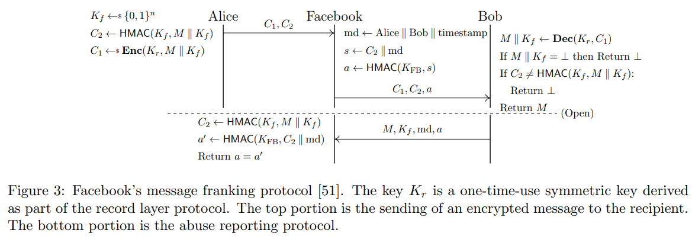
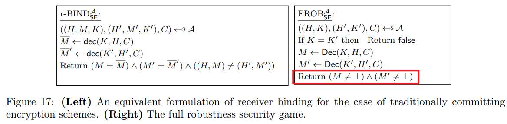
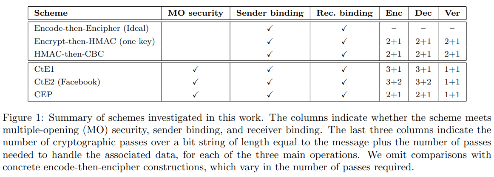
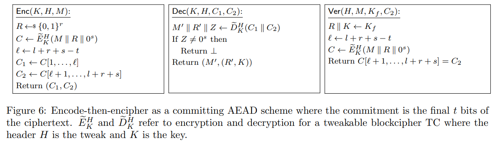
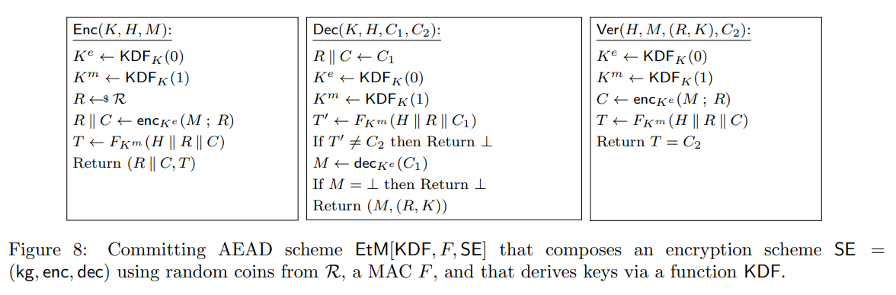
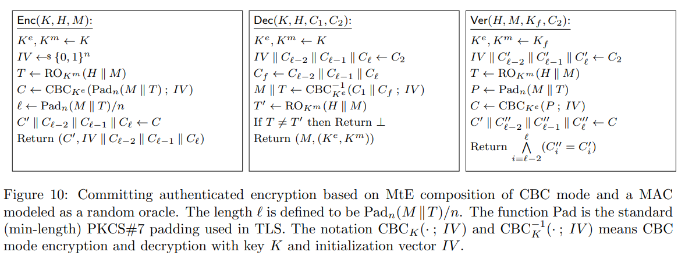
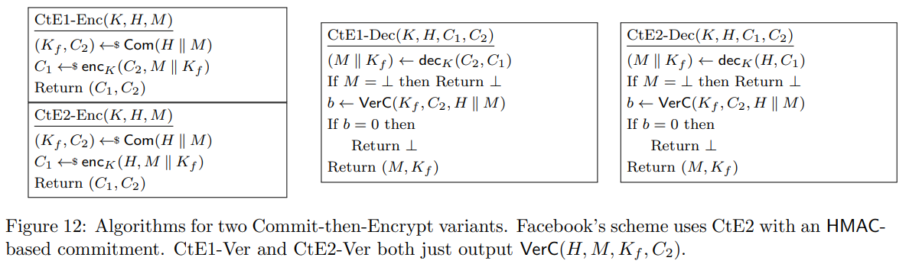
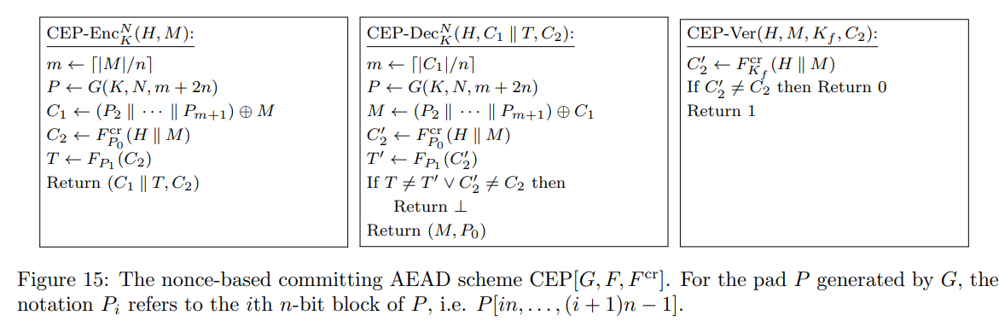

# [GLR17,CRYPTO] Message Franking via Committing Authenticated Encryption

> 源文件：`[GLR17,CRYPTO] Message Franking via Committing Authenticated Encryption.pdf`（PDF 原文保留，本文由 OCR 识别生成，轻微修正拼写）

**SUMMARY**: The authors formalize messaging franking's security goals, discuss existing AEAD schemes, and propose more efficient scheme to implement it.

## 1 Background

In 2017, Facebook proposed message franking that allows users to verifiably report a problematic message and its sender. At a high level, message franking cryptographically binds the sender's identity and the messages they sent in messaging, which enables the recipients to submit report with cryptographic verifiable proof.

（Figure 3: Facebook's message franking protocol。密钥 $K_r$ 是记录层协议派生的一次性对称密钥；上半部分是向接收者发送加密消息，下半部分是滥用举报协议。）

In Figure 3, the use of HMAC avoids the platform storage for ciphertexts.

## 2 Preliminaries

The authors formalize the message franking schemes to a new cryptographic primitive: **compactly committing authenticated encryption with associated data (ccAEAD)**. Before diving into the details of ccAEAD, we introduce the related cryptographic primitives as follows.

### Committing encryption (CE) [GH03, preprint]

As its usage in many schemes, an encryption scheme can be viewed as a commitment to the encrypted message that takes the ciphertext and decryption key as the commitment and opening, respectively.

CE considers the security of an encryption and commitment at the same time. Unlike a conventional encryption, CE involves a verification algorithm in addition to (KG, Enc, Dec). Normally, it takes input of key, ciphertext, and message, verify the commitment via decrypting.

### Tweakable block cipher [LRW02, CRYPTO]

相关链接：What is a tweakable block cipher? - Cryptography Stack Exchange；xilinx.github.io/Vitis_Libraries/security/2020.1/guide_L1/internals/xts.html

Tweakable block cipher (e.g., Threefish) introduces a tweak in addition to the key. Both key and tweak are used to select a particular permutation from the pseudo-permutation family. Moreover, the additional input resolves the problem of related key attack. Furthermore, it is cheap to change a tweak, but expensive to change a key (in a tweakable cipher).

Here, what confuses me is the difference between tweakable block cipher and nonce-based encryption (Here, the former also indicates the mode of encryption such as XTS).

- Intuitively, nonce-based is contained in tweakable, which takes the nonces as tweak.
- However, nonce-based is more simple and maintains the same security level as the tweakable cipher.

Another point that confuses me is why changing key is expensive in AES? From the answers in StackExchange, I guess it is because that some intermediate results can be reused to encrypt different messages, when the key is fixed. Therefore, if the tweak is only related to the message, it will be cheap to change.

### Nonce-based encryption [Rogaway04, FSE]

Instead of using random initial value (IV) to encrypt a message, nonce-based encryption considers the case that IV is a nonce (number used only once). With this assumption, the security of encryption can be significantly clarified and improved.

This idea inspires the design of many cryptographic schemes. For example, $E_k(E_k(N) + i)$ is a nonce-based PRG, where $E$ is a block cipher, $N$ is a nonce, and $i$ is a counter that records the order of blocks.

### Authenticated encryption with associated data (AEAD)

A private-key encryption scheme is an authenticated encryption (AE) scheme if it is CCA-secure and unforgeable. -- IMF 3rd edition

Associated data such as header information usually requires integrity; therefore, it is a waste to directly encrypt it with AE. Hence, some schemes are designed to solve this problem efficiently.

## 3 Design Goals

### Security

- **Confidentiality & Integrity**: These two properties are similar to their definitions in conventional AEAD except the adoption to the opening security.
- **Sender binding**: The sender's message is bound to the message it actually sent, which prevents evading reporting.
- **Receiver binding**: This is similar to binding in conventional commitment. A malicious receiver cannot open the commitment to a message that differs from the actual one, which prevents malicious reporting.
- **Multiple opening (MO) security**: Open a commitment with the encryption key may compromise the security of ciphertexts that encrypted by the same key. Therefore, multiple opening security is required in this case. Note that, in Signal (i.e., the double ratchet algorithm), each key is used only once, and single opening is sufficient.

### Performance

**Compactly committing (cc)**: This means the commitment part of the ciphertext is small, and is linear in the key length instead of the message length. In contrast, conventional CE always takes the entire ciphertext as commitment.

### Discussion

Full robustness implies receiver binding, and the converse is not true. Because full robustness does not restrict the challenge message; it only requires the adversary to find a distinct key that decrypts the ciphertext to a non-empty plaintext.

**接收者绑定的等价形式与完全稳健性游戏（Figure 17）**：

$$\frac{\mathsf{r-BIND}_{\mathsf{SE}}^{\mathcal{A}}}{\{(H,M,K),(H',M',K'),C\} \leftrightarrow \mathcal{A}} \quad\quad \frac{\overline{M} \leftarrow \mathsf{dec}(K,H,C)}{\overline{M}' \leftarrow \mathsf{dec}(K',H',C)} \quad\quad \text{Return } (M = \overline{M}) \land (M' = \overline{M}') \land ((H,M) \neq (H',M'))$$

$$\frac{\mathsf{FROB}_{\mathsf{SE}}^{\mathcal{A}}}{\{(H,K),(H',K'),C\} \leftrightarrow \mathcal{A}} \quad\quad \text{If } K = K' \text{ then Return false} \quad\quad M \leftarrow \mathsf{Dec}(K,H,C) \quad\quad M' \leftarrow \mathsf{Dec}(K',H',C) \quad\quad \text{Return } (M \neq \bot) \land (M' \neq \bot)$$

## 4 Existing Scheme

The authors first consider whether existing AEAD schemes satisfy committing AEAD's security goals, and then propose a new scheme of ccAEAD (i.e., CEP). The below figure summarizes the security and performance of these schemes.

| Scheme | MO security | Sender binding | Rec. binding | Enc | Dec | Ver |
|--------|-------------|----------------|--------------|-----|-----|-----|
| Encode-then-Encipher (Ideal) | | ✓ | ✓ | - | - | - |
| Encrypt-then-HMAC (one key) | | ✓ | ✓ | 2+1 | 2+1 | 2+1 |
| HMAC-then-CBC | | ✓ | ✓ | 2+1 | 2+1 | 2+1 |
| CtE1 | ✓ | ✓ | ✓ | 3+1 | 3+1 | 1+1 |
| CtE2 (Facebook) | ✓ | ✓ | ✓ | 3+2 | 3+2 | 1+1 |
| **CEP** | ✓ | ✓ | ✓ | **2+1** | **2+1** | **1+1** |

（Figure 1: 各方案是否满足 multiple-opening (MO) security、sender binding、receiver binding；后三列是各操作对"消息长度等长的比特串"的密码学遍数（passes），加号后为处理 associated data 所需的额外遍数。）

### Committing Encode-then-Encipher (EtE) [BR00, ASIACRYPT]

```
Enc(K, H, M):                         Dec(K, H, C1, C2):                    Ver(H, M, Kf, C2):
R ←s {0,1}^r                          M' ‖ R' ‖ Z ← D̃_K^H(C1 ‖ C2)         R ‖ K ← Kf
C ← Ẽ_K^H(M ‖ R ‖ 0^s)                If Z ≠ 0^s then Return ⊥             ℓ ← l + r + s − t
ℓ ← l + r + s − t                     Return (M', (R', K))                 C ← Ẽ_K^H(M ‖ R ‖ 0^s)
C1 ← C[1,…,ℓ]                                                            Return C[ℓ+1,…,l+r+s] = C2
C2 ← C[ℓ+1,…,l+r+s]
Return (C1, C2)
```

（Figure 6: Encode-then-encipher 作为 committing AEAD 方案，commitment 是密文的最后 $t$ 比特。$\widetilde{E}_K^H$ / $\widetilde{D}_K^H$ 是 tweakable blockcipher 的加解密，header $H$ 为 tweak。）

### Encrypt-then-MAC (EtM)

```
Enc(K, H, M):                       Dec(K, H, C1, C2):                   Ver(H, M, (R,K), C2):
K^e ← KDF_K(0)                      R ‖ C ← C1                          K^e ← KDF_K(0)
K^m ← KDF_K(1)                      K^e ← KDF_K(0)                      K^m ← KDF_K(1)
R ←s R                              K^m ← KDF_K(1)                      C ← enc_{K^e}(M; R)
R ‖ C ← enc_{K^e}(M; R)             T' ← F_{K^m}(H ‖ R ‖ C1)           T ← F_{K^m}(H ‖ R ‖ C)
T ← F_{K^m}(H ‖ R ‖ C)              If T' ≠ C2 then Return ⊥            Return T = C2
Return (R ‖ C, T)                   M ← dec_{K^e}(C1)
                                    Return (M, (R,K))
```

（Figure 8: EtM[KDF, F, SE] 组合方案。）

When the enc. key and PRF key is chosen independently, this scheme is not receiver binding since the receiver can submit a different but valid key $K_e$ in reporting. Two $(H, K)$ pairs can map to the same $(C, R)$.

Q: The above problem can be resolved by assuming the Encryption is full robustness?

### MAC-then-Encrypt (MtE)

（Figure 10: MtE 组合——CBC 模式 + 建模为 random oracle 的 MAC。$\ell = \mathsf{Pad}_n(M \| T)/n$，Pad 为 TLS 使用的标准（最小长度）PKCS#7 填充。）

This scheme is secure even the two keys are chosen independently.

### Commitment-then-Encrypt (CtE, this formalizes Facebook's scheme)

```
CtE1-Enc(K, H, M):              CtE2-Enc(K, H, M):
(Kf, C2) ← Com(H ‖ M)           (Kf, C2) ← Com(H ‖ M)
C1 ← enc_K(C2, M ‖ Kf)          C1 ← enc_K(H, M ‖ Kf)
Return (C1, C2)                 Return (C1, C2)

CtE1-Dec(K, H, C1, C2):         CtE2-Dec(K, H, C1, C2):
(M ‖ Kf) ← dec_K(C2, C1)        (M ‖ Kf) ← dec_K(H, C1)
If M = ⊥ then Return ⊥          If M = ⊥ then Return ⊥
b ← VerC(Kf, C2, H ‖ M)         b ← VerC(Kf, C2, H ‖ M)
If b = 0 then Return ⊥          If b = 0 then Return ⊥
Return (M, Kf)                  Return (M, Kf)
```

（Figure 12: 两种 Commit-then-Encrypt 变体。Facebook 的方案使用基于 HMAC 的 commitment 的 CtE2。CtE1-Ver 和 CtE2-Ver 都只输出 $\mathsf{VerC}(H, M, K_f, C_2)$。）

- CtE1 is better than CtE2
- Commitment should be unique commitment in CtE2. For any $(H, M)$ pair, only one valid commitment exists
- Associated data only cryptographically processed once

## 5 Proposed Scheme (Committing Encrypt-and-PRF, CEP)

```
CEP-Enc_K^N(H, M):                          CEP-Dec_K^N(H, C1 ‖ T, C2):            CEP-Ver(H, M, Kf, C2):
m ← |M|/n                                   m ← |M|/n                               C2' ← F_{Kf}^cr(H ‖ M)
P ← G(K, N, m+2n)                           P ← G(K, N, m+2n)                       If C2' ≠ C2 then Return 0
C1 ← (P2 ‖ … ‖ P_{m+1}) ⊕ M                 M ← (P2 ‖ … ‖ P_{m+1}) ⊕ C1            Return 1
C2 ← F_{P0}^cr(H ‖ M)                       C2' ← F_{P0}^cr(H ‖ M)
T ← F_{P1}(C2)                              T' ← F_{P1}(C2')
Return (C1 ‖ T, C2)                         If T ≠ T' ∨ C2' ≠ C2 then Return ⊥
                                            Return (M, P0)
```

（Figure 15: 基于 nonce 的 committing AEAD 方案 CEP[G, F, $F^{cr}$]。$P_i$ 表示 G 生成 pad 的第 $i$ 个 $n$ 比特块。）

**Tips**
- Tag $T$ preserves ciphertext integrity.
- $P_0$ will be public in commitment verification. $(H, M, K_f, P_0, C_2)$ is the opening.

**Pros**
- Nonce-based advantages
- Ciphertext expansion is reduced; encryption and decryption process less input
- Achieves multiple-opening security goal
















