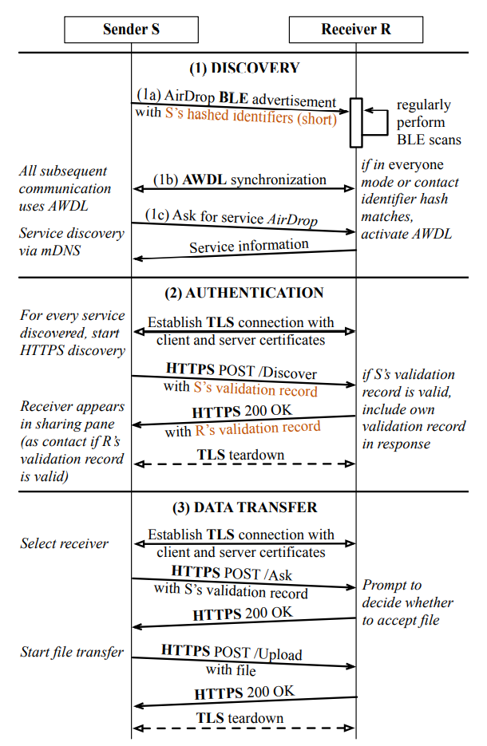
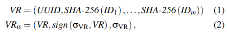
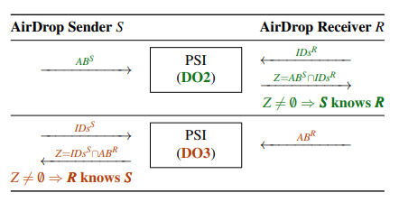
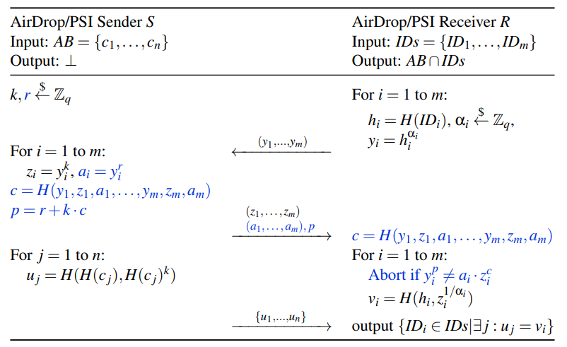
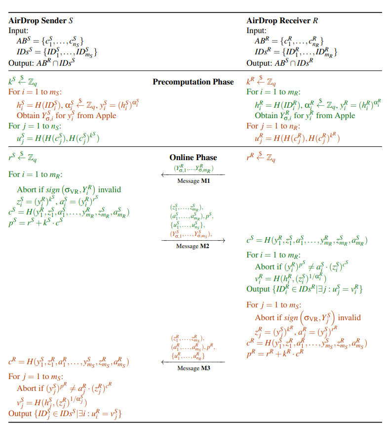
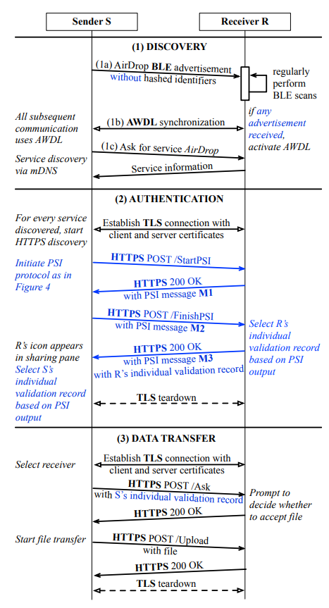
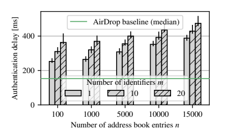

# [HHS+21, Security] PrivateDrop: Practical Privacy-Preserving Authentication for Apple AirDrop

*Alexander Heinrich, Matthias Hollick, Thomas Schneider, Milan Stute, Christian Weinert*

USENIX Security Symposium 2021 [[PDF](https://www.usenix.org/system/files/sec21-heinrich.pdf)] [[Slides](https://www.usenix.org/system/files/sec21_slides_heinrich-alexander_0.pdf)]

---

They propose a novel optimized PSI-based protocol called PrivateDrop that addresses the specific challenges of offline resource-constrained operation and integrates seamlessly into the current AirDrop protocol stack.

Each iOS or MacOS device has an address book (AB). AB contains several contact entries which , in turn consist of several contact identifiers. AirDrop leverage the user's own contact identifiers and their address book entries for authentication purpose.

Full protocol workflow consists of three phases: discovery, authentication and data transfer. There are two design flaws in the authentication handshake, where hashed contact identifiers (*VR*) are exchanged as part of Apple's validation record.

<!-- 飞书原始链接: https://internal-api-drive-stream.feishu.cn/space/api/box/stream/download/authcode/?code=ODA1NTE1N2I2Zjg5MDNjYTIxOWRkNWNmMzMzZDAyMDlfM2IxMGRiN2E3NjIwZDc0YjU0Njk3Yzk0NWJiYTYwMDdfSUQ6NzIwNzQ0NDkzMTg2OTE3OTkwOF8xNzg1NDYxODc1OjE3ODU0NjU0NzVfVjM -->

<!-- 飞书原始链接: https://internal-api-drive-stream.feishu.cn/space/api/box/stream/download/authcode/?code=Mjg1MGIxODAzMzQ5YWZhMmFjOGY4NjU2ZGFhZGI3ZmRfNjlkMWZhMzMxYjFmY2I0YjcwYjE5YjdlODU1OWU0YjVfSUQ6NzIwNzQ0NTE3MDQ5NjkxMzQxMF8xNzg1NDYxODc1OjE3ODU0NjU0NzVfVjM -->

**Threat Model:** Malicious adversary

**Recover hashed contact identifiers**

- Recover phone numbers: Brute force attack is enough because the phone number space is relatively small.
- Recover email addresses: Dictionary attacks.

**Contact Identifier Leakage of Sender:** Sender always disclose contact identifiers as part of the initial message. Malicious receiver can learn hashed identifiers of sender without requiring any prior knowledge of their target.

**Contact Identifier Leakage of Receiver:** Receiver will present their contact identifiers if they know any of the sender's identifiers. Thus malicious sender can learn information if receiver knows the sender.

To overcome these flaws, PSI can be modified and applyed into AirDrop. The high level idea is in the pictire below. First PSI assure S knows R and second PSI assure R knows S. Afterward, each party is assured that it is stored in the the respective other party's address book.

<!-- 飞书原始链接: https://internal-api-drive-stream.feishu.cn/space/api/box/stream/download/authcode/?code=MDE3NTI0ODYxMTI3OWFhNWQwZWMyZDI1ODRkZDg2OThfNGVhNzI4MDZhMGQyNGQyZmZmZmVlYzA2YmU1ZDBhNDVfSUQ6NzIwNzQ0NTEyOTMwMzQ5MDU2NF8xNzg1NDYxODc1OjE3ODU0NjU0NzVfVjM -->

After showing some high level idea, we need to specify the PSI protocol. The size of AB is larger than the size of IDs, so PSI protocol specialized in unbalanced size is prefered. The size of AB is well below 100k in contrast of hundreds of millions as considered for unbalanced PSI. Thus, protocol based on PKE which is inefficient at large scale is acceptable. As the adversary defined in threat model is malicious, so we must choose a protocol with malicious security. At last, the protocol can not require complex libaries for OT or garbled circuit. Finally the author chose [[JL10](https://link.springer.com/content/pdf/10.1007/978-3-642-15317-4.pdf#page=429)].

<!-- 飞书原始链接: https://internal-api-drive-stream.feishu.cn/space/api/box/stream/download/authcode/?code=ZTNiYmVhMTA5MDdmYWIzNzNlNTM0NmFkYmIxOWNlZTZfZTM4ZmFjYTE2YjM2NTcxY2RlNTc1MmFjZjZkMGM1ZDVfSUQ6NzIwNzQ0NTI2NzA3NzkzOTIyOF8xNzg1NDYxODc1OjE3ODU0NjU0NzVfVjM -->

The full PSI-based mutual authentication which has made some optimization. Some values such as k/u/y can be precomputed overnight when the device is charging. Round complesity can be reduced by bundle messages together.

<!-- 飞书原始链接: https://internal-api-drive-stream.feishu.cn/space/api/box/stream/download/authcode/?code=ZjUwMWZkNGMwYjIyYTAzNWUxNDVhZjBjNTVhYWE4NjlfYTE1NmUwZGRkNWY4NGIyNTYyN2UxNWRhNTMzMmVlMzVfSUQ6NzIwNzQ0NTMyODgyNjUzMTg0Ml8xNzg1NDYxODc1OjE3ODU0NjU0NzVfVjM -->

PrivateDrop protocol.

<!-- 飞书原始链接: https://internal-api-drive-stream.feishu.cn/space/api/box/stream/download/authcode/?code=ODFhNzM4Y2NkY2Q4ZDRjZDliNWRiYTEwZTJhYWJhMzlfODNlMWJiNWVkNmY3MTU4ZTZlN2E4ZjkyODFlODI3NTJfSUQ6NzIwNzQ0NTM4OTQ1OTM1NzY5OF8xNzg1NDYxODc1OjE3ODU0NjU0NzVfVjM -->

At last, the efficiency in the ideal internet (cable betwork) is satisfying. Even for extreme scenarios (m=20, n=15000), the overall delay stays below 500ms. This satisfies our user experience requirements as human perceive any delay below 1000ms as an "immediate response".

<!-- 飞书原始链接: https://internal-api-drive-stream.feishu.cn/space/api/box/stream/download/authcode/?code=MjgzNDcwNWI1ZDU4MmI2M2MxZmQ5ZWE2YWUxZTZhMGRfMzA5MmYzOWZlNjhlZDMyMzdhZWQxZjdkZWE4NmZmODlfSUQ6NzIwNzQ0NTQ0MDk5ODk5ODA0NF8xNzg1NDYxODc1OjE3ODU0NjU0NzVfVjM -->