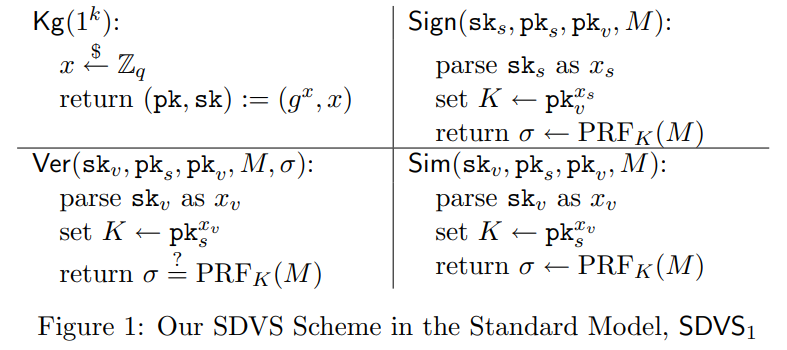
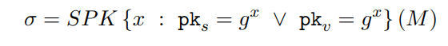
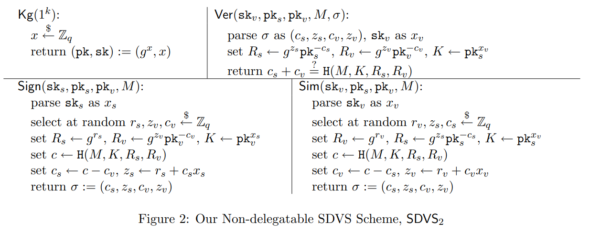

# [HYWS09,IJIS] Efficient strong designated verifier signature schemes without random oracle or with non-delegatability

**SUMMARY:** This paper proposed two strong designated verifier signature (SDVS) schemes 1) without random oracle or 2) without delegatability.

Here, strong means that two signer's signatures for the same verifier are indistinguishable to anyone other than the designated verifier.

## **1 SDVS without Random Oracle**

The insight behind this construction is a shared key $K = g^{x_s x_v}$. In fact, this is also the core of the PAEKS.

The problem is that anyone with the shared key  can sign a message on behalf of the signer S for the verifier V and vice versa, which is called delegable.

<!-- 飞书原始链接: https://internal-api-drive-stream.feishu.cn/space/api/box/stream/download/authcode/?code=ZTUzMjQzYTUyYjIyMGFkZjNjZWM4Y2ExOTdiMTFiZTJfY2QxNmU0YmQ2ZTg1ZDg5MzZkYTM0MWI4ZWM0MDBhYThfSUQ6NzMyMjc5NTc2MzQ2ODE1NjkyOV8xNzg1NDYxOTMzOjE3ODU0NjU1MzNfVjM -->

## **2 SDVS without Delegatability**

To resolve the above problem of delegatability, the authors introduce signature of knowledge  (SoK) to the construction.

<!-- 飞书原始链接: https://internal-api-drive-stream.feishu.cn/space/api/box/stream/download/authcode/?code=MzMwOTViZTI1OGU1NjNkYzg5N2ZkMDIyZGQ2NjQ3NDJfYmIzMGEyMDA3ZmUzOTIzYjA2Y2ZlM2ViYzdlNjI2NGFfSUQ6NzMyMjc5NTcxNDExMzczMjYzNl8xNzg1NDYxOTMzOjE3ODU0NjU1MzNfVjM -->

When a signer signs a message with a shared key, he must provide a proof that he knows one of the keys in the shared key. Moreover, the authors implement the SoK with the Sigma protocol.

<!-- 飞书原始链接: https://internal-api-drive-stream.feishu.cn/space/api/box/stream/download/authcode/?code=NjNhYTAwM2Q1YzM1ZDNjNTkyZDYwN2NjOTYzYWFmNDRfZWU1YTg2Y2FiN2VkYTg3ZjJhNDdkODE0ZWZiMTUxYjlfSUQ6NzMyMjc5NTY4OTcxMTQ1MjE4OF8xNzg1NDYxOTMzOjE3ODU0NjU1MzNfVjM -->

- Sigma protocol $(R_s, z_s, c_s)$ and $(R_v, z_v, c_v)$, where the signer S can generate the first proof correctly and forge the second proof with specific randomness $R_v$.