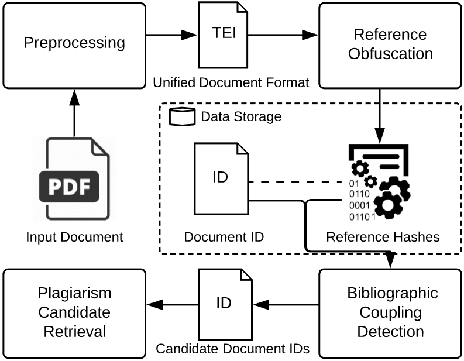
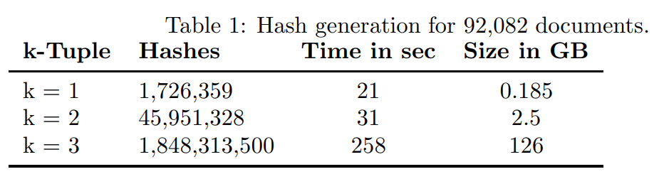
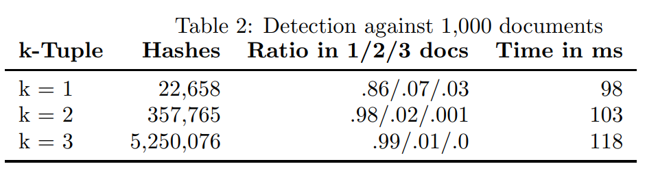
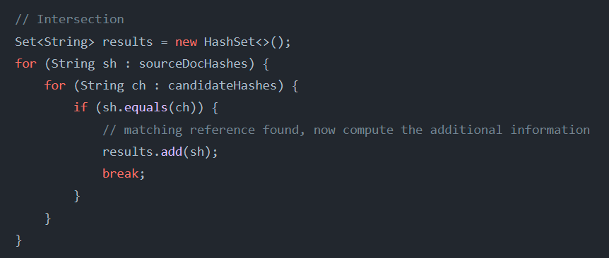

# [ISMG20, JCDL] A first step towards content protecting plagiarism detection

**Summary: 使用了PSI的方法做了引文的抄袭检测**

**背景：**

作者提出现在的抄袭检测系统 (Plagiarism Detection System, PDS) 会要求用户上传文件进行检测，检测和数据管理过程是不透明的，会造成用户对隐私的担心。作者最终想要整一个基于区块链的，去中心化的，能不泄露明文并且检测文章所有内容抄袭检测系统。但在这里先提出了一个基于PSI的检测引文抄袭的系统。

**系统流程：**

- 首先对文章进行预处理，把文章转换成XML格式，提取出参考文献目录。
- 然后把每条参考文献先进行简单哈希，然后将参考文献依据k的值进行组合；当参考文献为$\{a,b,c\}$时，如果此时$k=2$，那么划分为$\{a,b\},\{a,c\},\{b,c\}$，然后将组合出来的集合中的每个元素的哈希值相加得到新的哈希$H(r)=H(a)+H(b)$。假如一篇文章的参考文献集合为$R_d$，那么最终该参考文献对应的哈希值有$\tbinom{|R_d|}{k}$个。
- 将组合后的哈希值（待检测文章和数据库中文章）作为PSI的输入，原文称经过PSI后可以得出：

$$S_{PBC}(H_d,H_{d'})=\frac{|H_d\cap H_{d'}|}{|H_d\cup H_{d'}|}$$

- 最后根据待检测文章和数据中文章的$S_{PBC}$进行降序排列，然后filter for matches exclusively occuring in one ducument pair (我猜大意是指某个哈希组合只存在于数据库中某一篇文章中，那就判定待检测文章抄袭。文章没有继续说明怎样才算抄袭，并且作者在实现中没有这一步)

原文中并没有形式化定义该系统，我去文章中给出的GitHub仓库找到了下面的图片。

<!-- 飞书原始链接: https://internal-api-drive-stream.feishu.cn/space/api/box/stream/download/authcode/?code=ODBhZDQzOTI2ODcyMGNlNWNjMWMzOTA4Zjc4MDgxNjNfMGE5N2M4MzkwNjQwOWRiNmQ2YjE5YjdlNDMyMmFkNzRfSUQ6NzIxNzY3NzIwMjQ1ODk4NDQ1Ml8xNzg1NDYxODgxOjE3ODU0NjU0ODFfVjM -->

**效率评估：**

作者评估了生成哈希集合的时间和进行PSI的时间，用到的哈希函数是SHA1。

<!-- 飞书原始链接: https://internal-api-drive-stream.feishu.cn/space/api/box/stream/download/authcode/?code=NWIwNmFiN2IzNmJhYzBiMDExNGNlM2FhYjcxYjkzZDRfZTA5ZWViY2NmNzIzODBiZWM3NTE0MjQ0ZGE1ZmI3MjFfSUQ6NzIxNzY4OTYwMDIzMDM1OTA0M18xNzg1NDYxODgxOjE3ODU0NjU0ODFfVjM -->

<!-- 飞书原始链接: https://internal-api-drive-stream.feishu.cn/space/api/box/stream/download/authcode/?code=MDI2YTVjNDFiMTIzMDcwNDhiY2ZmNmYzOGUxNjM2OGJfZDU1MjM4YjM4ZTk3YTkwM2E4MzFiY2NiODcyZDczNmVfSUQ6NzIxNzY4OTg1MzM5MDIyNTQxMl8xNzg1NDYxODgxOjE3ODU0NjU0ODFfVjM -->

对数据库生成哈希的时间和空间基本是成指数级增长。进行PSI的时间很少，因为这里的PSI基本是简单哈希，效率很高，安全性存疑。

**结论：**

1. 作者提出的PSI仍然属于Simple hash的范畴，只是简单的将Simple hash的结果相加生成一个新的哈希再进行比较，并且没有给出安全模型或者安全证明，只是简单说明了一下相比于simple hash可以更好的抵御preimage攻击。
2. 作者的实现有问题，首先，PSI有两个参与方，但作者在实现的时候只使用了一个程序，并没有模拟发送方接收方；并且在PSI中双方集合的并集是不会被泄露的，但这里在计算$S_{PBC}$时直接使用了双方并集的大小，作者是在程序中直接获取哈希集合的大小，并集大小是不能够用通过PSI算出来的。我感觉作者实现的只是集合求交但不是隐私集合求交。

<!-- 飞书原始链接: https://internal-api-drive-stream.feishu.cn/space/api/box/stream/download/authcode/?code=NzVlNTViZTYxZGNkZmQ4YzlhMTAxNmNhMjA3NTViYTlfYzI5YjAzOTQ1NTcyN2E3ZDlhZWFlZWMyNDU1NWU1ZWFfSUQ6NzIxNzY5NDEwOTQ4MDUzNDA0NF8xNzg1NDYxODgxOjE3ODU0NjU0ODFfVjM -->

<!-- 飞书原始链接: https://internal-api-drive-stream.feishu.cn/space/api/box/stream/download/authcode/?code=ZDIzMTNlYzU5NWMxNDdiYzI2ZmNjZmJiZTE1ZmZlNzFfYjA3MWRmMjcyYTE0ODAyMmU2MjU3ZDc2MTdhNmE4YWNfSUQ6NzIxNzY5NDc4MDY0MDgwNDg2OF8xNzg1NDYxODgxOjE3ODU0NjU0ODFfVjM -->