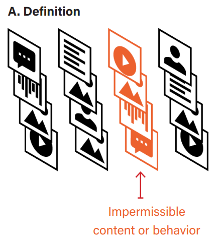
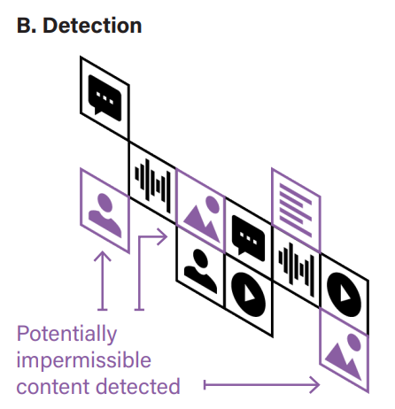
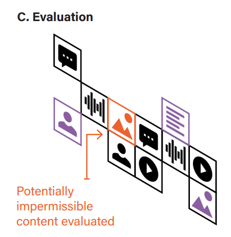
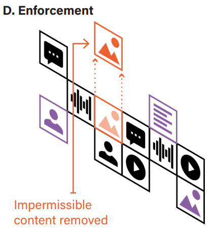
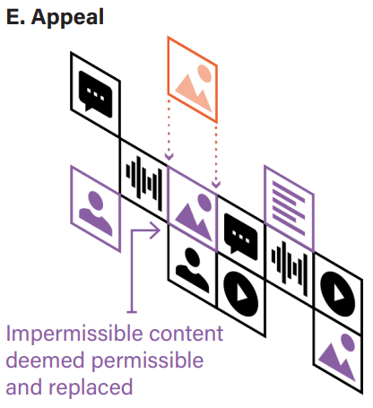
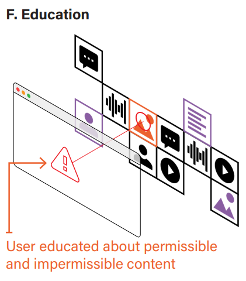

# [KKL+21,CDTreport] Outside looking in Approaches to content moderation in end-to-end encrypted systems

# Outside Looking In: Approaches to Content Moderation in End-to-End Encrypted Systems

## Intro

A new front has opened up in the Crypto Wars: content moderation.

As billions of people around the world began to use encrypted services to protect their privacy and data when communicating with others, the balance between personal privacy and public protection regained prominence in the last decade.

This paper assesses existing technical proposals for content moderation in E2EE services. The writers first explain the various tools in the content moderation toolbox, how they are used, and the different phases of the moderation cycle, including detection of unwanted content. Then they lay out a definition of encryption and E2EE, which includes privacy and security guarantees for end-users, before assessing current technical proposals for the detection of unwanted content in E2EE services against those guarantees.

## Understanding Content Moderation

**Content moderation** refers to the set of policies, systems, and tools that intermediaries of user-generated content use to decide what user-generated content or accounts to publish, remove, or otherwise manage.

Content hosts may moderate both illegal content and content that legal but violates their terms of service or other rules. This paper examines the processes hosts may use to take action against user-generated content or user accounts.

Hosts take a variety of approaches to content moderation.

- use automated systems to screen user-generated content at upload
- primarily review and moderate content after it has been posted
- act reactively, reviewing and moderating content only after it is reported as objectionable
- proactively seek out content for moderation

### Examples

- (Facebook, Twitter, and YouTube) Directly involved in content moderation

  - write policies and rules regarding the content that is permitted on their sites
  - employees or outsourced contractors to review and make content moderation decisions
  - employ teams to rule on user appeals of content moderation decisions
- (Reddit, Wikipedia, Slashdot, and Discord) Rely on community or distributed moderation

  - set baseline policies for content, while relying on volunteers to set additional rules, make content moderation decisions

## Phases of Content Moderation

Content moderation occurs in six phases: **definition, detection, evaluation, enforcement, appeal**, and **education**. Content moderation is an iterative process: these phases are interrelated, and each phase may happen multiple times.

### Definition

Hosts or others determine what user-generated content is and is not permitted on the service.Hosts may define and communicate permissible and impermissible content in their terms of service or community guidelines, but rules may also be defined and communicated in other ways.

<!-- 飞书原始链接: https://internal-api-drive-stream.feishu.cn/space/api/box/stream/download/authcode/?code=YTRiNWYyODVjZWVlN2RhOTk4MTY2Nzg2ZWIwZTFhMjVfZGMyNWQ3MTllMmQ1YmFkNTQ1NzhkZmViYjljNTE1ZWNfSUQ6NzIxMDAyNjM5MTUzNjk1OTUxNl8xNzg1NDYxODc3OjE3ODU0NjU0NzdfVjM -->

### Detection

How hosts or other moderators identify user-generated content that may violate their policies or the law.

- detection can take place at different points in time
- Ex post detection may be reactive(alert)

<!-- 飞书原始链接: https://internal-api-drive-stream.feishu.cn/space/api/box/stream/download/authcode/?code=ODc4NjZlZDU3NTg3ZDVhYzc3YzQ2ODFiYTViZjU5OTFfNGFlNmRjMTUwNjY5NWQ4Y2NiMTUwODM1YzVjZmRlNDhfSUQ6NzIxMDAyNjQzOTQ4NjQwNjY1N18xNzg1NDYxODc3OjE3ODU0NjU0NzdfVjM -->

### Evaluation

The user-generated content is examined to determine whether it does violate the host's policies, or is potentially a violation of a relevant law.

- Evaluation can be done by humans, automatically, or through a combination of automated and human review.

<!-- 飞书原始链接: https://internal-api-drive-stream.feishu.cn/space/api/box/stream/download/authcode/?code=YTE2Y2E0ZmRhOTBlODRjNGI5NWVmODk2YTdjYTI2NzVfOTE5ZmZkYjliNmU5OTllMjc1YTYwYzg4ZTMwZjRlYmNfSUQ6NzIxMDAyNjQ5MDk1OTY0MjY1Ml8xNzg1NDYxODc3OjE3ODU0NjU0NzdfVjM -->

### Enforcement

Enforcement is the action a moderator takes against user-generated content that it determines violates a content policy or law.

- removing content
- add a warning before users may access the content or counterspeech such as a fact-check
- disable user comments or other features for a post
- decrease the availability of some or all of a user's posts
- suspend or deactivate a user's account

<!-- 飞书原始链接: https://internal-api-drive-stream.feishu.cn/space/api/box/stream/download/authcode/?code=YzMyMWQwYmI5NDBlNTk3NWFiNjFjNDI5NDk0MjBmYmNfMTJhNjZkNDI3YzNkN2E1OTJmMjExNmUyZDM2NGJhMjRfSUQ6NzIxMDAyNjUyNTM1MzcwNTQ3NF8xNzg1NDYxODc3OjE3ODU0NjU0NzdfVjM -->

### Appeal

Since errors are inevitable in content moderation, after enforcement, some hosts allow users to appeal or otherwise seek review of content moderation decisions that users believe are erroneous

<!-- 飞书原始链接: https://internal-api-drive-stream.feishu.cn/space/api/box/stream/download/authcode/?code=MTlmODk0ZTMyM2UyZDVhNzRhMWU2ZDk1MDNkYWY3M2RfZDVjYjNmYzZjOWZmMzM1ZjZiNjEyNGQ2YzY1ZGQyY2VfSUQ6NzIxMDAyNjU2MDY4MDc3MTYxMl8xNzg1NDYxODc3OjE3ODU0NjU0NzdfVjM -->

### Education

Finally, hosts can educate users about their content moderation policies and the ways in which the policies are enforced.

<!-- 飞书原始链接: https://internal-api-drive-stream.feishu.cn/space/api/box/stream/download/authcode/?code=Y2E1NGY2YjMxNzZkZTUwNjkwYmMxOGQwNjc3ZGI5ZWNfYjJlMjkxNzkyZjQ0MjFiMjViZjQ3ZDRiYjBkZTM0ZDRfSUQ6NzIxMDAyNjU5Nzk3MzE5NjgwMl8xNzg1NDYxODc3OjE3ODU0NjU0NzdfVjM -->

## Understanding End-to-End Encryption (E2EE)

A system, service, or app is **end-to-end encrypted** if the keys used to encrypt and decrypt data are known only to the sender and the authorized recipients of this data.

### Examples of Services that include E2EE

descriptions of a few common services and their privacy:

- *Storage*

  - A cloud storage service that stores end-to-end encrypted files or photos
  - The data is first encrypted under a key known only to the user and then stored in the cloud
  - Keybase file system and the Pixek photo app
  - E2EE is used to guarantee that the user is the only party that can access the data
- *Messaging*

  - An encrypted message exchange is a conversation between two or more people over an end-to-end encrypted messaging app
  - Encrypted using keys known only to the participants in the conversation
  - WhatsApp and Signal
  - E2EE is used to make the conversation confidential in the sense that only the authenticated participants in the conversation can access the messages
- *Email*

  - Allows users to send and receive end-to-end encrypted emails
  - The keys are only known to the sender and recipients

## Detecting Content in E2EE Environments

Five technical proposals emerging from research in computer science and cryptography that **seek to enable content detection** in E2EE services

### User Reporting

A service provider may make tools available that allow users to alert moderators of unwanted content. Moderators are able to directly view content, and either take action for further review.

#### Message franking:

designed so that the messages can only be decrypted and verified by the service provider and no one else beyond the original sender and recipients.

Given a private conversation between users A and B, message franking guarantees that:

- B can prove to the service provider that they received a given message from A
- B cannot claim to the service provider that they received a message from A that they never received

**Limitation**: Although the message franking techniques described above do not violate the end-to-end guarantee of a private conversation, newer variants could, so it is important that practical deployments of message franking be transparent about the exact properties they guarantee

### Traceability

- Extends the techniques from message franking to trace all the users who forwarded or received a given piece of content
- built on top of message franking and, while franking does not violate the properties we expect from encrypted conversations, tracing does
- With it the service provider can learn information that was not explicitly revealed to it by either the sender or receiver

**Limitation**: traceability as a concept is not consistent with the privacy guarantees for E2EE systems and that fixing design issues in these flawed examples won't resolve this inherent tension.

### Metadata Analysis

Matadata means data about an encrypted message, can include a surprisingly robust amount of detail including file size, type, date/time, sender/receiver, etc. Analysis based on metadata is relevant, for example, in the detection of spam in plaintext communications.

**Privacy protection**: as long as the metadata analysis occurs exclusively on a user's device and does not store, use, or send decrypted messages, the user's privacy is preserved and the guarantees of end-to-end encryption are not violated

**Limitation**: not all metadata analysis may reliably identify problematic content.

### Perceptual Hashing in E2EE

*These approaches are not consistent with the privacy and security guarantees of E2EE.*

Different from cryptographic hashing, Perceptual hashing allows the service provider to determine the degree to which two pieces of content must be similar in order to be deemed a match.

Perceptual hashing is used in a plaintext context to automatically identify content that the host has previously determined it does not want on its system

**Limitation**:

- it is only effective on content that is shared more than once
- hash filtering, particularly where the algorithm is public, is also vulnerable to the deliberate addition of hashes to the database to generate false positives

### Predictive Models for Content Detection in E2EE

Aim to recognize the characteristics of content based on the machine's prior learning. This approach is often used for content that is new or previously unknown.

As with metadata analysis, if this process occurs exclusively on a user's device and no information about the message is disclosed to a third party, then the guarantees of end-to-end encryption may not be violated.

**Limitation**: more research is needed to develop viable techniques using this approach.

## Content Moderation in E2EE Environments -Next Steps for Research

two content detection proposals that preserve the security and privacy guarantees of E2EE without introducing any new security vulnerabilities into the system.

- user reporting, which includes message franking. Message franking enables user reporting of problematic content such as abusive content, mis- and disinformation, or CSAM, including in encrypted one-to-one and group chat settings.
- metadata analysis, which could be used, for example, to detect problematic content such as spam and CSAM.

**Advice:**

- Explore the applicability of content moderation approaches beyond just content detection in E2EE services.These types of interventions may be useful in thinking about how to design E2EE services to reduce the likelihood of abusive content and activity.
- Content detection solutions should emphasize user agency
- Significantly more research is needed to determine the most effective techniques for encouraging user reporting of content
- Additional research is needed to prevent abuse by repeat offenders
- Proposals must be explicit about the exact properties they guarantee, and that any change to a system needs user notification, consent and opt-out.

## Conclusion

we should recognize that technological solutions to detecting problematic content alone, whether in a plaintext or E2EE system, will not address the larger issues of, say, the distribution of disinformation or CSAM. Rather, as a society, we also need to consider the social and political causes behind these phenomena and address them at their core.