# [KM21, Security] Identifying Harmful Media in End-to-End Encrypted Communication: Efficient Private Membership Computation

**Summary:** This work makes a set of constructions for privacy preserving perceptual hash matching for E2EE.

## 1 Introduction

A popular method of detecting harmful media is perceptual hash matching (PHM), which maps media to a space where proximity reflects perceptual similarity and is robust against common transformations. But in E2EE, PHM can't compute and compare hashes of user media.

The authors explore the technical feasibility of E2EE service taking content moderation action without learning nothing about non-harmful data and without disclosing the hash set.

They formalize the problem of detecting perceptual hash matches in E2EE communications: private exact membership computation (PEMC) and private approximate membership computation (PAMC). Their protocols consist of four steps: bucketizing PHF values for efficient lookup, private information retrieval for PHF buckets, private equality testing and (for PAMC only) private threshold comparison.

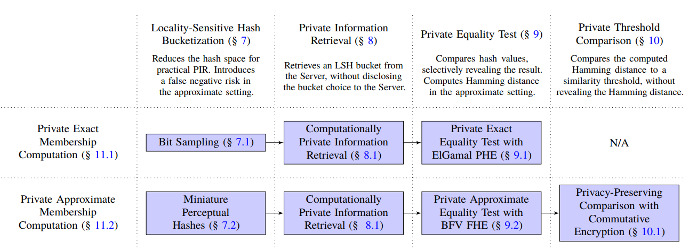
<!-- 飞书原始链接: https://internal-api-drive-stream.feishu.cn/space/api/box/stream/download/authcode/?code=YjdlZWNlMWFlM2FhNGU2OTU4N2QxMTJlNGFhZjIxMmZfZjEzYzhkNjZkNDFhMzViOTk2ZTBkNGZhOTM2NDdhYjdfSUQ6NzIxMjQ4MzUwMzkxOTgyNDg5OF8xNzg1NDYxODc4OjE3ODU0NjU0NzhfVjM -->

## 2 Problem Formulation

### Perceptual Hash Matching

Current PHM systems function, as follows. Clients share media via communication server, and the server receives the media in plaintext. Server the applies k-bit perceptual hash function $x=\rm{PHF}_k(\rm{media})\in \{0,1\}^k$. Then server compares $x$to a set of k-bit perceptual hashes for media known to be harmful, $\mathscr{B}\subseteq\{0,1\}^k$. In the exact hash match , the server identifies media as harmful if $x\in\mathscr{B}$. In the approximate hash matching: the server identifies media as harmful if  $\exist y\in\mathscr{B}$ such that $d_H(x,y)\le\delta_H$.

#### Privacy Properties

We refer to confidentiality for the Client's media and $x$as *client privacy*. We refer to confidentiality for $\mathscr{B}$as *server privacy.* We refer to a protocol that discloses a match to the Server as *server-revealing*, and we refer to a protocol that discloses a match to the Client as *client-revealing*.

#### Security Model

Parties could collude to conceal media content (e.g., by encrypting media) or take advantage of how PHFs are imperfect approximations of perceptual similarity (e.g., by applying transformations that PHFs miss). So PHM is secure for semi-honest adversaries.

### Privacy Preserving Perceptual Hash Matching

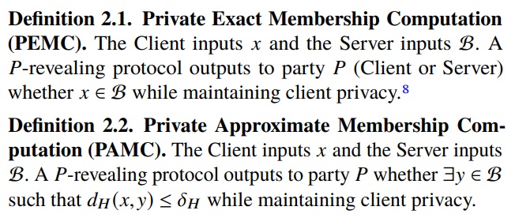
<!-- 飞书原始链接: https://internal-api-drive-stream.feishu.cn/space/api/box/stream/download/authcode/?code=YzVlOTFlYjM3YjBhZWVjMTQzZGYzZGQyNjUyZjY1MGNfNDNiNzQ3ZTZjYTI0MzYyOGY2ZTc0N2M1MzU3ZWEwNzVfSUQ6NzIxMjQ5Nzk0ODMwNjgzMzQxMF8xNzg1NDYxODc4OjE3ODU0NjU0NzhfVjM -->

#### Privacy Properties

Guarantee client privacy and server privacy can be optional. Server-revealing or client-revealing is optionally chosen.

#### Security Model

Semi-honest

### Limitations

- Influence free speech
- False positive
- Increase attack surface
- Do not protect PHF

## 3 PHF Predictive Performance

They aggregate a dataset of \~3.5 million distinct images from public sources.

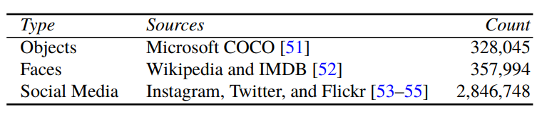
<!-- 飞书原始链接: https://internal-api-drive-stream.feishu.cn/space/api/box/stream/download/authcode/?code=ZGJkNTRmNzY0MDVhZWEzOThmZmEyZGU1NWFlM2Y5YzNfZGY3MmQxZDk1YmE4NWJlMTViYWI3MTE2NGI5MzM2ZmVfSUQ6NzIxMjUwNjMwMjIxOTUxNzk1M18xNzg1NDYxODc4OjE3ODU0NjU0NzhfVjM -->

They consider 6 open-source PHFs: Average Hash (aHash), blockHash, Difference Hash (dHash), Facebook PDQ, pHash and Wavelet Hash (wHash).

### Comparing Images

- Similar imagesThey randomly sample 10000 images and apply 5 transforms (Rotation, Noise Addition, Cropping, Gamma Correcting and Rescaling) to each image. They compare perceptual hashes of the original image and transformed image. As a result, the PHFs they evaluate is generally robust to modest extents of specific transformations as the distribution of hamming distances is close to 0.
- Dissimilar imagesAssuming that distinct images in the data set are perceptually dissimilar, they randomly sample 15000 images and calculate hamming distance between each pair of hashes. The distribution of normalized hamming distance is centered around 0.5 for each PHF.

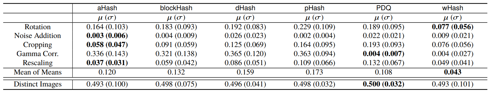
<!-- 飞书原始链接: https://internal-api-drive-stream.feishu.cn/space/api/box/stream/download/authcode/?code=MjNiMGU5NmU1ZTE2NjRiYzRjYTg2ZjkwNGEyZmQzNTFfY2U1MDhmZmRjMjgyZTA1YTc3MTAzZmYxZTc4YzZiYjlfSUQ6NzIxMjUxMjA2MzEzNzIxODU4OF8xNzg1NDYxODc4OjE3ODU0NjU0NzhfVjM -->

##  4  Client-Side Matching

Client-side matching does not require server privacy and trivially guarantee client privacy because all perceptual hash matching computation is local to the client.

They use binary search, bitwise trie, bloom filter and cuckoo filter for PEMC and multi-index hashing for PAMC.

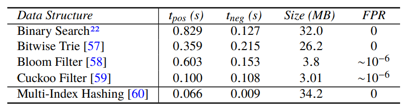
<!-- 飞书原始链接: https://internal-api-drive-stream.feishu.cn/space/api/box/stream/download/authcode/?code=OGJmOGZjZWU4ZjljNWIwNGY2YWYyYjNlZjg4MzIwNzNfMDliZGZlNjk0ZDUyY2VhZTViMzdmMDZiM2U4YWVhYzRfSUQ6NzIxMjUzMTE3NjIzMjQxOTM1Nl8xNzg1NDYxODc4OjE3ODU0NjU0NzhfVjM -->

## 5  Privacy Preserving Matching

1. The server partitions the hash set $\mathscr{B}$into localized buckets, for more efficient retrieval by the client.
2. The client uses private information retrieval to obtain the relevant buckets of hashes, under homomorphic encryption.
3. The client obliviously computes a Hamming distance between $x$and each encrypted hash.
4. For PAMC, the client and server jointly compute a thresholded comparison for each distance.

After executing the protocol, the server learns whether there is a perceptual hash match.

## 6 Locality-Sensitive Hash Bucketization

Locality-sensitive hash (LSH) maps similar items to the same bin with high probability. Applying LSH solves the problem of dividing the set of perceptual hashes $\mathscr{B}$into disjoint localized buckets for efficient retrieval.

**LSH.Setup.** A server holds a hash set $\mathscr{B}$ and knows a function $\phi(\cdot)$which the server applies to buckets before indexing. Both parties know the l-hash family  The server computes the LSH index ind,

$\rm{ind}[w]\leftarrow \phi (\{y\in \mathscr{B:L}(y)=w\})$.

**LSH.Query.** For a k-bit element e, this function returns the l-bit LSH $\mathscr{L}(e)$.

### Bit Sampling

For a k-bit perceptual hash $s=s_1s_2...s_k$, the l-bit LSH $\mathscr{L}_E(s)=s_1||s_2||...||s_l$. They use this function to construct the cPIR index in PEMC.

### Miniature Perceptual Hashes

The bit sampling based LSH may induce false negatives. They use the fact that PHF is a type of LSH. PHFs can operate on lower-resolution grayscale images to produce smaller hashes. Almost all PHFs produce hashes of perfect square lengths, because input images are resized to small squares. We compute:

$$l'=min(l^2:l<i^2,i\in\Bbb{Z})$$

$$\mathscr{L}_a(x)=PHF_{l'}(x)_1||PHF_{l'}(x)_2||...||PHF_{l'}(x)_l$$

PHF-based LSH will reduce false negatives and does not lead to an imbalanced LSH index.

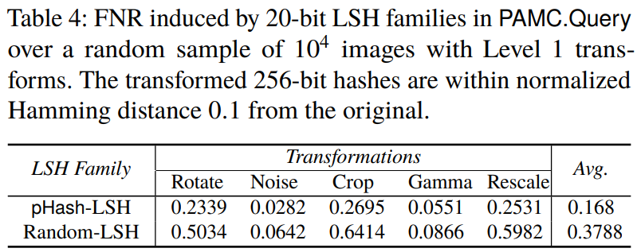
<!-- 飞书原始链接: https://internal-api-drive-stream.feishu.cn/space/api/box/stream/download/authcode/?code=MDljOWU5NmMwZTU1M2Y0ZGYyOGJkODIyZWZhNmQ1YTlfYzE3NjI3NjgzYmI2M2E5ZDZmN2IxODI2YjliOGU0YWNfSUQ6NzIxMjU0Mjk0MTQ2MDc0MjE0NV8xNzg1NDYxODc4OjE3ODU0NjU0NzhfVjM -->

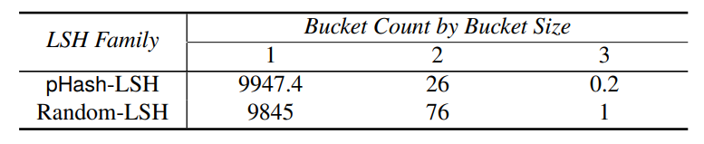
<!-- 飞书原始链接: https://internal-api-drive-stream.feishu.cn/space/api/box/stream/download/authcode/?code=MzBkNTliNTY5NTVlN2QyY2IxMmU0NjMzN2Y5ZDhkMDZfYTA4MWZlMDcxOGZjYjgwODE3NDUyNzUyZmI2MjU2M2JfSUQ6NzIxMjU0MzAyMDk4ODk4OTQ0M18xNzg1NDYxODc4OjE3ODU0NjU0NzhfVjM -->

## 8 Private Information Retrieval (PIR)

A client can privately obtain a set of LSH buckets.

### Computationally Private Information Retrieval (CPIR)

A cPIR protocol allows a Client to retrieve an element ec from a Server that stores a database $D = \{e_i : 1 ≤ i ≤ |D|\}$ without revealing choice c. The server must necessarily operate on all database elements. Otherwise, if the Server could omit operating on certain elements, it could infringe on the privacy guarantee of Client choice c.

XPIR is based on BFV cryptosystem. XPIR computes the dot product of a homomorphically encrypted query vector $\overrightarrow{q}$ and the entire database, using FHE.Absorb.

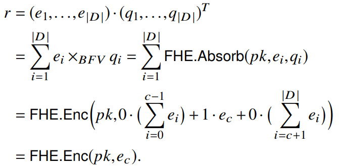
<!-- 飞书原始链接: https://internal-api-drive-stream.feishu.cn/space/api/box/stream/download/authcode/?code=ODZlOGU5ZDc0MWJmNWMwMWE3NWVlZGExMmI3ZjQ0OGRfMjliNDA4Nzc4MzY2OTUzN2Y4NTVkODIwZjBmN2FhZmFfSUQ6NzIxMjU0NzYwODU5ODgzOTMyNF8xNzg1NDYxODc4OjE3ODU0NjU0NzhfVjM -->

SealPIR is an improvement over XPIR, which seeks to reduce query size at the cost of increased server-side computation.

cPIR.Query. LSH family $\mathscr{L}$is publicly known, Client sends query $\rm{FHE}.Enc(pk,\mathscr{L(x)})$to the server, Server sends reply $\rm{FHE}.Enc(pk,ind[\mathscr{L(x)}])$to the client.

## 9 Private Equality Test

After the Client privately retrieves one or more LSH buckets of encrypted hashes, it performs computation on the encrypted hashes. The Client returns the transformed ciphertexts to the Server, which can then learn the result of the equality tests.

### Private Exact Equality Test

They use ElGamal to perform the comparison. The server generates an ElGamal key pair $(sk_s,pk_s)=\rm{PHE}.KeyGen(\it{q,E,G})$and sends $pk_s, (C_y, C'_y)=\rm{PHE.Enc(\it{pk_s,y})}$to the client. The client computes:

$$(C_{-x},C'_{-x})=\rm{PHE.Enc(\it{pk_s,-x})}$$

$$\rho_{-x}(C_y,C'_y)=r\times_E[(C_y,C'_y)+_E(C_{-x},C'_{-x})] )=\rm{PHE.Enc(\it{pk_s},r(y-x))}$$

The client returns $(C,C')=\rho_{-x}(C_y,C'_y)$to the server, which concludes that $\rm{PHE.DecChk(\it{pk_s},(C,C'),0)}\iff \it{x=y}$

### Private Approximate Equality Test

They use BFV to perform the comparison. The server generates a BFV key pair $(sk_s,pk_s)$and sends $pk_s,c_y=\rm{FHE.Enc(pk_s,FHE.Pack_1(y))}$. Client computes:

$$J_x=\sum_{i=0}^{l_b-1}x^{n-i}$$

$$J_y=\sum_{i=0}^{l_a-1}x^{i}$$

$$c_x=\rm{FHE.Enc(pk_s,FHE.Pack_2(x))}$$

$\zeta(c_x,c_y)=-2^{-1}\{(2\cdot c_y-J_y)\cdot (2\cdot c_x-J_x)\}+2^{-1}\{J_x\cdot J_y\}$,

and returns $\zeta(c_x,c_y)$to the server. The server computes $p_{x,y}=\rm{FHE.Dec(sk_s,\zeta (c_x,c_y))}$ and concludes $d_H(x,y)\le\delta_H\iff p_{x,y}(0)\le\delta_H$.

## 10 Private Threshold Comparison

Suppose a Client and a Server hold values $ν_c,ν_s\in [t]$ for some modulus t. A private threshold comparison (PTC) protocol allows the two parties to privately decide whether $νs −νc ≤ δ$ for some threshold $δ \in [t]$. The PTC is based on privacy preserving comparison (PPC) protocol. $\rm{PPC(\cdot,\{a\},\{b\})}$returns $true$if and only if $a<b$.

### Hiding the Hamming Distance

The client samples $r\in R_t$such that $r(0)<t-k$. The client computes $\rm{FHE.Enc(pk_s,r)}$and sends $\zeta(c_x,c_y)+c_r$. The server the ncan decrypt with $sk_s$ to obtain $p_{x,y}=\rm{FHE.Dec(sk_s,\zeta (c_x,c_y)+c_r)}$.

We have:

$$d_H(x,y)=p_{x,y}(0)-r(0)$$

The client knows $r(0)$but knows nothing about $p_{x,y}(0)$. And the server knows just the opposite. Using PPC protocol, the server inputs $p_{x,y}(0)-\delta_H$and the client inputs $r(0)$, the two party can jointly determine whether $d_H(x,y)\le\delta_H$.

## 11 Private Membership Computation

Putting the above components together, we can get the final protocol.

### PEMC

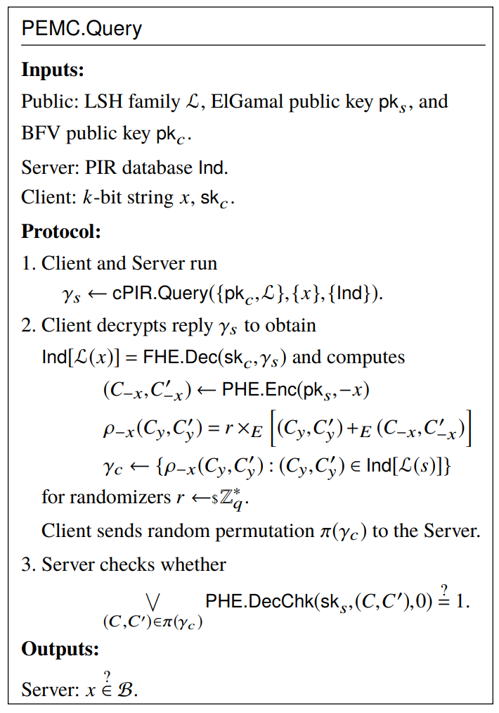
<!-- 飞书原始链接: https://internal-api-drive-stream.feishu.cn/space/api/box/stream/download/authcode/?code=ZTFiZjhkYTI1NmRiYzYxODkwZGI2NWZhNzA0ZmQzM2VfZmIxN2FiNzk2ZDdkNTI5MzE0NjcxMDI5Zjk1NjIzMzVfSUQ6NzIxMjU5MzE0MjA0MTAzNDc1NF8xNzg1NDYxODc4OjE3ODU0NjU0NzhfVjM -->

### PAMC

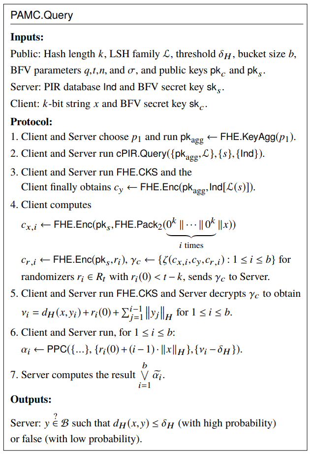
<!-- 飞书原始链接: https://internal-api-drive-stream.feishu.cn/space/api/box/stream/download/authcode/?code=NzYxZGI1ZDEzZGE2ODE1NTE2ZDc3ZDkwYzYzODIxNDFfOGEwMDljYjRjMTQ2MDRlMDIxODAzNTkxM2IwYzE2YTZfSUQ6NzIxMjU5MzQ2ODEzOTYzNDY4OV8xNzg1NDYxODc4OjE3ODU0NjU0NzhfVjM -->

## 12 Implementation and Benchmarks

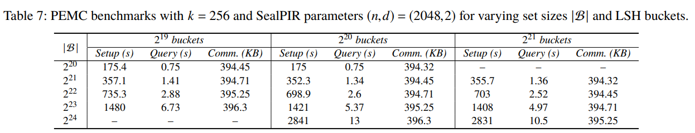
<!-- 飞书原始链接: https://internal-api-drive-stream.feishu.cn/space/api/box/stream/download/authcode/?code=Y2UyZDgzMzZmMDhkZTZhMmFmZDIxN2M0ZTY1ZmY2YzJfMjYwMmMxY2ZkODg2NjVhNDQwODU0OWViOWUwNjcwYzBfSUQ6NzIxMjU5MzYyNjU0MTY3MDQwMl8xNzg1NDYxODc4OjE3ODU0NjU0NzhfVjM -->

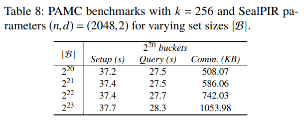
<!-- 飞书原始链接: https://internal-api-drive-stream.feishu.cn/space/api/box/stream/download/authcode/?code=Y2E2YTlmOTJhYzIwMjM4MDBlZTllYTdhN2YwYjY2OTFfN2VhZmE4OWI1OWU5NWQ2YTE5YTkyM2MxODU3ZmQ5ZDNfSUQ6NzIxMjU5MzcxNDE2MTU5ODQ5Ml8xNzg1NDYxODc4OjE3ODU0NjU0NzhfVjM -->

## 13 Conclusion

In this work, they explored the technical feasibility of privacypreserving perceptual hash matching in E2EE services.This work was published two years ago. They find their protocol is practicle for deployment on modern mobile devices. I think the construction is rather complicated and I can not totally understand. The construction on the paper I read last week by the same author is more trivial and easy to follow. In [[SKM23, S&P]](https://on65fe5uy6.feishu.cn/wiki/wikcnkOycgKCwXhf1X2XP1ymL2b), they have addressed the problems proposed in this paper, such as trust in the hash set, zero knowledge proof and harmful media disclosure.