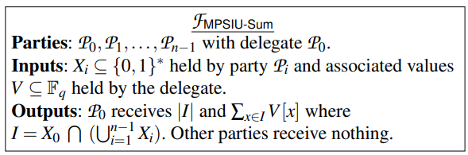
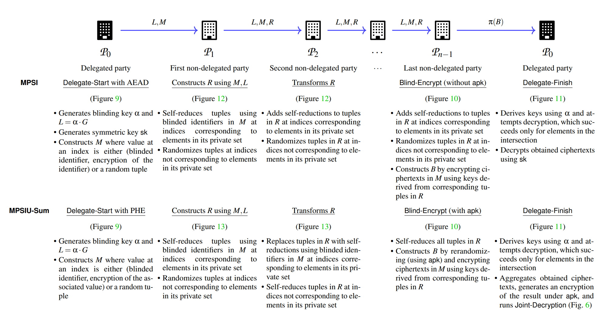
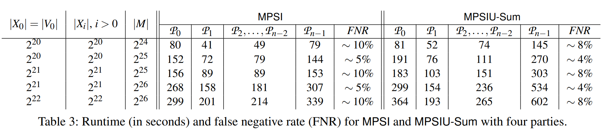

# [KM22, Security] Estimating Incidental Collection in Foreign Intelligence Surveillance: Large-Scale Multiparty Private Set Intersection with Union and Sum

**Summary:** Propose a multi-party private set intersection with union and sum (MPSIU-Sum) to estimating the incidental collection by U.S. Intelligence agencies.

## Background

法律规定只允许情报机构直接收集美国本土以外的外国人的通讯信息，不允许收集在美国本土的外国人以及美国人的信息。但实际上外国人会和美国人或者在美国的人通讯，情报机构会偶然收集到这些信息。之前没有很好的方法去统计这些偶然收集的信息，于是作者基于PSI提出了一个方案。

## Protocol

这个协议有多个参与方，一个情报机构以及n个通讯服务商，情报机构$P_0$拥有非监控目标用户id$X_0$以及每个用户id对应的收集信息的数量$V$；然后有$n-1$个通信服务商$P_1,...,P_{n-1}$，拥有美国用户的id$X_1,...,X_{n-1}$。通过运行MPSIU-Sum协议，情报机构可以获得偶然收集到的人数和通信条数。

<!-- 飞书原始链接: https://internal-api-drive-stream.feishu.cn/space/api/box/stream/download/authcode/?code=Mjg2NWJmNTk5OGZjNWRjZTQ0MjUzZWQ3YjdjZjE2NDZfMGY5NDY2MDFiZWM0MWYyZTE3ZDgzNmUwMTEzYmRjOWRfSUQ6NzIxNTEzODYwNDk2Mjc0MjI3NF8xNzg1NDYxODc5OjE3ODU0NjU0NzlfVjM -->

协议主要分为五个步骤：

- 第一步是情报机构建立哈希表M，表中元素要么是使用ElGamal和apk (所有参与方一起生成的公钥) 加密后的$V$要么是随机值；
- 第二步是第一个通信服务商初始化另一个哈希表R，然后把自己集合中的元素对应哈希表中的位置填上self-reduce tuples (这个tuple的性质是tuple和tuple相加还是tuple，但和非tuple相加就不是tuple了)，空置的位置填上随机值；
- 第三步是第一个服务商把哈希表R传送给后面的服务商，如果服务商有元素可以映射到R中仍然空着的位置，那么在这个空的位置写入self-reduce tuples；
- 第四步是，最后一个服务商先把M中的内容利用ElGamal加0，保证情报机构无法解密，然后把加0之后的密文用R当作密钥再进行加密，再把加密结果随机打乱生成B发送给情报机构；
- 第五步，如果R中对应项的元素是self-reduce tuples，那么情报机构就可以解密B中对应的一项，解密得到M中的某一项，如果R中元素不是self-reduce tuples，那么就会解密失败，情报机构收到的是和服务商并集的交集；情报机构收到结果后利用ElGamal的加同态把结果相加然后广播出去，随后所有的参与方共同参与解密，情报机构获取解密结果。

最终情报机构获得了人数和通信数量。

<!-- 飞书原始链接: https://internal-api-drive-stream.feishu.cn/space/api/box/stream/download/authcode/?code=OTc4OWM1NTVkMjYyNGM3NjliYTdiNGU2NDBmZDQzZDVfMDU3NDljMTU2YTdmMWQ0M2QzNDE4ZWYyYWJjZDhlZTJfSUQ6NzIxNTE0OTA4NDE0NjE1NTUyMV8xNzg1NDYxODc5OjE3ODU0NjU0NzlfVjM -->

## Benchmark

作者使用很高性能的计算机，1T内存和128核CPU，并且他假定情报机构有高性能计算机。虽然效率不是很高，但是由于情报机构一年只需要汇报一次，所以也是可以接受的，

<!-- 飞书原始链接: https://internal-api-drive-stream.feishu.cn/space/api/box/stream/download/authcode/?code=MmNlYjM2YjkzYzY2MzIwNDc1YjkwZTJkN2MwMWYzZjNfNGNmYzQ5NTRlYzI0ZmUzMzU3Nzg1NzNjNDczNTkwOWNfSUQ6NzIxNTE0OTQyMzA4Mzg4MDQ0OV8xNzg1NDYxODc5OjE3ODU0NjU0NzlfVjM -->

## Conclusion

这个方案解决一个情报机构不好统计偶然收集信息的问题，但是实际上感觉并不能防范恶意的情报机构，因为信息完全不对称，没有其它人可以知道情报机构是否按要求输入。今天TikTok刚好在美国开听证会，美方质疑TikTok是否会向中国政府提供信息，但通过这篇文章了解到美国政府一直在这么做，感觉一个是美国说一套做一套，第二是中国法制有待完善。