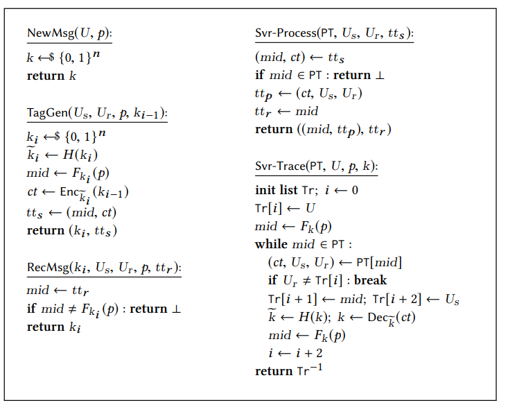
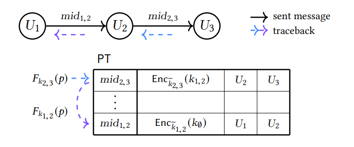

# [KTW22,ESORICS] Anonymous Traceback for E2EE

> 源文件：`[KTW22,ESORICS] Anonymous Traceback for E2EE.pdf`（PDF 原文保留，本文由 OCR 识别生成，轻微修正拼写；OCR 源文件含叠加文本框导致的重复内容，已去重）

**SUMMARY**: Based on [TMR19,CCS], the authors implement anonymous path and source traceback with minimal modification.

## 1 Background

While TMR19 achieves traceability for EEMS, it does not support anonymous messaging system. And, TMR19 reveals the communication parties to the platform which reveals the sociogram of users to the platform.

## 2 Setting & Goals

Besides the security goals (i.e., confidential and accountability) of TMR19, this work provides anonymity for users in addition.

This work does not provide deniability, since a signature is contained in message for recipients to authenticate the identity of senders.

## 3 Methodology | Roadmap

To show the two schemes of this paper, we begin with the path traceback scheme in TMR19.

### 3.0 Path traceback in TMR19

**TMR19 的路径追踪协议（伪代码）**：

- $\mathsf{NewMsg}(U, p)$: $k \leftarrow \{0,1\}^n$
- $\mathsf{Svr\text{-}Process}(PT, U_s, U_r, t_{ts})$: $(mid, ct) \leftarrow t_{ts}$; if $mid \in PT$ return $\perp$; $t_{tp} \leftarrow (ct, U_s, U_r)$; $t_{tr} \leftarrow mid$; return $((mid, t_{tp}), t_{tr})$
- $\mathsf{Svr\text{-}Trace}(PT, U_s, p, k)$: init list $\Gamma_r \leftarrow 0$; $mid \leftarrow F_k(p)$; while $mid \in PT$: $(ct, U_s, U_r) \leftarrow PT[mid]$; $tr[i] \leftarrow U$; if $U_s \neq tr[i]$: break; $tr[i+1]$; $k \leftarrow H(k)$; $k \leftarrow \mathsf{Dec}_k(ct)$

**路径追踪示意**（发送消息 traceback）：

| $U_1$ | $\xrightarrow{mid_{1,2}}$ | $U_2$ | $\xrightarrow{mid_{2,3}}$ | $U_3$ |
|---|---|---|---|---|
| $F_{k_{1,2}}(p) \rightarrow mid_{1,2}$ | $\mathsf{Enc}_{\overline{k_{1,2}}}(k_\emptyset)$ | $U_1$ | $U_2$ | |
| | $F_{k_{2,3}}(p) \rightarrow mid_{2,3}$ | $\mathsf{Enc}_{\overline{k_{2,3}}}(k_{1,2})$ | $U_2$ | $U_3$ |

- $k_{i}$: one time key (OTK)
- $mid$: one time message tag from OTK (identify & bind plaintext and sender)
- $\mathsf{Enc}$: link the sender and its previous node

Random oracle is used to block.

### 3.1 Anonymous path traceback

Based on the above scheme, the idea of this anonymous scheme is straightforward.

1. $C_{pk}$: Encrypting the identity of the sender with OTK $k_{i}$ to preserve anonymity;
2. $\mathsf{Sig}$: Signing the whole message with the sender's $pk$, and encrypting the signature to avoid identity leakage;
3. $ts$: using timestamp to avoid replace attack.

**Send tag**（发送节点构造的标签，沿路径逐跳转发）：

| Send tag | $C_{k}$ | $C_{pk}$ | $C_{sig}$ | timestamp |
|----------|---------|----------|-----------|-----------|
| $F_{k_i}(p) \rightarrow mid$ | $\mathsf{Enc}_{k_i}(k_{i-1})$ | $\mathsf{Enc}_{k_i}(pk_s)$ | $\mathsf{Enc}_{k_i}(\mathsf{Sig}_{sk_s}(mid, C_{pk}, C_k, ts))$ | $ts$ |

### 3.2 Anonymous source traceback

The above scheme reveals the path from the reporter to the root to the platform, which undermines E2EE privacy. Therefore, this part tries to reveal only the originator to the platform.

For a trace-based scheme, anonymous source traceback is impossible in the single-server setting (Because the trace algorithm is step-by-step). Naturally, the authors divided the server to non-colluding servers to store trace and message information respectively.

The additional ephemeral signature is provided to the trace server to verify the validity of the query from the message server.

**Trace tag**（存于 trace server，用于定位源）：

| Trace Server | tag | $C_{k}$ | timestamp | One-time key |
|--------------|-----|---------|-----------|--------------|
| | $mid$ | $\mathsf{Enc}_{k_{i}}(k_{i-1})$ | $ts$ | $pk_{eph}$ |

**Message tag**（存于 message server，与消息关联）：

| Message Server | tag | $C_{pk}$ | $C_{sig}$ | timestamp | One-time key | One-time Sig |
|----------------|-----|----------|-----------|-----------|--------------|--------------|
| | $mid$ | $\mathsf{Enc}_{k_i}(pk_s)$ | $\mathsf{Enc}_{k_i}(\mathsf{Sig})$ | $ts$ | $pk_{eph}$ | $\mathsf{Sig}_{eph}$ |

其中 $pk_{eph}$ 与 $\mathsf{Sig}_{eph}$ 为额外的一次性公钥/签名，用于 trace server 验证 message server 查询的有效性。

## 4 Evaluation

The performance of the two schemes is very similar to TMR19, since they do not introduce additional heavy loaded cryptographic operations.

## 5 Observation & Insights

The authors argue that they do not design anonymous tree traceback because tree traceback reveals too much (unnecessary) information to the platform. However, from my observation, this probably because their solution cannot achieve anonymous tree traceback trivially.

This work is straightforward. What the author does is exactly what the reader thinks.

There is no specific challenge in this work.
