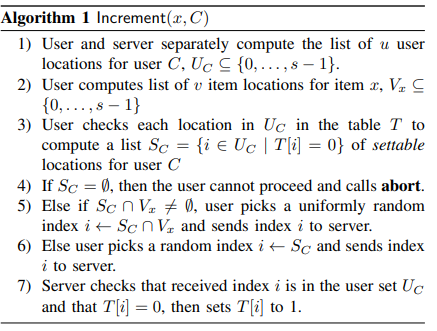
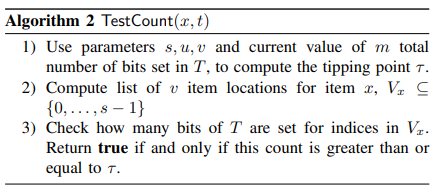
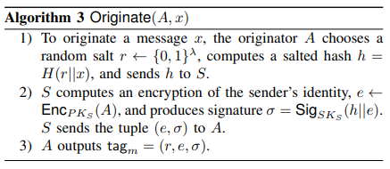
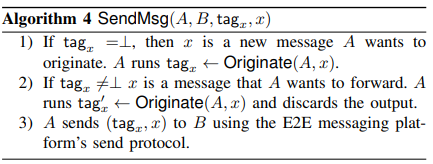
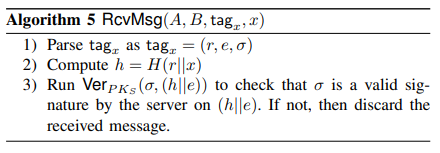
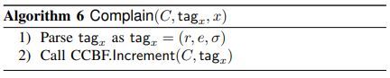
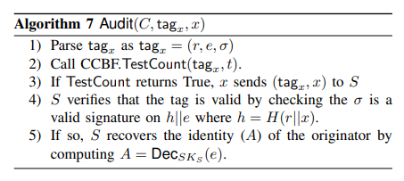

# [LRTY22,NDSS] (FACTS) Fighting Fake News in Encrypted Messaging with the Fuzzy Anonymous Complaint Tally System

# I. INTRODUCTION

- Fake News: Created by low credibility sources,spread mostly by unwitting humans, not bots

网络上假消息的泛滥对政治话语产生了重大影响，并导致了暴力事件。像Facebook和YouTube这样的大型服务已经开始通过手动审核和自动机器学习技术的组合来删除或标记伪造或误导性内容。

## Moderation

- Social Platforms

  - By Algorithm: Keyword identification,blacklists,machinelearning
  - Crowdsourcing: A group of average users can match the accuracy of professional fact checkers

然而，在端到端加密的消息系统(如Signal、WhatsApp、Telegram)中，也存在“Fake News”，此时处理假新闻会变得更加困难。

## Related Work (Some Tools)

- Forward limiting
- Message franking
- Searchable encryption(blacklists)
- Private set intersection(keywords)
- Private machine learning

但很多这些工具无法涵盖假新闻的细微差别并实现其审查

# Goals, Nongoals and Current Approaches:Traceback

## Goals

众包检测出病毒式虚假新闻的来源

- Crowdsource the detection of fake news
- ldentify sources of viral fake news
- Maintain E2EE privacy and security

## Non-Goals

- Set in stone what specific content should be moderated
- Decide the fate of accounts and content

We want to rely on many users complaining about a message-to identify fake news

## Traceback

On a message complaint,the path is revealed.

(单个用户就可以揭示整个路径，意味着任何内容都可能被某个恶意用户还原)

## Setting

Assumptions

- Messaging system is a centralized E2EE platform
- All messages are original or forwarded
- Complaints are rare relative to number of messages sent (所以用户不会投诉看到的每一条消息)

Actors

- Server *semi-honest* (honest but curious, 否则就不止是传播Fake News了)
- Most users *semi-honest*
- Some users *malicious*

# Fuzzy Anonymous Complaint Tally System(FACTS)

## Setting

Users can

- Send and forward messages
- Complain about messages
- Start audits when complaints have reached a threshold(当用户看到某条消息被多次举报时，可以告诉服务器举报数量超出了投诉阈值，服务器应进行审核)

Server

- Transmit messaging
- Moderate reported content/originator
- Store complaint information obliviously
- Recover originator upon audit

Security

- Users should not be able to:

  - Complain about a message they haven't received
  - Manipulate number of complaints for a message by asignificant amount
  - Falsify message originator

Privacy

- Users and server should not be able to:

  - See what users are complaining about
  - Complain about a message they haven't received

## CCBF Construction

The CCBF consists of a single size-s bit vector T and two operations:

- Increment(x, C): Increases the count by 1 for item x according to user id C.

<!-- 飞书原始链接: https://internal-api-drive-stream.feishu.cn/space/api/box/stream/download/authcode/?code=YWQ2Mzc3NzE2YTU4OTFjOTFmOTU5ODgyYTAxNjYwNjlfNzc4OTcwMmQzMGI4NTJjNTAxOGMzYTkwOGYxYjgzNzFfSUQ6NzIyMzAxNDQ3ODcwNjA2NTQzNl8xNzg1NDYxOTA1OjE3ODU0NjU1MDVfVjM -->

- TestCount(x, t): Returns true if the number of increments performed so far for item x is probably greater than or equal to t.

<!-- 飞书原始链接: https://internal-api-drive-stream.feishu.cn/space/api/box/stream/download/authcode/?code=NTA2YjU2ZDc5M2Y4NzUyZGU2MmMzNmJiODgwYjRkMDhfMmQ0MmEwZTkzNDllMDQ4ODM4OTFkYjg3MzNkMDYzNjVfSUQ6NzIyMzAxNDQ0ODQzNTQ2MjE0Nl8xNzg1NDYxOTA1OjE3ODU0NjU1MDVfVjM -->

## FACTS的构建

FACTS is a tuple of protocols FACTS = (Setup, SendMsg, RcvMsg, Complain, Audit). The first is used to set up FACTS, the next two are used to send and verify messages, while the last two methods are used to issue complaints and audit received messages.

- Setup(c): This takes as input the total number of users and initiates the FACTS scheme for c users.

<!-- 飞书原始链接: https://internal-api-drive-stream.feishu.cn/space/api/box/stream/download/authcode/?code=MjBiMTQxYzUwNGZjMGEwNjI3MTE3MmI2NDZlMWEwNzBfMTIyMTA1YTYwNGY2YzAzNzA5ZjY0NTFhMTU5MmU0ODJfSUQ6NzIyMzAxNDUyNzczNzA4NTk1Nl8xNzg1NDYxOTA1OjE3ODU0NjU1MDVfVjM -->

- SendMsg(A, B,tagx , x): This method is used by a user A to send a message x to another user B. This may be a new message originated by A (indicated by tagx =⊥) or a forward of a previously received message.

<!-- 飞书原始链接: https://internal-api-drive-stream.feishu.cn/space/api/box/stream/download/authcode/?code=ZTQ0MzA1Y2ZhOTFkMjNlZTgyOGRhMWFhYTYyNjg0NjhfZDk4NTRiNmNkZmE4YTg4M2Q3Mzk5YmRlYzk4YzM0NmRfSUQ6NzIyMzAxNDU2MTMwODQwOTg1OV8xNzg1NDYxOTA1OjE3ODU0NjU1MDVfVjM -->

- RcvMsg(A, B,tagx, x): This algorithm is run by B upon receiving a message (tagx , x) from A. This algorithm checks whether tagx is indeed a valid tag generated by A on message x. If this is the case, then B accepts the message, otherwise he rejects the message.

<!-- 飞书原始链接: https://internal-api-drive-stream.feishu.cn/space/api/box/stream/download/authcode/?code=NjgzMzM3NGJhNWZmZjg0N2Q2ZWU0YjJmYWU5MThlZmZfZTVkYmVjYzgwNTE5ODYxYTdmN2YyM2JjZDFjMjhhYThfSUQ6NzIyMzAxNDU4Nzg4MDI0MzIwM18xNzg1NDYxOTA1OjE3ODU0NjU1MDVfVjM -->

- Complain(C,tagx, x): This protocol is run by a user C to complain about a received message (tagx , x).

<!-- 飞书原始链接: https://internal-api-drive-stream.feishu.cn/space/api/box/stream/download/authcode/?code=NzA0MjQ2OGU0NDgyN2E0YTg2ZmRjNjE5MjlkZjFkZTBfM2EwNjQ4MzA1OTE2ZmM3OGM5NTJkNjNmODM0NjJmY2JfSUQ6NzIyMzAxNDYyMjY1MTY0NTk1NF8xNzg1NDYxOTA1OjE3ODU0NjU1MDVfVjM -->

- Audit(C,tagx, x): This protocol issues an audit of a message x revealing (tagx , x) to S. This will be called by C when the number of complaints on m exceeds a pre-defined threshold (with high probability).

<!-- 飞书原始链接: https://internal-api-drive-stream.feishu.cn/space/api/box/stream/download/authcode/?code=OWU4NDcxODNjNTI5OTUzZDZhOTI2ODFiY2YwN2M0ZjZfMDMzMGQzZGJkY2M4Njg4MzEzNTQyZjAxYzNmYjQyMTFfSUQ6NzIyMzAxNDY1OTMwNDE5NDA1MF8xNzg1NDYxOTA1OjE3ODU0NjU1MDVfVjM -->

# SECURITY OF FACTS

## A. Adversary Model

two different types of adversaries against FACTS

- honest-but-curious server S
- adversary controlling a group of malicious users who do not collude with the server

## B. Privacy

### Privacy vs. Server

#### 定义

a definition for privacy against a semi-honest server who may also collude with some semi-honest users:

- unless a message is audited or is received by an adversarial user, the server learns no information. In particular,
- the server not able to tell whether any message is a new message and how many complaints this message may have.

#### 表现

- FACTS is private against a semi-honest server

### Privacy vs. Users

#### 定义

a third party adversary that tries to learn information about the messages and complaints in FACTS.

- a user cannot distinguish a new message from a forwarded message unless another corrupted user has previously seen that message.
- a malicious user cannot learn the identity of the message originator

#### 表现

FACTS achieves privacy against malicious clients.

## C. Integrity

- no adversary controlling a subset of the users should be able to frame an honest user as the originator of an audited message he did not originate
- an adversary controlling a subset of the users should not be able to significantly delay the audit of a malicious message
- an adversary controlling a small set of users should not be able to significantly speed up the auditing of a targeted message

### 表现

- The FACTS scheme is unforgeable

# 关于FACTS和STAR

- FACTS相比STAR主要就是加不了这个aux附加信息
- FACTS加不了的主要原因就是，它的零散标记只翻转对应消息，只有集中上报，也就是最后处理消息来源的时候才会收到原消息x，这个时候已经没有机会加aux了。
- 问题是如果我想在零散标记阶段加aux，那么FACTS这个本身基于位翻转的小开销方案就要大改。从信息的角度来说，我1bit已经带不了附加信息了。