# [LSTY25,CCS]End-to-End Encrypted Git Services

[Li 等 - 2025 - End-to-End Encrypted Git Services.pdf](<./assets/Li 等 - 2025 - End-to-End Encrypted Git Services.pdf>)
<!-- 飞书原始链接: https://internal-api-drive-stream.feishu.cn/space/api/box/stream/download/authcode/?code=NjQzMjc3YTcwNmFlN2JiZGRjODljZjgzNmYxNjgxYjBfYTJlZDVhNjRmODE2OTk1MGNhM2IxYzk4NTlkOTcyM2FfSUQ6NzU3NDc0Nzg1MDIyOTQ1MjAwMl8xNzg1NDYxOTY3OjE3ODU0NjU1NjdfVjM -->

[Git Services.pptm](<./assets/Git Services.pptm>)
<!-- 飞书原始链接: https://internal-api-drive-stream.feishu.cn/space/api/box/stream/download/authcode/?code=NzJiZWU3MjZjZGRiYzMxMmJhNmRkM2E3NDBhNTI4ZWNfZGFhYzgyNjFiYzU3YmQ5MTI1MDk4NjcyNDJlNjhmZDVfSUQ6NzU3NDc0Nzg1MTAwNTA1NDEzN18xNzg1NDYxOTY3OjE3ODU0NjU1NjdfVjM -->

[Git Services.pdf](<./assets/Git Services.pdf>)
<!-- 飞书原始链接: https://internal-api-drive-stream.feishu.cn/space/api/box/stream/download/authcode/?code=MDhmYWUwODc3MjMyMmYzZDIxNTQzMjZiMzFmZWEzZTVfY2Y4NzJmNmVmMGE4MzE3NjYwMWFlNTU5YzY5YTg3NzdfSUQ6NzU3NDc0ODM1NzkxNTExODgxN18xNzg1NDYxOTY3OjE3ODU0NjU1NjdfVjM -->

不支持密钥更新的前向后向安全，默认共享全版本（共享密钥在仓库中伴随更新）

share是一对一，并且share操作等于一次仓库更新

非重点技术可以作为扩展部分书写，比如这里完全没涉及访问控制，登录机制和用户便携性

## GIT元数据

- **更新元数据：**SGitChar保护 操作类型（插入 / 删除）、修改位置（如行号、字符位置）、修改长度、版本更新频率；
- **结构元数据**：文件名、目录结构、文件数量、文件大小等；git平台需要通过文件名和路径追踪文件
- **行为元数据**：用户访问时间、协作关系（谁与谁共享）、编辑频率等。共享需通过服务器传递共享请求

## 架构

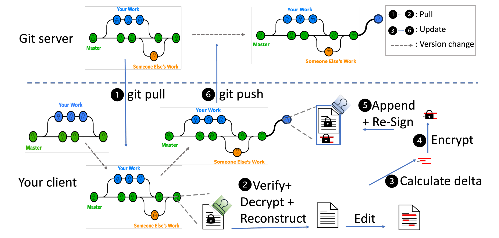
<!-- 飞书原始链接: https://internal-api-drive-stream.feishu.cn/space/api/box/stream/download/authcode/?code=ZmYyOWRiZGZjNDhmYzE4MTkzY2RhNTQ0MThhNjdiZThfZDYwNzcwOTdjNGNlZmM5Y2U0NWI4YjY1ZTEzYjlmZjlfSUQ6NzU3NDc0Nzg1MzM1MzA3Nzk0OV8xNzg1NDYxOTY3OjE3ODU0NjU1NjdfVjM -->

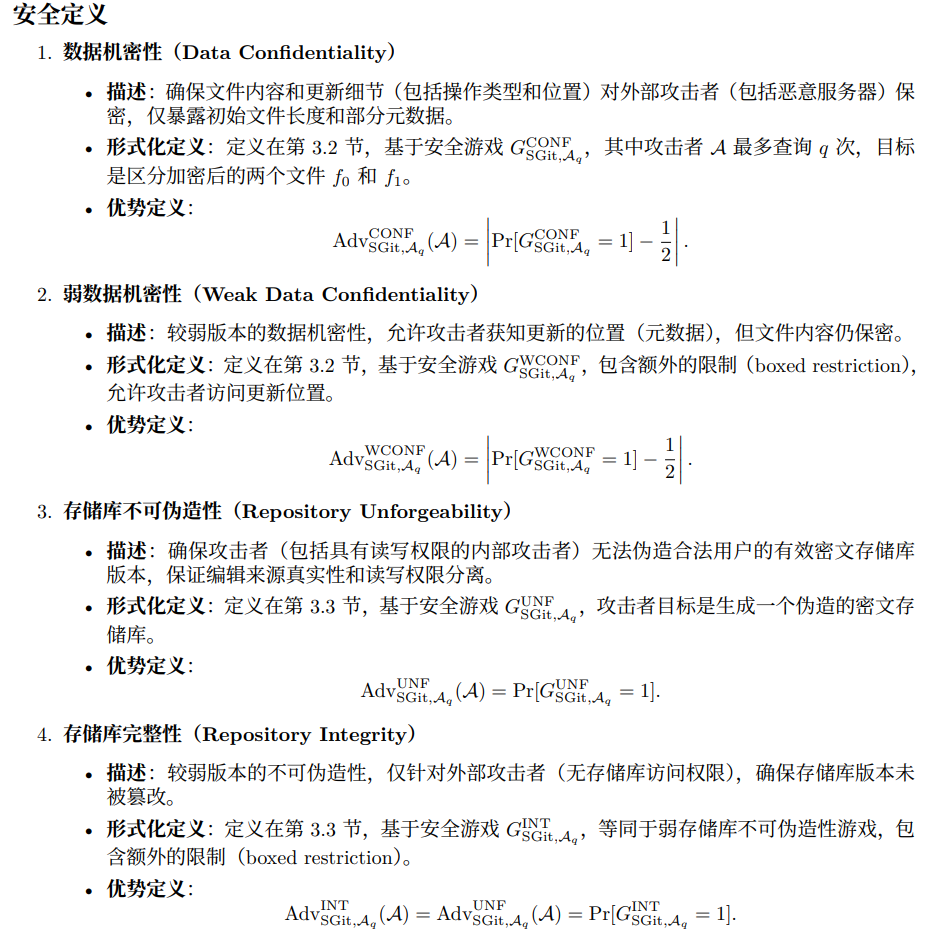
<!-- 飞书原始链接: https://internal-api-drive-stream.feishu.cn/space/api/box/stream/download/authcode/?code=ZjBiNWI2M2UwZWQwNGM5OGY0OTlhMzBlNTY0ODBiY2FfYWNjYTQ0YzBkMGVhYzVhYzFkNDZlYWNhNTgyYzE1YzZfSUQ6NzU3NDc0Nzg1MjQ2MDI4MTA0OV8xNzg1NDYxOTY3OjE3ODU0NjU1NjdfVjM -->

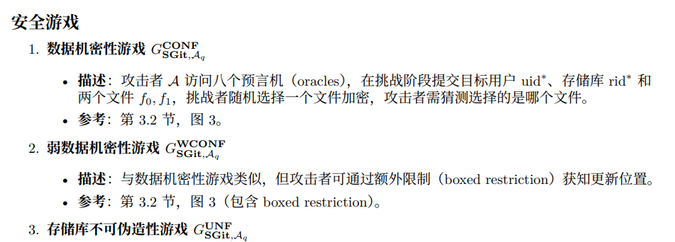
<!-- 飞书原始链接: https://internal-api-drive-stream.feishu.cn/space/api/box/stream/download/authcode/?code=MTQ3NTJlYjdmODcyMTc1YTU1NGNiNTNhNjQzYzRiZTFfYzExYWEzZWQ3YmVlYWYzZTJkMzJlN2E5MmM0ZDk1NTJfSUQ6NzU3NDc0Nzg1MTAwNTAyMTM2OV8xNzg1NDYxOTY3OjE3ODU0NjU1NjdfVjM -->

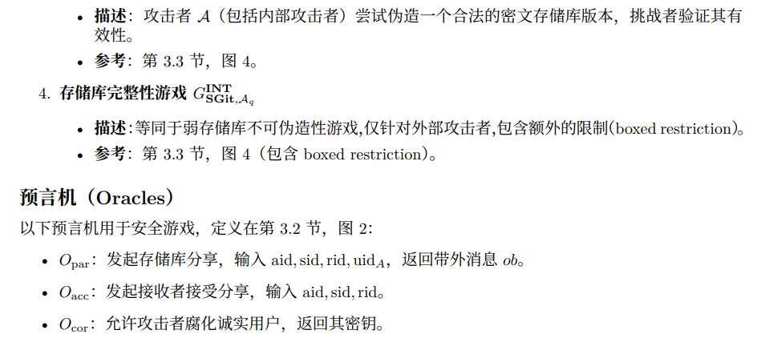
<!-- 飞书原始链接: https://internal-api-drive-stream.feishu.cn/space/api/box/stream/download/authcode/?code=ZmNhZjM4NTI1Mjk4NmI1MjVkNmJiNjcxYjNmODQ5YmFfM2I0ZjBhYzdiODZkNDQ4ODZhYTYyNzgxZDQ0MGFhNjhfSUQ6NzU3NDc0Nzg1MjEyOTU4NjQwM18xNzg1NDYxOTY3OjE3ODU0NjU1NjdfVjM -->

| 操作类型 | 计算开销 | 通信开销 | 存储开销 | 主要瓶颈 |
|---|---|---|---|---|
| 增加接收者 ($f_{acs}$) | 1. 公钥加密操作（$O(1)$ 次） 2. MerkleDAG 局部更新（根哈希计算） | 1. 接收者公钥获取 2. 完整 $f_{acs}$ 文件传输 | 1. $f_{acs}$ 文件增大（每个接收者增加固定大小条目） | 1. 公钥加密耗时 2. 接收者身份验证 |
| 更新版本 | 1. 文件差异计算（$O(n)$，$n$ 为文件大小） 2. 差异加密（$O(m)$，$m$ 为修改量） 3. 多级 MerkleDAG 更新（多个节点哈希重计算） | 1. 差异内容传输 | 1. 新版本文件存储（差异部分） | 1. 大文件差异计算耗时 2. 频繁更新导致哈希链膨胀 |

## 实现：

### 对比方案

- Git-crypt：基于 GPG 的文件级加密工具。

Git-crypt：基于 GPG（GNU Privacy Guard），默认 AES-256，密钥由用户初始设置时生成，通过 GPG 密钥对实现多用户共享加密仓库。以文件为单位进行加密，而非逐行或逐字符。未处理元数据

提交/还原时，clean filter/smudge filter

- Tink：Google 开发的加密库，支持文件级和目录级加密，使用 AEAD。
- SGitLine：按行分割文件，每行用独立密钥加密，保留行号等结构信息。暴露行号和操作类型（插入 / 删除），通过增量加密和 MerkleDAG，大幅减少加密开销和存储占用。
- SGitChar：计算字符级差异，仅加密修改的字符，附加到旧版本密文后。完全隐藏修改位置和操作类型，仅暴露更新时间和密文大小变化，在保护元数据的同时，通过差异加密平衡性能与隐私。

### 贡献

-SGitChar 首次在 Git 场景中实现隐藏更新位置和操作类型

在大型项目中加密时间减少 30%-40%，仓库体积增长降低 40%-60%

### 局限

key rotation

文件名和目录结构未加密

##  Chapter 1

### 介绍GIT

### 动机：为什么需要端对端安全

- Git平台上的隐私需求增长

——但GIt并无e2e，有数据泄露风险

- 协作版本更新过程中，需要精细的身份控制

——目前方案或有访问控制，但都依赖Git平台诚实

- 介绍相关的，满足e2e的Git方案和secure message方案，但git的情况很复杂，很有必要研究

### 技术不足：GIT离端对端安全差什么

- 直接用e2e云存储不可行

1. 已有的方案过于基础
2. Git 的 push,pull操作与一般云存储不同——计算差额
3. 更新，导致需要更强的保密性完整性和协作下的访问控制
4. 版本更新链， 不同版本间应用普通云存储的整体加密，开销极大

- 现有的临时GIt服务不够安全

1. Confidently:Git-ctypt, gringotts 用确定性加密
2. Int Git-Secret [34] and  Keybase [9] 混合加密，不能防御注入攻击、删除攻击（未对目录、版本链签名）--需要respority int
3. 作者身份追踪，读写访问分离依赖git平台--需要相关内容不可伪造
4. 所以形式化分析很有必要

- 方案开销和适配

1. 平凡方案（每次全签密）开销过大
2. 现有方案也大，需要一种细粒度控制的方案
3. 需要更好的可部署性

- 总结方案目标

e2eGit超出了当前的技术水平,本文：识别并形式化关键安全属性，给出开销最小且与现有Git兼容的可证明安全的构造。

**研究成果**

- 形式化语法+安全模型
- 构造：SGitLine,SGitChar
- 实现与实验对比

### 技术概述-我们怎么做

- 整体框架--不考虑身份认证

- 安全定义

1. 研究思路，模仿 ideal access control
2. 数据保密性：INDCPA基础上考虑share, updata； 更新元数据应保持隐私；
3. 仓库完整性：强于文件完整性；RW分离--提出强版本unforgeability，同时弱版本有其实用性，不是没用

- 阐述其安全高效的方案构建思路

总结提炼目前遇到的问题

1. 平凡解开销大，但git服务有diff功能。文件级别的处理，开销不小，且有安全漏洞
2. **两难（开销与安全）：文件整体加密再推送则git无法计算差异；细粒度加密暴露更新元数据。**
3. 需解决读写分离，编辑者身份认证

我们的构造工作

1. 提出Line 级别构造
2. 为解决不可伪造性，加入可验证机制：签名用hash-sign, 加密用对称签密。但是上述缺点在于暴露更新元数据，且通信成本可以继续降低
3. 为应对“”两难“”，提出 char 级别方案-对密文而非明文去重:diff-enc-sign-pull 上个版本密文计算密文的差异-上传差值

**相关工作**

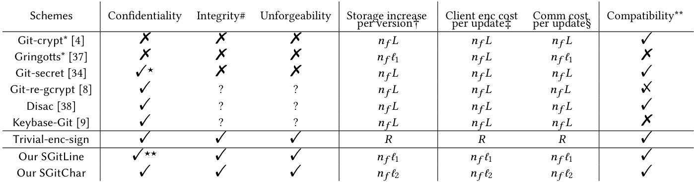
<!-- 飞书原始链接: https://internal-api-drive-stream.feishu.cn/space/api/box/stream/download/authcode/?code=OGJiNTA5ZjMzNGNmZGZlMzg3MjdjYTM0YTgzZDNhNzRfZTVhYmIwNzQ5OGM4OWU2YmQxMDFjMzhiMDRlMTJkOGVfSUQ6NzU3NDc0Nzg1MDk4NDQ0MzA5NF8xNzg1NDYxOTY3OjE3ODU0NjU1NjdfVjM -->

| 方案 | 核心实现 | 安全性局限 | 效率与兼容性问题 |
|---|---|---|---|
| Git-crypt [4] | 基于文件级加密，使用 AES 加密，通过文件哈希作为 IV 实现存储压缩。 | 采用确定性加密，泄露数据模式（相同明文对应相同密文），易遭"注入攻击"[24]；缺乏完整性保障。 | 仅对修改文件重加密，但微小修改仍需生成全新密文，存储优化对多文件小修改场景无效。 |
| Git-remote-gcrypt [8] | 对仓库完整新版本生成压缩包（packfile）后加密，支持增量压缩。 | 安全性未经过形式化分析；加密压缩包导致服务器无法解析版本结构。 | 不支持指定版本拉取、服务器端合并等 Git 核心操作；更新开销与仓库整体大小相关。 |
| Keybase-Git [9] | 结合 Keybase 服务器实现加密协作，采用混合加密范式。 | 安全性未经过形式化分析；依赖 Keybase 服务器，未解决服务器篡改风险。 | 与 GitHub 等现有 Git 服务器不兼容，仅限 Keybase 生态使用。 |
| Gringotts [37] | 基于行级确定性加密（固定 AES 的 IV），支持跨文件压缩。 | 确定性加密泄露数据模式；假设服务器诚实，未考虑服务器恶意行为（如篡改、删除）。 | 行级加密仍可能因短行导致存储开销较大；访问控制模型较弱。 |
| Disac [38] | 采用基于属性的签名（ABS）强化访问控制。 | 安全性未经过形式化分析；未解决完整性和抗伪造问题。 | 加密与权限管理开销较高，兼容性未明确。 |
| 其他开源工具（如 Git-secret [34]） | 允许用户选择加密文件（敏感文件），其余明文存储，采用混合加密。 | 未加密文件直接暴露；仓库完整性无法保证（服务器可注入 / 删除文件而不被检测）。 | 加密开销与修改文件大小相关；依赖用户手动选择加密范围，易因配置失误导致泄露。 |

`git-crypt` 提供对Git仓库中文件的**透明加密**。这意味着您在本地工作目录中看到和编辑的是解密后的明文文件，但当您执行 `git push` 时，被选定的文件会自动加密后再提交到远程仓库。对于没有密钥的协作者，他们仍然可以克隆和提交仓库，只是无法看到加密文件的内容，这实现了公私内容混合存储。

可以实现基础的共享（公钥，或者私钥通过链接传递）

Although git-crypt protects individual file contents with a SHA-1 HMAC, git-crypt cannot be used securely unless the entire repository is protected against tampering (an attacker who can mutate your repository can alter your .gitattributes file to disable encryption). If necessary, use git features such as signed tags instead of relying solely on git-crypt for integrity.--unforge，int不能保证,其本身没有签名验证机制。本方案侧重加密。不信任服务器具有内容的“读取”权限。但是，如上所述，因为它缺乏对仓库整体的签名机制，所以它**无法抵御一个具有“篡改”能力的恶意服务器**。

Gringotts: it may act maliciously, but will not misbehave if it can be caught doing so.

一整套系统，和git没什么关系，read-only。直接假设ECDSA unforge，不关心服务器delete, ignore数据的可能性--半可信服务器

`git-secret` 不是一个透明的加密工具，而是一个围绕`gpg`构建的**命令行封装工具**。它的主要用途是在一个团队内安全地存储和共享敏感信息（如密码、API密钥、证书），而不是加密整个项目代码。

**非透明操作**: 用户需要显式地运行命令来加解密。

- `git secret add <file>`: 标记一个文件为需要加密。
- `git secret hide`: 使用所有已授权用户的GPG公钥加密被标记的文件。加密后的文件通常以 `.secret` 为后缀。
- `git secret reveal`: 使用用户自己的GPG私钥解密文件。

**密钥管理**:

- 它在仓库的 `.gitsecret/` 目录下维护一个“钥匙环”，其中包含了所有被授权协作者的GPG公钥邮箱地址。
- 要添加一个新成员，你需要先导入他的GPG公钥，然后运行 `git secret tell <``his-email@example.com``>` 将他添加到仓库的授权列表中。

**工作流**: 典型的工作流是，将原始的敏感文件（如 `config.yml`）加入 `.gitignore`，然后用 `git-secret` 加密它生成 `config.yml.secret`，最后将这个加密后的文件提交到仓库中。

部分加密,所以没有对整个仓库状态的签名--一个恶意的服务器可以轻易地对那些**未加密的文件**进行操作，用户无法检测--int, forge

Git-remote-gcrypt是一个 **Git远程助手 (remote helper)**。它允许你将整个Git仓库（包括版本链）以加密形式存储在任何不被信任的存储位置，例如一个简单的FTP服务器、rsync目录或云存储桶。它保护的是整个仓库的数据流，而不仅仅是单个文件。

**远程助手**: 它通过拦截标准的 `git push` 和 `git pull` 命令工作。你需要将你的远程仓库URL配置为以 `gcrypt::` 开头。

**加密对象**: 当你推送时，`git-remote-gcrypt` 会获取Git生成的对象（packfiles等），并使用GPG对它们进行加密。它不会改变Git的内部工作方式，只是在数据传输前加了一层加密。

**不透明的远端**: 远程服务器上存储的是一堆加密过的二进制文件。服务器完全不知道这是一个Git仓库，因此无法执行任何Git原生操作（如分支查看、合并请求、垃圾回收等）。-- 不完全适配

**密钥管理**: 访问权限由谁拥有解密的GPG密钥决定。可以配置为使用对称加密（密码）或非对称加密（GPG公钥/私钥对）。

在推送（push）前对Git生成的“packfile”（一个包含多个Git对象的压缩文件）进行加密

Disac 协议能够在无需中央服务器支持的情况下实现文件粒度的读写分离访问控制。

 Keybase-Git专门与Keybase服务器协同工作，

## Chapter 2

支持哪些核心操作（概述+详述），这些操作的输入、输出及交互逻辑是什么？

覆盖原生 Git 的核心协作流程--**兼容性**

状态、权限管理--**安全性验证**

差异计算（ComDiff）--**高效性**

**正确性约束**

$$\Pi = (\Pi_{\text{reg}}, \Pi_{\text{auth}}, \Pi_{\text{init}}, \Pi_{\text{update}}, \Pi_{\text{pull}}, \Pi_{\text{shareI}}, \Pi_{\text{shareII}})\\\Pi_{\text{reg}}\langle uid; st_S\rangle \rightarrow \langle(cred,km); st_S' \rangle \\\Pi_{\text{auth}} \langle (uid, km); st_S \rangle \rightarrow \langle st_U ;st_S' \rangle \\\Pi_{\text{init}}\langle(st_U, km, rid, f^{pt}); st_S\rangle \rightarrow \langle repo_{new}; st_S'\rangle\\\Pi_{\text{update}}\langle(st_U, km, rid, repo_{old},f^{pt}_{new}); st_S\rangle \rightarrow \langle repo_{new}; st_S'\rangle\\\Pi_{\text{pull}}\langle(st_U, km, rid, repo_{old}); st_S\rangle \rightarrow \langle repo_{new}; st_S\rangle\\\Pi_{\text{shareI}}\langle(st_U, km, rid, acs,repo_{old},uid_{re}); st_S\rangle \rightarrow \langle (repo_{new},oob); st_S' \rangle\\\Pi_{\text{shareII}}\langle(st_U,rid, oob); st_S\rangle \rightarrow \langle st_U '; st_S'\rangle$$

该架构不考虑访问撤销问题

正确性包括：

注册该服务的诚实用户可以使用注册时使用的相同用户ID和凭证进行身份验证；

由诚实用户初始化、更新或共享的存储库可以通过其原始内容进行检索。

## Chapter 3

用密码学手段包装一个不可信的服务器 ，使其模拟一个完全可信的服务器。并且曝光过后，对于服务器而言其操作没有改变，对于用户来说的运行逻辑也没有改变。此时的新任端点是密码学原理。

confident-对应读取权限，主要针对防御被入侵的服务器读取用户加密的数据。

unforgeability-对应防御恶意服务器篡改文件

基础定义：一个服务器，选择性的用户腐坏

预言机主要运行用户端算法，并为攻击者提供与诚实用户交互和篡改诚实用户的接口

**Data confid**

定义动机：为Git服务模拟IND-CPA

**由于保密的不仅仅是文件，还有更新信息。受损服务器可以从多个版本的差异中得到更多信息，所以这里的机密性强于cca**

Git 服务保密性模型

**Dynamic Updates:**攻击者可以查询密文以获取仓库的更新版本，其中后续版本的密文可能由先前版本的密文导出，而不仅仅是明文。这比标准 CCA 更复杂，在标准 CCA 中，密文是直接从明文生成的。

**与诚实用户交互：**攻击者可以通过预言机与诚实用户交互，以共享仓库或腐蚀用户，模拟协作式 Git 环境。

**Multiple Versions:** 该模型考虑了多个仓库版本，其中密文跨版本关联，与单消息 CCA 场景相比，增加了对手的能力。

- **强机密性**：内容和元数据（如编辑位置）均隐藏（SGitChar）。
- **弱机密性**：内容隐藏，更新位置可能暴露（SGitLine）。

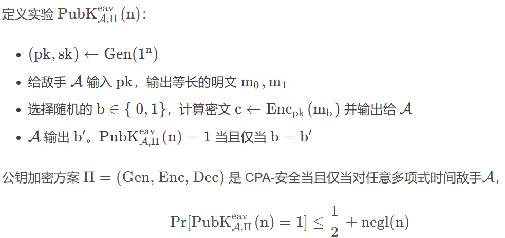
<!-- 飞书原始链接: https://internal-api-drive-stream.feishu.cn/space/api/box/stream/download/authcode/?code=ZWZhNjAyZWU5NzRjOGU2NGQ2YTJjZmI2YmFiZjAzYjVfMWVmODliNjlkNGFkZjk1MmE4MjMyN2ExMGYwYzJlZDlfSUQ6NzU3NDc0Nzg1MjU2MDczMTMzM18xNzg1NDYxOTY3OjE3ODU0NjU1NjdfVjM -->

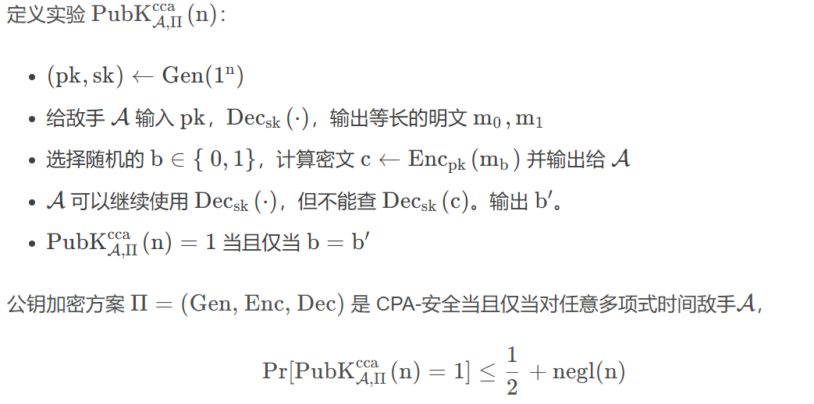
<!-- 飞书原始链接: https://internal-api-drive-stream.feishu.cn/space/api/box/stream/download/authcode/?code=NmE5ODc0OTZiODdhYjI0YWVmMTRlNjgyNmMwZWNmOGRfMTVkZTYxODEyNTg3MjE3OTYwMDVjYzQyNDI5ZmM5NzNfSUQ6NzU3NDc0Nzg1MTAwNTEzNjA1N18xNzg1NDYxOTY3OjE3ODU0NjU1NjdfVjM -->

**目标**：敌手尝试区分两个明文文件f0,f1的加密版本。

**敌手能力**：敌手可以访问8个oracle，模拟用户初始化、更新、共享和腐败等操作。敌手还可以查询更新密文（基于先前密文的更新）。

| 成功条件限制 | 具体条件/规则 | 目的 |
|---|---|---|
| 无效挑战排除 | 目标用户未注册、会话无效、用户对仓库无写入权限 | 防止敌手通过无效输入或不当权限轻易获胜，确保博弈针对有效场景 |
| 内部人员腐化排除 | 敌手不允许腐化任何对挑战仓库具有合法访问权限的用户 | 确保模型捕获的是针对外部人员的安全性，而非内部人员串通攻击 |
| 操作和长度一致 | 挑战文件必须产生相同类型的修改操作和相同的内容长度 | 防止敌手通过观察密文大小或操作类型（侧信道）轻易区分挑战文件 |
| 更新位置一致 | 挑战文件必须具有相同的更新位置（强机密） | 防止敌手通过观察精确编辑位置（侧信道）轻易区分挑战文件 |

**敌手优势**

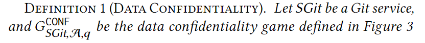
<!-- 飞书原始链接: https://internal-api-drive-stream.feishu.cn/space/api/box/stream/download/authcode/?code=NDk2Yzc4MDkwMjFmMTQ3ZjNiNzUyNTM5ZGZlZWIxNTRfMjAwZGRkYTQ1NGRjZjU4Mzg0ZTFiY2U0NzNkMDgzODhfSUQ6NzU3NDc0Nzg1MTExNDA4OTY2OF8xNzg1NDYxOTY3OjE3ODU0NjU1NjdfVjM -->

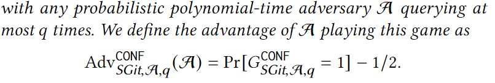
<!-- 飞书原始链接: https://internal-api-drive-stream.feishu.cn/space/api/box/stream/download/authcode/?code=NzI2MjZhYWQzM2E4ZDQzYjllMzkyN2IyY2JjNTYzZjlfOTM2ODRiMTgwODhhODBhZmFkOGE4OWMwZjI1OTA1NDZfSUQ6NzU3NDc0Nzg1MTExNDA3MzI4NF8xNzg1NDYxOTY3OjE3ODU0NjU1NjdfVjM -->

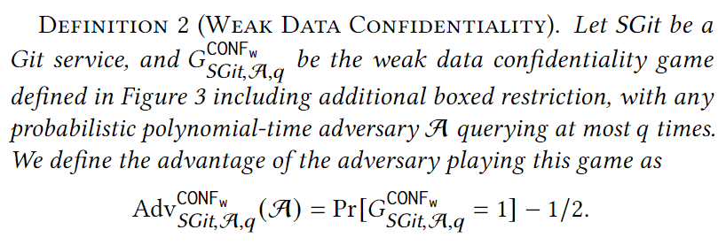
<!-- 飞书原始链接: https://internal-api-drive-stream.feishu.cn/space/api/box/stream/download/authcode/?code=ZGFhODU2OTc3ODY2NDA4ZDMxODhiNzVhNTZlMGE1NjZfNzE1ZjE2OTI1Y2Q3NzQzNDU3ZjRjODAyMThmNDMzYjFfSUQ6NzU3NDc0Nzg1MTAwNTE1MjQ0MV8xNzg1NDYxOTY3OjE3ODU0NjU1NjdfVjM -->

安全博弈

1. C 随机选取b=0,1。 A可访问损坏用户集，全局初始化仓库、密钥等。
2. A访问预言机生成挑战材料包(𝑢𝑖𝑑∗, 𝑠𝑖𝑑∗, 𝑟𝑖𝑑∗, 𝑓 𝑖𝑑∗, 𝑓'0 , 𝑓'1)，并提交f‘0,f’1(以及𝑢𝑖𝑑∗, 𝑟𝑖𝑑∗),此时对A提交的f'有以下限制：必须为有效U下人员(reg后)，必须有活跃会话(auth后)，必须有仓库真实存在且有写入权；必须不是腐败的用户，腐败用户集合必须已经被清除仓库的访问权。
3. C加密f_b并返回.如果仓库没有就新建一个，如果有就拉取上一个版本。计算出f0,f1与上一个版本的差异O0,O1,此处限制：长度相等，操作相同。weak要求位置也相同。即避免A通过提交不合法的f 获取平凡胜利。
4. 判断：A根据返回信息，访问预言机输出b=0 or 1, C判断正误。

**Repository int/ unforgeability**

针对内部人员的不可伪造性强于针对外部人员的完整性

定义动机：确保可验证的写入权限

**unforge：内部（无论有读写权限）人员不能冒充其他人**

**中间带：内部只读人员不能写入**

**Int:外部人员不能读写**

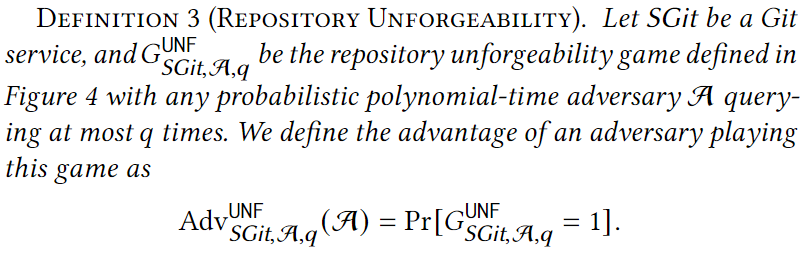
<!-- 飞书原始链接: https://internal-api-drive-stream.feishu.cn/space/api/box/stream/download/authcode/?code=ODY5YjQ0YWFiMTIxMTRlZmVmM2Q2NmFjMzgzZDFiMGJfOWNlOGJmMjUwODU4MDMwYmJhMDA0MWU2MjRhYzQ2ZjdfSUQ6NzU3NDc0Nzg1MTk0ODc4ODkyMV8xNzg1NDYxOTY3OjE3ODU0NjU1NjdfVjM -->

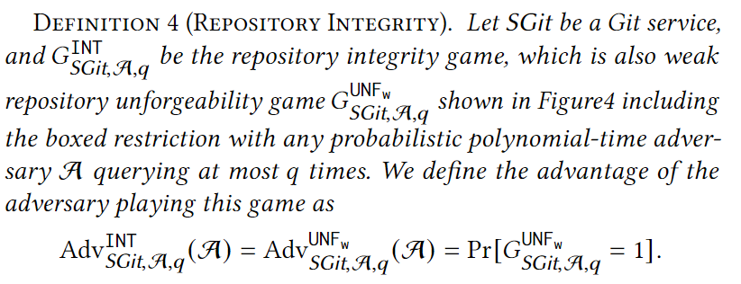
<!-- 飞书原始链接: https://internal-api-drive-stream.feishu.cn/space/api/box/stream/download/authcode/?code=YjJkNjk3MTNhNDdkNTY3ZTk1MDQ3OTFkMjc1ZmMyZTRfZTc4YWY5NWU3NmNjMTAyZWZkMmMzMmI3YzkyNzZiNTFfSUQ6NzU3NDc0Nzg1MDM1MDgyNDY0N18xNzg1NDYxOTY3OjE3ODU0NjU1NjdfVjM -->

安全博弈

1. 全局初始化仓库、密钥等，A可访问损坏用户集。
2. A访问预言机生成挑战材料包(𝑢𝑖𝑑∗, 𝑠𝑖𝑑∗, 𝑟𝑖𝑑∗,repo_ct ')，并提交repo_ct ',此时对A提交的repo'有以下限制：在目标仓库中未出现（排除重复），不是腐败用户发起，用户必须已经注册，是活跃信道。
3. 验证：C根据repo判断正误。repo要有合法的pt+ct形式，weak版本要不由内部损坏用户发起。repo要ct合法且该版本之前不存在，且作者确实为挑战用户

**标准假设：**PKI，IND-CPA安全对称加密$\Pi_{SE}$, IND-CPA安全公钥加密$\Pi_{PKE}$, 强存在性不可伪造数字签名$\Pi _{Sig}$ECDSA, Oracle 下 KDF(HKDF-SHA-256), MerkleDAG抗碰撞哈希(SHA-256)

整体安全模型和签密差距有多大？

SGitChar 和 SGitLine 中的Diff-then-Enc-then-Sign，针对 Git 环境专门应用的签密。

签密针对单一消息，Git服务处理多版本、增量更新，密文依赖复杂。

签密的整体博弈假设单一敌手，Git服务区分外部和内部攻击者。

Git服务强调元数据隐私（SGitChar vs. SGitLine），签密通常不考虑元数据。

签密：

机密性（Confidentiality）：确保消息内容仅对授权接收者可见。

完整性（Integrity）：确保消息未被篡改。

认证性（Authentication）：验证消息来源的真实性。

不可否认性（Non-repudiation）：发送者无法否认发送了消息。

## Chapter 4  

本章提出两种方案SGitLine和SGitChar，并通过形式化分析证明其安全性。两种方案均兼容现有 Git 服务器（如 GitHub），同时在效率与安全性之间实现平衡。

### 工作流程概述

画个图说话。

目标：在保证 E2E 安全的同时，兼容 Git 现有操作（如初始化、更新、拉取、共享），并将开销控制在与 “实际修改内容” 相关的范围内（而非整个文件或仓库）

1. 初始化（reg, auth, init）：用户在本地创建明文和密文仓库，将初始版本加密后同步到 Git 服务器，并附加签名确保完整性。
2. Update：用户基于本地版本修改后，计算与旧版本的差异，仅加密差异部分，生成新密文版本并签名后推送到服务器。
3. Pull: 用户从服务器获取缺失的密文版本，验证签名后解密差异部分，合并为完整明文版本。
4. Share : 所有者通过加密密钥材料并附加签名，向接收者授权访问；接收者解密密钥后获得读写权限。

### SGitLine

1. 初始化（reg, auth, init）：将文件按行拆分，每行用对称加密算法加密；对整个密文仓库计算 MerkleDAG 哈希（用于完整性校验），并以用户私钥签名。
2. Update：通过`ComDiff_line`算法计算新旧版本的行级差异（如插入 / 删除的行），仅加密新增行的内容，对密文仓库应用差异操作后重新签名。
3. Pull: 按行解密

- 安全性：仅满足 “弱数据机密性”—— 无法隐藏更新位置（如哪行被修改）和行长度等元数据。
- 存储：对短行较多的代码仓库，或仅修改行内少量字符（如修正拼写）时，存储开销可能高于明文仓库。

### 安全分析

Weak confid

在强不可伪造签名协议+INDCPA 的公钥加密方案+INDCPA的对称加密方案+KDF随机预言机+抗碰撞merkleDAG前提下：

若能突破，则规约证明：

0：B为confid的挑战者

1：B在回应Opull时对非法uid关联的rid也给回应--A要区分01即能够伪造一个仓库--违背unforge

2: B在回应O_shareI 时oob由随机密钥s替换真实仓库密钥k生成-A要区分12即能够区分s,k的公钥加密结果--违背PKE的INDCPA

3：B在回应O_init 时不通过k=KDF（rid,mk）,换成随机数s--A要区分k与s--违背随机预言机KDF

4：C模拟对称加密的INDCPA博弈，B运算敌手A提交f0f1的差异并保证idx相同

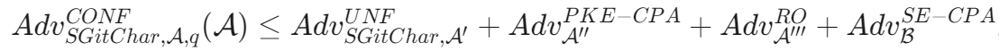
<!-- 飞书原始链接: https://internal-api-drive-stream.feishu.cn/space/api/box/stream/download/authcode/?code=YTBjMDg3MWYwZmUyNjQ0YjI0YzAxZjY0NGNjN2ZiNGVfOTYyYjBkNTY2NDU3YTA2YTBjMjZjNzk3Mjc2NWUzMDRfSUQ6NzU3NDc0Nzg1MzI2OTQwNDg5M18xNzg1NDYxOTY3OjE3ODU0NjU1NjdfVjM -->

具体来说，游戏 1 忽略了 Opull 涉及格式错误密文的所有解密查询。由于 SGitChar 的不可伪造性，对手 A 无法区分这种变化，而 SGitChar 的不可伪造性又可进一步归结为 Isig 和 MerkleDAG 的安全性。游戏 2 将与诚实用户共享的密钥材料替换为随机值，并在响应 Oshare 查询时对这些值进行加密。由于 ПPKE 的 IND-CPA 安全性，这种修改与使用真实密钥材料无法区分。在游戏 3 中，Oinit 查询中仓库加密密钥的推导被随机值所替代。由于 KDF 在给定随机输入时输出的伪随机性，这种变化对 A 来说是隐藏的。对于与挑战相关的查询，游戏 4 将其转换为 ПsE 的 IND-CPA 安全性游戏中对挑战者的挑战，并使用挑战响应作为相应的密文继续进行，由于 IsE 的 IND-CPA 安全性，这无法区分。

Unforge

在强不可伪造签名协议+抗碰撞merkleDAG前提下敌手成功情形：

1. 伪造了新签名-违背不可伪造签名协议
2. 对旧签名套用了新m-违背强不可伪造签名协议

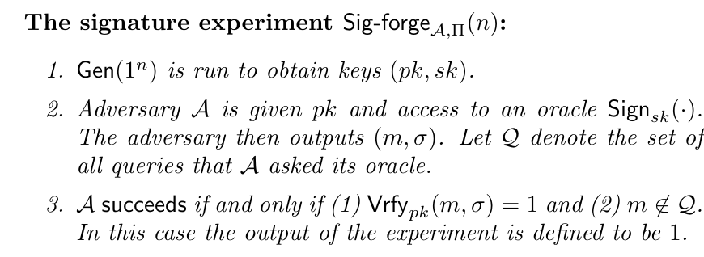
<!-- 飞书原始链接: https://internal-api-drive-stream.feishu.cn/space/api/box/stream/download/authcode/?code=MDA5NGIyNWM3ZjYwZGMxNzQzZmRiNzM4YTZmNjNjYjRfYTAxNDQ5ZGE5ZjE3M2ExZTUyYzkzOGFhOTNkOWI5MTlfSUQ6NzU3NDc0Nzg1MTE1MjE4MjQ2N18xNzg1NDYxOTY3OjE3ODU0NjU1NjdfVjM -->

强版本（m , $\sigma$）均不属于Q， 可以通过认证

1. 签名，m 都是旧的，但是套用到新的仓库信息上--即merkleDAG过程对不同仓库信息得到了相同的值，再得到相同m ,sigma --违背抗碰撞

### SGitChar

- diff(char-wise)，将所有更新操作（如插入 / 删除字符）整合为 “差异集”，仅加密差异部分并附加到旧密文后，隐藏更新位置。

1. 初始化（reg, auth, init）:对整个文件加密（而非按行），计算密文仓库的 MerkleDAG 哈希并签名。
2. Update :通过`ComDiff_char`算法计算字符级差异，加密差异集后附加到旧密文；对新密文仓库重新计算哈希并签名。
3. Pull: 验证签名后，解密差异集，将差异应用到旧明文版本以恢复新明文。

- 安全性：满足 “强数据机密性”—— 隐藏更新内容、位置和操作类型等元数据。
- 效率：开销与 “字符级差异大小” 成正比，对微小修改（如单字符变更）更高效。

缺陷：若本地无仓库历史，拉取最新版本需解密所有历史差异--share出去会遇到的问题

### 安全分析

strong confid

在强不可伪造签名协议+INDCPA 的公钥加密方案+INDCPA的对称加密方案+KDF随机预言机+抗碰撞merkleDAG前提下：

若能突破，则规约证明：

0：B为confid的挑战者

1：B在回应Opull时对非法uid关联的rid也给回应--A要区分01即能够伪造一个仓库--违背unforge

2: B在回应O_shareI 时oob由随机密钥s替换真实仓库密钥k生成-A要区分12即能够区分s,k的公钥加密结果--违背PKE的INDCPA

3：B在回应O_init 时不通过k=KDF（rid,mk）,换成随机数s--A要区分k与s--违背随机预言机KDF

4：C模拟对称加密的INDCPA博弈，B运算敌手A提交f0f1的差异（该版本保证操作类型op，文件长度相同）

<!-- 飞书原始链接: https://internal-api-drive-stream.feishu.cn/space/api/box/stream/download/authcode/?code=ZWNjODhlYjcxMGYwNzY5YjQxNWNlZWIzNjUwMTRjNGJfNzRhYTEwY2UyZjEyZTE3MGRkNGEyZTQ3OTUwOWYwN2VfSUQ6NzU3NDc0Nzg1MjE3OTUyNDgwNV8xNzg1NDYxOTY3OjE3ODU0NjU1NjdfVjM -->

本章的扩展问题：

1. 支持更多 Git 操作

   - 删除文件：通过 “空内容文件” 的更新操作实现。
   - 分支合并：将另一分支的差异集应用到当前分支，兼容 Git 无冲突合并逻辑。
2. 可移植性优化--认证登录的密钥管理：

   - 结合 “端到同端（E2SE）加密” 思想，引入密钥服务器，用户通过密码在多设备间派生密钥，避免依赖本地安全存储。
3. 检索效率优化：

   - 对 SGitChar 设置 “历史依赖长度”（如每 6 个版本），定期重新加密完整版本，避免拉取时解密过多历史差异。

## Chapter 5

从通信、计算、存储、端到端延迟四个维度验证方案优越性

| 模块 | 具体实现 |
|---|---|
| 加密算法 | 对称加密：AES-CTR（128 位密钥）；公钥加密：ECIES（基于 secp256r1 曲线）。 |
| 签名算法 | ECDSA（基于 secp256r1 曲线），哈希函数：SHA-256（替代 Git 默认的 SHA-1 以提升安全性）。 |
| 差异计算 | SGitLine：基于 git diff 的行级差异；SGitChar：基于 diff-match-patch 库的字符级差异。 |
| 兼容性处理 | 对非文本文件（如图片），用 Base64 编码密文为 ASCII 字符，避免 GitHub 格式校验拦截（代价是密文体积增加 30%）。 |
| 对比方案 | 1. Git-crypt：基于确定性加密（AES-CTR，IV 由文件 SHA-1 HMAC 派生）；2. Trivial-enc-sign：全量加密每个版本。 |