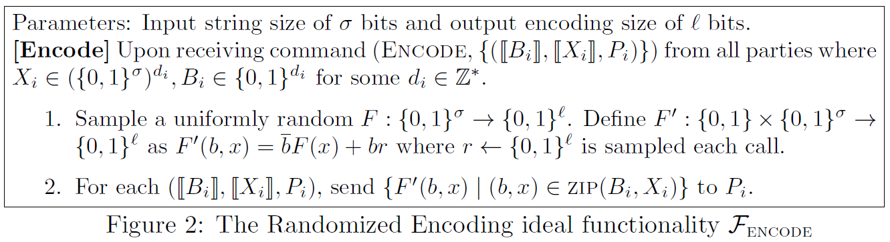
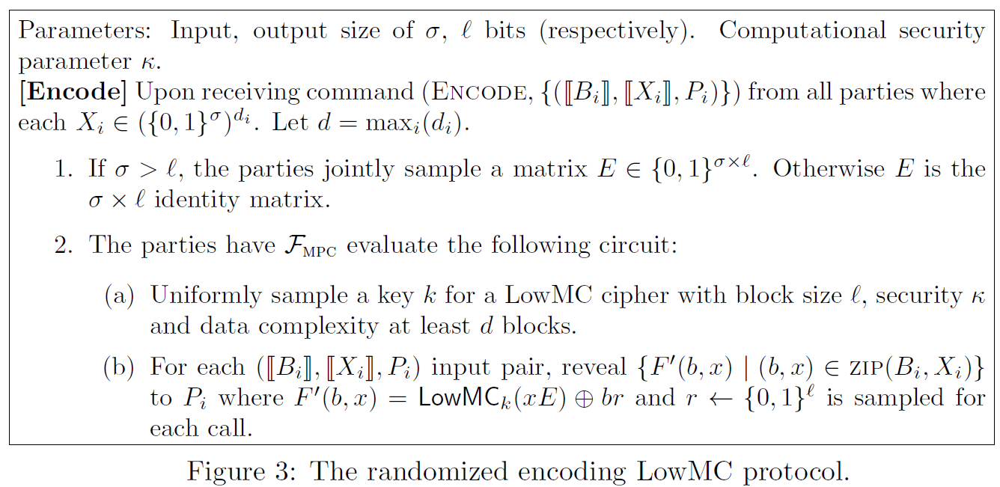
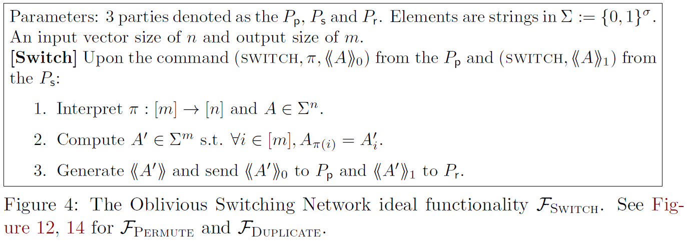
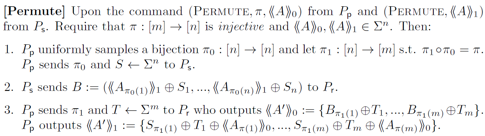

# [MRR20, CSS] Fast database joins and PSI for secret shared data

**Summary:** This paper presents first secure multi-party computation protocol for efficiently performing database joins and PSI on secret-shared data without revealing the underlying data.

## Contributions

They consider the problem of performing SQL-style join operations on tables that are secret shared among three parties, in the presence of an honest majority. Their proposed protocol takes two or more arbitrarily secret shared database tables and constructs another secret shared table containing a join of the two tables, without revealing any information beyond the secret shares themselves.

They achieve constant-round and has computaion and communication overhead linear in the size of tables.

Compared to existing three party protocols with similar functionality (composable), their implemntation is roughly 1000× faster. When compared with non-composable two party protocol, their protocol is 1.25× slower or 4000× faster depending on the functionality.

## Functionalities

Their protocol works on tables of secret shared data which are functionally similar to SQL tables. This is in contrast to traditional PSI and PSU protocols in that each record is now a tuple of values as opposed to a single key. For example, we consider the following SQL styled join/intersection query:

```SQL
select X2 from X inner join Y on X1 = Y1
select X1; max(X2; Y2) from X inner join Y on X1 = Y1 where Y2 > 23:3
```

Beyond these various join operations, our framework supports two broad classes of operations which are a function of a single table. The rst is a general SQL select statement which can perform computation on each row (e.g. compute the max of two columns) and lter the results using a where clause predicate. The second class is referred to as an aggregation which performs an operation across all of the rows of a table. For example, computing the sum, counts, or the max of a given column.

## Preliminaries

### Secret sharing  framework

The protocol is built on the $\text{ABY}^3$ framework. $\llbracket x \rrbracket$ denote a 2-out-of-3 binary replicated secret sharing of the value $x$. $《x》$denote 2-out-of-2 sharing.

### Cuckoo hash tables

Typically the required table size is $m\approx1.6n$ for $\lambda=40$ bits of statistical security.

## Construction

### Randomized encoding

#### Functionality

The functionality assigns a random $l$-bit encoding for each input $x\in\{0,1\}^\sigma$. For $B_i[j]$=0 then the functionality outputs the encoding for $X_i[j]$ and otherwise a random $l$-bit string. Looking forward, $B_i[j]=1$ will mean that the key $X_i[j]$ is actually set to null.


<!-- 飞书原始链接: https://internal-api-drive-stream.feishu.cn/space/api/box/stream/download/authcode/?code=ZDdhNjE4M2MwZTdiM2EzZmE4OTQ0ZjE4Nzg2NzVmOTBfMWNlMTQ1ZDEyOTQxNDRiYzM3NGZiMjFmNzVhODI3N2JfSUQ6NzMyNTQ3NDg1Nzg2NzU3NTMyNF8xNzg1NDYxOTM3OjE3ODU0NjU1MzdfVjM -->

#### Construction


<!-- 飞书原始链接: https://internal-api-drive-stream.feishu.cn/space/api/box/stream/download/authcode/?code=YWNkNzg1MzMyZWFhZmMwZGMyZTRkZGMzNGEwMTI5ODZfMGI3YzBiZDAwMjZlZDQzYmZlMGZlOWI0N2U2MTU5YjVfSUQ6NzMyNTQ3NjExMzYyMjk3NDQ2NV8xNzg1NDYxOTM3OjE3ODU0NjU1MzdfVjM -->

### Oblivious switching network

#### Functionality

It obviously transforms a vector $A=(A_1,...,A_n)$ such that the output is $A'=(A_{\pi(1)},...,A_{\pi(m)})$ for an arbitrary function $\pi:[m]\rightarrow[n]$.


<!-- 飞书原始链接: https://internal-api-drive-stream.feishu.cn/space/api/box/stream/download/authcode/?code=M2Y2NGQ2YTkyZDAxNmIzZTc5YzljN2MzYmNkNzM5ZjlfYTYwMDVmY2M3NDRhMjQ5Y2U4N2ZlYjAyYzYyMjRiNjBfSUQ6NzMyNTQ3NjkzNDQ4NTA0OTM0NV8xNzg1NDYxOTM3OjE3ODU0NjU1MzdfVjM -->

#### Construction

##### Permutation network

A restricted class of switching networks where the programming function $\pi$ is injective.


<!-- 飞书原始链接: https://internal-api-drive-stream.feishu.cn/space/api/box/stream/download/authcode/?code=NDFhZjc5MzllMjA1NTIwMWYyZTc0MDYyN2Y1M2NkYjhfY2FiZmMzMGNiNzZlYTMwZGUzNzQ5Njc5NmEyZjUwYTJfSUQ6NzMyNTQ3OTk1NDQ2Mjk4MjE0NV8xNzg1NDYxOTM3OjE3ODU0NjU1MzdfVjM -->

##### Duplication network

// TODO

##### Universal switch network

// TODO

### Join construction

Divided into four phases:

1. Compute randomized encodings of the join-columns/keys.
2. Party $P_1$ constructs a cuckoo table $T$ for table $Y$ and arranges the secret shares using a permutation protocol.
3. For each row $x$ in $X$, $P_0$ uses an oblivious switching network to map the corresponding location $i_1$,$i_2$ of the cuckoo hash table to a secret shared tuple $(x, T[i_1], T[i_2])$.
4. The join-key(s) of $x$ is compared to that of $T[i_1], T[i_2]$. If one of them matches, then the corresponding $Y'$ row is populated; otherwise the $Y'$ row is set to NULL.
5. The various types of joins can then be constructed by comparing row $i$ of $X$ and $Y'$.
