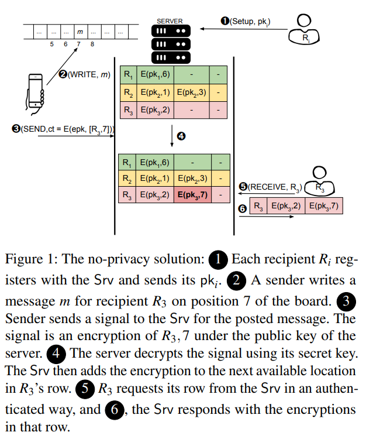
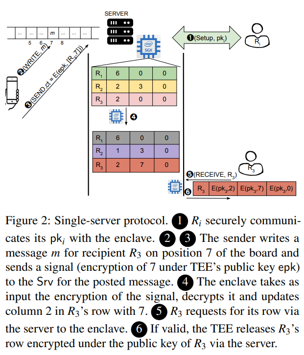
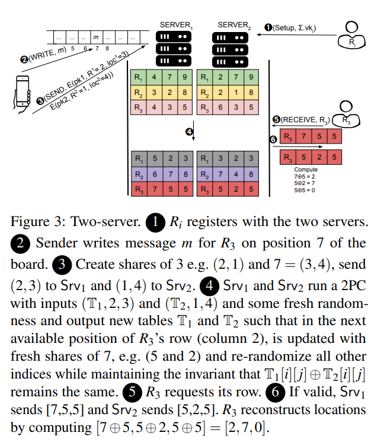

# [MSS+22, USENIX]Private Signaling

发送者在公共公告板的特定位置发布一条消息，并发布一个信号，仅预期的接收者能够知道该消息是发送给该位置的接收者，而其他人无法知晓。

# 问题描述：recipient anonymity

有M个接收者R1，...，RM，通过它们的公钥pk1，...，pkM在公告板上被公开识别。公告板针对接收者收集来自发送者的消息（m1，m2，m3，...）。在公告板上发布消息mj的发送者还将发布一个辅助信息c，用于向预期的接收者Ri发出信号，告知他们在公告板的位置j上有一条消息。

**问题是：**发送者如何设计信号c，以便通过查看c，除了Ri以外，没有人能够确定mj的预期接收者，且发送者与Ri没有任何通信或先前共享状态？

# Naive的Private Signaling

**描述：**发送者希望向Ri传递一条消息在位置loc上的信息，可以简单地使用a key-private的CPA安全加密方案，用公钥pki将loc进行加密，然后只在公告板上发布密文c。在这种情况下，信号就是密文本身。然后，每个接收者可以定期下载公告板上发布的所有密文，尝试解密每个密文以检测接收者的消息在哪里。

**安全性：**由于加密方案具有密钥隐私属性，该解决方案为每个接收者提供了完全的隐私，因为通过查看密文，每个公钥解锁的可能性是相等的。这里的完全意味着匿名集合由整个（诚实的）接收者集合构成。

**代价：**完全的隐私对于每个接收者来说成本很高，因为它需要扫描整个公告板来检测信号。

**目标：**减少接收者的通信和计算复杂性。

# 对Efficient的Private Signaling的思考 : *the Need for a Server*

在**没有任何外部帮助**（例如专门为每个接收者过滤消息的服务器）的情况下，接收者必须阅读所有信号的列表，以确定哪个信号是针对他们的。因此，无服务器的解决方案会导致每个接收者的复**杂性为O(N)**。如果signal的大小随着可能的接收者总数O(M)的增加而增加，可以将搜索复杂性降低到每个接收者的O(logN)。这对于甚至是中等规模的M来说仍然**非常低效**。

因此，为了降低接收者的复杂性成本，需要使用**外部服务器**来帮助进行过滤。

那么，在存在不受信任的服务器的情况下，是否存在一种解决方案，可以实现完全匿名性，并且接收者的复杂性仅为常量？

# 3 Contribution

**私密信号传递问题的形式化。**在通用可组合性框架下定义了一个理想功能FprivSignal，用于达到对私密信号传递系统的正确性和隐私保证的期望。之前的相关研究要么没有提供任何形式化定义，要么提供了较弱的安全保证。

**具有常量接收者开销和可证明的UC安全性的私密信号传递协议。**研究的重点是最小化接收者和发送者的成本。提供了两个用于实现理想功能FprivSignal的协议，在其中一个协议中，发送者只需进行一次（或两次）加密即可计算出一个信号，接收者无需进行任何扫描，只需进行与接收到的信号数量相匹配的解密操作。*两个协议*：一个基于加密电路，需要两个服务器，另一个利用可信执行环境（TEE），只需要一个服务器。

**开源实现。**实现了两个协议并测定了它们的效率。将性能与相关工作进行了比较。

# Solution

基于对接收者的列表进行隐私更新的相同高级方法，文章实现了两种实例化的理想功能FprivSignal，以实现接收者的通信和计算复杂性的常量级。首先解释一般性的方法，随后介绍了两种具体实现方法。

## The no-privacy solution

<!-- 飞书原始链接: https://internal-api-drive-stream.feishu.cn/space/api/box/stream/download/authcode/?code=MTI4NzNiMTMwYTAzYjAzOTk2MzQ2NDhhNzMxNjdhOWFfNWU4M2JlNTYxMmUxOTJjM2E5ZTRjMjUyZGQ0MzJlNDBfSUQ6NzI1Njc3NzE0OTI4ODYxMTg0NF8xNzg1NDYxOTEyOjE3ODU0NjU1MTJfVjM -->

这里主要是给一个基础的方案，由服务器存储公告板上某个消息对应的接受者，此时对应关系对于服务器来说是明文的

## TEE-based Solution

<!-- 飞书原始链接: https://internal-api-drive-stream.feishu.cn/space/api/box/stream/download/authcode/?code=MzExZGQ3MmE3OWIxOWNjZTJjYjVkZjk0ODhjMWVhNmVfNmMyNDIxNTY4NTgxODNkNDFhZDNjOThkZTIwYjdiNThfSUQ6NzI1Njc3NzE3NDMxNTg3NjM1NV8xNzg1NDYxOTEyOjE3ODU0NjU1MTJfVjM -->

这个方案主要是引入了一个可信第三方，但是对于硬件有大小要求。

## Two-server Solution

<!-- 飞书原始链接: https://internal-api-drive-stream.feishu.cn/space/api/box/stream/download/authcode/?code=MWJmMzlmYmJmNzhlNDhkMGZjYTRkMTY4ODJiNGFlZWJfYjJlMTg3NzA2NjJlNWViMDM5MjI2NjQxMmRkZDRkNDRfSUQ6NzI1Njc3NzIwMzMxMTAzNDM3Ml8xNzg1NDYxOTEyOjE3ODU0NjU1MTJfVjM -->

秘密共享方案，通过拆分明文，使得不合谋的两个服务器无法自己聚合。同时在更新表之前引入新的随机性，把两边的share更新，从而隐藏更新的接收者身份

这个和riposte的区别在于**riposte的公告板并没有指定任何的接受者**，**保护的是发送者**到底写在了哪个栏位，在**private signaling**里，发送者是明文写入公告板的，保护的其实是**接受方的身份**，而且fss的引入是为了压缩和服务器的通信开销。

结合起来做的东西可能就是发送者向服务器发送明文拆分后的key以及接受者身份，由多个服务器协同维护公告板，恢复出消息……但是这样在公告板恢复出来之前，写入第几个栏位的信息也丢掉了啊，或者说写入的栏位也一起share了？

我得再思考一下