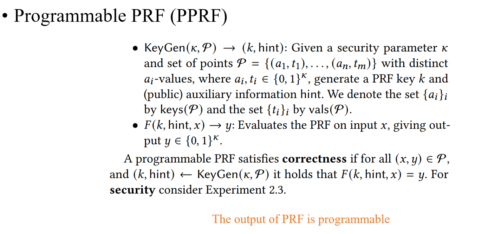
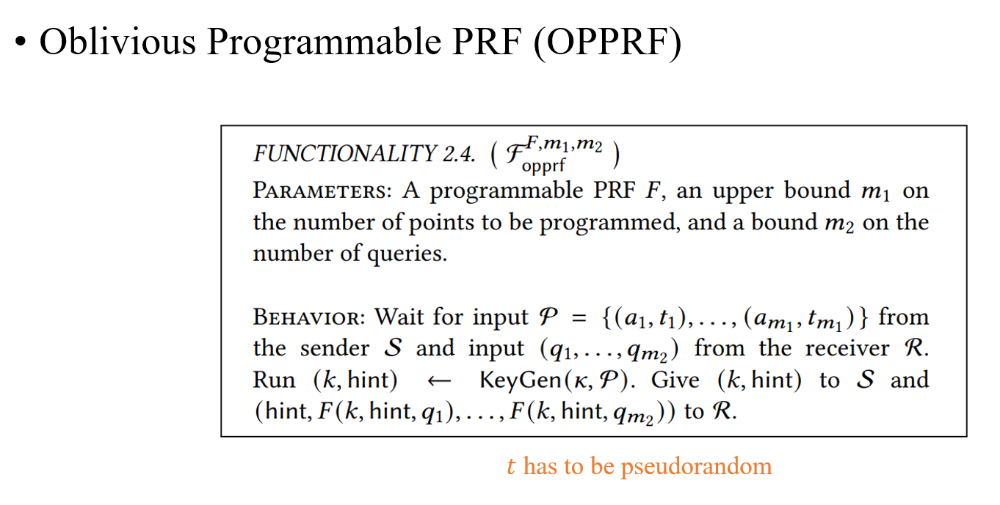
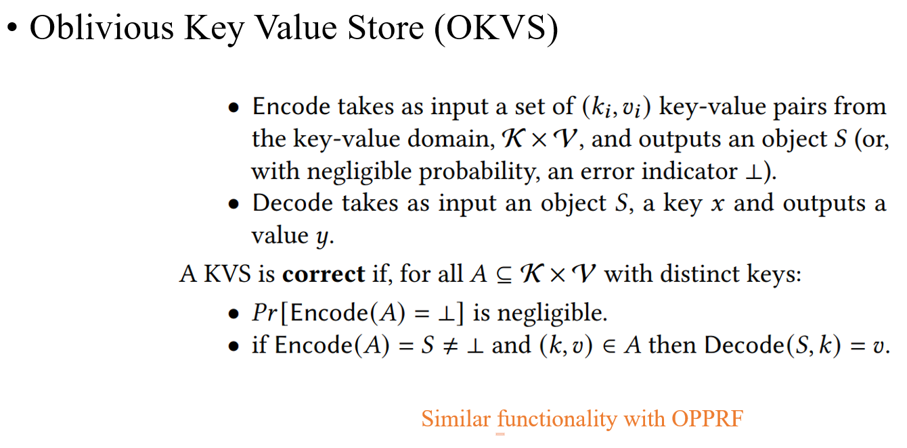
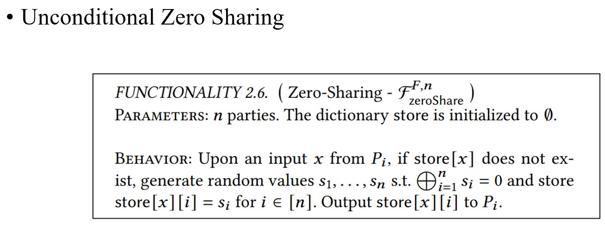
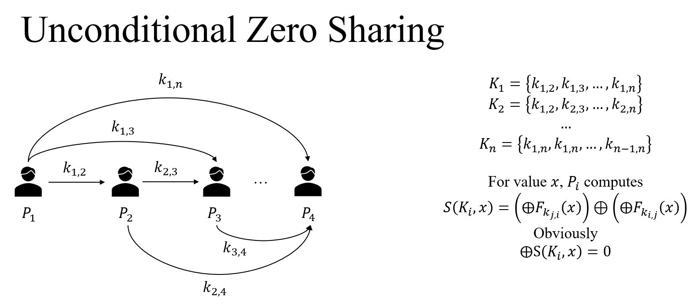
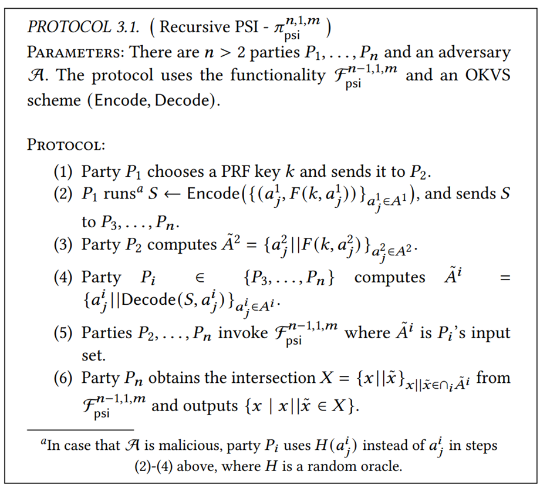
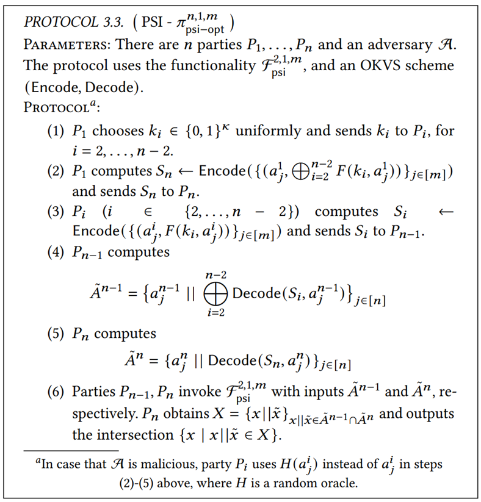
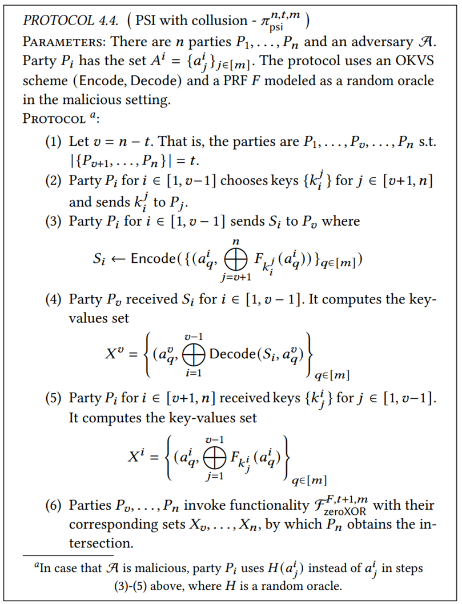
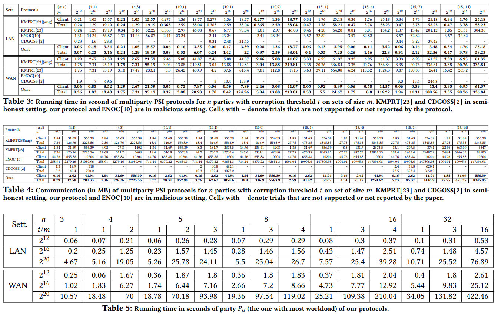

# [NYT21, CCS]  Simple, Fast Malicious Multiparty Private Set Intersection

**Summary: A malicious multiparty PSI based on oblivious programmable PRF (OPPRF) and oblivious key value store (OKVS).**

## Overview

这篇文章构造中主要用到的密码学原语就是OPPRF和OKVS，OPPRF的概念比较新颖，属于是专门为mPSI定制的。OPPRF的功能简单来说就是S输入一个键值对集合，R输入一组查询，如果查询到了S输入的键，那么返回S输入的值，否则返回随机数。OPPRF的功能和OKVS几乎是一样的，区别在于OKVS的查询次数是不受限制的，而OPPRF查询次数会有限制。

<!-- 飞书原始链接: https://internal-api-drive-stream.feishu.cn/space/api/box/stream/download/authcode/?code=ODZiNjNiMmFhOWQ3NmJlNDBjMWY5OWQzMDg2NDc3MDZfMWM1YzVkNGYxMDkyNmI4MzU0ZGRiY2VlOTBmMGQzZWVfSUQ6NzIzMzM4OTYwNjU1NTg0NDYxMF8xNzg1NDYxOTA5OjE3ODU0NjU1MDlfVjM -->

<!-- 飞书原始链接: https://internal-api-drive-stream.feishu.cn/space/api/box/stream/download/authcode/?code=N2Q3Yjg3MjUyYWZjZWM2ZGE0OGZhYjBkNjI1ZDNiMzdfZTcwYzA0ZmQzMTYwMjQ1OThlYzNiZTc3MGZhYmEyMTJfSUQ6NzIzMzM4OTY1MjE1MTk3NTkzOF8xNzg1NDYxOTA5OjE3ODU0NjU1MDlfVjM -->

<!-- 飞书原始链接: https://internal-api-drive-stream.feishu.cn/space/api/box/stream/download/authcode/?code=OWViYzc5OGRmMTlhMjdlNmY0ZTJhN2E3YWVhYzljNzFfNTdmNDkxYjVmNGUxNzQ2YWE1YzNjODEzNzhhZWQ5MDhfSUQ6NzIzMzM4OTY5NTA1MTM4MjgxMl8xNzg1NDYxOTA5OjE3ODU0NjU1MDlfVjM -->

还有另一个原语，在malicious的情况下使用

<!-- 飞书原始链接: https://internal-api-drive-stream.feishu.cn/space/api/box/stream/download/authcode/?code=MmYyMGY5NDdkZDY5NTQxNGNmYjFjYWIyMTQwYzY5ZDBfZGRkZTM3Zjg2ZDVkMjI5OTUyNzMzNDA3YTNkYjc3MjBfSUQ6NzIzMzM5MTE0ODkzNTQ3OTMyNF8xNzg1NDYxOTA5OjE3ODU0NjU1MDlfVjM -->

<!-- 飞书原始链接: https://internal-api-drive-stream.feishu.cn/space/api/box/stream/download/authcode/?code=YWFiMmY1ZmUxOTRlOTI2M2QyMzFhZjljZTFiZmVlMWFfNWI0MGU5NWI1ZTJiY2FkZjdmZmZiMmRhNzYxNzcyNTRfSUQ6NzIzMzM5MTIyNjk5NTgxODQ5N18xNzg1NDYxOTA5OjE3ODU0NjU1MDlfVjM -->

## PSI with No Collusion

在没有合谋的情况下文章提出了两种方案，一种是递归的，需要O(n)轮，另一种只需要O(1)轮

### O(n) Rounds

<!-- 飞书原始链接: https://internal-api-drive-stream.feishu.cn/space/api/box/stream/download/authcode/?code=NzAxODA4NzhhMWVlMDQyMWZkNjNhMTJjNmZhZWI2Y2NfZGYzMDVjMzYzODAyYWI4MjAxNjI2NjliN2ExZjg3MWRfSUQ6NzIzMzM5MDkzNjczMzA3MzQxMF8xNzg1NDYxOTA5OjE3ODU0NjU1MDlfVjM -->

### O(1) Rounds

<!-- 飞书原始链接: https://internal-api-drive-stream.feishu.cn/space/api/box/stream/download/authcode/?code=ZmZhN2ZiMTJkMGFkOWI2YWJhODU0Zjc5Y2MzOWY0Y2VfYTljMTk0OGJlZjg1ZjRjYWM4NjZkMTBjM2VjMjY1YmFfSUQ6NzIzMzM5MDk2MTg0MDEyODAwMV8xNzg1NDYxOTA5OjE3ODU0NjU1MDlfVjM -->

## PSI with Arbitrary Collusion

这里将参与方分成了三个阵营，v-1个client，1个pivot，n-v个server；使用到了ZeroXOR（用前面提到的ZeroSharing构造）。直觉上来说，因为在这个方案中必须要所有人的信息加在一起才能得到最后的交集，所以即使有n-1个party合谋，方案仍然是安全的。

<!-- 飞书原始链接: https://internal-api-drive-stream.feishu.cn/space/api/box/stream/download/authcode/?code=ZDViMzQ4M2U1NGYyNDgwNTk1YmVmM2U3MzgzMThjODFfYWExNTM0Mjg1M2UxYjNkN2I1YThmMWEzNzIzYjlmZTNfSUQ6NzIzMzM5MjA5MjUwNzAxMzEyNF8xNzg1NDYxOTA5OjE3ODU0NjU1MDlfVjM -->

## Evaluation

<!-- 飞书原始链接: https://internal-api-drive-stream.feishu.cn/space/api/box/stream/download/authcode/?code=ODY1ZmQxNjU2MzY0NzcyOTRkZTgwNzQwOTZhNjAyNDZfOThhZjAwMjM1MGZmNTFmMTc1ZGU1MjhiN2MyNjc1MDZfSUQ6NzIzMzM5NTkxNjEyMjgzMjkwMF8xNzg1NDYxOTA5OjE3ODU0NjU1MDlfVjM -->

## Conclusion

这个方案最大的特点就是快，还介绍了OKVS怎么在PSI中使用，这是我之前没有读过的。