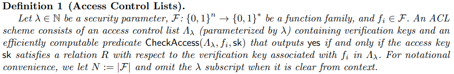
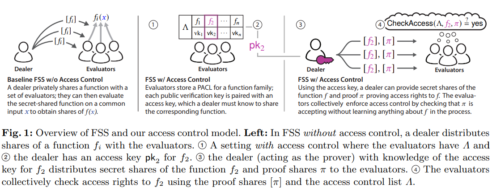
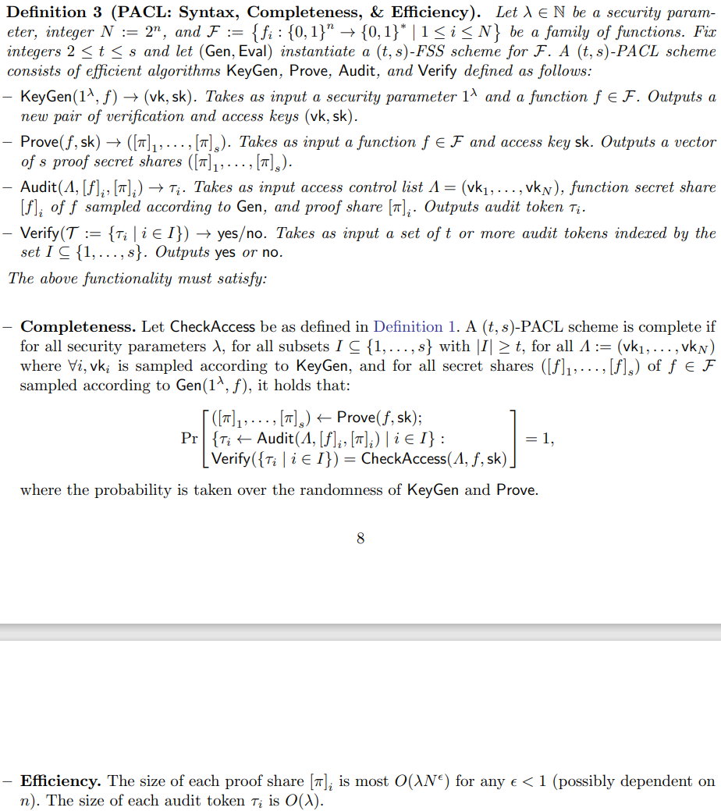
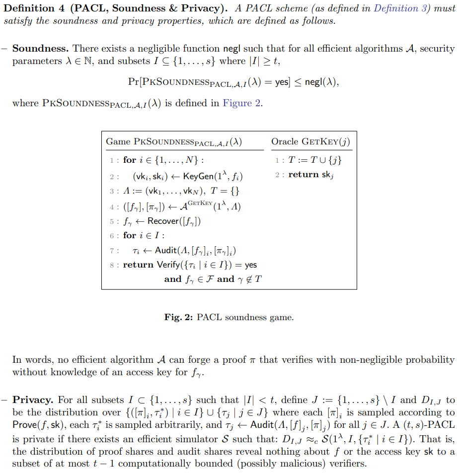
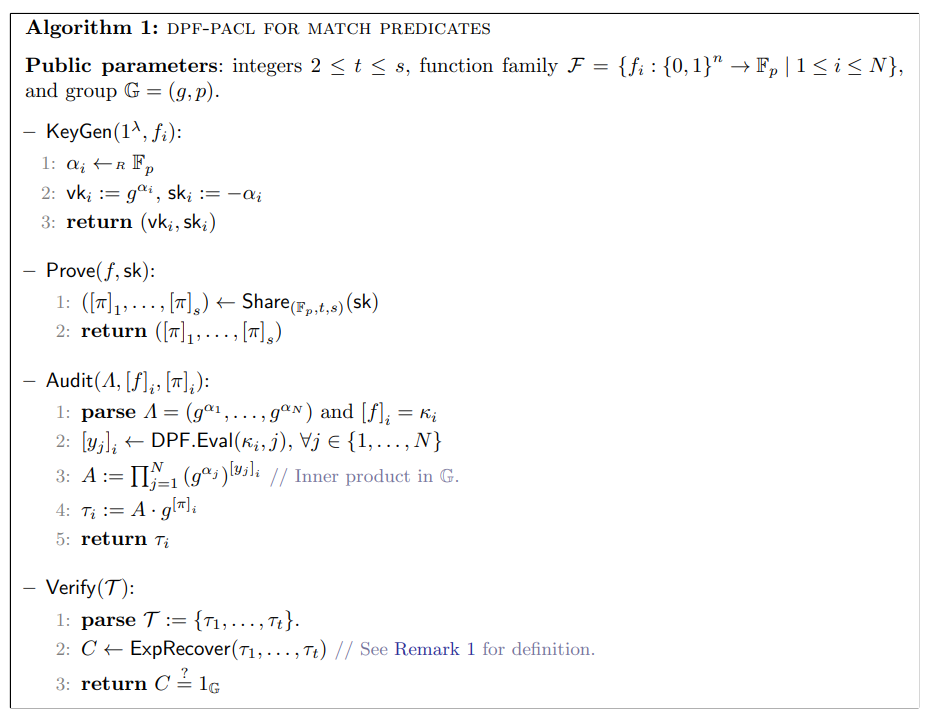
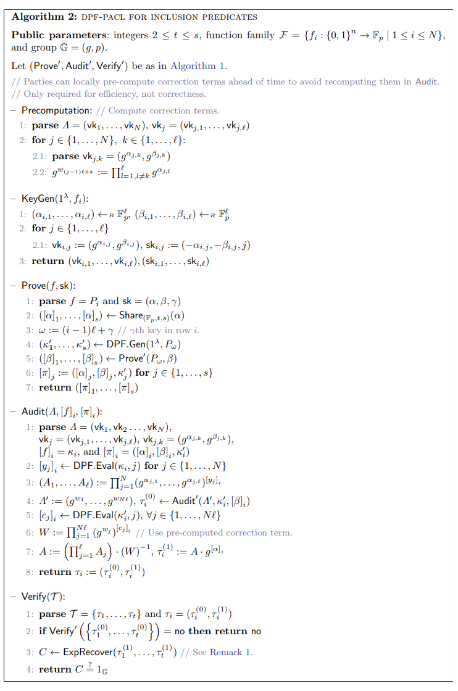
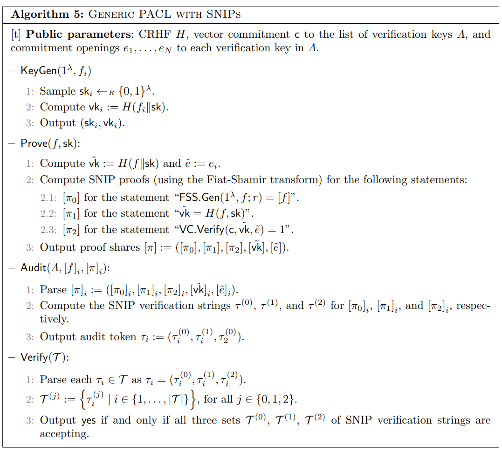

# [SBY+23,S&P]Private Access Control for Function Secret Sharing

> - initiate the study of access control for FSS
> - definitions and constructions abstract and improve the concrete efficiency of several recent systems

# 1 Introduction

许多以FSS为核心的应用往往在用户可能又恶意行为的环境中涉及了私人用户数据的处理，故而访问控制变成了一个重要的问题。例如在涉及从数据库中私密读写数据的FSS应用中，需要访问控制以防止恶意用户访问或重写属于其他用户的数据。

FSS让任何用户（dealer）将一个函数的简洁秘密共享分发给一组函数计算器（evaluators）。这些计算器可以高效非互动地在一个公共输入 $x$ 上计算函数以获得 $f(x)$ 的秘密共享。FSS保证函数保持私有，仅对计算器的严格子集是公开的，这意味着计算器不了解有关 $f$（除了 $f$ 所属的函数族）的任何信息。

## 什么是 private access control

我们将访问控制建模为函数和密钥之间的一一映射。一组函数中的每个函数，都映射到一个验证密钥和一个访问密钥。计算器持有验证密钥，一个dealer持有一个或多个访问密钥。  
dealer使用FSS通过一组验证密钥的子集提供函数 $f_i$ 的访问权证明：$\pi$，并使用相应的访问密钥提供证明 $\pi$。此时充当验证方的计算器可以使用验证密钥验证证明 $\pi$，并决定dealer是否有权计算函数 $f_i$。

## 挑战

- 访问控制必须保持函数的隐私性
- 访问控制机制必须保持效率保证
- 防止恶意计算方侵犯隐私

## 目标

- 简洁的证明
- 与证明者没有互动
- 验证者之间交换最多一条消息来检查访问权限

# Non-private access control for functions

## Access Control Lists (ACLs)

为了方便定义PACL（私有ACL），先定义ACL（Definition 1 is general and not specific to FSS）  
[Def1]

<!-- 飞书原始链接: https://internal-api-drive-stream.feishu.cn/space/api/box/stream/download/authcode/?code=OTNkY2JlN2JhZTc2YjcyNDI4NTE5ODI1OWQ5MzAzM2VfNGFkNTI4YThmNjJhZGJkM2VhNTljOGNhMmQ3ZTc1NWJfSUQ6NzIzMDc5OTA1NjI4OTM5ODc4Nl8xNzg1NDYxOTA4OjE3ODU0NjU1MDhfVjM -->

# Private access control for FSS

私有ACL（PACL）方案包括了一个证明者和一组 $s$ 个验证者。证明者持有访问密钥 $\mathsf{sk}$ 和函数 $f_i \in F$。验证者持有份额 $[f_i]$ 和函数族 $F$ 的访问控制列表 $\Lambda$。验证者在不知道 $f_i$ 的情况下确定 $\mathrm{CheckAccess}$ 是否输出 yes。  
[fig1]

<!-- 飞书原始链接: https://internal-api-drive-stream.feishu.cn/space/api/box/stream/download/authcode/?code=YTI2ZTc4ZTE3Zjk3YjgzY2M2MDczMDBiY2Y3OWRkMWNfNDc1YjU1YWE5YjI4YTZiYWEyY2EzNGI4YTExZDZkMjdfSUQ6NzIzMDc5OTA4NTYzMTk5NTkwNl8xNzg1NDYxOTA4OjE3ODU0NjU1MDhfVjM -->

## Public-key PACL

公钥PACL方案由四个算法组成：KeyGen，Prove，Audit和Verify, 这里参数会用到函数族 $F$ 和整数 ${2} \leq t \leq s$  
[Def3]

<!-- 飞书原始链接: https://internal-api-drive-stream.feishu.cn/space/api/box/stream/download/authcode/?code=Y2ZjODUyMWQ5MTg3ZTk2ZDFjM2UxZDU1ZGVkZTcwNjFfOTU4ZDkxNjgwNGU1NDEzYjFlZTU2Yzg4YzMzNjJlYTJfSUQ6NzIzMDc5OTE1NDc1NzQwMjY1Ml8xNzg1NDYxOTA4OjE3ODU0NjU1MDhfVjM -->

<!-- 飞书原始链接: https://internal-api-drive-stream.feishu.cn/space/api/box/stream/download/authcode/?code=YjVjNTgxMGM0MGQ2YmFlNTViNjZkNWMwOTY2MDA1MGRfZjE4ZTJiMmQzMzg4M2UxYjg4OGU0MjNlMDllNWZiMWJfSUQ6NzIzMDc5OTI5MTIyNDk5Nzg5MF8xNzg1NDYxOTA4OjE3ODU0NjU1MDhfVjM -->

  
[Def4]

<!-- 飞书原始链接: https://internal-api-drive-stream.feishu.cn/space/api/box/stream/download/authcode/?code=N2NiMmM5NTFkODZkYTE1YjBjMjVmZWU0ZDE3NDVhN2NfZTUyYmZkYzg5Y2YwYmRkYzYxZGEzZjA2ZGJiNWM2NmJfSUQ6NzIzMDc5OTE3OTk0ODYzODIxMF8xNzg1NDYxOTA4OjE3ODU0NjU1MDhfVjM -->

# Group-based constructions

针对分布式点函数（DPFs）类别的PACL构造(后续扩展到FSS)

## DPF-PACL for match predicate

[alg1]

<!-- 飞书原始链接: https://internal-api-drive-stream.feishu.cn/space/api/box/stream/download/authcode/?code=NWU3N2RlYzU0ZTMzMmJmMmI4YzMwNzdlNTNkOWE3ZmFfYjY4YmM4OTNjNWY5NDcwNjM4Nzc1Y2JiMDJhYjIzMTRfSUQ6NzIzMDc5OTM4MjM1NzEzMTI2NV8xNzg1NDYxOTA4OjE3ODU0NjU1MDhfVjM -->

## DPF-PACL for inclusion predicates

[alg2]

<!-- 飞书原始链接: https://internal-api-drive-stream.feishu.cn/space/api/box/stream/download/authcode/?code=YjNlN2JhYWViMDk2N2FkZDMwOGE2ZDc5ZWFiMTUyMDNfZDkwNmVmNDFiMjgzMGU3NjYwNzBkYTU2NzAxNDEyMmRfSUQ6NzIzMDc5OTQxMDM1ODM1Mzk0OF8xNzg1NDYxOTA4OjE3ODU0NjU1MDhfVjM -->

# PACLs for FSS from DPF-PACLs

These transformations are taken from Boyle et al. and form the class of functions that can be efficiently secret-shared using lightweight cryptographic assumptions.

- PACLs for range functions and decision trees
- PACLs for small function classes
- PACLs for data matching functions
- PACLs for $NC^0$ functions

# Generic PACLs from distributed zero-knowledge proofs

利用了一个secret-shared non-interactive proofs (SNIPs)和Fiat-Shamir over SNIPs来构建PACLs  
Proposition 1. Algorithm 5 satisfies the completeness, soundness, privacy, and efficiency guarantees of Definition 4.  
[alg5]

<!-- 飞书原始链接: https://internal-api-drive-stream.feishu.cn/space/api/box/stream/download/authcode/?code=OTJhZTY3MWE3YjQwOTU2ODU5NDY2OWYzZGQzMjk1ZGZfNjUwODU3NzAwYWMzODkwZGI5NjhlZDk4MjBlZmQyMDRfSUQ6NzIzMDc5OTQ0MDYwMDEzNzcyOV8xNzg1NDYxOTA4OjE3ODU0NjU1MDhfVjM -->

这篇涉及到零知识证明开始就有点晕乎了，找了个做zkproof的同学聊了聊，也有点一头雾水的感觉

作者里竟然还有高中生，更受打击了
