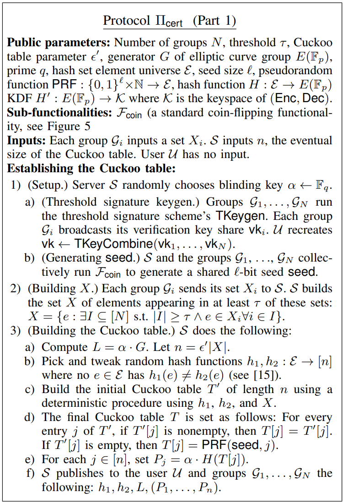
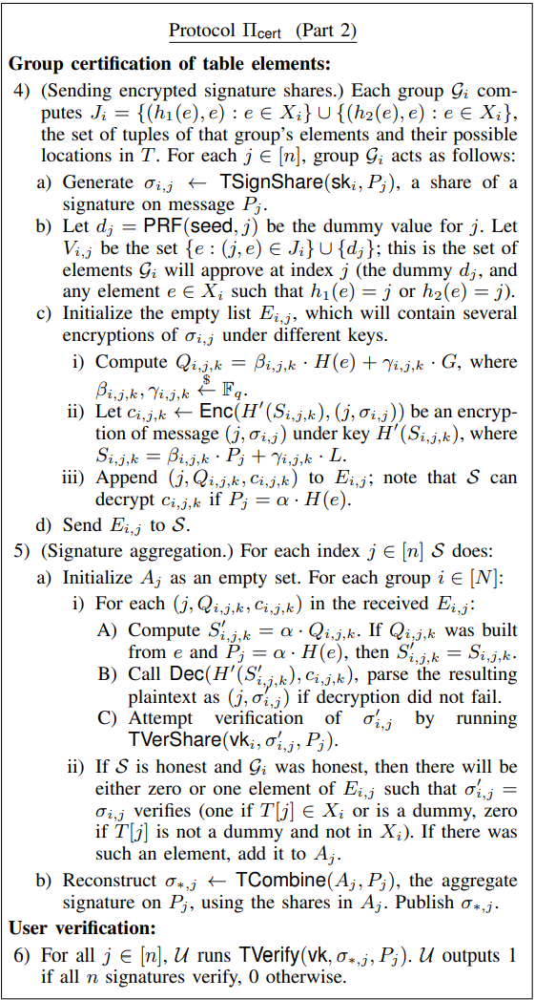
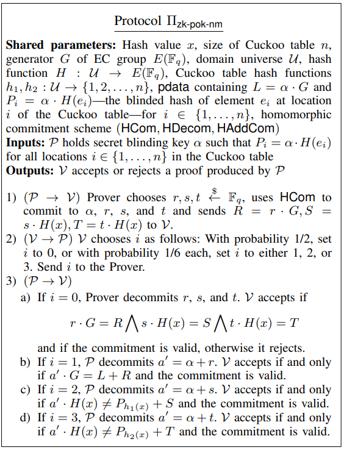
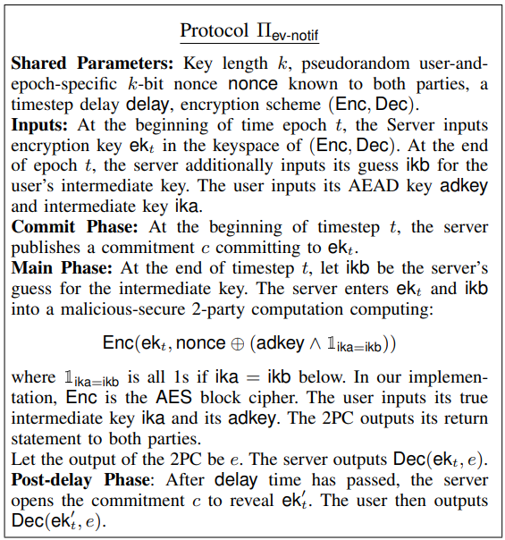

# [SKM23, S&P] Public Verification for Private Hash Matching

**Summary (Z Jiang):** Contributing new cryptographic methods for system verification by general public.

**Summary (ZM Wang)**: This paper improves the transparency of private hash matching, which is the core mechanism of client-side scanning.

**Observations:** The motivation of this paper is attractive. However, I do not get much insights from this paper. In detail, the authors introduce three solutions: 1) group threshold signature, authenticates the set of illegal messages by a group; 2) proof of non-inclusion, allows the platform proves a specific message does not exist in the set; 3) match notification: notificates the results of match to the users.

## 1 Introduction

E2EE is a safeguard for online communication that prevents online services from accessing user content. But this security also creates unprecedented challenges for content moderation. This limitation has led to worldwide controversy about how E2EE interacts with efforts to combat proliferation of child sexual abuse material (CSAM).

Perceptual hash function (PHF) is a predominant method for detection. But PHF is not immediately compatible with E2EE. Private Hash Matching (PHM) can let a server identify a match between a client's hash and a server's hash while learn nothing about non matching content and maintaining the confidentiality of the hash set.

But PHM can undermine security, privacy and free expression. This work can partially solve these worries by threshold certification of the hash set, proof of non-membership in the hash set and guarantee eventual detection notification.

## 2 Pros and Cons of CSAM Detection

### Pros:

- The same people who share or receive CSAM may engage in other forms of child sexual abuse.
- There is currently a market for CSAM, with an estimated \$250 million to \$20 billion U.S. dollars spent on CSAM annually.
- Survivors of child sexual abuse can be revictimized by the proliferation of recorded imagery of their abuse.
- Preventing the spread of CSAM is a worthy goal unto itself.

### Cons:

- The hash set forms are exception to the fundamental security and privacy guarantees of E2EE.
- PHM for CSAM could lead to PHM for other content.

  - The marginal cost of adapting it to detect other categories of content would be modest.
  - Change attitude toward E2EE.
  - Create or reinforce broader political trends toward stricter forms of content moderation.
- False positives imply plaintext access to user content.

## 3 The Apple PSI System

- **Public parameters:** Elliptic curves group $E(\mathbb{F}_b)$. A hash function $H:\{0,1\}^*\to E(\mathbb{F}_b)$. A random key robust encryption scheme (Enc, Dec). Key space $\cal{K^’}$. KDF $H^’:E(\mathbb{F}_b)\to \cal{K}^’$
- **Generate cuckoo hash table**Using hash functions $h_1$ and $h_2$, the server arranges hash set X into a Cuckoo table T of length n (empty slots are filled with dummy elements). The server chooses blind key $\alpha\in\mathbb{f}_b$. And publicly releases $pdata=(L,\{P_j\}_{j\in[n]})$where$L=\alpha\cdot G$,$P_j=\alpha\cdot H(T[j])$.
- **Threshold certification**The client's set $Y$contains images to match against $X$. Each element has *associated data* **ad**. Semi-honest clients facilitate the matching process by sending a voucher for each element. This voucher contains $\mathrm{Enc}(\mathrm{adkey, ad})$ and the $\mathrm{adkey}$will be revealed to Apple if and only if the client's set $Y$has at least $t_{sh}$matches with Apple's hash set $X$. The $\rm{adkey}$is sent to the server encrypted with an emphemeral key $\rm{rkey}$. The client sends four additional objects to the server: $Q_1$,$Q_2$,$\rm{Enc}(H(S_1),rkey)$$ \rm{Enc}(H'(S_2),rkey)$, where for random $\beta_j,\gamma_j\in\mathbb{F_p}$:$Q_j=\beta_j\cdot H(y)+\gamma_jG$$S_j=\beta_j\cdot P_{h_j}(y)+\gamma_jL$If $P_{h_j}(y)=\alpha H(y)$, server is able to decrypt $\rm{rkey}$and therefore one Shamir share of $\rm{adkey}$. If the client sends $t_{sh}$many vouchers that do match, the server can reconstruct $\rm{adkey}$can decrypt associated data in all matching vouchers (we call this event positive).

## 4 Threshold Zero-Knowledge Certification of the Hash Set

The purpose of this method is to face immense pressure to expand the set to include material outside the original purpose of the deployment (user can directly and frequently verify that the threshold intersection and blinding was done correctly).

### Challanges

1. Child safety groups can not distinguish$\rm{pdata}$(due to the blind key $\alpha$) from random data, therefore they can not directly certify that $P_j$ corresponds to known CSAM elements $T[j]$.
2. There are random dummy elements in empty slots of the cuckoo hash table. It is not clear how a thirdparty auditor could verify that these elements are actually random and do not represent other random-looking hashes of meaningful content.

### Goals

The goal of the protocol is for the server $\cal{S}$ and groups to work together to prove to $\cal{U}$ that each element of the $\rm{pdata}$ was built either from a hash held by at least $\tau$child safety groups, or is pseudorandom, and we accomplish this without sacrificing server privacy.

- **Unforgeability.** Even if the server and $d<\tau$ malicious groups collude, these parties cannot cause improper verification of a hash not contributed by at least $(\tau-d)$ honest groups.
- **Server Privacy.** No party except the server $\cal{S}$ learns any information about the elements themselves, including which groups certified which elements and which elements are dummies.

### Protocol

#### Part 1. Establishing the Cuckoo table

<!-- 飞书原始链接: https://internal-api-drive-stream.feishu.cn/space/api/box/stream/download/authcode/?code=ZTBkYzE2NGVjNmYwYThkYjk3Yjc3YWFlMTNiM2E4MDZfNTliODU0ODgyZGRkOWUzMTE3NDNiY2M4NWMzZmE3ZTRfSUQ6NzIwOTg5Mjg5OTAxNjczNjc5Nl8xNzg1NDYxODc2OjE3ODU0NjU0NzZfVjM -->

The groups and server begin by generating relevant keys, and building a shared random seed which will be used to generate dummies. The groups send their sets $X_i$ to the server, which builds the threshold set $X$ as the set of all elements appearing in at least $τ$ of the $X_i$ sets. The server builds a Cuckoo table from $X$, filling the empty spaces in with dummies pseudorandomly derived from seed.

#### Part 2. Group certification of group elements

<!-- 飞书原始链接: https://internal-api-drive-stream.feishu.cn/space/api/box/stream/download/authcode/?code=MzQwNWQ5ODU1ZmI4Nzk0NDIzOTUzZjM4ODM5ZWM5YmZfNTBhNWQxZjkyMWM5MDkyNDRkMTY5ZDQzODU5NjUyMjlfSUQ6NzIwOTg5MzE0MTE4NzY3NDExM18xNzg1NDYxODc2OjE3ODU0NjU0NzZfVjM -->

Unlike authorized PSI [CZ09,FC], the group members in Fcert sign the elements of cuckcoo tables directly. This significantly reduce the complexity of the design since it does not require the zero-knowledge presentation of signatures on raw elements.

#### Benchmarks

For a matchlist containing ${2}^{20}$ elements, the server’s runtime was 466s, the groups’ average runtime was 255s, and the linear verification time was 469s.

## 5 Proof of Non-Membership in the Hash Set

Apple promised that it would refuse to include non-CSAM matches in the hash set and PHM is limited to detecting CSAM stored in iCloud and it will not accede to any government's request to expand it. Users may doubt these types of promises.

### Goals

- **Limited exception to server privacy:** The online service should be able to prove that the elements of a set of hashes for known legitimate images are not elements in the PHM hash set, as a deliberate relaxation of server privacy.
- **Non-interactivity:** The server should be able to publish the proof once, clients should be able to verify separately.
- **Soundness:** The server should not be able to prove non-membership of a hash that is on the hash list.

### Protocol

The approach is to combine a standard zero-knowledge proof of knowledge of a discrete log with a homomorphic commitment scheme. If the hash to be checked for non-membership is $x$, this will allow Apple to prove knowledge of $\alpha$ such that:

$$L=\alpha\cdot G \bigwedge P_{h_1(x)} \neq\alpha\cdot H(x) \bigwedge P_{h_2(x)}\neq\alpha\cdot H(x)$$

<!-- 飞书原始链接: https://internal-api-drive-stream.feishu.cn/space/api/box/stream/download/authcode/?code=M2RjMzMxZDE1OGJhYzI3MjkzNGU3YzU5ZDY2NDYwMmVfZDk2NjM4NDE5YWY4Yzc4OTc5OGM4YjI3YjhiOThlMmRfSUQ6NzIwOTk2OTk2MDE2Mzg4NTA1OF8xNzg1NDYxODc2OjE3ODU0NjU0NzZfVjM -->

### Benchmarks

The single-threaded implementation requires 147 ms to generate a non-interactive proof and 66 ms to verify it at the 128-it security level, independent of the hash set size.

## 6 Guaranteed Eventual Detection Notification

The last two sections described transparency methods that improve trust in the hash set. In this section, we describe how to improve transparency in implementation.

### Goals

- **Privacy:** Users should learn nothing from the protocol until the delay has elapsed. After the delay is completed, users should learn whether their own $\rm{adkey}$ was disclosed to the server. The protocol run once per timestamp.
- **Guaranteed notification:** If a malicious server learns a user's $\rm{adkey}$, after delay user the learns this happens.
- **Correctness:** If the user acts as it would in the honest protocol, then the server learns the user’s adkey immediately after timestep t ends.

### Protocol

User sends a share of intermediate key $\rm{ika}$ in voucher instead of $\rm{adkey}$.

<!-- 飞书原始链接: https://internal-api-drive-stream.feishu.cn/space/api/box/stream/download/authcode/?code=OWIwNGEyNDZjOWI1MTBhMDExYTE3MzA3YTU4Mjk1Y2NfYTU5OGMxNzZmOWE5ZjhjNTBmZjMyOGY1ZDBiMjY0Y2NfSUQ6NzIwOTk3OTkyODczMTk3NTY4Ml8xNzg1NDYxODc2OjE3ODU0NjU0NzZfVjM -->

### Benchmark

Averaged over 100 runs with random valid inputs, the protocol has an online time of 0.747 milliseconds and an offline preprocessing time of 38.2 milliseconds, not including network delays.

## 7 Conclusion

The protocols would allow certification of the hash set by external groups, proof that particular content is not in the hash set, and eventual notification of false positives.