# [SKR+24, Preprint] Large-Scale Private Set Intersection in the Client-Server Setting

**Summary:** 这篇文章提出了一种OVUF构造，并且使用这个OVUF实现了PSI，利用服务器的one-time encoding，在multi-client场景下实现很好的存储和计算开销。

## Introduction

这篇文章首先介绍了Client-Server Setting是什么样的场景，比如Contact discovery或者password checkup，这种场景下需要有一个服务器对上多个客户端。现有的PSI可以分为三类：

- 没有为unbalanced场景设计的malicious secure PSI，通信开销和双方集合线性相关
- 已有的unbalanced PSI不是malicious secure的

所以他们提出了malicious的基于client-server Setting的PSI， 但是没有说是unbalanced setting。本质上还是offline/online模型，offline阶段先把server的集合传输过去，online阶段再进行计算，client需要保存整个server集合的encoding，这篇文章的malicious能保证所有client收到的集合是一样的。

文章中提到的contribution是：

- **Reusable and asynchronous server encodings：** Reuseable指的是server集合的encoding可以在所有client中复用，不用重新生成；Asynchronous指的是client可以自由选择时间下载encoding，但是我认为这个asynchronous很牵强，因为client只有在拿到encoding之后，才能得到PSI的结果。
- **Efficient oblivious verifiable unpredictable function：**因为VUF比PRF更弱，所以计算起来比PRF更快，并且在构造OVUF的时候也使用了一个“imperfect”的方法，牺牲功能提升效率。
- **Practical Efficiency：**在server数据集大小为10亿下，生成encoding的大小为800MB，online time是5s（这里的时间指的是执行OVUF的时间）

## Preliminaries

### VUF

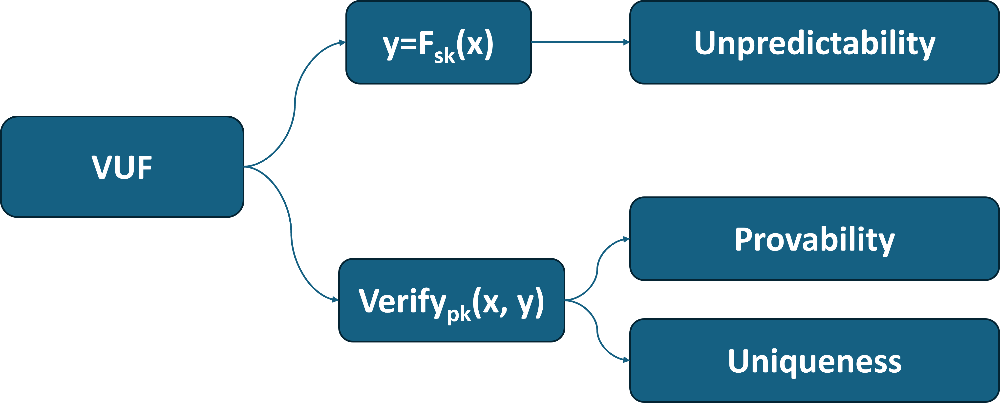
<!-- 飞书原始链接: https://internal-api-drive-stream.feishu.cn/space/api/box/stream/download/authcode/?code=Zjk2M2VkYjljYTBkM2ZmZDI3MzM1OTIyZThmZjI4ZDhfYTAzNDhiZDZkNDBiMzUzZjRmNGMxNjI4MTk4NjZhNDBfSUQ6NzM1ODc0MTUxODIxMDQ0OTQxMF8xNzg1NDYxOTM4OjE3ODU0NjU1MzhfVjM -->

一组VUF的密钥由(pk, sk)组成，sk用于计算函数$F_{sk}(x)$，pk用于验证一对数据是否由正确的函数生成，如果pk和sk对应，并且$y=F_{sk}(x)$，那么$\textit{Verify}_{pk}(x,y)=1$，否则输出0。

下面是文章中使用的VUF构造，基于[[DY05, PKC](https://eprint.iacr.org/2004/310.pdf)]

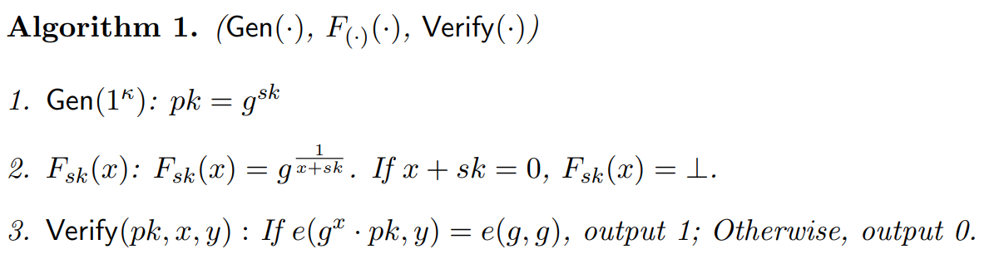
<!-- 飞书原始链接: https://internal-api-drive-stream.feishu.cn/space/api/box/stream/download/authcode/?code=NmY4YzQ5YWVhZTZkNWJjNzM5ODc4YmU0ODk5ZjU0YzJfZDUyMTMxNTljM2RmYjQ5MGE3ZjkwZjBmOGE2ZTA2ZWFfSUQ6NzM1ODc0NzI2NjkyNzEzMjY3NV8xNzg1NDYxOTM4OjE3ODU0NjU1MzhfVjM -->

### OVUF

OVUF的ideal functionality如下方所示

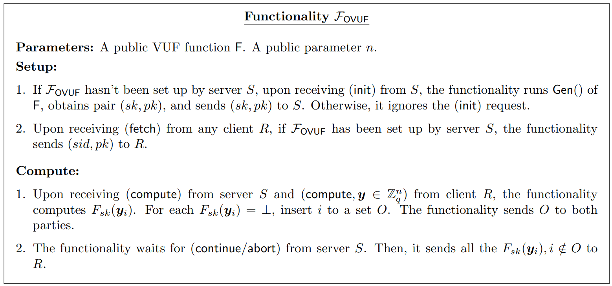
<!-- 飞书原始链接: https://internal-api-drive-stream.feishu.cn/space/api/box/stream/download/authcode/?code=YTk5ZGU0OWQzMDRlYTViMWE4MWMwNzA1Mjc1NmI0ZmRfYWQyMDVhM2Q4ZjNhM2JkYzNkMzljY2Q0NmUyYmU4YjdfSUQ6NzM1ODc1MTgxNzMyNjc1NTg0NF8xNzg1NDYxOTM4OjE3ODU0NjU1MzhfVjM -->

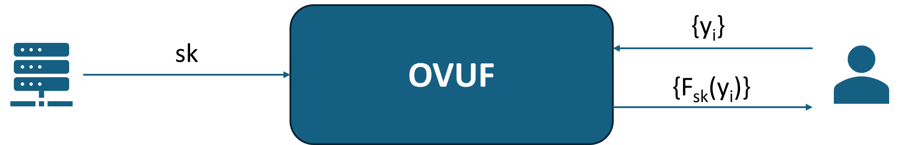
<!-- 飞书原始链接: https://internal-api-drive-stream.feishu.cn/space/api/box/stream/download/authcode/?code=YTllNTQ2ZDQ1NjZiZTNlYWFmMTZiYjkxYmQ2NDE0NmZfMjI2NjcyNTY1MTFhMjRlYWRiNzA1NDMwN2E5NDM3MTdfSUQ6NzM1ODc1NTY1MTI2ODg3MDE0OF8xNzg1NDYxOTM4OjE3ODU0NjU1MzhfVjM -->

## Construction

基于OVUF的PSI的构造和基于OPRF的构造差不多

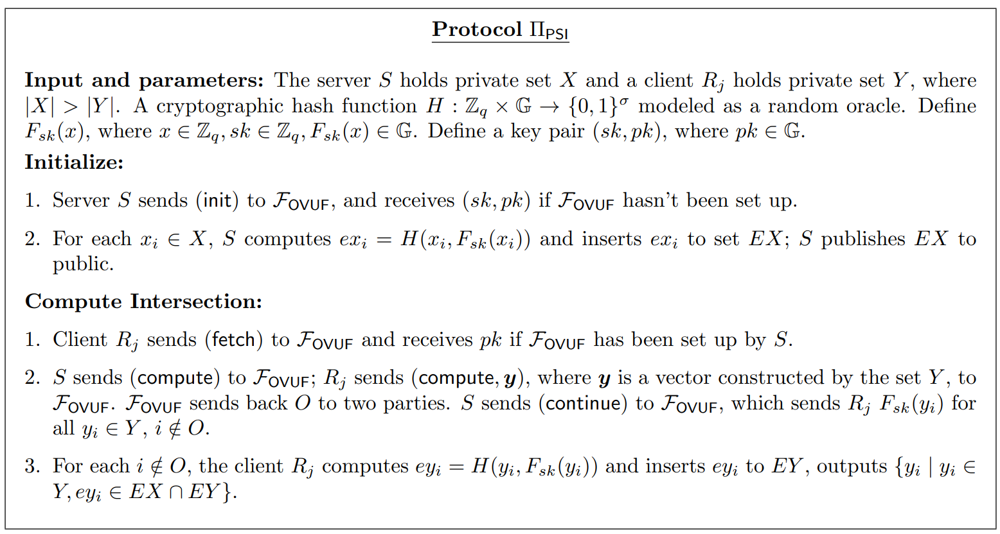
<!-- 飞书原始链接: https://internal-api-drive-stream.feishu.cn/space/api/box/stream/download/authcode/?code=NjFiMDMxYTk1YmM5YWFlZDEzZjliZDkxY2NiMTJmN2NfODgwYWE2MTc2MmE4YWUzMjg1MGYwMDk2YWU4NGU5MTZfSUQ6NzM1ODc1NjU5NTgxMDI3MTIzNV8xNzg1NDYxOTM4OjE3ODU0NjU1MzhfVjM -->

这篇文章主要贡献是在DY-VUF的基础上构造了OVUF

构造VOUF的基础是一个interactive multiplicative-to-additive conversion protocol (MtA)，简单来说这个方案可以将输入的multiplicative shares输出为两个additive shares

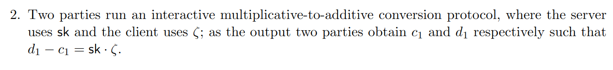
<!-- 飞书原始链接: https://internal-api-drive-stream.feishu.cn/space/api/box/stream/download/authcode/?code=ODJkMDA0NTM3ZDBhNGM3NjY4YzQxZjIwMWU4YThjYjdfODBhNDJhYmM3MTJlNmMyMTYzY2E4OTRmNGZmNjFiNjdfSUQ6NzM2MDYwMjMwNjExMzIwODMyMV8xNzg1NDYxOTM4OjE3ODU0NjU1MzhfVjM -->

下面我们介绍怎么构造一个MtA protocol

### Encoding for Coalesced Multiplication

文章首先回顾了[[DKLS20](https://eprint.iacr.org/2019/523.pdf#page=11.15)]中的randomized encoding方法：

- Single Encoding

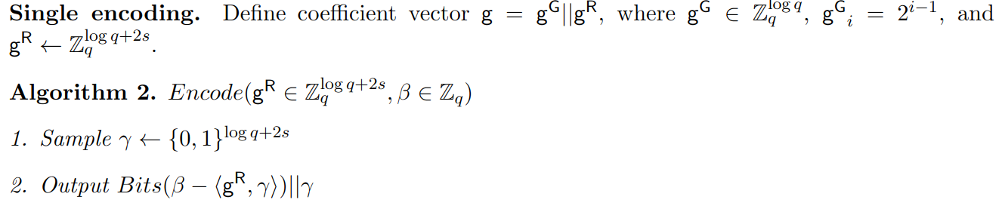
<!-- 飞书原始链接: https://internal-api-drive-stream.feishu.cn/space/api/box/stream/download/authcode/?code=NTNkYWMzODVhNzliYmEyMTZiOWFiNjhjNTVmOGMzMjVfMzAxNDU5MTllNjk4NzJiMDgwYmUxZTM5NTRiN2QyNDFfSUQ6NzM2MDYwODM4NzkwNDczMzIxMl8xNzg1NDYxOTM4OjE3ODU0NjU1MzhfVjM -->

- Batch Encoding

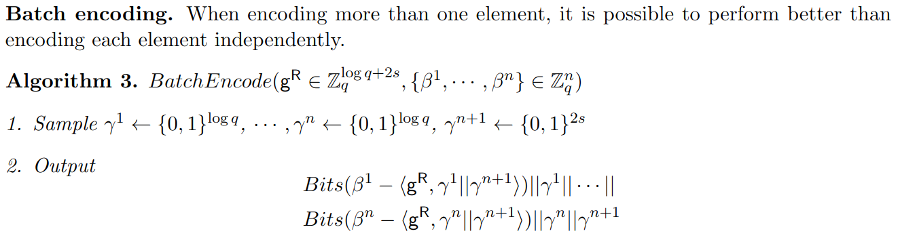
<!-- 飞书原始链接: https://internal-api-drive-stream.feishu.cn/space/api/box/stream/download/authcode/?code=YzU2NzdhYjA3ODQ1ODNhM2Y4MDdjNjA3Mzk3YTY0Y2RfOGE0Yjk3M2EwM2E5YjM2MGJmNjUxY2RjMTRhNGJkNzVfSUQ6NzM2MDYwODYwNDMzODc2NTg1Ml8xNzg1NDYxOTM4OjE3ODU0NjU1MzhfVjM -->

这些randomized encoding保证输出结果在统计学上是均匀的

### Imperfect Multiplicative to Additive Shares

文章中说：

> It is imperfect because a malicious sender can execute attacks that lead to incorrect additive secret shares, depending on the receiver’s input.

构造MtA需要用到COT (Correlated Oblivious Transfer), 它的ideal functionality放在下面，和传统OT不同的是，如果选择位为1，它得到的结果是和Sender输入相关联的随机数，否则结果是完全随机的。

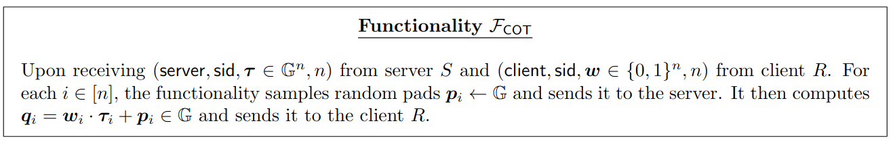
<!-- 飞书原始链接: https://internal-api-drive-stream.feishu.cn/space/api/box/stream/download/authcode/?code=OWFhMDY5MjE5OWIwMjY0OTM4YjgzNDRlMDM4YWY5ZDRfMmUyZDUwNDc2OTU4ZGE2OTJkODAyODAwOTBlNDE0MDdfSUQ6NzM2MDYxNjI0NTY2NDAzODkxM18xNzg1NDYxOTM4OjE3ODU0NjU1MzhfVjM -->

作者首先在semi-honest下提出了一个构造方法，sender输入$a\in Z_q$，receiver输入$b\in Z_q$

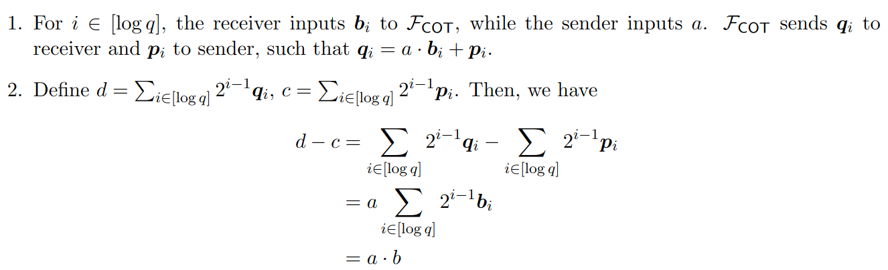
<!-- 飞书原始链接: https://internal-api-drive-stream.feishu.cn/space/api/box/stream/download/authcode/?code=YWZhMDkwOWM2MWUyNWQ4YTQ3Y2EzZjRmMzk1YzFiODFfZGQ0YmY5YzEwODE5NjNjZWM0YTllYjczMDI1ZGFkZGNfSUQ6NzM2MDYxODE1OTU4MzkzNjUxM18xNzg1NDYxOTM4OjE3ODU0NjU1MzhfVjM -->

这个方案中，malicious sender可以额外输入一个error vector $\textbf{e}$，每次输入$a+e_i$，这样最终协议执行的结果就是错误的。在[[DKLS20](https://eprint.iacr.org/2019/523.pdf#page=11.15)]引入了consistency check来防止这些修改，但是在这篇工作中不需要这样，作者提到VUF已经提供了这样的安全性，所以imperfect MtA已经足够，但还是引入了上面提到了randomized encoding。

然后作者提出了batched MtA，支持输入向量$\textbf{a}\in Z^n_q, \textbf{b}\in Z^n_q$

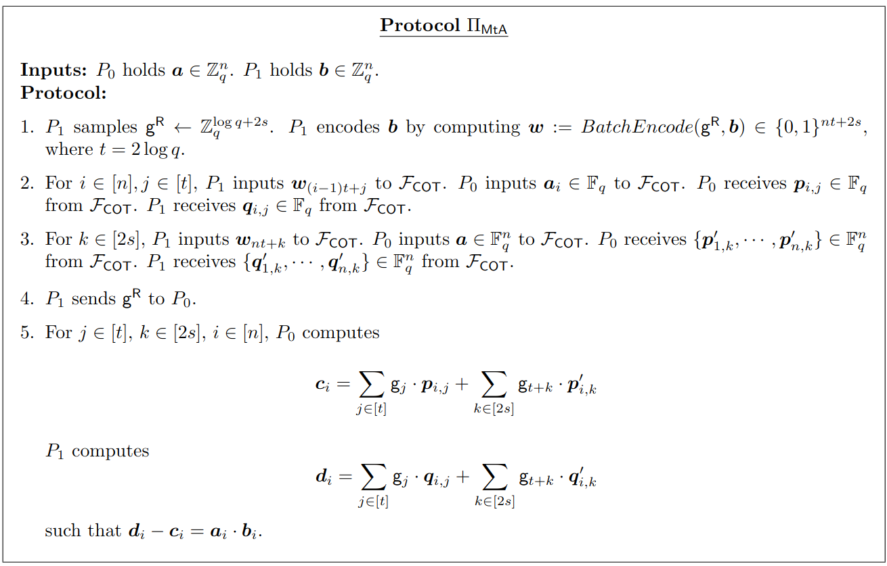
<!-- 飞书原始链接: https://internal-api-drive-stream.feishu.cn/space/api/box/stream/download/authcode/?code=ZWI2YTNhYmEwMmFmYmFjMzJkYWVkZmUxOWExMzk1MWJfNDE3NGI4MTViMzM4Y2RlZGE5MDNiZjI2OTA0NjI5ZTFfSUQ6NzM2MDYyMjUzMTk5MTk5NDM3Ml8xNzg1NDYxOTM4OjE3ODU0NjU1MzhfVjM -->

### OVUF from imperfect encoding

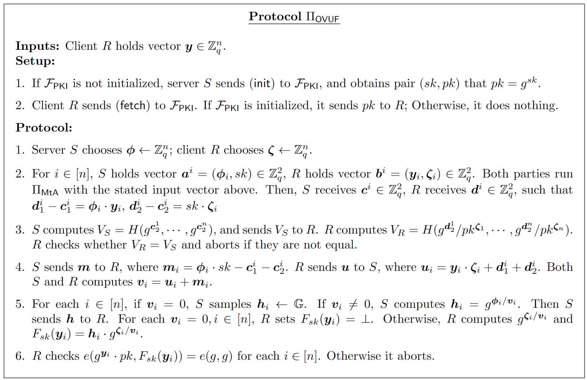
<!-- 飞书原始链接: https://internal-api-drive-stream.feishu.cn/space/api/box/stream/download/authcode/?code=MDgzMGE3ZDI5NzU1ZmMzYjliZWY0NTEwNTFjZTI5NThfODZjZTM1MmU2Mjk5MTRkZTcyOGEzNGNlNjBkZmEyOThfSUQ6NzM2MDk4NTU3MTgzNTMzMDU4OF8xNzg1NDYxOTM4OjE3ODU0NjU1MzhfVjM -->

下面按步骤分析这个过程：

1. server和client分别选择两个随机向量，这两个向量是实现oblivious的关键
2. 对于每一个元素，生成两个向量$a^i=(\phi_i,sk)$和$b^i=(y_i,\zeta_i)$，把这两个向量作为MtA的输入，然后得到$d^i_1-c^i_1=\phi_i\cdot y_i$, $d^i_2-c^i_2=sk\cdot \zeta_i$
3. 这一步主要用于验证server是否使用了正确的sk，解决了上面提到的malicious server的问题
4. Server和Client都有$\phi_i\cdot y_i$和$sk\cdot \zeta_i$的share，server自己可以计算$\phi_i\cdot sk$，client可以计算$y_i\cdot \zeta_i$，于是他们可以得到$(\phi_i+\zeta_i)\cdot(y_i\cdot sk)$的share，把share相加起来就可以得到$v_i=(\phi_i+\zeta_i)\cdot(y_i+sk)$
5. Server计算$h_i=g^{\phi_i/v_i}$发送给Client，Client计算$F_{sk}(y_i)=h_i\cdot g^{\zeta_i/v_i}=g^{1/y_i+sk}$
6. Client可以通过$pk$验证$F_{sk}$的有效性