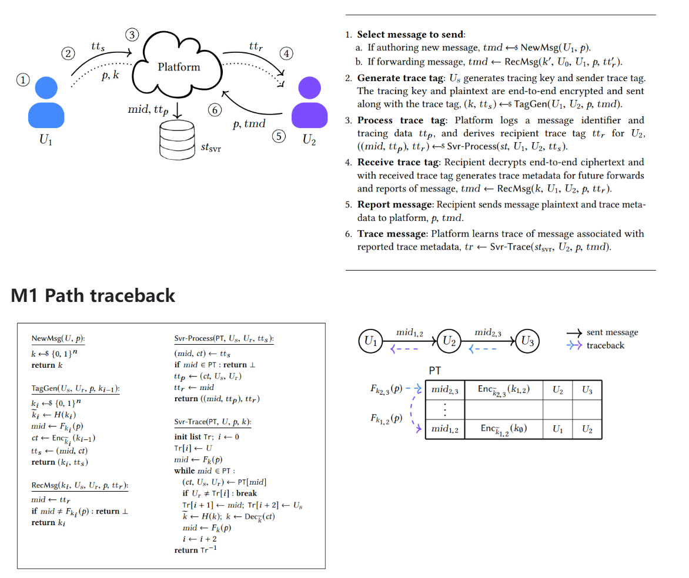
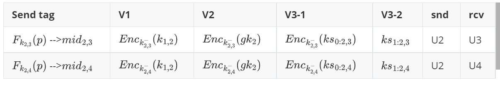
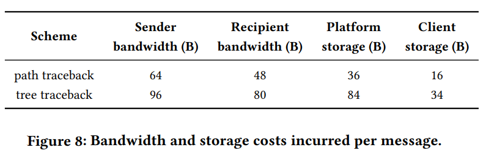

# [TMR19,CCS] Traceback for EEMS

> 一个不那么好的示例 :|

**SUMMARY:** Generalize user reports to trace back the path of a forwarding message to its source.

## **1 Background**

## **2 Setting & Goals**

### **Setting**

1. Users don't know if a message is forwarded msg or a fresh one, so do the platform.

   - Note that, in real-world apps, Whatsapp reveals this info., Signal  don't. And iMessage, Telegramm, and Facebook Messenger don't support forwarding in E2EE mode.
2. Meta-data is revealed to the platform, which means that the platform knows A communicated with B. ❓The platform not just knows, but is also required to collect this meta-data.
3. The deniability is achieved by the underlying E2EE mechanisms. ❓

### **Security Goals**

- **Confidentiality**

  - Trace confidentiality for users: one node only knows its previous and next node
  - Pre-report trace confidentiality for platform: before report, the platform only knows communication metadata
  - Post-report trace confidentiality for platform: after report, the platform only knows the message trace
- **Accountability**

  - Trace unforgeability: no user or users can smear an honest user
  - Sender binding: no user can author a message that cannot be traceback

### **Limitation**

- Partition attack: a malicious user could partition the forwarding path through copy-paste of the received message, which seems fundamentally unavoidable.

  - TEE or ZK ?
- Bypassing tracing through hacked client

## **3 Methodology | Roadmap**

### **M1 Path traceback**

- k\_{i}: one time key (OTK)
- mid: one time message tag from OTK (identify&bind plaintext and sender)
- Enc: link the sender and its previous node
- Random oracle is used to block

<!-- 飞书原始链接: https://internal-api-drive-stream.feishu.cn/space/api/box/stream/download/authcode/?code=OTY2NjEyYzU3ZGE1OGQ0NmY5Mjk5MzE5NDgxMWQ3YjVfZmFkODcyYjc0NzJiNmQ1ZTUxNmVjMjBlYTUxOTRiOGNfSUQ6NzIwNzQ0MjA1NjU2ODk3OTQ1OV8xNzg1NDYxODc1OjE3ODU0NjU0NzVfVjM -->

#### **M2 Tree traceback**

The path traceback only links the current node and its previous node in Enc (where the msg from), but the tree traceback is required to link the current node and its next nodes where the msg goes.

**Challenge**: the forward nodes change in time. (**Trace forward/future!**)

**Solution:** a tracing key gk (generator of pointers to each forward msgs.)

1. ctk for previous message,
2. Tracing key generator for forwards by the sender. Iterator and counter
3. Tracing key generator for forwards by the recipient.

   - How could the sender know the recipients' tracing key when it sends msg to the recipient? If it doesn't know, then how could the platform trace the forward message from its recipient?
   - Let the sender generate its recipients' tracing key!
   - $k_{2,3} \leftarrow F_{gk_{2}}(ctr), k_{2,4} \leftarrow F_{gk_{2}}(ctr+1), gk_{4} = H(ks_{0:2,4} || ks_{1:2,4})$

<!-- 飞书原始链接: https://internal-api-drive-stream.feishu.cn/space/api/box/stream/download/authcode/?code=YzZlMjllMDUwZTgxYWY0ZGE1OTUzMjdkODFiZWY4MzRfYzMyNDNlZDY1YTBiNjhkNjQ1NjhhNGU5MDE2ZTUyYzJfSUQ6NzIwNzQ0MTM3MjQ0ODU3MTM5Nl8xNzg1NDYxODc1OjE3ODU0NjU0NzVfVjM -->

**Concerns:**

1. How to escrow the above value 3.
2. Forward counter.

   - An adversary could launch partition attack by increment counter non-correctly.
   - The trace from the partitioned subtree would label the partition node as the source of the message.

## **4 Evaluation**

### **Performance**

<!-- 飞书原始链接: https://internal-api-drive-stream.feishu.cn/space/api/box/stream/download/authcode/?code=NDA3Yjc2OGM4NzY2ZDVkM2M2MjhlNWMyY2VkMDNlOGNfYTdhNDgwYzZkNTBlNDFlNmIxMjg1MmM0MmRlZmQwMThfSUQ6NzIwNzQ0MTIwNjIyODM2OTQwOV8xNzg1NDYxODc1OjE3ODU0NjU0NzVfVjM -->

### **Discussion**

- Supporting more general plaintext linking policies

  - e.g., link two plaintexts in client side to avoid partition attack
- Preventing partition attacks by malicious users (TEE | ZK)
- Mitigating abuse of abuse mitigations

  - Tracing + anonymous blacklisting
  - Threshold reporting
  - Robustness of the tracing authority (multi-authority tracing)

## **5 Observation & Insights**

1. Can we achieve meta-private by putting M1 PT contents into ciphertexts?

   - NO. Any recipient on the path could know the path.
2. The ciphertext doesn't contain identity information, but is contained in the server database (PT).

   - If we don't contain identity info. in ciphertext  or server, then the clients required to store this info.?
3. The core difference between Path and Tree is that while Path only tracks the backward, Tree also tracks the forward.
4. $C_{1,2} = E2EE_{k_{1,2}}(m, Tag_{m:1,2} = (src, \sigma)), Tag_{m:1,2} = (src=Enc_{k_{1,2}}(U1) ,\sigma = Sig_{sk_{1}}(m||src))$
5. $C_{2,3} = E2EE_{k_{1,2}}(m, Enc_{k_{1,2}}(Tag_{m:1,2}), Tag_{m:2,3})$