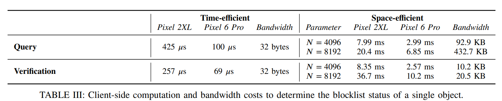

# [TMS+23,Arxiv] Robust, Privacy-preserving, Transparent, and Auditable on-device blocking

> 源文件：`[TMS+23,Arxiv] Robust, Privacy-preserving, Transparent, and Auditable on-device blocklisting.pdf`（PDF 原文保留，本文由 OCR 识别生成，轻微修正拼写）

**SUMMARY**: This paper proposes a system for client-side scanning with better transparency and auditability.

## 1 Motivation

Client-side scanning is a hot topic in legislation, with many regulators attempting to force applications to deploy the mechanism. However, preventing the abuse of this mechanism is an open problem. For example, the server may detect legal contents on the clients.

## 2 Participants & Goals

**Participants.** The system involves:
1. **Curators** maintain the blocklists;
2. **Enforcers** execute the PSI with the clients;
3. **Clients** query the enforcers for CSAM detection;
4. **Auditor** audits the PSI results and blocklists consistency.

**Goals**

- **Transparency.** The server must provide the curator's signature of the block entries to the client, which proves the validity of the entries.
- **Consistency.** 1) All clients see the same blocklist. 2) The update of blocklist is recorded.
- **Auditability.** An auditor can reconstruct the history of the blocklist entries.

**Notable Settings**

- **Client-side output.** Unlike Apple PSI, the PSI protocol in the system outputs the result to the clients. The authors claim this provides better privacy for clients.
- **No perceptual hash.** The system does not use perceptual hash since it brings false positives and is vulnerable to attacks.
- **No probabilistic data structure or hash prefix.** 1) Hash prefix would leak partial information about an object. 2) PDS creates a side-channel that leaks the knowledge of client/server's set.

## 3 Methodology

Transparency is achieved by the curators' signature on the blocklist entries.

Consistency is achieved by a merkle tree whose leaves are the hash of all elements in blocklist. Whenever the curators update the blocklists, a new leaf is inserted into the tree.

**Auditability.**
- Privileged auditor has access to all the blocklist entries, thus it can rebuild the entire merkle tree.
- Unprivileged auditor redo the behavior of users, which guarantees the enforcers' misbehavior can be audited by somebody.

Detection is achieved by the PSI protocol.
- Time-efficient PSI use DH-KE based PSI with pre-processing.
- Space-efficient PSI use FHE-based PSI.

A notable setting is client-side output, which allows 1) the online phase to be time-efficient; otherwise, the client would have O(N) computational overhead. 2) the users can verify the curators' signature after a match occurs, which is impossible in server-side output.

## 4 Evaluation

|  | Time-efficient | Time-efficient | Time-efficient | Space-efficient | Space-efficient | Space-efficient |
|--|----------------|----------------|----------------|-----------------|-----------------|-----------------|
|  | Pixel 2XL | Pixel 6 Pro | Bandwidth | Parameter | Pixel 2XL | Pixel 6 Pro |
| Query | 425 μs | 100 μs | 32 bytes | N = 4096 / N = 8192 | 7.99 ms / 20.4 ms | 2.99 ms / 6.85 ms |
| Verification | 257 μs | 69 μs | 32 bytes | N = 4096 / N = 8192 | 8.35 ms / 36.7 ms | 2.57 ms / 10.2 ms |

*TABLE III: Client-side computation and bandwidth costs to determine the blocklist status of a single object.*

## 5 Observation & Insight

（原笔记此节无内容。）

