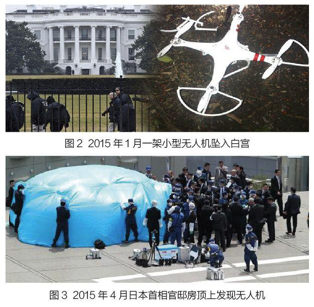
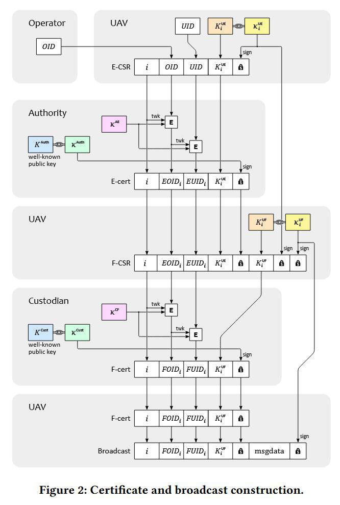
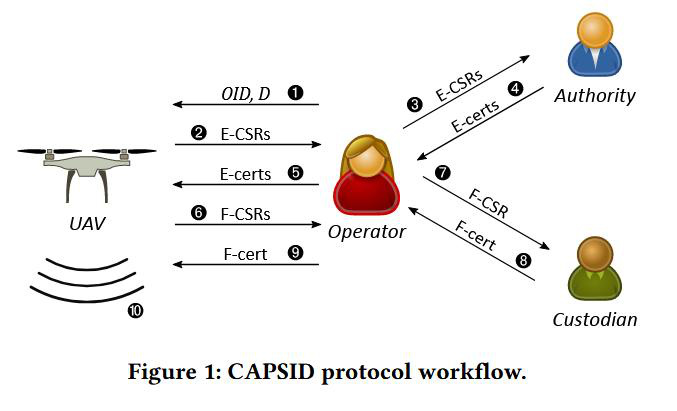
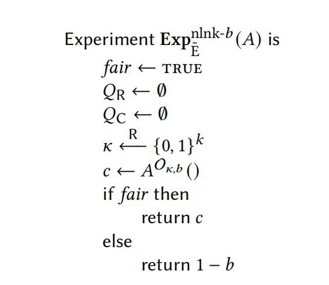
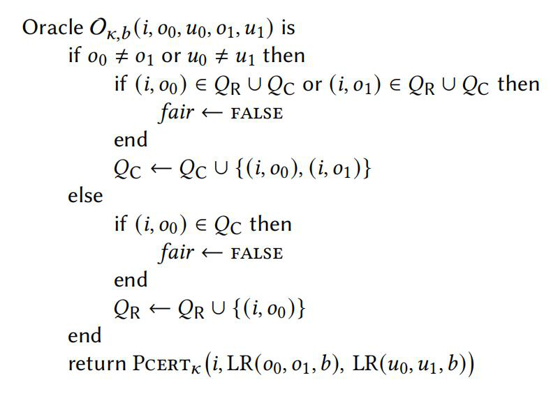

# [YJK+24,CCS] CAPSID: A Private Session ID System for Small UAVs

> 源文件：`[YJK+24,CCS] CAPSID A Private Session ID System for Small UAVs.pdf`（PDF 原文保留，本文由 OCR 识别生成，为幻灯片式笔记整理）

**目录**：01 INTRODUCE → 02 CAPSID → 03 SECURITY ANALYSIS → 04 DISCUSSION

## 1 INTRODUCE

### 1.1 unmanned aerial vehicles (UAVs)

- ① Application
- ② Threat（2015 年 1 月一架小型无人机坠入白宫；2015 年 4 月日本首相官邸房顶上发现无人机）




### 1.2 BACKGROUND

**Remote ID system**

**Broadcast messages**：

- UAV: latitude、longitude、velocity、serial number (SN)、session ID
- control station: latitude, longitude
- The current time (UTC)
- An indication of the emergency status of the UAV.

**Problems with Remote ID**：

- Unverifiable by unprivileged receivers.
- Unauthenticated.
- Mass surveillance.

## 2 CAPSID

### 2.1 CAPSID 总览

**术语**：

- OID: Operator identifier
- D: The interval between the operating cycles
- E-CSRs: epoch certificate signing request
- E-certs: epoch certificate
- F-CSRs: flight certificate signing request
- F-certs: flight certificate

**① Enrollment phase**：
- Operator registration: OID
- UAV registration: E-cert
- flight subscription: F-cert $K^{UF}$

**② Operational phase**：
- Broadcast signing: message, F-cert
- Unsealing.

**security properties**：
- Verifiable.
- Traceable.
- Unlinkable.

### 2.2 UAV registration

$$E_{CSR}(i, OID, UID, K_i^{UE}, k_i^{UE}) = (i, OID, UID, K_i^{UE}, \sigma_{ecsr}), \quad \sigma_{ecsr} = S_{k_i^{UE}}(i \| OID \| UID \| K_i^{UE})$$

$$E_{CERT}(i, OID, UID, K_i^{UE}) = (i, EOID_i, EUID_i, K_i^{UE}, \sigma_{cert}), \quad \sigma_{cert} = S_{k_i^{Auth}}(i \| EOID_i \| EUID_i \| K_i^{UE})$$

$$EOID_i \equiv \widetilde{E}_{k^{AE}}(0 \| i, OID), \quad EUID_i \equiv \widetilde{E}_{k^{AE}}(1 \| EOID_i, UID)$$

### 2.3 Flight Subscription

$$F_{CSR}\left((i, EOID_i, EUID_i, K_i^{UE}, \sigma_{ecert}), k_i^{UE}, K_i^{UF}, k_i^{UF}\right) \equiv \left((i, EOID_i, EUID_i, K_i^{UE}, \sigma_{ecert}), K_i^{UF}, \sigma_{fcsr}^{UE}, \sigma_{fcsr}^{UF}\right)$$

$$\sigma_{fcsr}^{UE} = S_{k_i^{UE}}(i \| EOID_i \| EUID_i \| K_i^{UE} \| \sigma_{ecert} \| K_i^{UF})$$

$$\sigma_{fcsr}^{UF} = S_{k_i^{UF}}(i \| EOID_i \| EUID_i \| K_i^{UE} \| \sigma_{ecert} \| K_i^{UF} \| \sigma_{fcsr}^{UE})$$

$$F_{CERT}(i, EOID_i, EUID_i, K_i^{UF}) = (i, FOID_i, FUID_i, K_i^{UF}, \sigma_{fcert}), \quad \sigma_{fcert} = S_{k^{Cust}}(i \| FOID_i \| FUID_i \| K_i^{UF})$$

$$FOID_i \equiv \widetilde{E}_{k^{CF}}(0 \| i, EOID_i), \quad FUID_i \equiv \widetilde{E}_{k^{CF}}(1 \| FOID_i, EUID_i)$$

### 2.4 Flight Information Broadcasts

Receiver verification:

（Figure 1: CAPSID protocol workflow；Figure 2: Certificate and broadcast construction。）

### 2.5 Unsealing

**Unsealing process** 借助 Custodian ledger（public, append-only）实现：

1. Timestamp of the transaction,
2. The epoch number, EOID, and EUID from the F-CSR,
3. A cryptographic commitment to the issued F-cert.

**Corrupt Authority 攻击**：Adversary 伪造 E-cert 广播，Custodian（ledger）中记录真实 F-cert；攻击者可以获得全部 $OID_i$ 的广播（Unsealing 揭示真实身份）。





## 3 SECURITY ANALYSIS

### 3.1 Verifiability and Traceability

Modeling Tool: ProVerif

**Constructors**：
- E-certs, F-certs: Verified via Authority keys and Custodian keys.
- Broadcasts: Encrypted with tweakable block ciphers and signed keys.
- Ledger: Immutable, append-only for attacker.

**Attacker capabilities**：
- Unlimited Authority and Custodian interaction.
- Full access to broadcast channel.
- Limited control of legitimate operators.
- Compromised Custodian.

向 ProVerif 提交三个验证查询：

- **Query 1: Verifiable broadcasts** — if a broadcast is accepted by a receiver then: $F_{CERT} \leftarrow \text{Custodian}$；$E_{CERT}(i, EOID, EUID) \leftarrow \text{Authority}$。Result: Passes in Honest Custodian Model. Fails in Corrupt Custodian Model.
- **Query 2: Traceable broadcasts** — if a broadcast is accepted by a receiver then: message send operator(OID)。Result: Passes in Honest Custodian Model. Fails in Corrupt Custodian Model.
- **Query 3: Impersonation-resistant broadcasts** — if a broadcast is traced to an operator and the operator has accepted the F-cert then: message send operator(OID)。Result: Passes in Honest Custodian Model. Fails in Corrupt Custodian Model.

### 3.2 Operator Non-linkability

**E-certs 和 F-certs 构造**：

$$E_{CERT}(i, OID, UID, K_i^{UE}) = (i, EOID_i, EUID_i, K_i^{UE}, \sigma_{cert}), \quad F_{CERT}(i, EOID_i, EUID_i, K_i^{UF}) = (i, FOID_i, FUID_i, K_i^{UF}, \sigma_{fcert})$$

**common construction**：

$$P_{CERT_k}(i, o, u) = \left(\widetilde{E}_k(0 \| i, o), \widetilde{E}_k(1 \| \widetilde{E}_k(0 \| i, o), u)\right)$$

$$\widetilde{E}_k: \{0,1\}^k \times \{0,1\}^{\ell} \times \{0,1\}^n \rightarrow \{0,1\}^n, \quad \ell = n + 1$$

证明：Non-linkability（Indistinguishability proof）。

### 3.3 Non-Linkability Experiment

left-or-right 函数：$LR(x, y, 0) = x$, $LR(x, y, 1) = y$

**Pcert oracle**：

$$O_{k,b}(i, o_0, u_0, o_1, u_1) = P_{CERT_k}(i, LR(o_0, o_1, b), LR(u_0, u_1, b))$$

Oracle $O_{k,b}(i, o_0, u_0, o_1, u_1)$ 规则：
- ① 若 $o_0 \neq o_1$ 或 $u_0 \neq u_1$：若 $(i, o_0) \in Q_R \cup Q_C$ 或 $(i, o_1) \in Q_R \cup Q_C$ 则 $fair \leftarrow FALSE$；$Q_C \leftarrow Q_C \cup \{(i, o_0), (i, o_1)\}$
- ② 否则：若 $(i, o_0) \in Q_C$ 则 $fair \leftarrow FALSE$；$Q_R \leftarrow Q_R \cup \{(i, o_0)\}$
- 返回 $P_{CERT_k}(i, LR(o_0, o_1, b), LR(u_0, u_1, b))$

约束（对给定 epoch i 与 OID）：① challenge queries 只能一次；② regular queries 任意次。$Q_C$: challenge 查询集合；$Q_R$: regular 查询集合。

**实验** $\text{Exp}_{\widetilde{E}}^{\text{nlnk}-b}(\mathcal{A})$：

```
fair ← TRUE;  Q_R ← ∅;  Q_C ← ∅
κ ← {0,1}^k
c ← A^{O_{κ,b}}()
if fair then return c else return 1-b
```

$$\text{Adv}_{\widetilde{E}}^{\text{nlnk}}(\mathcal{A}) = \Pr[\text{Exp}_{\widetilde{E}}^{\text{nlnk}-1}(\mathcal{A}) = 1] - \Pr[\text{Exp}_{\widetilde{E}}^{\text{nlnk}-0}(\mathcal{A}) = 1]$$

$$\text{Adv}_{\widetilde{E}}^{\text{nlnk}}(k, n, t, q) = \max_{\mathcal{A}}\{\text{Adv}_{\widetilde{E}, \mathcal{A}}^{\text{nlnk}}\} < \text{negl}$$

其中 k: key size, n: block size, t: running time, q: number of queries。





## 4 DISCUSSION

### 4.1 Discussion

**Candidates for the Role of Custodian**：
- Another government agency.
- A UAV pilot or industry association.
- UAV manufacturers.

**Related Work**：

| System/Protocol | Domain | Traceability | Verifiability | Non-linkability |
|-----------------|--------|--------------|---------------|-----------------|
| CAPSID | UAV | ✓ | ✓ | ✓ |
| Remote ID | UAV | ✗ | ✗ | ✓ |
| ADS-B | Manned aircraft | ✓ | ✗ | ✗ |
| VANETs | Vehicular Networks | ✓ | ✓ | ✓ |
| Group Signatures | Distributed environment | ✓ | ✓ | ✓ |
| Identity Escrow | Identity management | ✓ | ✓ | ✓ |


