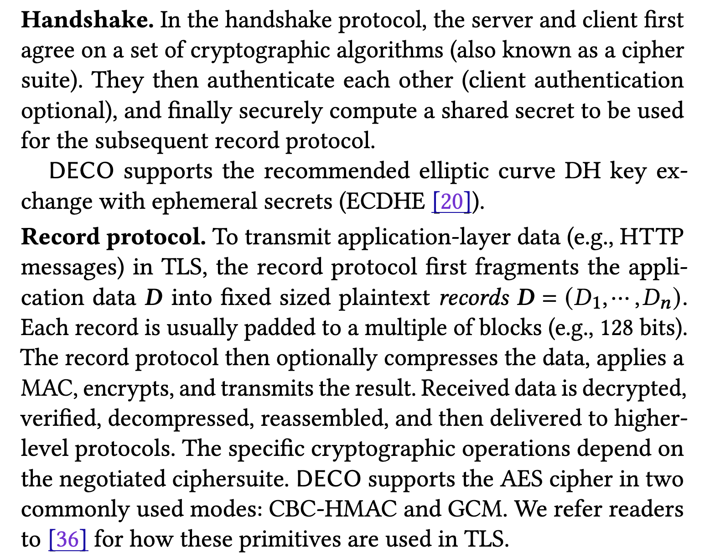
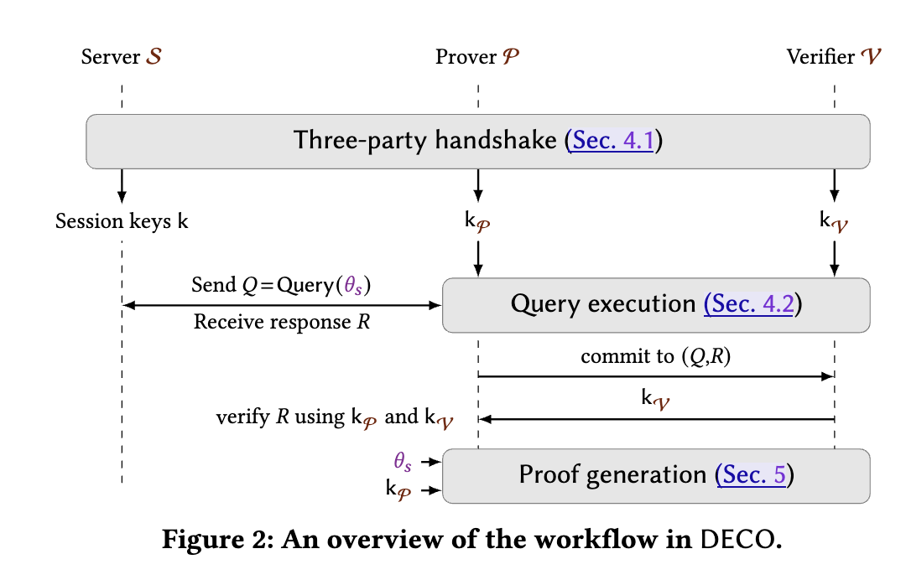

# [ZMM+20, CCS] DECO: Liberating Web Data Using Decentralized Oracles for TLS

**Summary:** Enable user proof a piece of data come from certain website via TLS.

## Introduction

### Motivation

- TLS is popular
- User cannot export data from TLS easily.

  - For example: Alice wants to prove to Bob that she is over 18 years old.
  
    - Directly send Alice's ID: Raise privacy concerns
    - Alice just enter her age to a sheet provided by Bob: Easy to forge
- Oracle for smart contracts: Step forward to export TLS-protected data, but:

  - Only work with deprecated TLS versions
  - No privacy from the oracle
  - Rely on TEE
  - Break legacy compatibility for TLS & Server decides which data can be exported

### Contribution

- They propose a decentralized oracle for TLSNo server-side cooperation

  - Source agnostic
  - Broad compatibility
- What is TLS oracle?

<!-- 飞书画板 token: OKlCwxaWqheDgSb7ANHciMWUnRL -->

## Preliminaries

- TLS Protocol

<!-- 飞书原始链接: https://internal-api-drive-stream.feishu.cn/space/api/box/stream/download/authcode/?code=MWYzNzEzMmU4MTA2NWJhZjM0NmM0MTZiYjNlZDJkMGFfZjlkNWQwYjkyMDkxYzA3NTIzMmY1MDUzOGU4NmEwNGRfSUQ6NzUzOTUzOTg3MTg2Njk0NTUzN18xNzg1NDYxOTY2OjE3ODU0NjU1NjZfVjM -->

## Overview

<!-- 飞书原始链接: https://internal-api-drive-stream.feishu.cn/space/api/box/stream/download/authcode/?code=NDNlMTVmZTc5YWVhYjBhNTAyODI4OTM2ZDE5OGU0ZDRfYmJmNGQzY2E3MGUwYTg1YmUwMDMxODFkNTY3MjBlNjdfSUQ6NzUzOTA3OTUyMjA1MTA2MzgyN18xNzg1NDYxOTY2OjE3ODU0NjU1NjZfVjM -->

### Model

<!-- 飞书画板 token: FU1Zw3d2ehQk3lbxD1Fc6PeDnEg -->

## Details